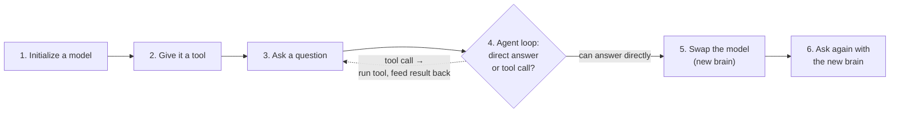
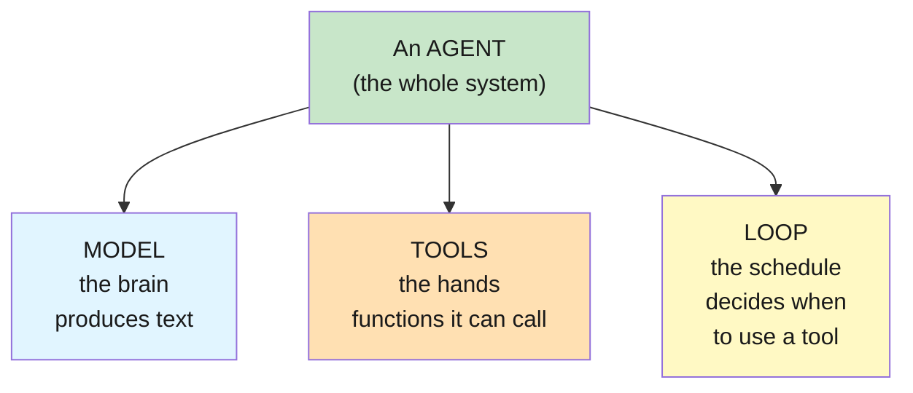
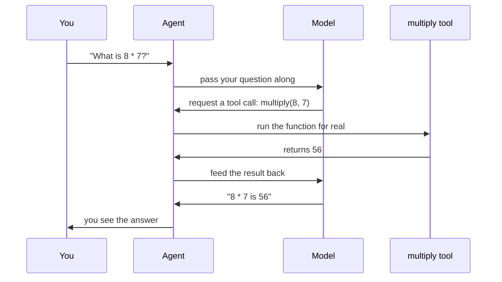
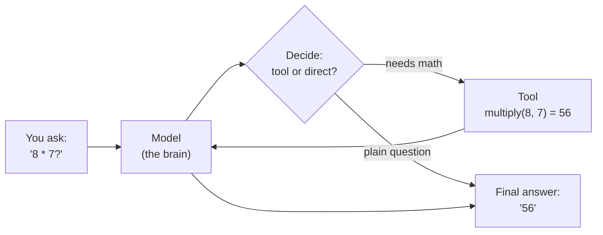

# Lab 1: Agents & Models

**Difficulty: Beginner | ~30 min | No prerequisites**

---

## 1. Agents & Models

Your first LangChain lab. You will build a tiny AI **agent**, give it a tool, and then **swap the model** underneath it — proving the model is a swappable part, not the whole system.

---

## 2. Problem Statement / Use Case Overview

"Agent" is the most overused word in AI right now — every product is "agentic", and every tutorial assumes you already know what an agent is. This lab is the absolute starting point. You will learn what an agent actually is: a **model** (the brain that talks) plus **tools** (the hands it can use) plus a **loop** that decides when to use them. You will build one agent that can do arithmetic, then swap two completely different models underneath it without changing a single line of the agent's logic. By the end you'll understand why model-swapping is trivial in LangChain and why that matters when you design real applications.

---

## 3. Input Data

There is no dataset. The input is plain English:

- A question the agent can answer directly: *"In one sentence, what is an AI agent?"*
- A question that requires a tool: *"What is 8 multiplied by 7?"*

That's it — one of the best ways to learn a concept is to keep the data small enough to inspect by eye (Article PF-4).

---

## 4. Processing

The agent runs in a loop:

1. **Initialize** a chat model (pointing at OpenRouter, using a free model).
2. **Give it a tool** — a single `multiply` function the model can choose to call.
3. **Ask a question.** The agent decides: answer directly, or emit a tool call.
4. **The loop executes the tool** and feeds the result back to the model.
5. **Swap the model** — build a second agent with a different model, same tools, same code.
6. **Ask again** and watch a different brain produce the same correct answer.

Here's the whole lab as a flow — the loop on the left repeats until the model can answer directly, then we swap the brain:



Step 4 is the heart of it: the model doesn't run your code — it asks for a tool call, and the loop executes it and hands the result back until the model can answer.

---

## 5. Output

When the notebook works, each question cell prints the agent's final answer — the last message in the agent's conversation. On a real run it looked like:

```
Step 5 (openai/gpt-oss-20b:free) -> 56
Step 7 (nvidia/nemotron-nano-9b-v2:free) -> The product of 8 multiplied by 7 is 56.
Step 8 (no tool) -> An AI agent is a program that can use tools and make decisions...
```

The exact wording will vary — free models change and answers differ slightly. What must be true: **both models return the correct result (56) through identical agent code, and the last cell answers from knowledge without calling a tool.** If you see that, the swap worked.

---

## 6. Tech Stack

- Python 3.11
- `langchain==1.2.15`
- `langchain-core==1.2.28`
- `langchain-openai==1.1.12` (OpenRouter speaks the OpenAI protocol)
- `python-dotenv` (loads `.env`)
- OpenRouter API — free models, no cost (see https://openrouter.ai/models)

No GPU needed. Runs on any laptop. The only "cost" is a free OpenRouter account for an API key.

---

## 7. Underlying Concepts

### Model vs. agent

A **model** (a chat model) is the brain: you send it text, it returns text. It has no hands — it cannot look things up, calculate, or touch the outside world. An **agent** is the brain *plus* tools *plus* a loop. The loop is the key idea: the model doesn't run your code; it *describes* what it wants to run (a tool call), and the agent framework executes it and hands the result back.

Think of it like a chef. The **model** is the chef's knowledge — recipes and judgement. The **agent** is the kitchen: the chef (model) shouts an order ("chop two onions"), and a sous-chef (the tool) does the chopping and reports back. The chef never leaves the kitchen.

An agent is built from three parts — the model is only one of them:



This is why you can swap the model freely: it's just one of the three parts. The tools and the loop stay put.

### Tool calling

Modern chat models are trained to output not just text but **structured tool requests** — "I want to call `multiply` with 8 and 7." LangChain's agent sees that request, runs your Python function, and sends the function's output back to the model as a new message. The model then produces the final answer.

Step by step, that round-trip looks like this:



Notice the model never computes anything — it only *asks* for the tool call, and the agent loop does the actual work. That separation is the entire idea behind agents.

### Why model-swapping is free

All this works because LangChain talks to every model through one interface (`BaseChatModel`). Your agent code never mentions a provider — it just needs *a* model object. Swap `ChatOpenAI(model="...A...")` for `ChatOpenAI(model="...B...")` and the same agent keeps working. This is why you can prototype with a free model and move to a paid one later by changing one line.



This is one agent run: the model decides, uses the tool when needed, and produces the final answer. **Swap the model and the same loop runs with a new brain** — that's the trick shown in Step 6.

---

## 8. Prerequisites

- **None.** You need basic Python (run a script, install packages) and a web browser.
- One free account: [openrouter.ai](https://openrouter.ai) → Settings → Keys → create a key that starts with `sk-or-v1`.

---

## 9. Environment / Dependencies Setup

Run these in a terminal. We use a virtual environment so the project is isolated and reproducible (Article CQ-6).

```bash
cd Lab1

python3 -m venv .venv
source .venv/bin/activate

pip install --upgrade pip
pip install "langchain==1.2.15" "langchain-core==1.2.28" "langchain-openai==1.1.12" "python-dotenv" "jupyterlab" "ipykernel"
```

Then create your key file:

```bash
cp .env.example .env
```

Open `.env` and replace the `sk-or-v1-xxx...` placeholder with your real OpenRouter API key. Save it.

Verify the environment:

```bash
python -c "import langchain, langchain_openai; print('OK')"
```

You should see `OK`. To run the notebook: `jupyter lab lab-agents-models.ipynb` (or open the file in VS Code).

---

## 10. Step-wise Development Instructions

Every cell below is one logical step. Read the explanation, run the cell, look at the result, move on.

### Step 1 — Load the key

This cell loads the `.env` file and fails loudly if your key is missing — better to find out here than halfway through.

```python
import os
from dotenv import load_dotenv

load_dotenv()

if not os.getenv("OPENROUTER_API_KEY"):
    raise SystemExit("No OPENROUTER_API_KEY found. Add it to .env and restart the kernel.")
```

### Step 2 — Initialize a model

`ChatOpenAI` is LangChain's wrapper for any OpenAI-compatible API. OpenRouter is one. `model=` is the free model ID, `base_url=` points at OpenRouter, `temperature=0` keeps answers factual.

```python
from langchain_openai import ChatOpenAI

model_1 = ChatOpenAI(
    model="openai/gpt-oss-20b:free",
    base_url="https://openrouter.ai/api/v1",
    api_key=os.getenv("OPENROUTER_API_KEY"),
    temperature=0,
)
```

### Step 3 — Write a tool

A tool is just a function with a clear docstring and typed arguments. LangChain reads the docstring to tell the model what the tool does.

```python
def multiply(a: float, b: float) -> float:
    """Multiply two numbers and return their product."""
    return a * b
```

### Step 4 — Create the agent

`create_agent` wraps the model and tools into the agent loop. One line.

```python
from langchain.agents import create_agent

agent = create_agent(model_1, tools=[multiply])
```

### Step 5 — Ask a question that needs the tool

`invoke` runs the whole loop. The last message in `messages` is the final answer.

```python
result_1 = agent.invoke({
    "messages": [("user", "What is 8 multiplied by 7?")],
})
result_1["messages"][-1].content
```

### Step 6 — Swap the model

Build a *second* agent with a different free model. Same tool, same structure — only the model changed.

```python
model_2 = ChatOpenAI(
    model="nvidia/nemotron-nano-9b-v2:free",
    base_url="https://openrouter.ai/api/v1",
    api_key=os.getenv("OPENROUTER_API_KEY"),
    temperature=0,
)

agent_2 = create_agent(model_2, tools=[multiply])
```

### Step 7 — Ask the same question with the new brain

```python
result_2 = agent_2.invoke({
    "messages": [("user", "What is 8 multiplied by 7?")],
})
result_2["messages"][-1].content
```

### Step 8 — A question with no tool needed

Agents don't always use tools. This question is answered directly from the model's knowledge.

```python
result_3 = agent_2.invoke({
    "messages": [("user", "In one sentence, what is an AI agent?")],
})
result_3["messages"][-1].content
```

---

## 11. Optional Exercise

Swap in a third model. Add a new cell: create a `ChatOpenAI` with the free model `inclusionai/ling-3.0-flash:free`, build an `agent_3` with the same `multiply` tool, and ask it the same "8 multiplied by 7" question. Confirm it returns 56. If that model ID no longer exists, pick any model listed as `:free` at https://openrouter.ai/models and note the ID you used.

---

## 12. What We Learnt

- A **model** answers text; an **agent** is a model + tools + a loop that decides when to use them.
- **Tool calling** lets the model request an action; the agent runs it and feeds the result back.
- LangChain talks to all models through one interface, so **swapping the model is a one-line change** that leaves the agent untouched.
- Free OpenRouter models teach real concepts at zero cost — cheap enough to experiment freely.
- Restart-and-run-all works: this notebook is a sequence you can re-run top to bottom, because every step rebuilds its own state.
