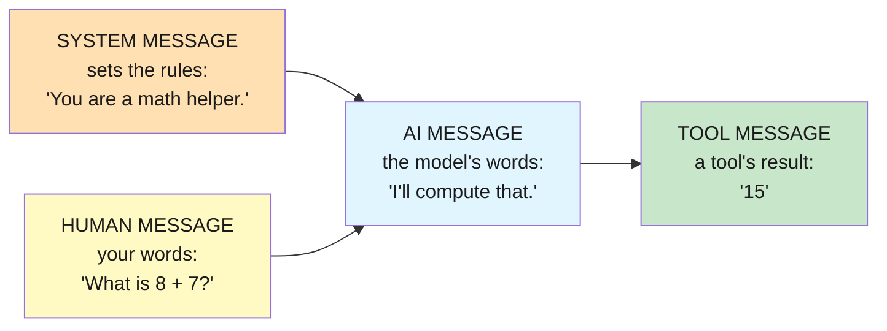
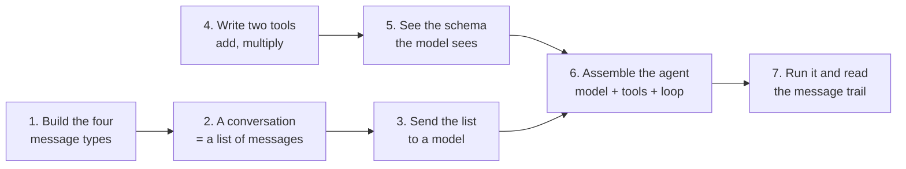
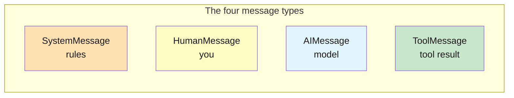
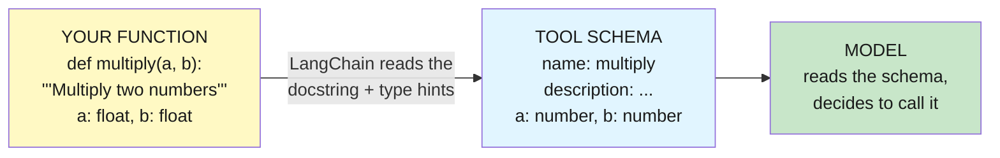
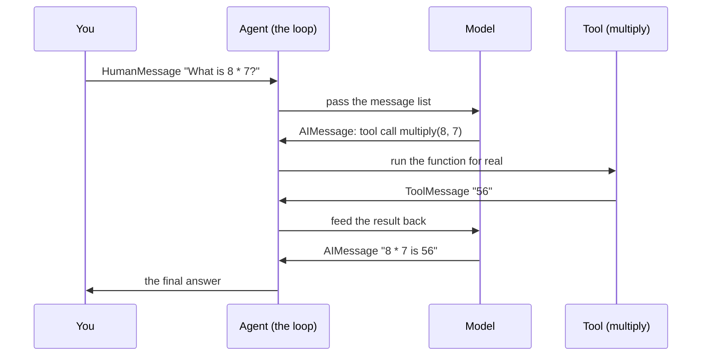

# Lab 2: Messages & Tools

**Difficulty: Beginner | ~30 min | Requires Lab 1 (recommended)**

---

## 1. Messages & Tools

Every AI agent you will ever build — in LangChain or anywhere else — is made from two basic parts: **messages** and **tools**. This lab makes both visible. You will create the four kinds of messages by hand, send a whole conversation to a model, write two tools, see *exactly* what the model sees of your tools, and then watch an agent's conversation happen as a list of messages. After this lab, an "agent" is not a magic black box: it's messages flowing through a loop, with tools it can call along the way.

### What is a message?

A **message** is a single piece of data in a conversation. Every message has two important properties:

- **`type`** — who said it: the *system* (the rules), a *human* (you), the *AI* (the model), or a *tool* (the result of a function call).
- **`content`** — the actual text.



A whole **conversation is just a list of messages**, in order, oldest first. That's the entire data model of an agent: one list, four kinds of entries.

### What is a tool?

A **tool** is a small function the model is *allowed* to call. In this lab a tool is a plain Python function with a docstring and type hints — nothing fancier. The model never sees your Python code; it sees a **schema** (a description of the tool's name, what it does, and what inputs it takes) that LangChain builds automatically from your docstring and type hints. The model reads the schema, decides "I should call `multiply` with 8 and 7", and the agent loop runs your function for real.

In one sentence: **messages are the data agents pass around, and tools are the actions agents can take** — and both are just ordinary Python objects you can build, inspect, and print.

---

## 2. Problem Statement / Use Case Overview

Every agent tutorial throws around the words "messages" and "tools" as if they were obvious — and they're usually the first things that confuse a new learner. This lab solves that by making both building blocks physical: you will literally construct message objects, print them, pass them to a model, write tool functions, and print the JSON schema the model sees. Then you'll assemble both into an agent and read its *entire conversation* back as a list of messages. By the end you won't just know that "agents use messages and tools" — you'll have seen every message type, every tool definition, and every step of the round-trip with your own eyes. That foundation is what makes every later lab (memory, RAG, multi-agent) click.

---

## 3. Input Data

There is no dataset. The inputs are things you construct by hand, small enough to inspect by eye (Article PF-4):

- Four **message objects** you create directly (`SystemMessage`, `HumanMessage`, `AIMessage`, `ToolMessage`).
- A short **chat history** of four messages about a traffic light.
- A few English questions: *"Which one means stop?"*, *"What is 8 multiplied by 7?"*, *"What is 5 plus 3?"*

That's the whole input — deliberately tiny, because the point is to see the data, not to process a lot of it.

---

## 4. Processing

The lab moves through the two building blocks, then puts them together:

1. **Build messages by hand** — create the four message types and print `type` + `content`.
2. **Assemble a conversation** — a chat history is just a list of messages.
3. **Send it to a model** — the model reads the whole list and answers the last question.
4. **Write tools** — two plain functions, `add` and `multiply`.
5. **Inspect the schema** — print the exact description the model sees.
6. **Assemble the agent** — `create_agent(model, tools=[add, multiply])` wraps both building blocks in the decision loop.
7. **Read the conversation** — run the agent and print its message list: you'll see the tool round-trip as data.

Here's the whole lab as a flow:



Steps 3 and 4 are the two building blocks; step 7 is the payoff where you watch them combine.

---

## 5. Output

When the notebook works, each cell prints its messages so you can see everything as data. From a real run it looked like this:

```
system    -> You are a math helper.
human     -> What is 8 + 7?
ai        -> I'll compute that with a tool.
tool      -> 15
```

The model replies to the four-message history with a fresh `ai` message:

```
reply type: ai
The **red** light means stop.
```

Step 7 prints the tool schema — the *exact* description the model receives:

```
add
Add two numbers and return their sum.
{'properties': {'a': {'type': 'number'}, 'b': {'type': 'number'}}, 'required': ['a', 'b'], 'type': 'object'}
```

Step 9 prints the agent's whole conversation, and you can see the round-trip as four messages:

```
--- human ---
What is 8 multiplied by 7?

--- ai ---
(no text)
  tool call: multiply{'a': 8, 'b': 7}

--- tool ---
56.0

--- ai ---
56
```

Step 10 prints just the message *types*, which tell the story of the loop repeating until the model can answer:

```
human
ai
tool
ai
tool
ai
8 multiplied by 7 is **56**.  
5 plus 3 is **8**.
```

The exact wording of the model's answers will vary — free models change and answers differ slightly. What must be true: the message `type` sequence follows the pattern `human → ai → (tool → ai)…` and ends in an `ai` message containing the correct answers (56 and 8). If you see that, both building blocks and the loop around them are working.

---

## 6. Tech Stack

- Python 3.11
- `langchain==1.2.15`
- `langchain-core==1.2.28`
- `langchain-openai==1.1.12` (OpenRouter speaks the OpenAI protocol)
- `python-dotenv==1.2.2` (loads `.env`)
- OpenRouter API — free models, no cost (see https://openrouter.ai/models)

No GPU needed. Runs on any laptop. The only "cost" is a free OpenRouter account for an API key.

---

## 7. Underlying Concepts

### Messages: the data agents pass around

A **message** is one unit of conversation. LangChain gives you four classes, one per speaker, and each instance carries a `type` and a `content`:

- **`SystemMessage`** — the rules for the whole conversation ("You are a math helper."). Set once, at the top.
- **`HumanMessage`** — your words.
- **`AIMessage`** — the model's words. Special case: when the model wants a tool, its `AIMessage` has empty text but a `tool_calls` field describing which tool to call and with what arguments.
- **`ToolMessage`** — the result of a tool call, tagged with a `tool_call_id` that links it back to the exact call the model requested.



The crucial idea: **a conversation is a list of messages.** That list is the entire memory of a chat. You build it, append to it, pass it to a model, and the model reads it top to bottom like a person reading a chat log. There is no hidden "chat state" — just the list.

### Tools: what agents act with

A **tool** is a function the model is allowed to call. LangChain turns a plain Python function into a tool by reading two things it can see *without executing the code*:

- the **docstring** → the tool's `description` (what it does),
- the **type hints** → the tool's `parameters` (what inputs it expects, and of what type).

That pair becomes a JSON **schema** — the model's window into your tool. The model literally cannot see your Python code; it only sees the schema. This is why a good docstring is not optional: it's the tool's user manual.



### The round-trip: messages + tools + loop

Put both building blocks together and you get the agent loop from Lab 1 — but now you can name every piece of data it moves. Each step is one message:



Notice: the tool's result travels back to the model as just another message (`ToolMessage`), and the model answers with just another message (`AIMessage`). Nothing in the loop is special — it is messages moving through the same list, over and over, until the model can answer without another tool. That loop is why the message `type` sequence in Step 10 repeats `ai → tool` until it ends on a plain `ai` answer.

---

## 8. Prerequisites

- **None strictly required** — this lab builds everything from scratch.
- **Lab 1 is recommended** (builds an agent and explains the loop) because this lab zooms in on the two pieces that agent was made of.
- Basic Python (run a script, install packages) and a web browser.
- One free account: [openrouter.ai](https://openrouter.ai) → Settings → Keys → create a key that starts with `sk-or-v1`.

---

## 9. Environment / Dependencies Setup

Run these in a terminal. We use a virtual environment so the project is isolated and reproducible (Article CQ-6).

```bash
cd Lab2

python3 -m venv .venv
source .venv/bin/activate

pip install --upgrade pip
pip install "langchain==1.2.15" "langchain-core==1.2.28" "langchain-openai==1.1.12" "python-dotenv==1.2.2" "jupyterlab" "ipykernel"
```

Then create your key file:

```bash
cp .env.example .env
```

Open `.env` and replace the `sk-or-v1-xxx...` placeholder with your real OpenRouter API key. Save it.

Verify the environment:

```bash
python -c "import langchain, langchain_openai; print('OK')"
```

You should see `OK`. To run the notebook: `jupyter lab lab-messages-tools.ipynb` (or open the file in VS Code). The notebook's first cell also runs the same installs, so if you skipped this step you can let it install the modules for you.

---

## 10. Step-wise Development Instructions

This section is the heart of the lab. You'll work through **ten steps**, each one a single logical move, with the context you need explained before you run each cell. Run the cell, glance at the result, then move on — don't scroll ahead.

The whole lab in one sentence: build the messages (the data), write the tools (the actions), then assemble both into an agent and watch its conversation happen as a list of messages.

### Step 1 — Install the required modules

This first command installs the four Python libraries the lab needs, with exact versions pinned so the build is reproducible. Each library has one specific job:
- `langchain` — provides `create_agent`, the machinery that builds the agent loop.
- `langchain-core` — the shared foundation, including the message classes and tool helpers you'll use directly in this lab.
- `langchain-openai` — provides `ChatOpenAI`, the wrapper that lets LangChain talk to any OpenAI-compatible API. OpenRouter speaks that protocol, so this one class reaches *any* model on OpenRouter.
- `python-dotenv` — reads your API key from a `.env` file so the secret never sits in your code.

Pinning exact versions (`==1.2.15`, not `>=1.2.15`) means the lab behaves the same today and six months from now (Article CQ-6). The `!` at the start is a Jupyter special: it runs the rest of the cell as a terminal command instead of Python.

When it finishes, the final line should read `Successfully installed ...`. If you already ran the Section 9 setup, you'll instead see `Requirement already satisfied` lines — that's fine, either outcome is success.

```python
!pip install "langchain==1.2.15" "langchain-core==1.2.28" "langchain-openai==1.1.12" "python-dotenv==1.2.2"
```

### Step 2 — Load the key

Next we load your OpenRouter API key out of the `.env` file into the notebook's environment, and stop immediately if it's missing. Every model call to OpenRouter must prove who's asking, but we never type the key into code (Article CQ-7). Instead:
- `load_dotenv()` finds the `.env` file in this folder and loads every `KEY=VALUE` line into the process's environment variables.
- `os.getenv("OPENROUTER_API_KEY")` reads the key back out by name.
- The `if` check is a safety net: if the key is missing (no `.env`, or the placeholder was never replaced), we stop right here with a clear message instead of failing halfway through with a confusing API error.

The cell should produce no output at all — that's the success signal. If the key is missing, you'll get the red error `No OPENROUTER_API_KEY found...`, which tells you exactly what to fix: put the key in `.env` and restart the kernel.

```python
import os
from dotenv import load_dotenv

load_dotenv()

if not os.getenv("OPENROUTER_API_KEY"):
    raise SystemExit("No OPENROUTER_API_KEY found. Add it to .env and restart the kernel.")
```

### Step 3 — Create the four message types by hand

Now the first building block. We create one instance of each of the four message classes — the *rules* (system), *you* (human), *the model* (ai), and *a tool's result* (tool). This is the moment you see that a message is just an object with a `type` and a `content` — nothing magical. Two details worth noticing:

- `AIMessage` is the only one created *by* the model in real use; here we hand-make it just to see its shape.
- `ToolMessage` needs a `tool_call_id` — a label that links a tool's result back to the specific tool call that produced it. We make one up here; in a real run the loop generates it.

The `for` loop prints every message's `type` and `content`, side by side, so you can see the whole roster at once. Expect four lines, one per message, like the sample in Section 5.

```python
from langchain_core.messages import SystemMessage, HumanMessage, AIMessage, ToolMessage

# Each message type plays one role in the conversation
system_message = SystemMessage(content="You are a math helper.")   # the rules
human_message = HumanMessage(content="What is 8 + 7?")             # your words
ai_message = AIMessage(content="I'll compute that with a tool.")   # the model's words
tool_message = ToolMessage(content="15", tool_call_id="call_1")    # a tool's result

# Every message has a .type and a .content — the two things that matter
for message in [system_message, human_message, ai_message, tool_message]:
    print(f"{message.type:<8} -> {message.content}")
```

### Step 4 — A conversation is a list of messages

Next, we assemble a real chat history as a list: a system message, a human question, the model's answer, and another human question. That's all a conversation is — a Python list of message objects, oldest first. The model reads it top to bottom the way a person reads a chat log, and that order is the only thing giving it "context."

Notice the list mixes message types freely (`system`, `human`, `ai`, `human`). There's nothing enforcing turns — the structure is just the order you put them in. The loop prints the list so you can confirm it looks exactly like a chat log.

```python
# A chat is just a list of messages, in order, oldest first
history = [
    SystemMessage(content="You are a friendly assistant."),
    HumanMessage(content="Name three colors of a traffic light."),
    AIMessage(content="Red, yellow, and green."),
    HumanMessage(content="Which one means stop?"),
]

# Print the list so you can see the whole conversation at once
for message in history:
    print(f"{message.type:<8} -> {message.content}")
```

### Step 5 — Send the whole conversation to a model

Now we prove the list from Step 4 is real data the model can read. We create a chat model — the same wrapper and settings as Lab 1 — and pass it the whole `history`. The model reads all four messages and answers the *last* question ("Which one means stop?"), using the earlier messages as context. The reply comes back as an `AIMessage`, which is why we can print `reply.type` — a model's answer is itself a message, the same object type you built by hand in Step 3.

```python
from langchain_openai import ChatOpenAI

# The model: same wrapper and settings as Lab 1
model = ChatOpenAI(
    model="openai/gpt-oss-20b:free",         # a free model on OpenRouter
    base_url="https://openrouter.ai/api/v1", # redirect the OpenAI client to OpenRouter
    api_key=os.getenv("OPENROUTER_API_KEY"), # your key, read from .env
    temperature=0,                           # 0 = factual, reproducible
)

# The model reads the whole history and answers the last question
reply = model.invoke(history)
print(f"reply type: {reply.type}")
print(reply.content)
```

Expect `reply type: ai` and a one-line answer like *"The red light means stop."* The exact wording varies by model, but the answer must be correct — and that correct answer only exists because the list carried the context.

### Step 6 — Write two tools

Now the second building block. A **tool is just a Python function** — but two details make it a tool the model can understand:
- The **docstring** tells the model *what the function does* (LangChain turns it into the tool's `description`).
- The **type hints** (`a: float, b: float`) tell the model *what inputs to supply* and of what kind.

That's the whole definition. `add` and `multiply` are ordinary functions; nothing about them knows about agents or models. This cell only defines them — nothing runs until an agent calls them in Step 9.

```python
# A tool is just a function. The docstring tells the model WHAT it does,
# the type hints tell it WHAT INPUTS to supply.
def add(a: float, b: float) -> float:
    """Add two numbers and return their sum."""
    return a + b

def multiply(a: float, b: float) -> float:
    """Multiply two numbers and return their product."""
    return a * b
```

### Step 7 — See exactly what the model sees

Here's the payoff of Step 6. The model can't read your Python code — so LangChain builds a **schema** from each function and shows the model *that* instead. We generate the schema for both tools and print it, piece by piece:
- `name` — the function's name.
- `description` — taken from the docstring.
- `parameters` — taken from the type hints, describing `a` and `b` as `number` inputs, both required.

Compare the printed schema to the function it came from: same information, but as a JSON-style description instead of code. This is exactly the description traveling to the model when the agent runs. If you ever change a docstring or a type hint, this schema is what changes too — which is why good docstrings matter so much.

```python
from langchain_core.utils.function_calling import convert_to_openai_tool

# Build the schema for each tool and print what the model actually sees
for tool_function in [add, multiply]:
    schema = convert_to_openai_tool(tool_function)["function"]
    print(schema["name"])        # the tool's name
    print(schema["description"]) # from the docstring
    print(schema["parameters"])  # from the type hints
    print()
```

### Step 8 — Assemble the agent

Now we put both building blocks together. `create_agent(model, tools=[add, multiply])` takes the model (the brain) and the list of tools (the hands) and wraps them in the decision loop — the machinery that lets the model *request* a tool call, runs your function for real, feeds the result back as a message, and keeps going until the model can answer. The `tools=[...]` argument is a list, worth noticing: it's exactly where you'd add a third tool later (see the Optional Exercise).

No output — but something important just happened: `agent` is now a complete agent built from the pieces you've seen in every previous step.

```python
from langchain.agents import create_agent

# The agent = this model + both tools + the decision loop around them
agent = create_agent(model, tools=[add, multiply])
```

### Step 9 — Run the agent and read the whole conversation

Time to run it. We invoke the agent with one user message and then print *every* message in its conversation. Here's what you should see, and how to read it:

1. A `human` message — your question.
2. An `ai` message with **no text** but a `tool call: multiply{'a': 8, 'b': 7}` — the model *requesting* the tool. Empty text plus a tool call is how a model says "I want to run code."
3. A `tool` message with `56.0` — your `multiply` function actually running and its result coming back as a message.
4. A final `ai` message with the answer — the model reading the tool's result and replying.

The `for` loop does three things per message: prints its `type`, prints its `content` (or `(no text)` when the text is empty), and — only if the message carries `tool_calls` — prints each requested call. `getattr` is just a safe way to ask "does this message have a `tool_calls` attribute?" without crashing on messages that don't.

```python
# Run the agent loop with one user message
result = agent.invoke({
    "messages": [("user", "What is 8 multiplied by 7?")],
})

# Print the whole conversation, message by message
for message in result["messages"]:
    print(f"\n--- {message.type} ---")                        # which kind of message
    print(message.content if message.content else "(no text)") # its text
    for call in getattr(message, "tool_calls", []):            # did the model ask for a tool?
        print(f"  tool call: {call['name']}{call['args']}")
```

This is the key moment of the lab: the "magic" agent is just these four messages. The model didn't compute anything — it asked, your function ran, and the result came back as one more message.

### Step 10 — A question that needs both tools

Last run: one question that needs *both* tools — "What is 8 multiplied by 7? And what is 5 plus 3?" This time we print only the message *types*, because the types alone tell the story. You'll see the `ai → tool` cycle repeat (the model handles one calculation, gets the result, then requests the next) and end on a plain `ai` answer. That repeating cycle is the loop from Section 7, now visible as a sequence of message types. The final line prints the last message's content — the answer.

```python
# One question that needs both tools
result_both = agent.invoke({
    "messages": [("user", "What is 8 multiplied by 7? And what is 5 plus 3?")],
})

# The message types alone tell the story of the loop
for message in result_both["messages"]:
    print(message.type)

# The last message is always the final answer
print(result_both["messages"][-1].content)
```

Expect a type sequence like `human, ai, tool, ai, tool, ai` and a final answer containing both 56 and 8. The exact order can vary slightly — some models batch both tool calls at once (`human, ai, tool, tool, ai`) — but the pattern is always: it loops through `ai → tool` until a final `ai` message has the answer.

---

## 11. Optional Exercise

Add a third tool. In a new cell, write a `subtract` function — docstring `"""Subtract the second number from the first and return the result."""` and inputs `a: float, b: float` — then rebuild the agent with `tools=[add, multiply, subtract]`. Ask it "What is 20 minus 8?" and confirm the message trail ends `human -> ai -> tool -> ai` with the answer 12.

---

## 12. What We Learnt

- A **message** is a single unit of conversation with a `type` (system, human, ai, tool) and a `content`. The four message classes are just objects you can build and print by hand.
- A **conversation is a list of messages** — that list is the model's entire context, read top to bottom.
- A **tool** is a plain Python function; its **docstring** becomes the description and its **type hints** become the input schema that the model sees.
- The model never sees your code — only the **schema** LangChain generates from the function, which is why clear docstrings are essential.
- An **agent's conversation is inspectable data**: run it and you can print each message, watch the `ai` (tool request) → `tool` (result) cycle, and see the final `ai` answer — messages and tools are all that's happening.
- Everything from Lab 1's "loop" is just these building blocks moving through a list — and now you can see it with your own eyes.

Test yourself: complete the exercises in [`lab-messages-tools-assignment.md`](lab-messages-tools-assignment.md) — answer key included.
