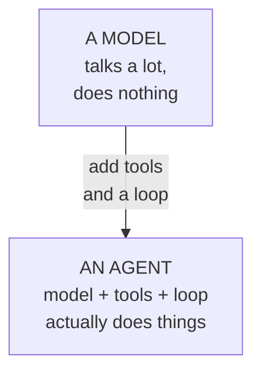
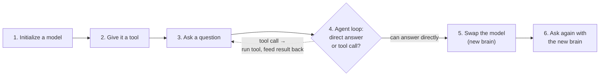
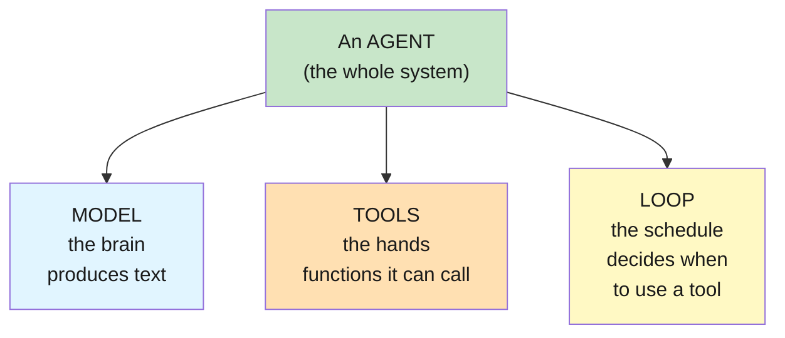
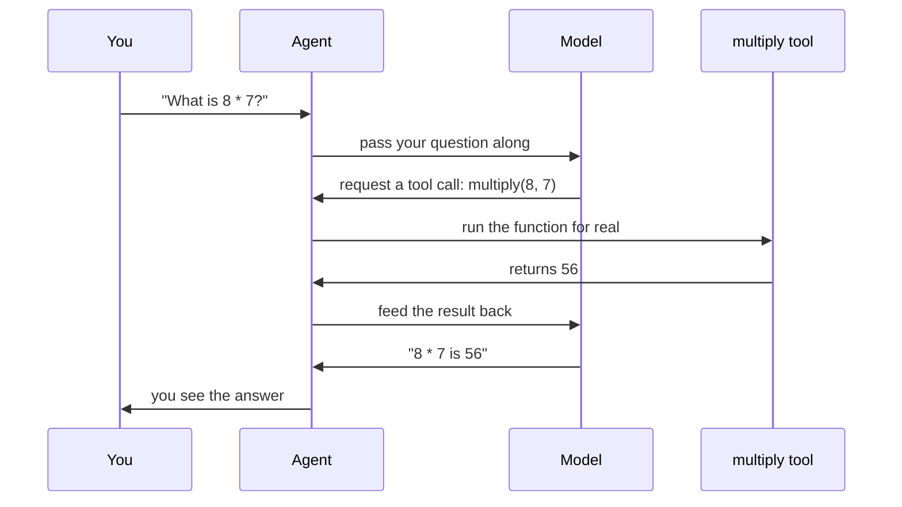
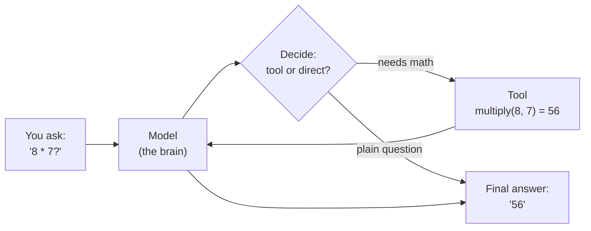

# Lab 1: Agents & Models

**Difficulty: Beginner | ~30 min | No prerequisites**

---

## 1. Agents & Models

Your first LangChain lab. You will build a tiny AI **agent**, give it a tool, and then **swap the model** underneath it — proving the model is a swappable part, not the whole system.

### What is a model?

A **model** (a chat model) is a program trained on an enormous amount of text. You send it a message; it predicts the most likely words to come next — which is why it can answer questions, explain things, and chat naturally. Think of it as an extremely well-read friend who has never left the library: it knows a lot, but it cannot look anything up, cannot calculate reliably, and cannot touch anything. A model is all talk.

Two things matter for this lab:

- **Models are different people.** GPT, Gemini, Llama, Nemotron — each is a different model with different strengths, speeds, and costs. This lab exploits exactly that.
- **A model alone can't do anything.** It can *suggest* an action, but it has no way to perform it.

### What is an agent?

An **agent** is a model wrapped in a framework that gives it hands. Two extra pieces turn a talk-only model into a doer:

- **Tools** — small functions the model is allowed to call. Ours is a single `multiply` function.
- **A loop** — machinery that lets the model *request* a tool call, runs the tool for real, and feeds the result back until the model can give a final answer.



The key idea: **the model never runs your code.** It describes what it wants ("call `multiply` with 8 and 7"), and the agent loop executes it. That's the difference between a chatbot and an agent — and you're about to build the agent yourself. Section 7 goes deeper into how the loop works.

---

## 2. Problem Statement / Use Case Overview

"Agent" is the most overused word in AI right now — every product is "agentic", and every tutorial assumes you already know what an agent is. This lab is the absolute starting point. You will learn what an agent actually is: a **model** (the brain that talks) plus **tools** (the hands it can use) plus a **loop** that decides when to use them. You will build one agent that can do arithmetic, then swap two completely different models underneath it without changing a single line of the agent's logic. By the end you'll understand why model-swapping is trivial in LangChain and why that matters when you design real applications.

---

## 3. Input Data

There is no dataset. The input is plain English:

- A question the agent can answer directly: *"In one sentence, what is an AI agent?"*
- A question that requires a tool: *"What is 8 multiplied by 7?"*

That's it — one of the best ways to learn a concept is to keep the data small enough to inspect by eye (Article PF-4).

---

## 4. Processing

The agent runs in a loop:

1. **Initialize** a chat model (pointing at OpenRouter, using a free model).
2. **Give it a tool** — a single `multiply` function the model can choose to call.
3. **Ask a question.** The agent decides: answer directly, or emit a tool call.
4. **The loop executes the tool** and feeds the result back to the model.
5. **Swap the model** — build a second agent with a different model, same tools, same code.
6. **Ask again** and watch a different brain produce the same correct answer.

Here's the whole lab as a flow — the loop on the left repeats until the model can answer directly, then we swap the brain:



Step 4 is the heart of it: the model doesn't run your code — it asks for a tool call, and the loop executes it and hands the result back until the model can answer.

---

## 5. Output

When the notebook works, each question cell prints the agent's final answer — the last message in the agent's conversation. On a real run it looked like:

```
Step 5 (openai/gpt-oss-20b:free) -> 56
Step 7 (nvidia/nemotron-nano-9b-v2:free) -> The product of 8 multiplied by 7 is 56.
Step 8 (no tool) -> An AI agent is a program that can use tools and make decisions...
```

The exact wording will vary — free models change and answers differ slightly. What must be true: **both models return the correct result (56) through identical agent code, and the last cell answers from knowledge without calling a tool.** If you see that, the swap worked.

---

## 6. Tech Stack

- Python 3.11
- `langchain==1.2.15`
- `langchain-core==1.2.28`
- `langchain-openai==1.1.12` (OpenRouter speaks the OpenAI protocol)
- `python-dotenv==1.2.2` (loads `.env`)
- OpenRouter API — free models, no cost (see https://openrouter.ai/models)

No GPU needed. Runs on any laptop. The only "cost" is a free OpenRouter account for an API key.

---

## 7. Underlying Concepts

### Model vs. agent

A **model** (a chat model) is the brain: you send it text, it returns text. It has no hands — it cannot look things up, calculate, or touch the outside world. An **agent** is the brain *plus* tools *plus* a loop. The loop is the key idea: the model doesn't run your code; it *describes* what it wants to run (a tool call), and the agent framework executes it and hands the result back.

Think of it like a chef. The **model** is the chef's knowledge — recipes and judgement. The **agent** is the kitchen: the chef (model) shouts an order ("chop two onions"), and a sous-chef (the tool) does the chopping and reports back. The chef never leaves the kitchen.

An agent is built from three parts — the model is only one of them:



This is why you can swap the model freely: it's just one of the three parts. The tools and the loop stay put.

### Tool calling

Modern chat models are trained to output not just text but **structured tool requests** — "I want to call `multiply` with 8 and 7." LangChain's agent sees that request, runs your Python function, and sends the function's output back to the model as a new message. The model then produces the final answer.

Step by step, that round-trip looks like this:



Notice the model never computes anything — it only *asks* for the tool call, and the agent loop does the actual work. That separation is the entire idea behind agents.

### Why model-swapping is free

All this works because LangChain talks to every model through one interface (`BaseChatModel`). Your agent code never mentions a provider — it just needs *a* model object. Swap `ChatOpenAI(model="...A...")` for `ChatOpenAI(model="...B...")` and the same agent keeps working. This is why you can prototype with a free model and move to a paid one later by changing one line.



This is one agent run: the model decides, uses the tool when needed, and produces the final answer. **Swap the model and the same loop runs with a new brain** — that's the trick shown in Step 6.

---

## 8. Prerequisites

- **None.** You need basic Python (run a script, install packages) and a web browser.
- One free account: [openrouter.ai](https://openrouter.ai) → Settings → Keys → create a key that starts with `sk-or-v1`.

---

## 9. Environment / Dependencies Setup

Run these in a terminal. We use a virtual environment so the project is isolated and reproducible (Article CQ-6).

```bash
cd Lab1

python3 -m venv .venv
source .venv/bin/activate

pip install --upgrade pip
pip install -qU "langchain==1.2.15" "langchain-core==1.2.28" "langchain-openai==1.1.12" "python-dotenv==1.2.2" "jupyterlab" "ipykernel"
```

Then create your key file:

```bash
cp .env.example .env
```

Open `.env` and replace the `sk-or-v1-xxx...` placeholder with your real OpenRouter API key. Save it.

Verify the environment:

```bash
python -c "import langchain, langchain_openai; print('OK')"
```

You should see `OK`. To run the notebook: `jupyter lab lab-agents-models.ipynb` (or open the file in VS Code). The notebook's first cell also runs the same installs, so if you skipped this step you can let it install the modules for you.

---

## 10. Step-wise Development Instructions

This section is the heart of the lab. You'll work through **nine steps**, each one a single logical move, with the context you need explained before you run each cell. Run the cell, glance at the result, then move on — don't scroll ahead.

The whole lab in one sentence: build a model (the brain), add a tool (the hands), wrap both in a loop (the agent), prove it works, then swap the brain to prove the model is a swappable part — not the whole system.

### Step 1 — Install the required modules

This first command installs the four Python libraries the lab needs, with exact versions pinned so the build is reproducible. Each library has one specific job:
- `langchain` — provides `create_agent`, the machinery that builds the agent loop (the "schedule" that decides when to use a tool).
- `langchain-core` — the shared foundation `langchain` is built on, pinned for compatibility.
- `langchain-openai` — provides `ChatOpenAI`, the wrapper that lets LangChain talk to any OpenAI-compatible API. OpenRouter speaks that protocol, so this one class reaches *any* model on OpenRouter.
- `python-dotenv` — reads your API key from a `.env` file so the secret never sits in your code.

Pinning exact versions (`==1.2.15`, not `>=1.2.15`) means the lab behaves the same today and six months from now — a silent library update is exactly what breaks working code (Article CQ-6). The `!` at the start is a Jupyter special: it runs the rest of the cell as a terminal command instead of Python.

When it finishes, the final line should read `Successfully installed ...`. If you already ran the Section 9 setup, you'll instead see `Requirement already satisfied` lines — that's fine, it just means the packages were already there. Either outcome is success.

```python
# One command installs all required modules (versions pinned for reproducibility)
!pip install -qU "langchain==1.2.15" "langchain-core==1.2.28" "langchain-openai==1.1.12" "python-dotenv==1.2.2"
```

### Step 2 — Load the key

Next we load your OpenRouter API key out of the `.env` file into the notebook's environment, and stop immediately if it's missing. Every model call to OpenRouter must prove who's asking (your key), but we never type the key into code — anyone reading the notebook would see it (Article CQ-7). Instead:
- `load_dotenv()` finds the `.env` file in this folder and loads every `KEY=VALUE` line into the process's environment variables.
- `os.getenv("OPENROUTER_API_KEY")` reads the key back out by name.
- The `if` check is a safety net: if the key is missing (no `.env`, or the placeholder was never replaced), we stop right here with a clear message instead of failing halfway through with a confusing API error.

The cell should produce no output at all — that's the success signal, it means the key was found. If the key is missing, you'll get the red error `No OPENROUTER_API_KEY found...`, which tells you exactly what to fix: put the key in `.env` and restart the kernel.

```python
import os
from dotenv import load_dotenv

# Read the OPENROUTER_API_KEY we saved in .env (Step 9 of the guide)
load_dotenv()

# Stop early with a clear message if the key is missing
if not os.getenv("OPENROUTER_API_KEY"):
    raise SystemExit("No OPENROUTER_API_KEY found. Add it to .env and restart the kernel.")
```

### Step 3 — Initialize a model

Now we create the agent's **brain** — a chat model object named `model_1`, pointed at the free `openai/gpt-oss-20b:free` model served by OpenRouter. A model is the piece that produces text (the brain that talks, from Sections 1 and 7), but it isn't born knowing about OpenRouter or your key — it has to be *configured*, and this object is that configuration. Each argument has a specific job:
- `model=` — which model to use. OpenRouter's ID format is `provider/model:free`; the `:free` suffix means the model costs nothing.
- `base_url=` — where to reach it. `ChatOpenAI` normally expects OpenAI's own servers; this line redirects it to OpenRouter's API instead. That one redirect is how a single wrapper reaches hundreds of models.
- `api_key=` — your key, pulled from the environment variable we loaded in Step 2. Never typed as plain text.
- `temperature=0` — a "creativity" dial. 0 makes the model pick the most likely words every time, keeping answers factual and reproducible. This lab is about structure, not creativity.

Creating an object is silent, so don't expect any output — nothing printed is exactly the success signal. The real test comes in Step 6.

```python
from langchain_openai import ChatOpenAI

# Model 1: an open-weight model served free by OpenRouter
# base_url redirects the standard OpenAI client to OpenRouter
model_1 = ChatOpenAI(
    model="openai/gpt-oss-20b:free",
    base_url="https://openrouter.ai/api/v1",
    api_key=os.getenv("OPENROUTER_API_KEY"),
    temperature=0,
)
```

### Step 4 — Write a tool

Next we define the agent's **hands** — a single Python function named `multiply` that multiplies two numbers. This is the tool the model will be *allowed* to call. From the model's point of view, a tool is just a function described to it: LangChain reads the function's **docstring** (`"""Multiply two numbers and return their product."""`) and **type hints** (`a: float, b: float`) and builds a description that tells the model what the tool does and what inputs to supply. Without the docstring, the model would be guessing what `multiply` does — it literally cannot see your Python code.

This cell only *defines* the function, so there's nothing to see yet; nothing runs until the agent calls it in Step 6.

```python
def multiply(a: float, b: float) -> float:
    """Multiply two numbers and return their product."""
    return a * b
```

### Step 5 — Create the agent

Now we assemble the three parts — brain, hands, loop — into a single `agent` object with one line: `create_agent(model_1, tools=[multiply])`. This is the moment a model becomes an agent. `create_agent` takes the model (the brain) and the list of tools (the hands) and wraps them in the decision loop from Section 7 — the machinery that lets the model *request* a tool call, runs your function for real, feeds the result back, and keeps going until the model can answer directly. The `tools=[multiply]` argument is a list, which is worth noticing: it's where you'd add a second or third tool later.

Again, no output — but something important just happened: `agent` is now a complete agent, not just a model. We prove it in the next step.

```python
from langchain.agents import create_agent

# The agent = this model + this tool + the decision loop around them
agent = create_agent(model_1, tools=[multiply])
```

### Step 6 — Ask a question that needs the tool

Time to run the agent for the first time. We `invoke` it with a user message, "What is 8 multiplied by 7?", and print the final answer. This question is deliberately chosen — `8 × 7` is arithmetic the model can't reliably do from memory, so it *has* to use the tool. Here's what `invoke` does under the hood (the loop from Section 7, now real):
1. Send your message to the model.
2. The model replies with a tool request: "call `multiply` with 8 and 7."
3. The loop runs your Python function for real, gets `56`.
4. The loop sends `56` back to the model as a new message.
5. The model produces the final answer.

The result is a dictionary (`result_1`) whose `"messages"` key holds the whole conversation. The last message in that list, `result_1["messages"][-1].content`, is the final answer — that's why we index it that way. The output cell *shows* only the answer because that's the last expression in the cell; Jupyter prints the last line's value.

Expect the answer `56` in some phrasing (e.g. "8 multiplied by 7 is 56"). The exact wording varies by model, but the number must be right. If you see `56`, the whole loop — model requests a tool, loop executes it, model answers — worked end to end.

```python
# Run the agent loop with a user message
result_1 = agent.invoke({
    "messages": [("user", "What is 8 multiplied by 7?")],
})

# Show only the final answer, not the whole conversation
result_1["messages"][-1].content
```

### Step 7 — Swap the model

Now the point of the lab. We build a *second* agent, `agent_2`, with a completely different model — `nvidia/nemotron-nano-9b-v2:free` — but the exact same tool and the same one-line structure. Look at the code: nothing changed except the `model=` string. The tool is untouched, the `create_agent` call is untouched. It works because LangChain talks to every model through one interface (`BaseChatModel`) — your agent code never mentions a provider, it just needs *a* model object (Section 7, "Why model-swapping is free"). This is the skill you'll use in real projects: prototype with a free model, upgrade to a paid one by changing one line.

No output — but creating this agent required *zero changes* to anything except the model ID. If it builds, the swap is already half-proven; Step 8 proves the rest.

```python
# Model 2: a different open-weight model, still free on OpenRouter
model_2 = ChatOpenAI(
    model="nvidia/nemotron-nano-9b-v2:free",
    base_url="https://openrouter.ai/api/v1",
    api_key=os.getenv("OPENROUTER_API_KEY"),
    temperature=0,
)

# Same tools, same loop, new brain
agent_2 = create_agent(model_2, tools=[multiply])
```

### Step 8 — Ask the same question with the new brain

Now we send the exact same question, "What is 8 multiplied by 7?", through `agent_2` — the new brain. This is the experiment that proves model-swapping: same question, same tool, same loop — only the model differs. If `agent_2` also returns 56, you've shown that the model is genuinely interchangeable — the agent's ability comes from the loop and the tool, not from which brain happens to be attached. The model isn't the system; it's one swappable part of it.

Expect `56` again, probably phrased slightly differently (e.g. "The product of 8 and 7 is 56."). That's exactly what you want: the *answer* is identical while the *wording* differs, which is the signature of two different models doing the same correct job.

```python
# Run the same question through the swapped model
result_2 = agent_2.invoke({
    "messages": [("user", "What is 8 multiplied by 7?")],
})
result_2["messages"][-1].content
```

### Step 9 — A question with no tool needed

Last run: we use the agent on a *knowledge* question — "In one sentence, what is an AI agent?" Agents don't always use tools, and this step shows the loop is a *decision*, not an automatic tool-call. For this question the model can answer directly from what it was trained on, so the loop's decision is "no tool needed — just answer." Watch what's different from Step 8: no tool gets invoked, and the loop still completes. Understanding this is important — a well-built agent uses its tools only when it actually needs them, which is the behavior you want in real applications (fewer API calls, faster answers).

Expect a one-sentence definition of an AI agent. The exact wording varies, but the answer should describe something like a program that uses tools or makes decisions — and it should arrive *without* any tool call. Compare it to Steps 6 and 8: same agent, but this time no `multiply` ran.

```python
# A plain-knowledge question: no tool, the loop just answers
result_3 = agent_2.invoke({
    "messages": [("user", "In one sentence, what is an AI agent?")],
})
result_3["messages"][-1].content
```

---

## 11. Optional Exercise

Swap in a third model. Add a new cell: create a `ChatOpenAI` with the free model `inclusionai/ling-3.0-flash:free`, build an `agent_3` with the same `multiply` tool, and ask it the same "8 multiplied by 7" question. Confirm it returns 56. If that model ID no longer exists, pick any model listed as `:free` at https://openrouter.ai/models and note the ID you used.

---

## 12. What We Learnt

- A **model** answers text; an **agent** is a model + tools + a loop that decides when to use them.
- **Tool calling** lets the model request an action; the agent runs it and feeds the result back.
- LangChain talks to all models through one interface, so **swapping the model is a one-line change** that leaves the agent untouched.
- Free OpenRouter models teach real concepts at zero cost — cheap enough to experiment freely.
- Restart-and-run-all works: this notebook is a sequence you can re-run top to bottom, because every step rebuilds its own state.

Test yourself: complete the exercises in [`lab-agents-models-assignment.md`](lab-agents-models-assignment.md) — answer key included.
