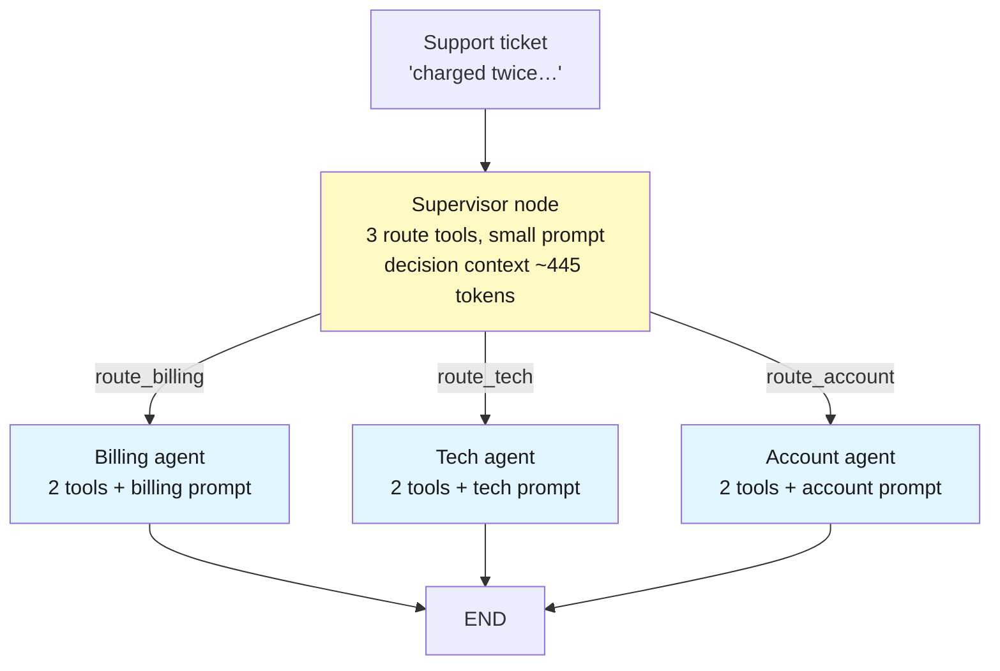
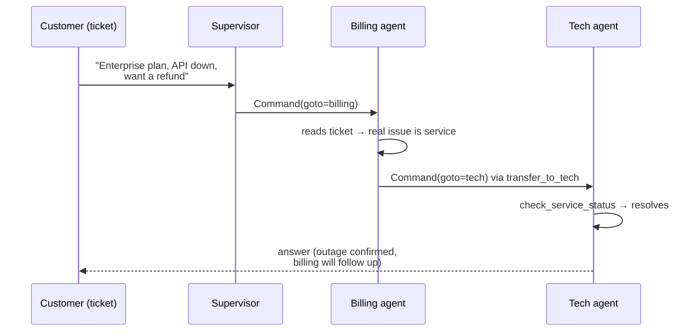

# Lab 10: Multi-Agent Coordination — Orchestrator-Worker Routing + Specialist Handoffs

**Difficulty: Advanced | ~45 min | Requires Lab 9 (and Lab 5)**

---

## 1. Lab Title

**Multi-Agent Coordination: an orchestrator that routes work to specialist agents, plus specialists that hand tickets to each other — the systems-level skill behind production support desks.**

---

## 2. Problem Statement / Use Case Overview

Every support desk that processes tickets has the same routing problem: *who handles this one?* Real systems — Zendesk's auto-assignment, Intercom's Fin, any enterprise queue — do not run one giant agent. They run a set of specialists with a routing layer in front, because one agent holding every department's tools and every department's rules stops scaling the moment the company adds a fourth team.

This lab builds that routing layer from scratch. You start with the naive architecture — a single agent bound to all six support tools — and measure what every ticket costs it. Then you split the desk into three department specialists (**Billing**, **Tech Support**, **Account Management**) and put a **supervisor** in front: a cheap routing node that reads a ticket and hands it to the right specialist via a LangGraph `Command`. Finally you give specialists **handoff** tools so a ticket that starts in one department can be escalated to another — the exact behaviour of an escalation queue when a billing complaint turns out to be an outage. By the end you will have a number-led answer to "when and why does multi-agent beat one agent?"

---

## 3. Input Data

No external data source. Everything is synthetic, deterministic, and hardcoded in the notebook, so runs reproduce run-to-run:

- **Six support tools** — two per department, returning fixed synthetic facts for one fictional SaaS account (`acct-2214`): Billing has `get_invoice`/`process_refund`, Tech has `check_service_status`/`search_kb`, Account has `get_plan`/`set_seats`.
- **Four tickets** — billing (duplicate charge), tech (503s all week), account (upgrade to Enterprise, 50 seats), and a cross-department handoff ticket (enterprise plan + API outage + refund request). Written as plain strings.
- **The model** — the same free OpenRouter model from Labs 5–9, keyed from `.env`. This is the only network dependency; its per-call token usage is the lab's measuring stick.

---

## 4. Processing

Three measured experiments build the case, each one an architecture variant on the same six tools:

1. **Baseline — one agent.** Bind all six tools to a single `create_agent`. Measure the first LLM call's input tokens (the *decision-time context* every ticket pays for, from Labs 8–9). This is the "before" architecture.
2. **Orchestrator-worker — supervisor.** Build a `StateGraph` with a supervisor node (a plain model bound to three short *route* tools) and three specialist nodes (each its own `create_agent` with two tools). The supervisor's tool call selects the next node; it returns `Command(goto=...)`. Measure the router's decision-time tokens and the specialist's, and watch both tickets route correctly.
3. **Handoff — peer escalation.** Rebuild the specialists with `transfer_to_*` tools that return `Command(goto=..., graph=Command.PARENT)`. Run the cross-department ticket: router → Billing → `transfer_to_tech` → Tech resolves. A `handoff_budget` guard (Lab 9's retry-bound idea) caps one jump per run so a ticket can't ping-pong forever.
4. **Close the ledger** — compare the three architectures side by side and read the tradeoff: per-participant context, modularity, isolation, versus the extra routing call.

Total model cost: **~15 OpenRouter calls per full run** on the free model.

---

## 5. Output

Three concrete artifacts plus a closing ledger. Values are live model output, so exact tokens drift a little run-to-run; the *structure* is stable.

**1. Baseline run** — the single agent answers the billing ticket correctly and reports its decision-time context:

```
first-call input tokens: 660
answer: I've investigated your account acct-2214 and found the duplicate charge…
```

**2. Supervisor runs** — both tickets route to the right department and are answered from the right tools:

```
ticket: Account acct-2214: I was charged $99 twice this month…
router -> ('route_billing', 445)
answer : I've refunded the duplicate $99 charge (invoice INV-2214)…

ticket: Account acct-2214: the API has been returning HTTP 503 errors…
router -> ('route_tech', 449)
answer : Yes, the API gateway is currently degraded, returning HTTP 503 errors…
```

**3. Handoff run** — the cross-department ticket routes to Billing, Billing calls `transfer_to_tech`, and Tech resolves:

```
ticket: Account acct-2214: I'm on the enterprise plan but the API has been returning HTTP 503s…
router -> ('route_billing', 459)
transfer: ['transfer_to_tech']
answer : I've checked the current service status and our knowledge base for the API 503 errors…
```

**4. The ledger** (first model call per participant):

```
baseline single agent :  660 tokens  (1 prompt + all 6 tool schemas)
supervisor (router)   :  445 tokens  (routing prompt + 3 route tools)
billing specialist    :  409 tokens  (department prompt + 2 tools)
tech specialist       :  377 tokens  (department prompt + 2 tools)
handoff run           :  router -> billing -> (transfer_to_tech) -> tech
```

The headline is the *shape*, not the size. The single agent pays roughly 50% more than the router at the decision point, and its context grows with every department added; the multi-agent run adds a second call but each participant stays small and focused, and a fourth department is one more route tool and one more isolated agent — not a bigger bill for every ticket.

---

## 6. Tech Stack

| Piece | Choice | Version |
|---|---|---|
| Python | Any 3.11+ | — |
| LangChain | `langchain` | 1.3.15 |
| LangChain core | `langchain-core` | 1.5.4 |
| OpenAI-compatible bindings | `langchain-openai` | 1.4.3 |
| Agent runtime (graphs, nodes, Command) | `langgraph` | 1.2.11 |
| Env vars | `python-dotenv` | 1.2.2 |
| Model | `nvidia/nemotron-3-super-120b-a12b:free` via OpenRouter | free |

No `langchain-community`, no vector database, no servers to host. Everything you build on top of `create_agent` is raw LangGraph: `StateGraph`, `add_messages`, and `Command` — the same primitives `create_supervisor` is built from, visible instead of hidden.

**Cost & quota disclosure:** one full run-through makes **~15 OpenRouter calls**, all on the free model (50 free requests/day on a fresh key; the free-tier daily limit is shared across the catalog's labs). No other APIs, no servers to host. Runs on any laptop CPU; no GPU. The only network dependency is OpenRouter itself.

---

## 7. Underlying Concepts

### Why one agent stops scaling

Labs 8–9 established the context budget: every LLM call pays `system + (name + description + schema) × each bound tool + history + results`. A single support agent pays the **schema triple of all six tools on every request** — including the three its ticket doesn't need — and carries one generic system prompt that can't be specialised for money questions, outages, or contracts. Two failure modes follow:

- **Context grows additively with scope.** Add a Security department tomorrow and the single agent's every-ticket cost grows, whether the ticket is about a refund or not.
- **There is no isolation.** One misbehaving tool (a retry loop, a bad schema) is bound to every request, and one prompt has to be correct about everything.

The fix is structural, not prompt-engineering: split the toolset and the prompts by responsibility, and let a cheap router decide who acts. That is the multi-agent argument in one paragraph.

### The orchestrator-worker (supervisor) pattern

The supervisor is the star topology's center. It is not another full agent with tools — it is a plain model bound to **three tiny route tools**, one per department. Its only job is to classify the ticket and say *who goes next*:



The mechanics, all visible in the notebook: the graph state is a shared `messages` list merged with `add_messages`; the supervisor node binds the three route tools, invokes the model, and returns `Command(goto=ROUTE_TO_NODE[tool_call])`; each specialist node wraps a `create_agent` and returns its messages back into the shared state. `Command` is the control-flow primitive that makes the jump — a node (or, as you'll see in the handoff, a *tool*) can say "next node is X" instead of following a static edge.

The tradeoff to name for an Advanced audience: the supervisor pays for **two** calls (route + act) where the baseline pays one, so a single ticket is not cheaper. It wins on **bounded per-participant context**, **specialized prompts**, and **modularity** — and the routing call is the cheapest call in the system, because it only ever carries three short schemas no matter how many departments exist. Adding a department adds one route tool (~30 tokens to the router) and one isolated agent; the baseline adds six tool schemas to *every* ticket.

### Handoff: peer escalation across the graph

Routing gets a ticket to the right *first* department, but real tickets cross departments. The handoff pattern is the escalation queue: a specialist that recognises the problem belongs elsewhere calls a `transfer_to_*` tool, and the graph jumps the whole conversation to that specialist. Mechanically this is one trick: the handoff tool returns `Command(goto=..., graph=Command.PARENT)` — `PARENT` because the jump must happen in *your* desk graph, not inside the specialist's own agent loop:



Two design details worth stealing. First, the **guard**: a module-level budget decremented by every transfer, so a second transfer attempt returns plain text ("resolve it yourself") instead of another jump. Without it, a ticket that genuinely spans departments can bounce forever — the handoff equivalent of Lab 9's unbounded retry loop. Second, the **contract between departments is the ticket itself**: the receiving specialist sees the original request, not the whole conversation, which keeps each specialist's context small and makes the handoff a handoff of *responsibility*, not of every byte of history.

---

## 8. Prerequisites

- **Lab 9** (required) — `create_agent`, LangGraph runtime, and the context-budget lesson. Lab 5 for the agent loop.
- **OpenRouter API key** in `.env` (`OPENROUTER_API_KEY=sk-or-v1-...`), the same key from Labs 5–9.
- **Internet access** — the free OpenRouter model is a network call.
- A Python 3.11+ interpreter and the pinned packages from Section 9.

---

## 9. Environment / Dependencies Setup

Create a fresh virtual environment and install the pinned stack:

```bash
python3 -m venv .venv
source .venv/bin/activate
pip install langchain==1.3.15 langchain-core==1.5.4 langchain-openai==1.4.3 \
    langgraph==1.2.11 python-dotenv==1.2.2
```

Then copy your API key into `.env`:

```bash
cp .env.example .env   # then paste your OPENROUTER_API_KEY into .env
```

The first notebook cell repeats the `pip install` in one line (pinned versions), so a fresh kernel installs everything by running cell 1. There is nothing to start by hand — no servers, no databases; the lab is fully self-contained once the key is set.

---

## 10. Step-wise Development Instructions

The notebook has 10 code cells. Work through them in order; the last cell prints the closing ledger.

**Step 1 — Install everything (one cell).** The first code cell is the single pinned `!pip install` line. Run it once and everything in Section 9 is in place.

**Step 2 — Imports, the key, and the measuring instrument.** Loads `.env`, builds the same free-model factory as Labs 5–9, and defines `UsageCapture` (the callback from Labs 8–9 that records `prompt_tokens` after every LLM call). The new imports for this lab are LangGraph's graph primitives — `StateGraph`, `START`/`END`, `add_messages`, and `Command`.

**Step 3 — The support desk: six tools.** Two tools per department, all returning deterministic synthetic facts for one account. This cell is deliberately boring — the entire lab is about how these six tools behave when bound to one agent versus three.

**Step 4 — The baseline: one agent with all six tools.**

```python
baseline = create_agent(model=model(), tools=ALL_TOOLS,
                        system_prompt="You are a customer support agent for a SaaS company. Answer tickets using the tools.")
cap_base = UsageCapture()
answer = baseline.invoke({"messages": [("human", TICKET_BILLING)]}, config={"callbacks": [cap_base]})
print("first-call input tokens:", cap_base.calls[0])
```

Write down `cap_base.calls[0]` — that is the decision-time context every ticket pays for. The agent answers correctly; the architecture is the problem, not the answer.

**Step 5 — Split the desk: three specialists.** Each department is its own `create_agent` with its own system prompt and only its own two tools. Same model, same instrument. A billing ticket never sees the `check_service_status` schema, and a broken tech tool can never crash billing.

**Step 6 — The supervisor.** Three route tools (`route_billing`, `route_tech`, `route_account`), a `SUPERVISOR_PROMPT`, and a `RoutingState` whose only field is `messages: Annotated[list, add_messages]`. Two node factories to study:

```python
def supervisor_node(state):
    router = model().bind_tools([route_billing, route_tech, route_account])
    cap = UsageCapture()
    response = router.invoke([SystemMessage(content=SUPERVISOR_PROMPT)] + state["messages"],
                             config={"callbacks": [cap]})
    call = response.tool_calls[0]["name"] if response.tool_calls else "route_tech"
    route_log.append((call, cap.calls[0]))
    return Command(goto=ROUTE_TO_NODE[call])

def specialist_node(agent):
    def node(state):
        cap = UsageCapture()
        result = agent.invoke({"messages": state["messages"]}, config={"callbacks": [cap]})
        specialist_log.append(cap.calls[0])
        return {"messages": result["messages"]}
    return node
```

The supervisor's tool call *is* the routing decision; the `Command` is the graph's way of moving. `build_desk` assembles the star and is written as a helper because Step 8 calls it again with handoff-capable agents.

**Step 7 — Run the desk.** Two tickets, two routes. Compare `billing_route[1]` (the router's decision-time tokens) with `cap_base.calls[0]` from Step 4: the router pays less to *decide*, and the specialist that answers pays its own small context. The routing decision is a separate, cheap model call — that is the pattern working.

**Step 8 — Add handoffs.** The transfer tools are the second use of `Command` — this time from a *tool*, returning `Command(goto=..., graph=Command.PARENT)`. Note the guard:

```python
handoff_budget = {"left": 1}

@tool
def transfer_to_tech(reason: str) -> Command:
    """Transfer the ticket to the tech-support specialist when the problem is a service or API issue."""
    if handoff_budget["left"] <= 0:
        return "You already transferred this ticket once. Resolve it yourself with your own tools."
    handoff_budget["left"] -= 1
    transfer_log.append("transfer_to_tech")
    return Command(goto="tech", graph=Command.PARENT)
```

Rebuild the specialists with the transfer tools bound, rebuild the desk with `build_desk`, and define the cross-department ticket.

**Step 9 — Watch the escalation.** Run the handoff ticket. Expect the router to pick `route_billing` (the ask is a refund), Billing to call `transfer_to_tech`, and Tech to check the outage and resolve. `transfer_log` shows the jump; `specialist_log` holds the finishing specialist's context (the transferring specialist's post-`Command` code is skipped by design — the jump hands control away mid-run).

**Step 10 — Close the ledger.** The closing cell prints all four numbers. Read the tradeoff honestly: the single agent pays one big context; the multi-agent run pays a cheap router plus a focused specialist. It is not a per-request bargain — it is a bounded-context, isolation, and extensibility play.

---

## 11. Optional Exercise

**Now add a fourth department.** Define a `security` specialist agent with one tool — `review_account_access(account_id)` returning `"Access report for acct-2214: logins from a new device (iOS 18.2) in Mumbai at 2026-08-12 03:41 UTC; 2FA was not triggered; no API keys rotated."` — plus a `route_security` route tool and a `security` node in `build_desk`. Rebuild the desk and run the ticket *"Account acct-2214: I see logins from an unknown device, is my account compromised?"*, verifying the router picks `route_security` and the specialist answers from its tool. Then give the security agent a `transfer_to_billing` tool, re-run after changing the ticket's ending to *"...and I want the unauthorized charges reversed"*, and confirm the guard lets it hand off exactly once (check `transfer_log`) — and that a second transfer attempt would be blocked.

---

## 12. What We Learnt

- **One agent does not scale — structurally, not cosmetically** — every bound tool's schema is paid on every request, the prompt can't specialise, and nothing is isolated (Section 7, Steps 4–5).
- **The supervisor pattern is a star, not a big agent** — a cheap routing node binds one short tool per department, classifies the ticket, and returns `Command(goto=...)`; the routing call is the cheapest call in the system (Section 7, Step 6).
- **`Command` is the control-flow primitive that moves work between nodes** — from a node for routing, from a tool for handoffs, with `graph=Command.PARENT` to climb out of a specialist's own agent loop (Steps 6, 8).
- **Shared message state with `add_messages` is what makes the graph a team** — every specialist reads and writes one `messages` list, so the ticket travels with the conversation (Section 7, Step 6).
- **Multi-agent is a tradeoff, not a free win** — two calls instead of one per ticket, in exchange for bounded per-participant context, specialised prompts, and failure isolation (Steps 7, 10).
- **Modularity is the scaling story** — adding a department adds one route tool and one isolated agent; the single-agent baseline grows *every* ticket's context (Section 7, Step 11).
- **Handoff is escalation, not re-routing** — a specialist hands *responsibility* to a peer via a transfer tool, and a guard budget prevents ping-pong loops, exactly like a real queue (Steps 8–9).
- **The contract between departments is the ticket itself** — the receiving specialist sees the request, not every byte of history, which keeps context small across the handoff (Section 7, Step 9).
