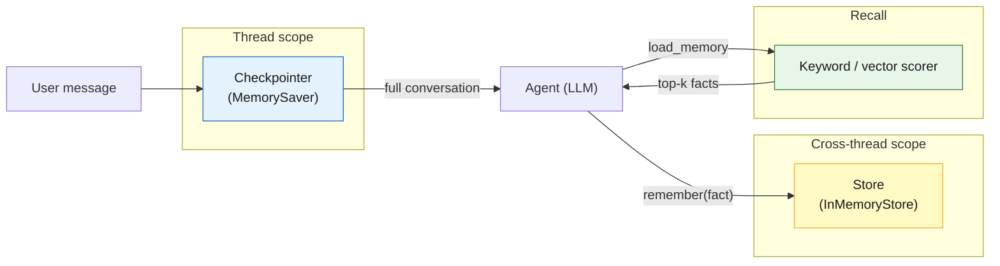
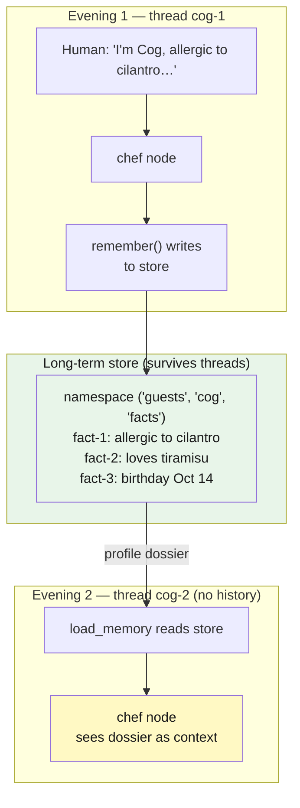
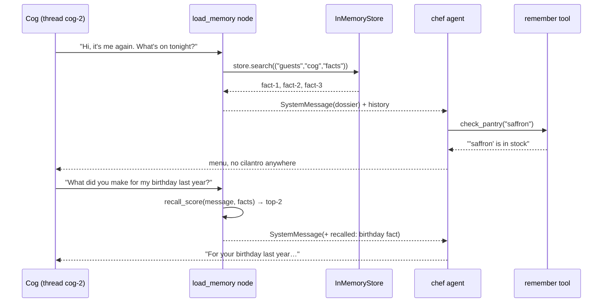

# Lab 11: Long-Term Memory — the host Who Never Forgets a Guest

**Difficulty: Advanced | ~45 min | Requires Lab 9 (and Lab 10)**

---

## 1. Lab Title

**Long-Term Memory for agents: a restaurant host that remembers every guest across sessions — thread-scoped short-term memory, a namespaced long-term store, and keyword recall when a guest says "surprise me."**

---

## What is Long-Term Memory for Agents?

Most agents you have built so far (Labs 4–9) carry memory in two places: the **model's training knowledge** (static, frozen at train time) and the **conversation history** (live, but scoped to a single thread). When the thread ends, the conversation history is gone. If the user starts a new thread, the agent starts from zero — no name, no preferences, no context from yesterday. This is the "guest who has to reintroduce themselves at every visit" problem.

Long-term memory solves this by giving agents a **persistent, cross-thread store** — a place to write facts that survive across sessions, threads, and even process restarts. But memory is not one thing. Real systems split it into three layers, each with different scope, cost, and retrieval characteristics:

1. **Checkpointer (short-term, thread-scoped).** This is the `MemorySaver` from Lab 9 — it replays the full conversation history within a single thread so the agent can reference earlier turns. Scope: one thread. Lifetime: until you delete the thread. Cost: paid on every invoke (the full message list is part of the context window).

2. **Store (long-term, cross-thread).** An `InMemoryStore` (or a database-backed store in production) keyed by a namespace tuple like `("guests", "cog", "facts")`. Facts written here survive across threads and sessions. Scope: defined by the namespace — one guest's facts are invisible to another's. Lifetime: until you delete them. Cost: zero at rest; paid only when `load_memory` reads them into the prompt.

3. **Recall (retrieval over stored facts).** Just like Lab 9's retrieval-augmented agent retrieved documents from a corpus, the recall layer searches the long-term store for facts relevant to the current message. In this lab it is a simple keyword-overlap scorer; in production it would be a vector similarity search. Scope: the guest's namespace. Cost: a small scoring pass, then only the matching facts enter the context window.



The key insight is that **each layer has a different boundary**: the checkpointer is per-thread, the store is per-entity (namespaced), and recall is on-demand (like retrieval). This lab wires all three together into a single `load_memory → chef → END` graph and proves the boundaries work by running two guests across three threads.

---

## 2. Problem Statement / Use Case Overview

An agent that forgets is a guest who has to reintroduce themselves at every visit. Labs 5–9 gave you agents with *stateless* conversations and a *thread-scoped* checkpointer; Lab 10 built a routing layer for a support desk. This lab answers the question none of them touch: **how does an agent remember something from one session and use it in another?**

You will build the memory layer behind a one-table restaurant's host. Across three simulated evenings (three threads, two guests), the agent learns that Cog is allergic to cilantro, loves tiramisu, and has a birthday on October 14 — then greets her by name in a *new thread* with zero conversation history, avoids cilantro unprompted, and digs up the birthday menu when she asks "what did you make me last year?" Meanwhile a second guest, Node, sees none of Cog's facts — memory is namespaced, not shared. Along the way you will split memory into the three layers real systems use: the checkpointer (short-term, thread-scoped), a store (long-term, cross-thread), and retrieval over stored facts (recall). By the end you'll know *where* to put a fact, *when* to read it back, and how to keep one guest's private history out of another's context.

---

## 3. Input Data

No external dataset. Everything is generated during the lab — that is the point, because the lab's "data" is **the conversation itself**:

- **Three guest sessions** written as plain strings: Cog's first visit (she volunteers her allergy, favourite dessert, and birthday), Cog's second visit in a fresh thread (a greeting, then a recall question about her birthday menu), and Node's first visit (he only says he doesn't eat pork).
- **A fictional kitchen inventory** — five ingredients hardcoded in `check_pantry`, so the chef's suggestions are grounded in reproducible facts, not imagination.
- **The model** — the same free OpenRouter model from Labs 5–10, keyed from `.env`. It supplies the chef's persona and drives the `remember` tool; the memory machinery around it is entirely local and deterministic.

---

## 4. Processing

One graph, four pieces, three runs. The graph is a short pipeline: `load_memory → chef → END`, compiled with both a checkpointer and a store.

1. **`load_memory`** (a plain node) reads the store for the guest's namespace, builds a *dossier* of every stored fact, and — when the guest's message matches stored facts by keyword overlap — adds a *recalled* line. It injects all of it as a `SystemMessage` so the model sees memory as context.
2. **`chef`** (a `create_agent`) answers from that context. It holds two tools: `check_pantry` (grounded menu suggestions) and `remember` — the write side of long-term memory. When the model calls `remember`, the tool writes the fact into the store's namespace for that guest.
3. **Three runs prove the three layers.** Run 1 (Cog, thread `cog-1`) starts with an empty store and fills it. Run 2 (Cog, thread `cog-2`) shows the store surviving across threads while the conversation history does not. Run 3 (Node, thread `node-1`) shows namespace isolation.
4. **The ledger** closes by printing each guest's stored facts and the decision-time token cost per chef call — memory has a price, and it is visible in the token count of run 2 versus run 1.

Total model cost: **~15 OpenRouter calls per full run** on the free model.

---

## 5. Output

Four concrete outputs. Values are live model text, so the wording drifts a little; the *structure* is stable. These are the real outputs of a clean run (Restart & Run All from an empty store).

**1. Session 1 — Cog's first visit (empty store, thread `cog-1`):**

```
chef: Good evening, Cog! Welcome to our restaurant. I hope you're having a lovely day.
      I've taken note of a few things you shared: you're allergic to cilantro, you love tiramisu, yo...
store now holds: ['Cog is allergic to cilantro.', 'Cog loves tiramisu.',
                  "Cog's birthday is October 14.",
                  "Cog's grandmother always made saffron risotto for her birthday."]
```

All four facts landed in Cog's namespace — including the risotto one, which is the key to the recall demo in session 2b.

**2. Session 2 — Cog returns in a brand-new thread (`cog-2`) — the store survived, the conversation did not:**

```
profile loaded: - Cog is allergic to cilantro.
                - Cog loves tiramisu.
                - Cog's birthday is October 14.
                - Cog's grandmother always made saffron risotto for her birthday.
chef: Welcome back, Cog! It's a pleasure to see you again. I've checked our pantry tonight and found
      we have saffron and mascarpone in stock, which reminds me of your grandmother's saffron risotto...
```

**3. Session 2b — the same thread, a recall question — keyword scoring surfaces both birthday memories:**

```
recalled: Cog's grandmother always made saffron risotto for her birthday. | Cog's birthday is October 14.
chef: I don't have a specific record of what I prepared for your birthday last year in my memory.
      However, I do know that your grandmother always made saffron risotto for your birthday...
```

**4. Session 3 — Node, a different guest, sees none of Cog's memory (`node-1`), and the ledger closes:**

```
profile loaded: - Node does not eat pork
chef: Hello Node, welcome to our restaurant! It's a pleasure to have you here for your first visit.
      May I ask if you have any other dietary preferences or restrictions I should be aware of?

ledger
  cog facts: ['Cog is allergic to cilantro.', 'Cog loves tiramisu.',
                "Cog's birthday is October 14.",
                "Cog's grandmother always made saffron risotto for her birthday."]
  node   facts: ['Node does not eat pork']
  decision-time tokens per chef call: [526, 527, 1225, 491]
  model calls per chef run: [6, 5, 1, 2]
```

The headline is the *isolation + persistence* pair. Threads are cheap amnesia; the store is deliberate memory. Cog's facts appear in a thread that never met her before, Node never sees them, and every fact a `remember` call writes is a fact `load_memory` can read on the next evening. Note the ledger's second line — each chef run is a small agent loop, so a session costs several model calls (here 6, 5, 1, 2), and run 2's chef call carries more decision-time tokens than run 1's because the dossier is now in its context.

---

## 6. Tech Stack

| Piece | Choice | Version |
|---|---|---|
| Python | Any 3.11+ | — |
| LangChain | `langchain` | 1.3.15 |
| LangChain core | `langchain-core` | 1.5.4 |
| OpenAI-compatible bindings | `langchain-openai` | 1.4.3 |
| Agent runtime (graphs, checkpointer, store) | `langgraph` | 1.2.11 |
| Env vars | `python-dotenv` | 1.2.2 |
| Model | `nvidia/nemotron-3-super-120b-a12b:free` via OpenRouter | free |

The two new pieces this lab adds to your toolkit are both from `langgraph` (no new packages): **`MemorySaver`** as the checkpointer (thread-scoped memory, first seen in Lab 9) and **`InMemoryStore`** as the long-term store, surfaced inside nodes via the injected **`Runtime`** and a `context_schema`. No vector database, no embeddings API, no servers.

**Cost & quota disclosure:** one full run-through makes **~15 OpenRouter calls**, all on the free model (50 free requests/day on a fresh key; the free-tier daily limit is shared across the catalog's labs). No other APIs, no servers to host. Runs on any laptop CPU; no GPU. The only network dependency is OpenRouter itself.

---

## 7. Underlying Concepts

### Memory is not one thing

Agents get "memory" from three different mechanisms, and the most common production mistake is treating them as interchangeable:

- **Thread-scoped (short-term) memory** is the *conversation*. The checkpointer (`MemorySaver`) snapshots state per `thread_id`, so turn N within a thread sees turns 1…N−1. Close the thread and it is gone. This is working memory — fast, scoped, disposable.
- **Long-term memory** is the *store*. An `InMemoryStore` holds named items in hierarchical namespaces, independent of threads. It survives a new thread, a new process, even a new deployment (swap `InMemoryStore` for a durable `PostgresStore` and the API does not change). This is the filing cabinet.
- **Recall** is *retrieval over the store*. Long-term memory only helps if you can find the right fact at the right moment. Real systems use embeddings; this lab uses a deliberately tiny keyword scorer so the mechanism is visible and needs no extra API.



### The store: namespaces, items, and the `Runtime`

A store is a key–value tree. `store.put(("guests", "cog", "facts"), "fact-1", {"content": "..."})` writes an item whose **namespace** is the tuple `("guests", "cog", "facts")`, whose **key** is `"fact-1"`, and whose **value** is the dict `{"content": ...}`. Reading is prefix-based: `store.search(("guests", "cog", "facts"))` returns every fact for Cog, and — this is the isolation guarantee — Node's namespace `("guests", "node", "facts")` is a different branch of the tree. Namespaces are how you partition memory by user, tenant, or category without any shared-state bugs.

Nodes reach the store through a mechanism this lab uses for the first time: the **injected `Runtime`**. Compile the graph with `store=store` and a `context_schema=Guest`; declare `runtime: Runtime[Guest]` in a node's signature and LangGraph hands you an object carrying `runtime.store` and `runtime.context` (here, the `guest_id`). No globals, no plumbing — the graph's run-scoped dependencies show up as a parameter.

### The write path: memory as a tool

The chef does not *write* memory; the chef *decides* what is worth remembering, and a tool does the writing. `remember` is built with a closure over the store and the guest's id, so the model call triggers a real `store.put` when it chooses:

```python
def make_remember(store, guest_id):
    @tool
    def remember(fact: str) -> str:
        """Persist one fact about this guest so every future session recalls it."""
        existing = [i.value["content"] for i in store.search(("guests", guest_id, "facts"))]
        if fact in existing:
            return "Already remembered."
        store.put(("guests", guest_id, "facts"), f"fact-{len(existing) + 1}", {"content": fact})
        return f"Remembered as fact {len(existing) + 1}."
    return remember
```

This is the canonical LangGraph long-term-memory pattern: the model is the *fact extractor*, the tool is the *persistence boundary*. The tool hides the store from the model (the model never sees namespaces or keys), and because the write is a tool call, it lands in the same audit trail as every other tool invocation. Note the guard: if the fact already exists the tool returns `"Already remembered."` instead of writing a duplicate — models are eager re-extractors, and idempotent writes keep the filing cabinet clean.

### The read path: memory as context

The read side inverts it — the graph surfaces memory as a `SystemMessage`, because the model cannot query the store directly and shouldn't have to. `load_memory` runs before the chef on every request, so **the model's context is rebuilt from memory at the start of each turn**:

- the **dossier**: every stored fact for this guest;
- the **recall** line: only when the incoming message overlaps stored facts, `top-2` keyword matches are appended — the retrieval step. The scorer is `recall_score`, a token-overlap function from Lab 9's retrieval toolkit. At scale you would swap the scorer for an embedding index (`store.search(..., query=...)` with `index={"embed": ...}`); the pipeline shape is identical.

The tradeoff to name for an Advanced audience is the **context bill**: memory does not make the model smarter for free. Every dossier line is a token on every call in that thread. That is why the ledger in Step 10 measures decision-time tokens per run — a memory system that injects the whole store on every request has turned a filing cabinet into an engine of context bloat. Real systems summarize, TTL-stamp, and rank precisely because of this.



### Isolation is a feature, not an accident

Because memory is namespaced per guest, Node's evening can never be contaminated by Cog's facts — the same mechanism that makes multi-tenant SaaS safe. Contrast this with a single shared `messages` list: that is *team* memory (Lab 10's desk), where every agent shares the thread. Long-term memory is *per-entity* memory, and the namespace is the boundary.

---

## 8. Prerequisites

- **Lab 9** (required) — `create_agent`, the LangGraph runtime, the checkpointer (`MemorySaver`, `thread_id`), and the retrieval/context-budget lesson. Lab 10 for graph structure and `Runtime`-adjacent patterns.
- **OpenRouter API key** in `.env` (`OPENROUTER_API_KEY=sk-or-v1-...`), the same key from Labs 5–10.
- **Internet access** — the free OpenRouter model is a network call.
- A Python 3.11+ interpreter and the pinned packages from Section 9.

---

## 9. Environment / Dependencies Setup

Create a fresh virtual environment and install the pinned stack:

```bash
python3 -m venv .venv
source .venv/bin/activate
pip install -qU langchain==1.3.15 langchain-core==1.5.4 langchain-openai==1.4.3 \
    langgraph==1.2.11 python-dotenv==1.2.2
```

Then copy your API key into `.env`:

```bash
cp .env.example .env   # then paste your OPENROUTER_API_KEY into .env
```

The first notebook cell repeats the `pip install` in one line (pinned versions), so a fresh kernel installs everything by running cell 1. Nothing to start by hand — the checkpointer and store are in-memory, so **Restart & Run All starts from an empty store** (a full fresh run is exactly what the demo wants).

---

## 10. Step-wise Development Instructions

The notebook has 10 code cells. Work through them in order; the last cell prints the closing ledger.

**Step 1 — Install everything (one cell).** The first code cell is the single pinned `!pip install` line. Run it once and everything in Section 9 is in place.

**Step 2 — Imports, the key, and the measuring instrument.** Loads `.env`, builds the same free-model factory as Labs 5–10, and defines `UsageCapture` (the callback from Labs 8–9 that records `prompt_tokens` after every LLM call). The new imports are the memory pieces: `Runtime` (the injected run-scoped object), `InMemoryStore` (the long-term store), `MemorySaver` (the thread checkpointer), and `dataclass` (for the `Guest` context schema).

```python
import os, pathlib
from dotenv import load_dotenv
load_dotenv(pathlib.Path(".env"))
from langchain_openai import ChatOpenAI
from langchain_core.tools import tool
from langchain_core.messages import SystemMessage
from langchain_core.callbacks import BaseCallbackHandler
from langchain.agents import create_agent
from langgraph.graph import StateGraph, START, END
from langgraph.graph.message import add_messages
from langgraph.runtime import Runtime          # injected run-scoped object (store + context)
from langgraph.store.memory import InMemoryStore  # cross-thread long-term store
from langgraph.checkpoint.memory import MemorySaver  # thread-scoped checkpointer
from dataclasses import dataclass
from typing import Annotated, TypedDict
```

The model factory — same free tier as Labs 5–10:

```python
def model():
    return ChatOpenAI(base_url="https://openrouter.ai/api/v1",
                      api_key=os.environ["OPENROUTER_API_KEY"],
                      model="nvidia/nemotron-3-super-120b-a12b:free", temperature=0)
```

The measuring instrument:

```python
# Records prompt_tokens after every LLM call — measures the token price of memory
class UsageCapture(BaseCallbackHandler):
    def __init__(self): self.calls = []
    def on_llm_end(self, response, **kwargs):
        usage = (response.llm_output or {}).get("token_usage", {})
        self.calls.append(usage.get("prompt_tokens", 0))
```

**Step 3 — The store and the tools.** One `InMemoryStore` for the whole lab, a deterministic `check_pantry` tool, and `make_remember` — the factory that closes over `(store, guest_id)` and returns a `remember` tool that persists a fact. Study `make_remember`: the namespace tuple and the value dict are the entire long-term-memory write API.

```python
store = InMemoryStore()  # cross-thread long-term store — survives new threads, new processes
```

The write side — a factory that closes over the store and guest ID:

```python
# Factory: closes over (store, guest_id) so remember() writes to the right namespace
def make_remember(store, guest_id):
    @tool
    def remember(fact: str) -> str:
        """Persist one fact about this guest so every future session recalls it."""
        existing = [i.value["content"] for i in store.search(("guests", guest_id, "facts"))]
        if fact in existing:
            return "Already remembered."  # idempotent — prevents duplicate writes
        # store.put(namespace, key, value) — the entire long-term write API
        store.put(("guests", guest_id, "facts"), f"fact-{len(existing) + 1}", {"content": fact})
        return f"Remembered as fact {len(existing) + 1}."
    return remember
```

**Step 4 — Context schema, state, and the recall scorer.** `Guest` is the `context_schema` dataclass that carries the `guest_id` into nodes; `MemoryState` is the graph state (one `messages` list merged with `add_messages`); `recall_score` is the deterministic retrieval stand-in — it counts overlapping words between the incoming message and a stored fact.

```python
# Guest: context_schema dataclass — carries guest_id into every node via Runtime
@dataclass
class Guest:
    guest_id: str

# Graph state: shared messages list merged with add_messages
class MemoryState(TypedDict):
    messages: Annotated[list, add_messages]
```

The retrieval stand-in — counts overlapping keywords between a query and a stored fact:

```python
# Keyword overlap scorer — deterministic retrieval stand-in (swap for embeddings in production)
def recall_score(query: str, fact: str) -> int:
    q = {w for w in query.lower().split() if len(w) > 2}
    f = {w for w in fact.lower().split() if len(w) > 2}
    return len(q & f)
```

**Step 5 — `load_memory`: memory as context.** The read path. It searches the guest's namespace, builds the dossier, and when the message overlaps stored facts appends the top-2 as a `recall` line, then returns the whole thing as a `SystemMessage`. Note the signature — `runtime: Runtime[Guest]` is how the node gets both the store and the guest id.

```python
# Read path: rebuilds context from the store before every chef call
def load_memory(state, runtime: Runtime[Guest]):
    guest = runtime.context.guest_id
    # Search the guest's namespace — prefix-based, so Node never sees Cog's facts
    facts = runtime.store.search(("guests", guest, "facts"))
    dossier = "\n".join(f"- {i.value['content']}" for i in facts) or "(no facts yet — first visit)"
```

Now score the message against stored facts and assemble the prompt:

```python
    # Rank stored facts against the incoming message — top-2 become the recall line
    hits = sorted(((recall_score(state["messages"][-1].content, i.value["content"]), i.value["content"])
                   for i in facts), reverse=True)[:2]
    recall = " | ".join(content for score, content in hits if score > 0)
    prompt = (f"You are the host of a one-table restaurant. Your guest today is {guest}.\n"
              f"Facts you remember about {guest}:\n{dossier}\n")
    if recall:
        prompt += f"The guest's latest message matches these memories: {recall}\n"
    prompt += ("Greet warmly. Check the pantry with check_pantry when you suggest dishes. "
               "RULE: call remember for every NEW durable fact the guest shares about themselves - "
               "preferences, diet, allergies, plans. Never remember greetings or small talk, and never "
               "re-remember a fact you already hold. If there are no facts yet, remember what they told "
               "you, then ask one question.")
    return {"messages": [SystemMessage(content=prompt)]}
```

**Step 6 — `chef` and the graph.** `chef_node` builds a fresh `create_agent` bound to `check_pantry` and `make_remember(runtime.store, runtime.context.guest_id)`, invokes it, and records the decision-time tokens. The graph is `START → load_memory → chef → END`, compiled with `checkpointer=MemorySaver()` *and* `store=store` — one for thread memory, one for long-term memory.

```python
usage_calls, usage_counts = [], []  # track decision-time tokens and call count per chef run

# Chef node: builds a fresh agent per run with the current guest's tools and store
def chef_node(state, runtime: Runtime[Guest]):
    cap = UsageCapture()
    # remember is scoped to this guest via the factory — namespaced writes
    agent = create_agent(model=model(),
                         tools=[check_pantry, make_remember(runtime.store, runtime.context.guest_id)],
                         system_prompt="You are the host. Serve the guest using the profile in your context.")
    result = agent.invoke({"messages": state["messages"]}, config={"callbacks": [cap]})
    usage_calls.append(cap.calls[0])
    usage_counts.append(len(cap.calls))
    return {"messages": result["messages"]}
```

Wire the graph — two edges, two compiled stores:

```python
# Graph: load_memory → chef → END, compiled with both checkpointer and store
app = (StateGraph(state_schema=MemoryState, context_schema=Guest)
       .add_node("load_memory", load_memory)
       .add_node("chef", chef_node)
       .add_edge(START, "load_memory")
       .add_edge("load_memory", "chef")
       .add_edge("chef", END)
       .compile(checkpointer=MemorySaver(), store=store))  # MemorySaver = thread memory, store = long-term
```

**Step 7 — Evening 1: Cog fills the filing cabinet.** Run the first thread with Cog's introduction. Expect the chef to call `remember` four times (one per fact, the second identical call returns "Already remembered."); print the store afterwards to prove the writes landed.

```python
# Helpers reused across all evenings
def facts_of(guest_id):
    """Read every stored fact for a guest — the dossier at any point in time."""
    return [i.value["content"] for i in store.search(("guests", guest_id, "facts"))]

def run(thread_id, guest_id, message):
    """Invoke the graph in a thread for a guest — each call is one 'evening'."""
    result = app.invoke({"messages": [("human", message)]},
                        config={"configurable": {"thread_id": thread_id}},
                        context=Guest(guest_id=guest_id))
    return str(result["messages"][-1].content)

def recall_line(query, guest_id):
    """Rank stored facts against a query and return the top-2 matches as a string."""
    hits = sorted(((recall_score(query, i.value["content"]), i.value["content"])
                   for i in store.search(("guests", guest_id, "facts"))), reverse=True)[:2]
    return " | ".join(content for score, content in hits if score > 0)
```

Run the first evening — an empty store, four facts volunteered:

```python
# Evening 1: empty store — Cog volunteers four facts, chef calls remember for each
print("EVENING 1 - Cog's first visit (thread: cog-1)")
answer = run("cog-1", "cog",
             "Good evening! I'm Cog. A few things about me: I'm allergic to cilantro. I love tiramisu. My birthday is October 14, and my grandmother always made saffron risotto for it.")
print("chef:", answer.replace("\n", " ")[:180])
print("store now holds:", facts_of("cog"))  # prove the writes landed
```

**Step 8 — Evening 2: a new thread with the old memory.** Run a *different* `thread_id` for the same guest. The conversation from evening 1 is gone, but `load_memory` rebuilds the dossier from the store — the chef greets Cog, avoids cilantro, and this is the moment short-term vs long-term memory stops being theory. Then, in the same thread, ask the birthday question and watch the recall line appear.

```python
# Evening 2: new thread, same guest — conversation history is gone, store survives
print("EVENING 2 — Cog returns in a new thread (thread: cog-2)")
print("profile loaded:", "\n".join(f"- {f}" for f in facts_of("cog")))  # rebuilt from store
answer = run("cog-2", "cog", "Hi, it's me again. What's on tonight?")
print("chef:", answer.replace("\n", " ")[:180])  # chef greets by name, avoids cilantro
```

**Step 9 — Evening 2b: the same thread, a recall question.** The conversation in this thread has already loaded Cog's dossier. Now she asks about last year's birthday. `load_memory` re-ranks the stored facts against *this* message and appends a recall line — the birthday fact — so the chef can answer from memory. This is retrieval over the store: the recall line is computed by `recall_score`, not copied by the model.

```python
# Evening 2b: same thread — recall question triggers keyword scoring over the store
print("EVENING 2b — same thread, a recall question")
query = "What did you make me for my birthday last year?"
print("recalled:", recall_line(query, "cog") or "(no match)")  # top-2 keyword matches
answer = run("cog-2", "cog", query)
print("chef:", answer.replace("\n", " ")[:200])
```

**Step 10 — Evening 3: Node's isolation.** Run a thread for a new guest. The profile loads empty, Node's `remember` call writes to *his* namespace, and the closing print shows Cog's facts and Node's facts side by side — two guests, two branches of the tree, zero leakage.

```python
# Evening 3: new guest — namespace isolation means Node never sees Cog's facts
print("EVENING 3 - Node's first visit (thread: node-1)")
answer = run("node-1", "node", "Hi, I'm Node. First time here. I don't eat pork.")
print("profile loaded:", "\n".join(f"- {f}" for f in facts_of("node")) or "(no facts yet - first visit)")
print("chef:", answer.replace("\n", " ")[:180])
```

Close with the ledger — two guests, two namespaces, zero leakage:

```python
# Ledger: every guest's facts side by side + the token price of memory per chef call
print()
print("ledger")
print("  cog facts:", facts_of("cog"))
print("  node   facts:", facts_of("node"))
print("  decision-time tokens per chef call:", usage_calls)  # run 2 costs more (dossier in context)
print("  model calls per chef run:", usage_counts)
```

---

## 11. Optional Exercise

**Now add a "regulars" shelf: a second memory namespace for favourite drinks.** Define a `remember_drink(choice: str)` tool (same factory shape, but namespaced `("guests", guest_id, "drinks")`), bind it to the chef alongside `remember`, and extend `load_memory` so the dossier joins both namespaces (`facts` + `drinks`) into one prompt. Then re-run two threads for one guest — the first where they state a drink preference (e.g., "and I only drink Barolo"), the second a fresh thread where they ask "what will you pour with the risotto?" — and confirm the second thread recalls the drink from its own namespace while the dinner facts still load from theirs. Finally verify a third, different guest still sees an empty profile in both namespaces.

---

## 12. What We Learnt

- **Memory is three mechanisms, not one** — the checkpointer (thread-scoped conversation), the store (cross-thread long-term facts), and retrieval over the store (recall). Real systems build all three and keep them separate (Section 7, Steps 5–8).
- **The store is a namespaced key–value tree** — `put(namespace, key, value)` / `search(namespace)`, and the namespace tuple is the isolation boundary between guests, tenants, and categories (Section 7, Steps 3–9).
- **Nodes reach the store through the injected `Runtime`** — declare `runtime: Runtime[Guest]` with a `context_schema` and the graph hands you `runtime.store` plus `runtime.context`; no globals, no plumbing (Section 7, Step 5).
- **The write path is a tool** — the model decides what matters and `remember` persists it, so memory extraction lands in the tool-call audit trail and the model never touches namespaces (Section 7, Step 3).
- **The read path is context** — `load_memory` rebuilds a `SystemMessage` dossier every turn, and recall appends ranked matches only when they overlap the incoming message (Section 7, Step 5).
- **Isolation is structural** — Node never sees Cog's facts because his namespace is a different branch of the tree, the same mechanism that keeps multi-tenant systems safe (Section 7, Step 9).
- **Memory has a token price** — the dossier is context on every call in the thread, so memory must be namespaced, summarized, and retrieved, not replayed wholesale (Steps 7–10).
