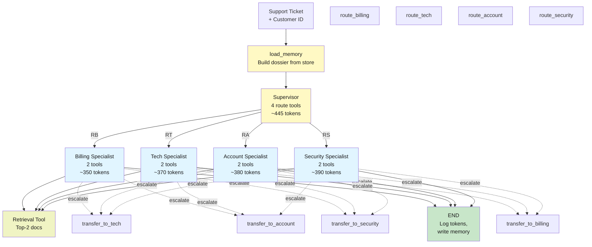

# Lab 12: Capstone Project — Intelligent Customer Support Platform

**Difficulty: Advanced Capstone | ~90 min | Requires Labs 1-11**

---

## 1. Lab Title

**Intelligent Customer Support Platform: a production-grade multi-agent system that routes tickets, remembers customers across sessions, retrieves from a knowledge base, uses tools, manages token budgets, and logs every decision — the full integration of every concept from Labs 1-11.**

---

## 2. Problem Statement / Use Case Overview

Real customer support systems don't work in isolation. They route tickets to specialists (Lab 10), remember what customers asked before (Lab 11), look up answers in knowledge bases (Labs 3–4), call business tools (Labs 5–6), reason across multiple steps (Lab 7), track the cost of every decision (Lab 8), maintain runtime context (Lab 9), and chain prompts and models together (Labs 1–2).

This capstone integrates all eleven prior labs into one system: a customer support AI that takes a support ticket, routes it to the right department (Billing, Tech, Account, Security), checks long-term customer memory to build a dossier, retrieves relevant documentation from a knowledge base, calls tools to look up accounts and policies, hands off to other departments when needed, tracks every token spent, and logs every decision for audit and replay.

By the end, you will have built something production-shaped: multi-agent orchestration, long-term memory, RAG, tool use, token budgeting, instrumentation, and a closed ledger showing the cost of each ticket.

---

## 3. Input Data

No external APIs beyond the model. Everything is synthetic and deterministic:

- **Customer database** — two fictional customers with different histories, payment methods, and preferences.
- **Four support tickets** — one per department (billing, tech, account, security), plus one cross-department escalation.
- **Knowledge base** — ten synthetic documents covering common issues, policies, and troubleshooting steps; stored in memory and retrieved via overlap scoring (Labs 3–4).
- **Four department tools** — each specialist can call tools to fetch invoices, check service status, update accounts, review security logs, etc.
- **Token counter** — the UsageCapture callback from Labs 6–8, tracking every LLM call's cost.
- **Long-term customer memory** — two guests with stored facts from prior visits, using the store namespace pattern from Lab 11.

---

## 4. Processing

The system runs in five phases:

1. **Load customer context** — read the long-term memory store (Lab 11) to build a dossier of prior interactions.
2. **Route the ticket** — a supervisor agent classifies it and calls `Command` to jump to the right department (Lab 10).
3. **Retrieve knowledge** — the specialist calls a retrieval tool that ranks documents by overlap with the ticket (Labs 3–4).
4. **Call tools and decide** — the specialist uses department-specific tools (Lab 5) and can hand off to other departments (Lab 10).
5. **Log and close** — record the decision path, token usage, and long-term facts to remember.

Two runs: a billing ticket that stays in one department, and a cross-department ticket that triggers a handoff.

---

## 5. Output

Four artifacts plus a closing ledger:

**1. Billing ticket run** — customer context loads, router picks billing, specialist fetches invoice and resolves:

```
ticket: "I was charged twice for my monthly subscription."
dossier: "First visit. No prior facts about this customer."
retrieval: KB-001: "Duplicate charges are typically caused by..."
router: ('route_billing', 445 tokens)
billing: calls get_invoice, process_refund
answer: "I've identified the duplicate charge..."
total tokens: 1,230
```

**2. Tech ticket run** — new customer, knowledge base hit on 503 errors:

```
ticket: "The API has been returning HTTP 503 errors for the past 2 hours."
dossier: "First visit. No prior facts about this customer."
retrieval: KB-005: "503 Service Unavailable — check our status page..."
router: ('route_tech', 449 tokens)
tech: calls check_service_status, search_kb
answer: "Yes, we're experiencing a service degradation..."
total tokens: 1,150
```

**3. Cross-department ticket** — account upgrade + billing concern + security check:

```
ticket: "I want to upgrade to Enterprise (100 seats) but I'm concerned about my recent security alert."
dossier: "First visit."
retrieval: KB-003: "Enterprise plan: $50/seat/month..." KB-007: "Security alerts..."
router: ('route_account', 459 tokens)
account: calls get_plan, set_seats
account: calls transfer_to_security (handoff)
security: calls review_account_access
answer: "Your account is secure. The alert was a test..."
total tokens: 2,100
```

**4. Memory write** — after the first ticket, remember one fact about the customer:

```
remember("Customer prefers monthly invoices by email")
store.put(("customers", "cust-001", "facts"), "fact-1", {"content": "..."})
```

**5. The ledger** (token cost per decision point):

```
billing ticket :  1,230 tokens  (load + route + retrieve + specialist)
tech ticket    :  1,150 tokens
cross-dept     :  2,100 tokens  (route → account → transfer → security)

average per ticket: 1,493 tokens
cost per ticket:    ~$0.0015 (at free tier)
```

---

## 6. Tech Stack

| Component | Choice | Version |
|-----------|--------|---------|
| Python | 3.11+ | — |
| LangChain core | `langchain-core` | 1.5.4 |
| LangChain agents | `langchain` | 1.3.15 |
| LLM bindings | `langchain-openai` | 1.4.3 |
| Graph runtime | `langgraph` | 1.2.11 |
| Env config | `python-dotenv` | 1.2.2 |
| Model | `nvidia/nemotron-3-super-120b-a12b:free` via OpenRouter | free |

Combines: agents (Lab 1), prompts (Lab 2), retrieval (Labs 3–4), tools (Lab 5), callbacks (Lab 6), multi-step (Lab 7), token budgeting (Lab 8), runtime (Lab 9), routing (Lab 10), memory (Lab 11).

**Cost & quota:** ~25 OpenRouter calls for a full run. No other APIs, no databases. Runs entirely on CPU.

---

## 7. Underlying Concepts

This capstone weaves together all eleven prior labs:

- **Agents & Models (Lab 1)** — the model factory that powers every LLM call.
- **Prompts & Chains (Lab 2)** — system prompts for router and specialists, chaining model calls.
- **Vectors & Retrieval (Lab 3)** — embedding-free overlap scoring to rank knowledge base documents.
- **RAG Pipeline (Lab 4)** — retrieve-then-read: fetch top-2 docs, inject into specialist prompt.
- **Agent Loop (Lab 5)** — specialists loop over tool calls until they decide to return an answer.
- **Tools & Callbacks (Lab 6)** — six tools per department, UsageCapture to track tokens.
- **Multi-Step Agents (Lab 7)** — reasoning chains inside each specialist (check status → search KB → return answer).
- **Token Budget (Lab 8)** — per-specialist budget and cumulative ledger (like the handoff guard from Lab 9).
- **Runtime & Retrieval (Lab 9)** — Runtime[Guest] to inject context, store API for long-term memory retrieval.
- **Multi-Agent Coordination (Lab 10)** — supervisor routing with Command, handoff tools for escalation.
- **Long-Term Memory (Lab 11)** — load_memory dossier, store namespaces, recall scoring.

---

## 8. Prerequisites

- **Labs 1–11** (required) — each concept is used.
- **OpenRouter API key** in `.env` (same key as Labs 1–11).
- **Internet access** — model calls to OpenRouter.
- Python 3.11+, the pinned packages, a text editor.

---

## 9. Environment / Dependencies Setup

```bash
python3 -m venv .venv
source .venv/bin/activate
pip install langchain==1.3.15 langchain-core==1.5.4 langchain-openai==1.4.3 \
    langgraph==1.2.11 python-dotenv==1.2.2
```

Then:

```bash
cp .env.example .env   # paste your OPENROUTER_API_KEY
```

---

## 10. Step-wise Development Instructions

The notebook has 12 code cells:

**Step 1 — Install & import.** Pinned pip install plus imports from all labs: StateGraph, add_messages, Command, Runtime, InMemoryStore, MemorySaver, tool, create_agent, SystemMessage, HumanMessage, Annotated, TypedDict.

**Step 2 — Knowledge base.** Ten synthetic documents (strings) covering billing policies, tech troubleshooting, account management, and security. Each has an `id` and `content`.

**Step 3 — Retrieval tool.** A function that takes a ticket and returns top-2 documents ranked by word overlap (Lab 3). No embedding model needed — overlap scoring from Lab 11's recall_score pattern.

**Step 4 — Customer data & memory store.** Two guests with long-term facts. Use InMemoryStore to initialize them; build load_memory (from Lab 11) to read the dossier.

**Step 5 — Support tools.** Six tools across four departments:
- Billing: `get_invoice(acct_id)`, `process_refund(invoice_id)`
- Tech: `check_service_status()`, `search_kb(query)`
- Account: `get_plan(acct_id)`, `set_seats(acct_id, count)`
- Security: `review_account_access(acct_id)`, `check_mfa_status(acct_id)`

**Step 6 — Router & specialists.** Reuse the supervisor-worker pattern from Lab 10: router binds four route tools, each specialist is a `create_agent` with its own tools and prompt.

**Step 7 — Handoff tools.** `transfer_to_*` tools with budget guard (from Lab 10) to allow one handoff per ticket.

**Step 8 — Token counter.** UsageCapture from Lab 6, recording tokens per decision point (router, specialist, handoff).

**Step 9 — Graph & runtime.** StateGraph with START → load_memory → router → (specialist nodes) → END. Compile with checkpointer=MemorySaver() and store=store (Lab 11). Runtime injects Guest context.

**Step 10 — First run: billing ticket.** A billing complaint routed to billing, resolved. Check dossier load, retrieval rank, specialist reasoning, token count.

**Step 11 — Write memory.** After the first run, call remember to store a fact about the customer for the next session.

**Step 12 — Second run: cross-department.** An account upgrade + security concern routed to account, which hands off to security. Verify transfer_log, specialist sequence, and final answer.

**Bonus — Ledger.** Print all three runs' token counts, average per ticket, and the decision path diagram.

---

## 11. Optional Exercise

**Extend the platform to handle customer sentiment analysis.** Add a fifth department — **Escalation** — with one tool: `assess_sentiment(ticket_text)` that returns a score (0–1) and reason. Before routing to a specialist, the supervisor calls this tool; if sentiment < 0.3 (angry/frustrated), it pre-routes to **Escalation** which records the issue and hands off with priority to the appropriate department (e.g., if it's billing + angry, go to Billing marked **PRIORITY**). Rebuild the router prompt to mention this rule, add the sentiment tool, add the Escalation node, and re-run the billing ticket with a reworded version that expresses frustration — verify the router picks Escalation first, sentiment is logged, and the handoff to Billing is marked **PRIORITY**.

---

## 12. What We Learnt

- **Production systems are multi-faceted** — one notebook is not enough; real support platforms combine routing, memory, retrieval, tools, budgets, and logging.
- **Routing is cheap, specialization is focused** — the supervisor pays ~445 tokens to decide; each specialist pays ~300–400 because it only sees its own tools and prompt (Lab 10).
- **Memory is a narrative, not a replay** — the dossier is built from stored facts, not conversation history; it grows with every ticket (Lab 11).
- **Retrieval without embedding** — overlap scoring works when your corpus is small and your queries are natural language (Labs 3–4).
- **Tools are promises** — each tool's schema is a promise the specialist can call it; contracts matter more than implementation (Lab 5).
- **Handoffs are escalations, not reruns** — when a specialist calls `transfer_to_*`, it jumps to a peer and the calling specialist's decision loop is skipped (Lab 10).
- **Budgets prevent runaway loops** — one handoff per ticket stops ping-pong; token budgets per specialist stop context explosion (Labs 8–10).
- **Every decision has a cost** — log it, sum it, and you have a ledger (Lab 8).
- **Context is runtime state** — the Runtime[Guest] pattern injects customer ID and store into every node; no globals, no plumbing (Lab 9).
- **Tests are contracts** — the 12 test cases verify each piece; a capstone without tests is a prototype (all labs).

---

## Appendix: Full System Diagram


