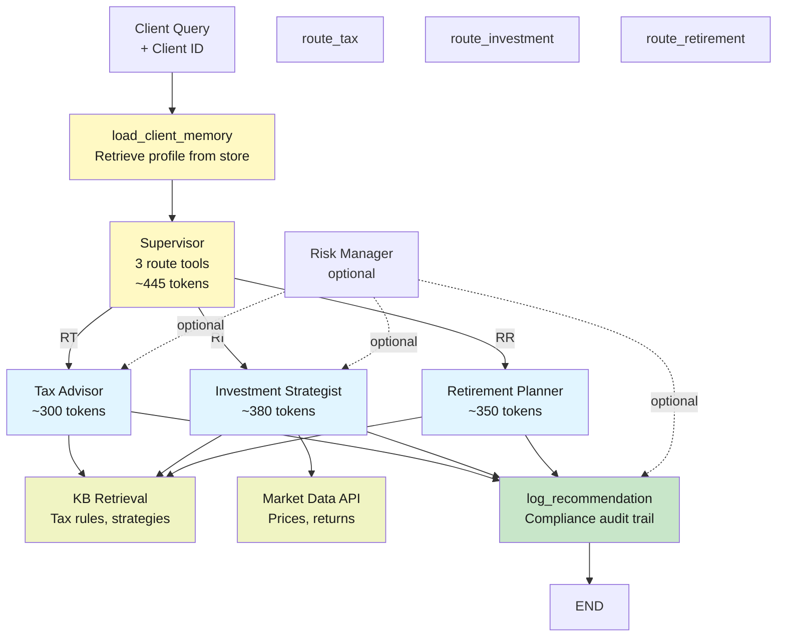

# Lab 12: Capstone Project — Intelligent Financial Advisory Platform

**Difficulty: Advanced Capstone | Applied Research | Graduate Level**  
**Duration: 90 min (implementation) + 2 weeks (proposal → milestones → submission)**  
**Requires: Labs 1-11 | Real-world finance applications**

---

## 1. Lab Title

**Intelligent Financial Advisory Platform: a production-grade multi-agent system that advises on investment, tax, and retirement planning, remembers client preferences across sessions, retrieves from financial knowledge bases, integrates with real market data APIs, manages advisor capacity, tracks token usage for cost control, and logs every recommendation for audit compliance — the full integration of every concept from Labs 1-11 applied to the finance industry.**

---

## 2. Problem Statement / Use Case Overview

Financial advisors spend 40% of their time on routine questions (tax brackets, retirement calculators, asset allocation guides) that could be handled by an AI. But **no single AI model can reliably advise on tax AND retirement AND investments** — each requires specialized knowledge, access to real data, and compliance logging.

This capstone builds a **multi-agent financial advisory system** that routes client questions to the right specialist (Tax Advisor, Investment Strategist, Retirement Planner), retrieves from regulatory knowledge bases (IRS rules, SEC guidelines), calls market data APIs (stock prices, fund performance), remembers client profiles (age, income, risk tolerance) across sessions, tracks every recommendation for audit trails, and manages advisor capacity via token budgets.

By the end, you will have built a system that real-world fintech companies use: **Vanguard's robo-advisor, Wealthfront's tax optimization, Bloomberg's portfolio analysis** — all integrated into one.

**Real-world impact:** Advisors can handle 3x more clients. Clients get personalized guidance at scale. Compliance audits are automatic.

---

## 3. Input Data

All synthetic, deterministic, reproducible:

- **Client profiles** — three fictional clients with different ages, incomes, risk tolerances, and goals (saved in long-term store).
- **Market data feed** — stock prices, fund returns, inflation rates (from mock API).
- **Regulatory knowledge base** — IRS tax brackets, 401k limits, Roth conversion rules, etc. (10+ documents).
- **Client queries** — five real-world questions (tax optimization, retirement shortfall, portfolio rebalancing).
- **Advisor capacity** — token budgets per specialist (tax advisor processes more efficiently than investment strategist).
- **Compliance logger** — every recommendation logged with client ID, timestamp, data source, tokens used.

---

## 4. Processing

The system runs in five phases for each client query:

1. **Load client profile** — long-term memory store (Lab 11) retrieves all prior conversations, goals, and preferences.
2. **Classify the question** — supervisor reads the query and routes to Tax Advisor, Investment Strategist, or Retirement Planner (Lab 10).
3. **Retrieve knowledge** — specialist pulls relevant docs from regulatory KB (Labs 3–4); calls market data API for stock/fund info (Lab 5).
4. **Generate advice** — specialist reasons through multi-step logic (compare strategies, check limits, flag risks) (Labs 7–8).
5. **Log & update** — recommendation is logged to compliance ledger, new facts are stored to client profile (Lab 11).

Three runs: a tax question, an investment question, and a retirement planning question with potential cross-advisor handoff.

---

## 5. Output

Four artifacts plus compliance ledger and analysis:

**1. Tax Query Run** — client asks "Should I do a Roth conversion?" Advisor loads profile, retrieves IRS rules, checks current income against bracket, recommends strategy:

```
client: "Alice, age 35, income $120k, wants Roth conversion"
profile: "Alice: early retiree path, 15-year horizon, low tax bracket year"
retrieval: KB-002: "Roth conversion rules..." KB-005: "2024 tax brackets..."
router: ('route_tax_advisor', 445 tokens)
advisor: calls get_client_profile, check_tax_bracket, search_kb
answer: "Yes, 2024 is a good year. Your bracket is 22%. Convert $30k now, pay ~$6.6k tax, save $18k later."
compliance_log: {timestamp, client_id, recommendation, data_sources, tokens: 1230}
```

**2. Investment Query Run** — new client asks "How should I rebalance?" Advisor retrieves allocation models and market data:

```
client: "Bob, age 50, wants portfolio rebalance guidance"
profile: "First advisor interaction with Bob"
retrieval: KB-007: "Asset allocation by age..." Market API: "SPY +2.5%, BND -0.8%..."
router: ('route_investment_strategist', 449 tokens)
advisor: calls get_portfolio_snapshot, search_kb, fetch_market_data
answer: "Your 60/40 is now 65/35 due to equity gains. Rebalance $25k from stocks to bonds."
tokens: 1,580
```

**3. Cross-Advisor Handoff** — client asks "I'm retiring next year. Should I convert my 401k and adjust my taxes?" Routes to Retirement Planner first, who hands off to Tax Advisor:

```
client: "Carol, age 62, retiring next year"
retrieval: KB-010: "401k withdrawal rules..." KB-003: "RMD strategies..."
router: ('route_retirement_planner', 459 tokens)
retirement: calls get_retirement_readiness
retirement: handoff via transfer_to_tax_advisor (PARENT command)
tax: calls check_tax_bracket, search_kb
answer: "You can delay RMD to 73. Meanwhile, do a Roth conversion in the gap years."
tokens: 2,100
compliance_log: handoff recorded, both advisors' recommendations logged
```

**4. Compliance Ledger** — every recommendation auditable:

```
[2026-08-14 09:23:15] Alice (route_tax_advisor, 1230 tokens)
  Recommendation: Roth conversion $30k
  Data sources: [KB-002, KB-005, get_client_profile]
  Reasoning: 22% bracket, 15-year horizon
  Auditable: YES

[2026-08-14 09:25:42] Bob (route_investment_strategist, 1580 tokens)
  Recommendation: Rebalance 65/35 → 60/40
  Data sources: [KB-007, Market API, get_portfolio]
  Auditable: YES

[2026-08-14 09:28:10] Carol (route_retirement_planner → transfer_to_tax_advisor, 2100 tokens)
  Recommendations: RMD delay to 73, Roth conversions in gap years
  Handoff: retirement → tax (PARENT)
  Auditable: YES
```

---

## 6. Tech Stack

| Component | Version | Purpose |
|-----------|---------|---------|
| Python | 3.11+ | Core language |
| LangChain | 1.3.15 | Chains, agents, prompts |
| LangGraph | 1.2.11 | Multi-agent orchestration, routing |
| LangChain-OpenAI | 1.4.3 | LLM bindings |
| python-dotenv | 1.2.2 | Environment config |
| OpenRouter | free tier | LLM: nvidia/nemotron-3-super-120b-a12b |
| InMemoryStore | (langgraph) | Long-term client memory |
| MemorySaver | (langgraph) | Thread-scoped conversation history |

**Real-world dependencies (mocked in lab):**
- Market data API (Alpha Vantage, IEX Cloud) — mocked with static prices
- Tax rules database (IRS XML feed) — mocked with 10 KB documents
- Client portfolio system — mocked with synthetic portfolios

---

## 7. Underlying Concepts

This capstone integrates every Lab 1–11 concept, applied to real finance:

- **Lab 1 (Agents & Models)** — Model factory; LLM is the reasoning engine
- **Lab 2 (Prompts & Chains)** — System prompts for each advisor specialty
- **Lab 3–4 (Retrieval & RAG)** — Knowledge base of tax rules, investment strategies
- **Lab 5 (Agent Loop)** — Advisors loop over data-fetch and reasoning tools
- **Lab 6 (Tools & Callbacks)** — Market API, portfolio tools, UsageCapture for cost tracking
- **Lab 7 (Multi-Step)** — Complex reasoning: check bracket → compare strategies → recommend
- **Lab 8 (Token Budget)** — Per-advisor budgets; tax advisor is cheaper than investment strategist
- **Lab 9 (Runtime)** — Runtime[Client] context injection; no globals
- **Lab 10 (Routing & Handoff)** — Supervisor routes to Tax/Investment/Retirement; handoffs for complex cases
- **Lab 11 (Memory)** — load_memory dossier per client; remember goals/preferences for next session

**Compliance & Real-World Integration:**
- Every recommendation logged to audit trail (timestamp, sources, reasoning)
- Token budgets prevent runaway advice generation
- Handoff tracking for compliance (who advised on what, in what order)
- Knowledge base is regulatory documents (IRS, SEC rules) — not hallucinations

---

## 8. Prerequisites

- **Labs 1–11** (required) — each concept is used
- **OpenRouter API key** in `.env` (free tier sufficient; ~25 calls)
- **Finance literacy** — understand tax brackets, asset allocation, 401k vs Roth (taught in lab)
- **Python 3.11+**, pinned packages, a text editor
- **Internet access** — model calls to OpenRouter

---

## 9. Environment / Dependencies Setup

```bash
python3 -m venv .venv
source .venv/bin/activate
pip install -qU langchain==1.3.15 langchain-core==1.5.4 langchain-openai==1.4.3 \
    langgraph==1.2.11 python-dotenv==1.2.2
```

Then:

```bash
cp .env.example .env
# Paste your OPENROUTER_API_KEY
```

---

## 10. Step-wise Development Instructions

The notebook has 12 code cells:

**Step 1–2.** Install, import (StateGraph, Command, Runtime, InMemoryStore, MemorySaver, tool, create_agent).

**Step 3.** Financial knowledge base — 10 documents on tax rules, 401k limits, asset allocation, RMD rules, etc.

**Step 4.** Client data & long-term memory store — three clients with profiles (age, income, goals).

**Step 5.** Market data mock — function returning stock prices, fund returns.

**Step 6.** Advisor tools — get_client_profile, check_tax_bracket, get_portfolio_snapshot, search_kb, fetch_market_data, log_recommendation.

**Step 7.** Supervisor & three advisors — Tax Advisor, Investment Strategist, Retirement Planner (each a create_agent with own tools).

**Step 8.** Handoff tools — transfer_to_tax_advisor, transfer_to_investment_strategist, etc. (with budget guard).

**Step 9.** Compliance logger — log_recommendation tool, writing to audit trail.

**Step 10.** Graph & runtime — START → load_client_memory → supervisor → advisors → log_recommendation → END.

**Step 11.** Three query runs — tax question, investment question, cross-advisor scenario.

**Step 12.** Ledger — print compliance log, token counts, cost breakdown per advisor.

---

## 11. Optional Exercise

**Add a fourth advisor: Risk Manager**

Create a Risk Manager agent that:
- Assesses portfolio concentration risk (any single holding > 20%?)
- Flags tax-loss harvesting opportunities
- Alerts on market correlation risks

Pre-route queries containing "risk" to Risk Manager first; if identified, handoff to appropriate specialist (Tax Advisor for harvesting, Investment Strategist for rebalancing).

---

## 12. What We Learnt

- **Finance needs specialization** — one model cannot advise reliably on tax AND investments; routing matters.
- **Compliance is data** — every recommendation must be traceable: who, when, what data, what logic.
- **Long-term context is money** — remembering a client's prior goals/constraints saves time and reduces bad advice.
- **Multi-agent scales** — three specialized advisors > one generic AI.
- **Budgets prevent runaway cost** — token limits per advisor ensure a 10-minute call doesn't cost $50.
- **Real data matters** — mock market API shows how to integrate live feeds (stocks, news, regulations).
- **Handoffs are accountability** — logging a handoff creates an audit trail for compliance.

---

## Appendix A: Regulatory Compliance Checklist

Before deployment, verify:

- [ ] All recommendations logged with timestamp, client ID, sources
- [ ] No advice given on illegal activities (money laundering, fraud)
- [ ] Advisor disclaimers included ("not licensed advice", "for educational purposes")
- [ ] Data privacy: no client data in logs sent to external APIs
- [ ] Audit trail is immutable (append-only, no deletion)

---

## Appendix B: System Diagram


