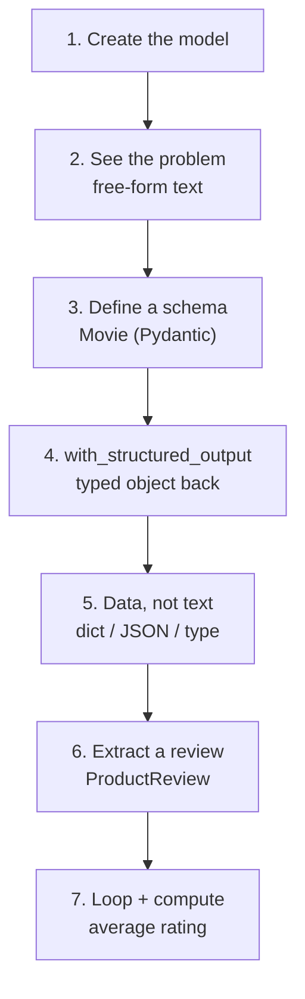
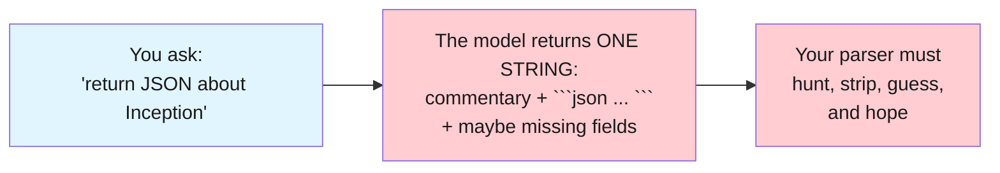
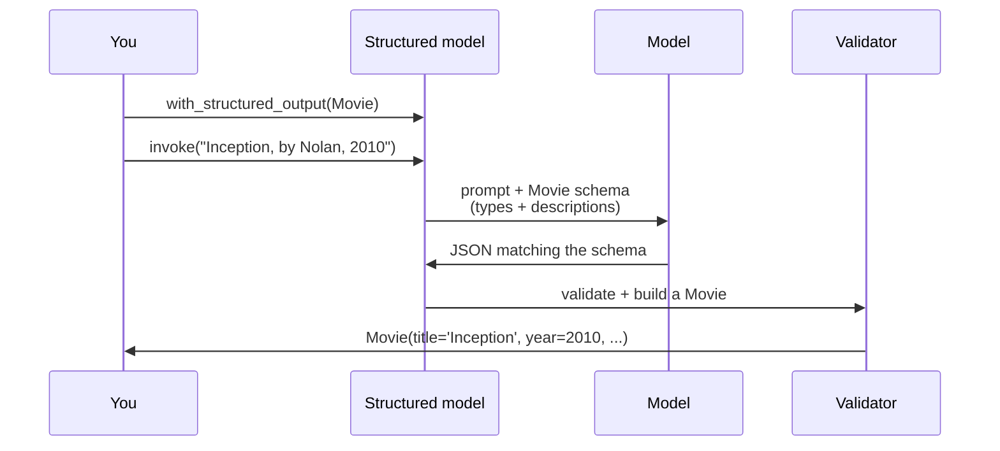

# Lab 3: Structured Output

**Difficulty: Beginner | ~30 min | Requires Lab 1 (recommended)**

---

## 1. Structured Output

Every AI application has a moment where a model's answer has to become *data*: a form to auto-fill, a row in a database, an argument to a function. But a model answers in **words** — and words aren't data. Ask a model for JSON and you'll get something that *looks* like JSON: wrapped in ```json fences, surrounded by commentary, missing fields here and there. A program can't consume that.

This lab fixes it with **structured output** — getting typed, schema-constrained responses out of the model. You define the exact shape you want back (a **schema**), hand it to the model, and the model returns a real Python object that matches it, field for field. You will first watch free-form text fail, then define a schema with Pydantic, get a typed object back with one method call, and finally build a tiny pipeline that turns a stack of plain-text reviews into data you can compute on.

### What is a schema?

A **schema** is a description of a shape — a contract that says "the answer must have these fields, of these types." In this lab a schema is a Pydantic class: `title: str` means "a text field," `year: int` means "a whole number," and a field like `genres: list[str]` would mean "a list of text entries." When the model sees a schema, it's told *exactly* what to produce, and LangChain validates the result before you ever see it.

### What is structured output?

**Structured output** is the model returning data that obeys a schema — a typed object instead of free text. LangChain's way of doing it is one method call: `model.with_structured_output(MySchema)`. After that, every `invoke` comes back as an instance of `MySchema`, already validated. That one line is the difference between parsing whatever the model decides to say and receiving exactly what your program needs.

---

## 2. Problem Statement / Use Case Overview

Real applications rarely want an essay. A support bot that classifies tickets needs `category`, `priority`, and `customer_id` — not a paragraph. A review analyzer needs `product`, `rating`, and `sentiment` — not prose. The naive approach — "ask the model for JSON, then `json.loads` it" — is fragile: the model wraps the JSON in markdown fences, adds commentary, or leaves a field out, and your parser breaks. This lab solves that by moving the responsibility from *you parsing* to *the model conforming*. You define the schema once, call `with_structured_output`, and get a validated, typed object every time. It stands alone, and it's the skill you'll reach for in almost every later lab — from extraction pipelines to building agents that hand back structured results.

---

## 3. Input Data

There is no dataset. The inputs are a handful of English sentences, small enough to inspect by eye (Article PF-4):

- Movie facts: *"Return structured details for 'Inception' by Christopher Nolan, released in 2010."*
- One customer review about an AeroPress coffee maker.
- Three short product reviews (a coffee maker, an office chair, and headphones) to process in a loop.

That's the whole input — deliberately tiny, because the point is to see how the same schema turns each sentence into the same typed shape.

---

## 4. Processing

The lab moves from "the problem" to "the fix," then to a realistic pipeline:

1. **Create the model** — the same `ChatOpenAI` wrapper and settings as Labs 1 and 2.
2. **See the problem** — ask for JSON in plain English and inspect what comes back (fences, commentary, a `str`).
3. **Define a schema** — a `Movie` Pydantic class with three typed fields.
4. **Get structured output** — `with_structured_output(Movie)` returns a real `Movie` object.
5. **Treat it as data** — convert to a dict or JSON, check its type.
6. **Extract from text** — a `ProductReview` schema pulled out of one review paragraph.
7. **Scale it** — loop over several reviews, collect typed records, and compute the average rating from the data.

Here's the whole lab as a flow:



Step 4 is the pivot: one method call turns "hope the JSON is clean" into "the schema is enforced."

---

## 5. Output

When the notebook works, each cell prints what it produces. On a real run it looked like this.

Step 4 — the problem. The model returns a sentence *plus* a JSON object — all in one string (sometimes the JSON is wrapped in ```json markdown fences, sometimes bare, depending on the model). Either way, it's a `str`, not data:

```
A skilled thief who enters people's dreams to steal secrets is given a chance to
have his criminal record erased if he can successfully perform the difficult task
of inception — planting an idea in a target's subconscious.
{
  "title": "Inception",
  "director": "Christopher Nolan",
  "year": 2010
}
type: str
```

Step 6 — the fix. The same question, schema-enforced, comes back as a typed `Movie`:

```
type:     Movie
title:    Inception
director: Christopher Nolan
year:     2010
```

Step 7 — the object is data:

```
{'title': 'Inception', 'director': 'Christopher Nolan', 'year': 2010}
{
  "title": "Inception",
  "director": "Christopher Nolan",
  "year": 2010
}
True
```

Step 8 — extraction from one review:

```
{'product': 'AeroPress Coffee Maker', 'rating': 5, 'sentiment': 'positive'}
```

Step 9 — the pipeline over three reviews, ending in a computed average:

```
AeroPress Coffee Maker | rating 5/5 | positive
Ergonomic Office Chair | rating 1/5 | negative
Wireless Noise-Cancelling Headphones | rating 4/5 | positive
Average rating: 3.3
```

The exact *values* may vary — free models change and their judgment differs slightly. What must be true: **Step 4 prints a `str` containing prose plus a JSON object, while Steps 6–9 print real `Movie`/`ProductReview` objects (or `True` for `isinstance`) with the correct fields.** If you see that, the schema constraint is doing its job.

---

## 6. Tech Stack

- Python 3.11
- `langchain==1.2.15`
- `langchain-core==1.2.28`
- `langchain-openai==1.1.12` (OpenRouter speaks the OpenAI protocol)
- `python-dotenv==1.2.2` (loads `.env`)
- `pydantic==2.13.4` (schema classes — the "shape" of the output)
- OpenRouter API — free models, no cost (see https://openrouter.ai/models)

No GPU needed. Runs on any laptop. The only "cost" is a free OpenRouter account for an API key.

---

## 7. Underlying Concepts

### The problem: model output is text, not data

A chat model's job is to predict the next word — so its output is always a string. When you ask for JSON, the model does its best to *write* JSON, but it also writes whatever else it thinks fits: an intro sentence, a closing remark, and — the classic — code fences around the JSON. Even when the JSON is perfect, your program must find it inside the string, strip the fences, and parse it. The format the model chooses is a guess, not a promise:



### What a schema does

A **schema** turns "please return JSON" into "the answer must be exactly this shape." Each field in the schema is a typed slot — in this lab's `Movie`, the slots are `title: str` and `year: int`. (Schemas can hold richer types too: a field declared `genres: list[str]` would demand a list of text entries.) The model is told the field types *and* a description of what belongs in each one. The schema is a contract between you and the model — and because LangChain sends it along with the request, the model has something concrete to conform to instead of guessing.

### How structured output works

`with_structured_output(MySchema)` rebuilds the model so that the schema travels with every request. The model is asked to produce output that matches the schema, and LangChain then **parses and validates** the reply before returning it. If a field is missing or wrong-typed, the validation fails loudly instead of silently handing you broken data. What you receive is an instance of your own class:



The result is data: you can read `movie.director`, convert it with `model_dump()`, or feed it into Python logic. No string parsing, ever.

### Why this is the same discipline as agent tool-calling

In Labs 1 and 2, your agent worked because the model could emit a **structured tool call** — a name plus typed arguments ("call `multiply` with 8 and 7"). That is structured output in disguise: the model is constrained to a shape, and the framework parses and validates it. `with_structured_output` uses the exact same idea, but the "shape" is *your* data instead of a tool's inputs. Understanding one makes the other obvious — a model that can reliably produce `multiply(8, 7)` can reliably produce `Movie(title, director, year)`. That connection is why the schema descriptions matter so much: like a tool's docstring, they're the model's only window into what you want.

---

## 8. Prerequisites

- **None strictly required** — this lab builds everything from scratch.
- **Lab 1 is recommended** (creates the same model wrapper; explains model vs. agent) and **Lab 2 is helpful** (explains the tool-calling discipline that structured output builds on).
- Basic Python (run a script, install packages) and a web browser.
- One free account: [openrouter.ai](https://openrouter.ai) → Settings → Keys → create a key that starts with `sk-or-v1`.

---

## 9. Environment / Dependencies Setup

Run these in a terminal. We use a virtual environment so the project is isolated and reproducible (Article CQ-6).

```bash
cd Lab3

python3 -m venv .venv
source .venv/bin/activate

pip install --upgrade pip
pip install "langchain==1.2.15" "langchain-core==1.2.28" "langchain-openai==1.1.12" "python-dotenv==1.2.2" "pydantic==2.13.4" "jupyterlab" "ipykernel"
```

Then create your key file:

```bash
cp .env.example .env
```

Open `.env` and replace the `sk-or-v1-xxx...` placeholder with your real OpenRouter API key. Save it.

Verify the environment:

```bash
python -c "import langchain, langchain_openai, pydantic; print('OK')"
```

You should see `OK`. To run the notebook: `jupyter lab lab-structured-output.ipynb` (or open the file in VS Code). The notebook's first cell also runs the same installs, so if you skipped this step you can let it install the modules for you.

---

## 10. Step-wise Development Instructions

This section is the heart of the lab. You'll work through **nine steps**, each one a single logical move, with the context you need explained before you run each cell. Run the cell, glance at the result, then move on — don't scroll ahead.

The whole lab in one sentence: watch free-form text fail, define a schema, let `with_structured_output` enforce it, and turn plain text into data you can compute on.

### Step 1 — Install the required modules

This first command installs the five Python libraries the lab needs, with exact versions pinned so the build is reproducible. Each library has one specific job:
- `langchain` — the framework that provides `with_structured_output`.
- `langchain-core` — the shared foundation `langchain` is built on, pinned for compatibility.
- `langchain-openai` — provides `ChatOpenAI`, the wrapper that lets LangChain talk to any OpenAI-compatible API. OpenRouter speaks that protocol, so this one class reaches *any* model on OpenRouter.
- `python-dotenv` — reads your API key from a `.env` file so the secret never sits in your code.
- `pydantic` — the library behind the schema classes you'll define in Step 5.

Pinning exact versions (`==1.2.15`, not `>=1.2.15`) means the lab behaves the same today and six months from now (Article CQ-6). The `!` at the start is a Jupyter special: it runs the rest of the cell as a terminal command instead of Python.

When it finishes, the final line should read `Successfully installed ...`. If you already ran the Section 9 setup, you'll instead see `Requirement already satisfied` lines — that's fine, either outcome is success.

```python
!pip install "langchain==1.2.15" "langchain-core==1.2.28" "langchain-openai==1.1.12" "python-dotenv==1.2.2" "pydantic==2.13.4"
```

### Step 2 — Load the key

Next we load your OpenRouter API key out of the `.env` file into the notebook's environment, and stop immediately if it's missing. Every model call to OpenRouter must prove who's asking, but we never type the key into code (Article CQ-7). Instead:
- `load_dotenv()` finds the `.env` file in this folder and loads every `KEY=VALUE` line into the process's environment variables.
- `os.getenv("OPENROUTER_API_KEY")` reads the key back out by name.
- The `if` check is a safety net: if the key is missing (no `.env`, or the placeholder was never replaced), we stop right here with a clear message instead of failing halfway through with a confusing API error.

The cell should produce no output at all — that's the success signal. If the key is missing, you'll get the red error `No OPENROUTER_API_KEY found...`, which tells you exactly what to fix: put the key in `.env` and restart the kernel.

```python
import os
from dotenv import load_dotenv

load_dotenv()

if not os.getenv("OPENROUTER_API_KEY"):
    raise SystemExit("No OPENROUTER_API_KEY found. Add it to .env and restart the kernel.")
```

### Step 3 — Create the model

Now we create the model — the same wrapper and settings you used in Labs 1 and 2. A model is the part that produces text; this object is its configuration. Each argument has a specific job:
- `model=` — which model to use. `nvidia/nemotron-3-super-120b-a12b:free` is a free model on OpenRouter; the `:free` suffix means it costs nothing.
- `base_url=` — where to reach it. `ChatOpenAI` normally expects OpenAI's own servers; this line redirects it to OpenRouter's API instead.
- `api_key=` — your key, pulled from the environment variable we loaded in Step 2. Never typed as plain text.
- `temperature=0` — a "creativity" dial. 0 makes the model pick the most likely words every time, keeping answers factual and reproducible.

Creating an object is silent, so don't expect any output — nothing printed is exactly the success signal.

```python
from langchain_openai import ChatOpenAI

model = ChatOpenAI(
    model="nvidia/nemotron-3-super-120b-a12b:free",
    base_url="https://openrouter.ai/api/v1",
    api_key=os.getenv("OPENROUTER_API_KEY"),
    temperature=0,
)
```

### Step 4 — See the problem: free-form output

Now we ask for JSON the naive way — in plain English, with no schema and no enforcement. We deliberately ask for a sentence *and* a JSON object, because that's what real prompting does and it shows exactly why structured output exists. What comes back is one **string**: a description sentence, then a JSON object. Depending on the model the JSON may arrive wrapped in markdown code fences (```json ... ```) or bare — either way, it's all one `str`.

The second `print` is the key detail: `type(reply.content)` is `str`. That's the whole problem in one line. The JSON is *inside* the string, but your program would have to hunt for it, strip any fences, and `json.loads` it — and hope the model didn't leave a field out this time. We keep this cell in the lab because it makes the fix in Step 6 feel earned.

```python
reply = model.invoke(
    "In one sentence, describe the movie 'Inception', then return a JSON object "
    "about it with fields title, director, and year."
)

print(reply.content)
print(f"type: {type(reply.content).__name__}")
```

Expect a sentence plus a JSON object, and the final line `type: str`. You may also see ```json fences around the JSON, depending on the model. Either way the final line proves the point: whatever you get is a string, not data.

### Step 5 — Define a schema

The fix starts here. We define what we want back as a **Pydantic schema** — a class named `Movie` with three typed fields. Each field has two parts that matter:
- The **type** (`str`, `int`) — the shape of the slot.
- The **`Field(description=...)`** — a plain-English note telling the model what belongs in that slot. Like a tool's docstring in Lab 2, this is the model's only window into what you want.

The class itself does nothing yet — defining a schema doesn't call any model. This cell is just the contract.

```python
from pydantic import BaseModel, Field

class Movie(BaseModel):
    title: str = Field(description="The movie's title")
    director: str = Field(description="The director's full name")
    year: int = Field(description="The movie's release year")
```

### Step 6 — Get structured output

Now the one-line pivot. `model.with_structured_output(Movie)` returns a *new* model — call it `structured_model` — that carries the `Movie` schema with every request. Behind the scenes, LangChain sends the schema alongside your question, the model replies with JSON matching it, and LangChain parses and validates it into a `Movie` object *before you ever see the reply*.

Then we invoke it with the same kind of request that produced a messy string in Step 4. The difference is visible in the output: `type(movie).__name__` prints `Movie` — not `str`. And each `movie.<field>` is real, typed data you can read by name.

```python
structured_model = model.with_structured_output(Movie)

movie = structured_model.invoke(
    "Return structured details for 'Inception' by Christopher Nolan, released in 2010."
)

print(f"type:     {type(movie).__name__}")
print(f"title:    {movie.title}")
print(f"director: {movie.director}")
print(f"year:     {movie.year}")
```

Expect `type: Movie` followed by the three correct fields: title `Inception`, director `Christopher Nolan`, year `2010`. Everything must arrive as a `Movie`, not a string.

### Step 7 — The output is data, not text

Now we prove `movie` is a normal Python object by doing normal Python things to it:
- `movie.model_dump()` — a plain `dict` you could feed anywhere.
- `movie.model_dump_json(indent=2)` — a clean JSON string with *no* fences, *no* commentary — because it was built from typed data, not scraped from prose.
- `isinstance(movie, Movie)` — the definitive check that this is your class, not a coincidence.

This is the practical payoff of Step 6: the object behaves like any object, so you can pass it to functions, save it as JSON, or store it in a database — all without ever writing a parser.

```python
print(movie.model_dump())                 # as a plain dict
print(movie.model_dump_json(indent=2))    # as a clean JSON string
print(isinstance(movie, Movie))           # it really is a Movie
```

### Step 8 — Extract structured facts from a review

Now a realistic job. A customer review is free text; we want the facts. We define a second schema, `ProductReview`, with `product`, `rating`, and `sentiment` — then extract from a review paragraph. Note the pattern from Step 5 and 6 repeated: define the schema, call `with_structured_output`, invoke. The `product` value is pulled from the quoted text, `rating` is read from "Five stars," and `sentiment` summarizes the tone. That's the whole skill — schema + one method call.

```python
class ProductReview(BaseModel):
    product: str = Field(description="The exact product being reviewed")
    rating: int = Field(description="The star rating, from 1 to 5")
    sentiment: str = Field(description="positive, negative, or neutral")


review_text = (
    "I bought the 'AeroPress Coffee Maker' two weeks ago and it makes the best "
    "cup of coffee. The whole process takes about two minutes and cleanup is "
    "effortless. Five stars from me."
)

review = model.with_structured_output(ProductReview).invoke(review_text)
print(review.model_dump())
```

Expect a `ProductReview` dict with `product` "AeroPress Coffee Maker", `rating` 5, and `sentiment` "positive". The rating is an `int`, not the words "five stars" — the schema converted it.

### Step 9 — Scale it: reviews in, data out, compute on it

Last step: the reason structured output pays for itself. We keep a list of three plain-text reviews, loop over them, and turn each into a typed `ProductReview` using the exact one-liner from Step 8. Then we do the thing we could never do with raw strings: **compute** — summing `r.rating` across objects and dividing.

Contrast this with Step 4's approach: there, averaging ratings would mean parsing three unpredictable strings. Here, each `parsed` is a `ProductReview` with an `int` rating, so the arithmetic is ordinary Python. That shift — from "hope the text parses" to "the data is already typed" — is the entire value of structured output.

```python
reviews_text = [
    "I bought the 'AeroPress Coffee Maker' two weeks ago and it makes the best cup of coffee. Five stars from me.",
    "The 'Ergonomic Office Chair' arrived broken and customer service never replied. One star, terrible.",
    "My 'Wireless Noise-Cancelling Headphones' are great value — comfortable and the battery lasts all week. Four stars.",
]

parsed_reviews = []
for review_text in reviews_text:
    parsed = model.with_structured_output(ProductReview).invoke(review_text)
    parsed_reviews.append(parsed)
    print(f"{parsed.product} | rating {parsed.rating}/5 | {parsed.sentiment}")

average_rating = sum(r.rating for r in parsed_reviews) / len(parsed_reviews)
print(f"Average rating: {average_rating:.1f}")
```

Expect three lines, one per product with its rating and sentiment, then `Average rating: 3.3`. The products and ratings should match the three reviews; the average is computed from typed data.

---

## 11. Optional Exercise

Swap the model. In a new cell, create a second `ChatOpenAI` with a different free model — any model listed as `:free` at https://openrouter.ai/models, for example `nvidia/nemotron-3-nano-30b-a3b:free` — then build `structured_model_2 = model_2.with_structured_output(Movie)` and ask it the same "Inception" question from Step 6. Confirm you get back a `Movie` object with title `Inception`, director `Christopher Nolan`, and year `2010`, proving the schema constraint holds no matter which model sits behind it.

---

## 12. What We Learnt

- A model's output is always **text** — asking for JSON gives you a string (prose plus a JSON object, often wrapped in code fences), not data you can compute on.
- A **schema** is a typed contract (a Pydantic class) describing exactly what the answer must look like — field names, types, and descriptions.
- **`with_structured_output(MySchema)`** is the one-line fix: the schema travels with the request, and LangChain parses and validates the reply into a real object of your class.
- The result is **data, not text**: read fields by name, convert with `model_dump()`/`model_dump_json()`, and feed objects straight into Python logic — no string parsing.
- The same schema-discipline that constrains the model's *data* is what powers agent **tool-calling** from Labs 1 and 2 — constrained shape in, validated structure out.
- With a schema, a loop of plain-text reviews becomes typed records you can average, filter, or store — the bridge between a model's words and your program's data.

Test yourself: complete the exercises in [`lab-structured-output-assignment.md`](lab-structured-output-assignment.md) — answer key included.
