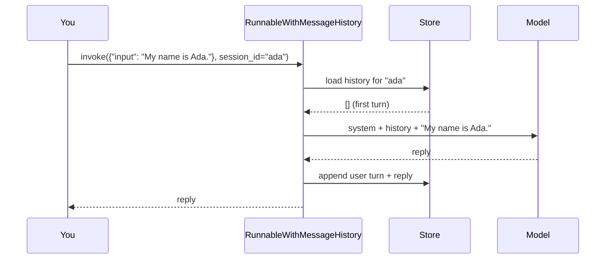

# Lab 4: Short-Term Memory & Streaming

**Difficulty: Intermediate | ~40 min | Requires Lab 3**

---

## 1. Short-Term Memory & Streaming

A base chat model has two gaps your application must fill. First, **statelessness**: every call is independent, so a model just told "my name is Ada" answers the next question as if it never heard it. Second, **latency**: waiting for a complete answer before showing anything makes even a fast model feel slow.

This lab closes both. **Short-term memory** means *your program* keeps the conversation and replays it into each new request, so the model answers with the context of everything said before. **Streaming** means the model's tokens arrive one chunk at a time and are displayed as they arrive — the typewriter effect behind modern chat UIs. You will build a session-aware chat chain with `RunnableWithMessageHistory`, watch memory stay per-session, then stream responses both with and without memory.

---

## 2. Problem Statement / Use Case Overview

Think of a customer-support bot or an assistant inside a product. Users expect it to remember what they just said ("set my budget to $500" ... "what can I buy with that?"). A stateless model can't — each question is a fresh conversation. The naive workaround, pasting the whole transcript into the prompt yourself, works but breaks the moment you have more than one conversation at once. And separately, even a correct answer feels broken if it arrives all at once after several seconds. This lab solves both problems with two framework pieces: **`RunnableWithMessageHistory`**, which manages per-session conversation context for you, and **streaming**, which surfaces tokens as the model generates them. You'll end with a chat chain that holds context per conversation and renders replies in real time — the two behaviors that make an AI app feel like a conversation rather than a search box.

---

## 3. Input Data

There is no dataset. The inputs are a handful of natural-language turns, small enough to read by eye (Article PF-4):

- Two turns establishing a fact: *"Hi, my name is Ada."* followed by *"What is my name?"*
- The same question sent through a *different* session, to prove memory is scoped.
- A generation prompt: *"Write a short two-line poem about coffee."* (for streaming)
- A three-turn conversation about a favorite city (for the optional exercise's bounded window)

That's the whole input — the lab is about *how* turns are stored and streamed, not about the data itself.

---

## 4. Processing

The lab builds the memory machinery step by step, then adds streaming:

1. **Create the model** — the same `ChatOpenAI` wrapper as Lab 3.
2. **Build a prompt with a history slot** — a `MessagesPlaceholder` where past turns are injected.
3. **Create an in-memory store** — a dict of session ID → `ChatMessageHistory`, plus the callback that returns it.
4. **Wrap the chain** — `RunnableWithMessageHistory` loads history, injects it, and appends new turns automatically.
5. **Chat across turns** — two calls in one session; the model answers using the earlier turn.
6. **Isolate sessions** — the same question in a new session gets no context.
7. **Stream** — `model.stream()` yields tokens as chunks.
8. **Stream with memory** — stream through the wrapped chain so context and tokens combine.

```mermaid
graph LR
    M["1. Create the model"]
    P["2. Prompt with a<br/>history slot"]
    S["3. Store + session<br/>callback"]
    W["4. Wrap with<br/>RunnableWithMessageHistory"]
    C["5. Chat across turns<br/>context retained"]
    I["6. New session<br/>context isolated"]
    T["7. Stream tokens<br/>chunk by chunk"]
    TM["8. Stream with memory"]
    M --> P --> S --> W --> C --> I --> T --> TM
    style W fill:#ffe0b2
    style C fill:#c8e6c9
    style T fill:#e1f5ff
```



Steps 4 and 7 are the pivots: Step 4 turns a stateless chain into a session-aware one; Step 7 turns a one-shot reply into a live stream.

---

## 5. Output

When the notebook works, each cell prints what it produces. On a real run it looked like this.

Step 6 — memory across turns. The model answers "What is my name?" from the earlier turn, and the last line shows the store has grown to four messages (two turns × question + answer):

```
Hi Ada! It's nice to meet you. How's your day going? ...
Your name is Ada! You told me that when you first said, "Hi, my name is Ada." ...
History stored for 'ada': 4 messages
```

Step 7 — session isolation. The same question through a new session gets nothing, and the store confirms both conversations exist side by side — plus a dump of what `ada` actually remembered, message by message:

```
I don't have access to personal information like your name unless you've shared
it with me in this conversation. Since this is a new chat and you haven't told me
your name, I don't know what it is.
...
Sessions in the store: ['ada', 'new-user']

What the ada session remembered:
  HumanMessage: Hi, my name is Ada.
  AIMessage: Hi Ada! It's nice to meet you...
  HumanMessage: What is my name?
  AIMessage: Your name is Ada! ...
```

Step 8 — streaming. The poem appears token by token, and the final line makes the mechanism explicit:

```
Steam curls like sunrise in a dark cup,
Awakening thoughts with each bitter sip.

Streamed in 60 chunks; first chunk type: AIMessageChunk
```

Step 9 — streaming with memory. The wrapped chain streams a one-word answer taken from the `ada` session's history:

```
Ada
```

The exact *values* vary — free models change and their phrasing differs. What must be true: **Step 6's model answers "Ada" from context, Step 7's new-session model doesn't, Step 8 prints the poem a chunk at a time and reports `AIMessageChunk`, and Step 9 streams an answer that only the remembered session could give.** If you see that, both concepts are working.

---

## 6. Tech Stack

- Python 3.11
- `langchain==1.2.15`
- `langchain-core==1.2.28` (provides `RunnableWithMessageHistory`, `InMemoryChatMessageHistory`, `trim_messages`)
- `langchain-openai==1.1.12` (OpenRouter speaks the OpenAI protocol)
- `python-dotenv==1.2.2` (loads `.env`)
- `pydantic==2.13.4` (pulled in by the framework)
- OpenRouter API — free models, no cost (see https://openrouter.ai/models); this lab uses `nvidia/nemotron-3-super-120b-a12b:free`

No GPU needed. Runs on any laptop. The only cost is a free OpenRouter account for an API key. One note: every history turn you replay is extra tokens in each request — short conversations are effectively free on the free tier, but a long unbounded history grows every call (that's what the optional exercise addresses).

---

## 7. Underlying Concepts

### Why a model can't remember on its own

A chat model is a function: text in, text out. It has no state between calls — the "conversation" it appears to have is an illusion created by the *caller* sending the full transcript each time. That transcript is the entire basis of conversational memory. Nothing is stored inside the model; memory is a **data problem** in your program, not a capability of the model. This lab stores that data in an in-memory `ChatMessageHistory` per session.

### How RunnableWithMessageHistory maintains context

The wrapper sits around the plain `prompt | model` chain and interposes on every call. For the active session ID it loads history, injects it into the prompt's `history` slot, sends the request, then appends the new question and answer back to the store. The model itself stays stateless — but from the outside it behaves as if it remembers:



That load → inject → call → append loop is the whole of short-term memory. Step 5's two `*_messages_key` arguments are the wrapper's map of where the new text (`input`) and the history (`history`) live in the prompt.

### Sessions: one conversation, one context

The `session_id` in the config is the key to everything. Two different IDs map to two different histories in the store, so the same chain can serve thousands of independent conversations — each `invoke` knows which transcript to replay. Without that scoping, one global transcript would leak facts between users.

### Streaming: tokens, not answers

A normal call waits for the model to finish and returns one message. Streaming calls the same endpoint but reads the response as it is generated: the provider sends a series of **chunks**, each an `AIMessageChunk` carrying the tokens produced since the last chunk. Your program prints each chunk as it arrives, so the UI fills in live. It costs the same and returns the same final text — the difference is *when* the user sees it. This is how a chat app can start rendering the first word within a second while a full response might take ten.

### The trade-off: memory costs tokens

History is replayed on every call, so a long conversation becomes a long prompt: more latency, more tokens, and for paid models, more money. Production systems therefore cap the window — keep the last N messages, or trim by token count. The optional exercise implements the token-budget version with `trim_messages`.

---

## 8. Prerequisites

- **Lab 3 (recommended)** — same `ChatOpenAI` wrapper and model, plus the Pydantic/structured-output conventions used in the assignment.
- **Labs 1–2 are helpful** but not required — they introduce the model wrapper and tool-calling.
- Basic Python (run a script, install packages) and a web browser.
- One free account: [openrouter.ai](https://openrouter.ai) → Settings → Keys → create a key that starts with `sk-or-v1`.

---

## 9. Environment / Dependencies Setup

Run these in a terminal. We use a virtual environment so the project is isolated and reproducible (Article CQ-6). Note the folder name has parentheses, so quote it:

```bash
cd "Lab4(Intermediate)"

python3 -m venv .venv
source .venv/bin/activate

pip install --upgrade pip
pip install "langchain==1.2.15" "langchain-core==1.2.28" "langchain-openai==1.1.12" "python-dotenv==1.2.2" "pydantic==2.13.4" "jupyterlab" "ipykernel"
```

Then create your key file:

```bash
cp .env.example .env
```

Open `.env` and replace the `sk-or-v1-xxx...` placeholder with your real OpenRouter API key. Save it.

Verify the environment:

```bash
python -c "import langchain, langchain_core, langchain_openai, pydantic; print('OK')"
```

You should see `OK`. To run the notebook: `jupyter lab lab-memory-streaming.ipynb` (or open the file in VS Code). The notebook's first cell also runs the same installs, so if you skipped this step you can let it install the modules for you.

## 10. Step-wise Development Instructions

This section is the heart of the lab. You'll work through **nine steps**, each one a single logical move, with the context you need explained before you run each cell. Run the cell, glance at the result, then move on.

The whole lab in one sentence: give a stateless chain a per-session memory, prove the memory is scoped, then stream — first without memory, then with it.

### Step 1 — Install the required modules

This first command installs the five Python libraries the lab needs, with exact versions pinned so the build is reproducible. The pieces this lab uses (`RunnableWithMessageHistory`, `InMemoryChatMessageHistory`, `trim_messages`) all ship inside `langchain-core`, so the install list is identical to Lab 3 — no new dependencies. Pinning exact versions (`==1.2.15`) means the lab behaves the same today and months from now (Article CQ-6). The `!` prefix is a Jupyter special that runs the rest of the cell as a terminal command.

When it finishes you should see `Successfully installed ...` (or `Requirement already satisfied` if you already ran the Section 9 setup — either is success).

```python
# One command installs all required modules (versions pinned for reproducibility)
!pip install "langchain==1.2.15" "langchain-core==1.2.28" "langchain-openai==1.1.12" "python-dotenv==1.2.2" "pydantic==2.13.4"
```

### Step 2 — Load the key

Load your OpenRouter API key out of `.env` into the process environment, and stop immediately if it's missing. `load_dotenv()` reads every `KEY=VALUE` line from `.env`; `os.getenv("OPENROUTER_API_KEY")` fetches the key by name; the `if` check fails fast with a clear message instead of a confusing API error halfway through. The key never appears in code (Article CQ-7).

No output is the success signal. A missing key raises the red `No OPENROUTER_API_KEY found...` error, which tells you exactly what to fix.

```python
import os
from dotenv import load_dotenv

load_dotenv()

if not os.getenv("OPENROUTER_API_KEY"):
    raise SystemExit("No OPENROUTER_API_KEY found. Add it to .env and restart the kernel.")
```

### Step 3 — Create the model

Create the same model wrapper as Lab 3: `model=` names the free Nemotron model on OpenRouter, `base_url=` redirects the OpenAI-compatible client to OpenRouter, `api_key=` pulls the key from the environment, and `temperature=0` keeps answers deterministic.

```python
from langchain_openai import ChatOpenAI

model = ChatOpenAI(
    model="nvidia/nemotron-3-super-120b-a12b:free",
    base_url="https://openrouter.ai/api/v1",
    api_key=os.getenv("OPENROUTER_API_KEY"),
    temperature=0,
)
```

### Step 4 — Build the prompt and the in-memory history store

Two pieces come together here. The **prompt** is a template: a fixed system instruction, a `history` slot, and the current `{input}`. The `MessagesPlaceholder("history")` is the seam — it says "inject the conversation here as a list of messages," and its name must match the `history_messages_key` we pass in Step 5. The **store** is a plain dict from session ID to a `ChatMessageHistory` object, and `get_session_history` is the callback the wrapper will call to load or create history for the active session. `dict.setdefault` returns the existing object if present, or creates, stores, and returns a new one — one idiomatic line instead of three.

```python
from langchain_core.chat_history import InMemoryChatMessageHistory
from langchain_core.prompts import ChatPromptTemplate, MessagesPlaceholder

prompt = ChatPromptTemplate.from_messages([
    ("system", "You are a helpful assistant."),
    MessagesPlaceholder("history"),
    ("human", "{input}"),
])

store = {}

def get_session_history(session_id):
    return store.setdefault(session_id, InMemoryChatMessageHistory())
```

### Step 5 — Wrap the chain with RunnableWithMessageHistory

Now the stateless `prompt | model` chain becomes session-aware. `RunnableWithMessageHistory` wraps it and, on every call, performs the load → inject → call → append loop from Section 7. `input_messages_key="input"` and `history_messages_key="history"` tell it which prompt variables hold the new text and the replayed history. The chain itself is unchanged — the wrapper is what adds memory.

```python
from langchain_core.runnables.history import RunnableWithMessageHistory

chain = prompt | model
chat = RunnableWithMessageHistory(
    chain,
    get_session_history=get_session_history,
    input_messages_key="input",
    history_messages_key="history",
)
```

### Step 6 — Chat across turns (memory works)

Both calls pass `session_id="ada"`, so they share one history. The first turn states a fact; the second asks about it. Because the wrapper replayed the first exchange into the prompt, the model answers from context. The final `print` shows the store growing — four messages after two turns — making the mechanics visible rather than magical.

```python
response = chat.invoke(
    {"input": "Hi, my name is Ada."},
    config={"configurable": {"session_id": "ada"}},
)
print(response.content)

response = chat.invoke(
    {"input": "What is my name?"},
    config={"configurable": {"session_id": "ada"}},
)
print(response.content)

print(f"History stored for 'ada': {len(store['ada'].messages)} messages")
```

Expect the model to greet Ada, then answer "Your name is Ada!" from the first turn, then print `History stored for 'ada': 4 messages`.

### Step 7 — Each session has its own memory

Now send the identical question through a different `session_id`. The wrapper loads that session's history — an empty one — so the model has no idea about Ada. The second print shows both conversations stored side by side, and the loop dumps `ada`'s stored messages to show exactly what memory means here: a list of `HumanMessage`/`AIMessage` objects. This is the per-conversation scoping that lets one chain serve many users without leaking context between them.

```python
response = chat.invoke(
    {"input": "What is my name?"},
    config={"configurable": {"session_id": "new-user"}},
)
print(response.content)

print(f"\nSessions in the store: {sorted(store.keys())}")

print("\nWhat the ada session remembered:")
for message in store["ada"].messages:
    print(f"  {type(message).__name__}: {message.content[:60]}")
```

Expect the model to say it doesn't know your name (new session), `Sessions in the store: ['ada', 'new-user']`, then the four-message dump of what `ada` retained.

### Step 8 — Stream a response token by token

`model.stream(...)` returns an iterator of chunks instead of one finished answer. Each chunk is an `AIMessageChunk` whose `.content` holds the tokens produced so far. We print with `end=""` and `flush=True` so text appears as it arrives (no buffering), remember the first chunk to inspect its type, and count the chunks to show how many round-trips the stream actually took.

```python
first_chunk = None
chunk_count = 0
for chunk in model.stream("Write a short two-line poem about coffee."):
    if first_chunk is None:
        first_chunk = chunk
    chunk_count += 1
    print(chunk.content, end="", flush=True)

print(f"\n\nStreamed in {chunk_count} chunks; first chunk type: {type(first_chunk).__name__}")
```

Expect the poem to fill in live, then a line like `Streamed in 60 chunks; first chunk type: AIMessageChunk` (the exact chunk count varies). The type name is the proof it's genuinely streaming.

### Step 9 — Stream with memory

Streaming and memory compose: we stream through the *wrapped* `chat` object, still passing the `ada` session that already knows the name. The question is answered from history — but the tokens arrive as a stream, exactly as a production chat UI would render them.

```python
for chunk in chat.stream(
    {"input": "In one word, what is my name?"},
    config={"configurable": {"session_id": "ada"}},
):
    print(chunk.content, end="", flush=True)
print()
```

Expect `Ada` to appear token by token. Compare this with Step 8: the stream is the same mechanism, but the content depends on the session's remembered context.

---

## 11. Optional Exercise

Cap the memory window. History replayed on every call grows without bound, so add a **trimmer** that keeps only the most recent messages before the prompt sees them. Build a second chain like Steps 4–5 but with `RunnablePassthrough.assign(history=itemgetter("history") | trimmer)` inserted before `prompt` (and a `trim_messages` configured with a small `max_tokens` and a word-counting `token_counter`). Then hold three turns of conversation in a fresh session — state a fact, make a second remark, and ask about the fact — and confirm the model no longer recalls the very first turn, even though the store still holds it.

## 12. What We Learnt

- A model is **stateless**: it remembers nothing between calls, so conversational memory is a data problem in *your* program, not a model capability.
- **`MessagesPlaceholder`** is the seam in a prompt where past turns get injected.
- **`RunnableWithMessageHistory`** performs the load → inject → call → append loop that turns a stateless chain into a conversational one.
- **Session IDs scope memory**: each `session_id` maps to its own history, so one chain can serve many independent conversations without leaking context.
- **Streaming** yields `AIMessageChunk` tokens as they're generated; printing them as they arrive creates the responsive, live-typing feel of modern chat UIs.
- **Streaming and memory compose** — you can stream through the same wrapped, session-aware chain.
- **Memory costs tokens** — history is replayed every call, so production systems cap the window (as the optional exercise does with `trim_messages`).

Test yourself: complete the exercises in [`lab-memory-streaming-assignment.md`](lab-memory-streaming-assignment.md) — answer key included.
