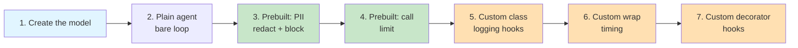
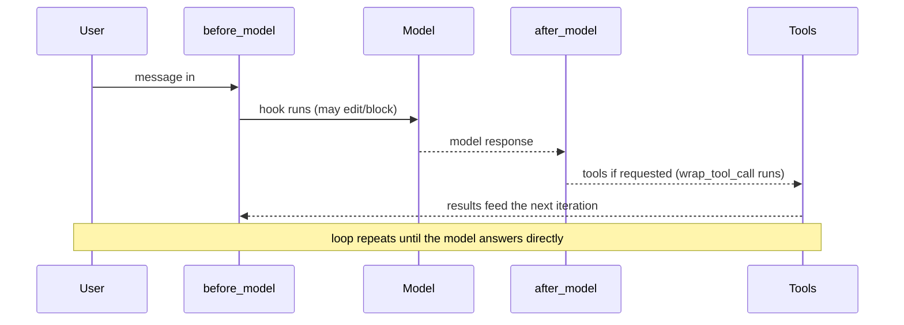

# Lab 5: Agent Middleware

**Difficulty: Intermediate | ~40 min | Requires Lab 2**

---

## 1. Agent Middleware

An agent is a loop: **call the model, run any tools it asked for, feed the results back, and repeat until the model answers directly**. That loop is powerful, but it is also a black box — there is no built-in place to log what the model saw, guard against sensitive input, cap spending, or time each call. Middleware opens the black box.

**Middleware** is code that wraps that loop and runs hooks around specific moments — before the model is called, after it responds, around tool execution. LangChain ships production-ready **prebuilt middleware** (PII redaction, call limits, retries, summarization), and you can write **custom middleware** that injects your own logic at the same points. This lab covers all three: what middleware is and where its hooks sit, two prebuilt pieces you can drop in today, and two styles of custom middleware you write yourself.

---

## 2. Problem Statement / Use Case Overview

Building an agent that *works* is Lab 1's achievement. Building one you can *ship* requires answering questions the core loop never asks: what exactly did the model see before it answered? What if a user pastes a credit-card number or an email into the conversation? What stops a buggy prompt from burning through the API budget in a retry loop? How slow is each model call, really?

Naively you could add prints and checks everywhere, but that splices monitoring, guardrails, and cost controls directly into your agent code — one concern tangled with every other. Middleware solves this the way web servers do: as **pluggable layers** between the agent loop and its model/tool calls. You attach a PII layer, a cost-control layer, and a logging layer by adding entries to a `middleware=[...]` list — and you can remove any of them without touching the agent itself. By the end of this lab you will have attached prebuilt middleware (PII redaction and a model-call budget) and written your own (a logging middleware and a call-timer) to the same agent, and you will know exactly where each hook runs in the loop.

---

## 3. Input Data

No dataset. The inputs are a handful of tiny prompts and tool definitions, readable by eye (Article PF-4):

- *"Say hello in one short sentence."* — first run, no middleware (overview).
- *"My email is john.smith@example.com. What is my email?"* — proves the PII layer scrubs the input before the model ever sees it.
- A `get_weather(city)` mock tool returning `"22C, sunny."` — the only "tool," sized so the free model reliably calls it.
- *"What is the weather in Paris? Use the get_weather tool."* — makes the agent take one model → tool → model round trip so the call limit can bite.
- Three trivial quiz prompts (`2 + 2`, capital of France, color of a banana) — one per custom-middleware demo.

That's the entire input; the lab is about *what runs around* the agent loop, not the data inside it.

---

## 4. Processing

The build moves from the plain loop outward, adding layers:

1. **Create the model** — the OpenRouter `ChatOpenAI` wrapper from Labs 1–4.
2. **Build a plain agent** — `create_agent(model)` gives you the bare loop to wrap.
3. **Attach prebuilt PII middleware** — an email detector that redacts matching text in `before_model`, and a `block` variant that raises instead.
4. **Attach prebuilt call-limit middleware** — `ModelCallLimitMiddleware` counts model calls and jumps out of the loop when the budget is spent.
5. **Write custom middleware (class style)** — subclass `AgentMiddleware` and implement `before_model`/`after_model` to log what happens around each call.
6. **Write custom middleware (wrap style)** — implement `wrap_model_call` to measure elapsed time around the model call itself.
7. **Write custom middleware (decorator style)** — turn plain functions into middleware with `@before_model` / `@after_model`.



Steps 3–4 are the prebuilt half, Steps 5–7 the custom half; the pivot is Step 2, where the loop becomes visible as a surface you can attach layers to.

---

## 5. Output

On a real run the notebook printed the following.

Step 4 — the plain agent answers and shows two messages in state (your question + the reply):

```
Hello!
Total messages in state: 2
```

Step 5 — PII redaction. The model replies to *something it never saw* — the raw email is replaced by `[REDACTED_EMAIL]` before the model call, and the proof line prints exactly what the model was given. The `block` strategy then raises `PIIDetectionError` before any model call:

```
Model reply: Your email address, as you've provided it in your message, is: **[REDACTED_EMAIL]**.
What the model actually saw: 'My email is [REDACTED_EMAIL]. What is my email?'
block strategy: PIIDetectionError raised before any model call
```

Step 6 — call limit. The agent's first model call triggers the weather tool; the *second* model call is refused, so the run ends with the framework's limit message instead of a second paid call:

```
  human: What is the weather in Paris? Use the get_weather tool.
  ai:
  tool: Weather in Paris: 22C, sunny.
  ai: Model call limits exceeded: run limit (1/1)
```

Step 7 — custom logging middleware; the hooks fire around the call:

```
  [before_model] calling the model with 1 message(s)
  [after_model] model replied: '2 + 2 equals 4.'
Final reply: 2 + 2 equals 4.
```

Step 8 — wrap-style timing prints how long the model call itself took:

```
  [wrap_model_call] model call took 12.45 seconds
Final reply: The capital of France is Paris.
```

Step 9 — decorator-style hooks:

```
  [@before_model] 1 message(s) in state
  [@after_model] reply: 'Yellow.'
Final reply: Yellow.
```

Exact values vary — free models change and answers drift. What must be true: **Step 5's reply can only be `[REDACTED_EMAIL]` (never the raw address) and the block variant raises; Step 6 ends with `Model call limits exceeded: run limit (1/1)`; Steps 7–9 print their hook lines before the final answer.** If you see that, middleware is working.

---

## 6. Tech Stack

- Python 3.11
- `langchain==1.2.15` (provides `create_agent` and the middleware API)
- `langchain-core==1.2.28` (message and tool primitives)
- `langchain-openai==1.1.12` (OpenRouter speaks the OpenAI protocol)
- `langgraph==1.1.6` (the runtime under the agent loop; provides `Runtime`)
- `python-dotenv==1.2.2` (loads `.env`)
- `pydantic==2.13.4` (pulled in by the framework)
- OpenRouter API — free models, no cost (see https://openrouter.ai/models); this lab uses `nvidia/nemotron-3-super-120b-a12b:free`

No GPU needed. Runs on any laptop. The only cost is a free OpenRouter account for an API key.

**Quota disclosure (PF-3):** OpenRouter's free tier allows **50 requests/day across all `:free` models** (20/minute), and failed requests count against it. The core steps (Steps 1–9) make about **6 model calls** — one per demo run (the PII block and the blocked second call in Step 6 make none) — and the Optional Exercise adds 1–2. If you hit a `429` error, either wait for the daily reset or add **$10 in credits once** — that raises the cap to 1,000 requests/day permanently (see https://openrouter.ai/docs/faq).

---

## 7. Underlying Concepts

### The agent loop and where hooks live

Everything an agent does is a small loop: the **model** is called; if it replies with tool calls, those **tools** run and their results are appended to the message list; the loop repeats until the model replies without tool calls. That is the whole machine from Lab 1. Middleware adds hook points around the two things that happen inside the loop:



Each hook gets the agent **state** (the message list, plus anything middleware has added) and the **runtime**, and may return a state-update dict — or nothing. That is all a prebuilt middleware is: a class that implements one or more of these hooks.

### Node-style vs. wrap-style hooks

There are two flavors, and picking the right one is half of writing middleware:

- **Node-style hooks** (`before_model`, `after_model`, plus `before_agent`/`after_agent` around the whole run) run *between* steps of the loop, see the current state, and can update it — redacting a message, counting calls, logging what was seen.
- **Wrap-style hooks** (`wrap_model_call`, `wrap_tool_call`) *surround the call itself*. You get the request and a `handler` — you may call `handler(request)` zero times (short-circuit), once (normal), or many times (retry). This is how timing, caching, and retries are built.

Rule of thumb from the LangChain docs: node-style for sequential logic (logging, validation, redaction), wrap-style for control flow (retry, fallback, caching, timing).

### Why middleware is layered, not embedded

Each concern lives in its own `AgentMiddleware` instance passed to `create_agent(middleware=[...])`. Middleware compose in order: `before_*` hooks run first-to-last, `after_*` hooks run last-to-first (like nested web-server middleware), and wrap-style hooks nest so the first in the list is the outermost layer. Because each piece is independent, you add or remove a guardrail by editing one list — never the agent logic.

### Prebuilt middleware = production concerns, packaged

PII redaction and call limits are hard problems to get right from scratch (regex coverage, streaming, per-thread accounting). LangChain ships them as configurable classes: `PIIMiddleware("email", strategy="redact")` picks the detection type and the strategy (`redact`, `mask`, `hash`, or `block` — raise before any model call), and `ModelCallLimitMiddleware(run_limit=1)` counts calls per run and jumps out of the loop when the budget is spent. Learning the prebuilt catalog before writing custom code is the point — most guardrails are already written.

### Two styles of custom middleware

The class style subclasses `AgentMiddleware` and overrides hook methods — the right choice when a middleware combines several hooks or takes configuration. The decorator style wraps a plain function with `@before_model` / `@after_model` (or `@wrap_model_call`) — the right choice for a single small hook. Both produce exactly the same kind of object the prebuilt middleware use, so you can mix class-, decorator-, and prebuilt middleware in one `middleware=[...]` list.

### The trade-off: hooks are invisible unless you look

Middleware changes behavior without changing the agent's visible code — which is great for separation of concerns and dangerous for debugging. A "reliable" agent may actually be silently blocked by a `block` PII strategy or truncated by a call limit. This lab's logging middleware exists to make the loop *visible*; in production you will want tracing (LangSmith) on top of middleware precisely because hooks are easy to forget about.

---

## 8. Prerequisites

- **Lab 2 (required)** — `create_agent`, tools, and the agent loop; middleware attaches to exactly the thing you built there.
- **Labs 1, 3, 4 are helpful** but not required — model wrapping, messages, and session state all recur in this lab's code.
- Basic Python (run a script, install packages) and a web browser.
- One free account: [openrouter.ai](https://openrouter.ai) → Settings → Keys → create a key that starts with `sk-or-v1`.

---

## 9. Environment / Dependencies Setup

Run these in a terminal. We use a virtual environment so the project is isolated and reproducible (Article CQ-6). Note the folder name has parentheses, so quote it:

```bash
cd "Lab5(Intermediate)"

python3 -m venv .venv
source .venv/bin/activate

pip install --upgrade pip
pip install "langchain==1.2.15" "langchain-core==1.2.28" "langchain-openai==1.1.12" "langgraph==1.1.6" "python-dotenv==1.2.2" "pydantic==2.13.4" "jupyterlab" "ipykernel"
```

Then create your key file:

```bash
cp .env.example .env
```

Open `.env` and replace the `sk-or-v1-xxx...` placeholder with your real OpenRouter API key. Save it.

Verify the environment:

```bash
python -c "import langchain, langchain_core, langchain_openai, langgraph, pydantic; print('OK')"
```

You should see `OK`. To run the notebook: `jupyter lab lab-agent-middleware.ipynb` (or open the file in VS Code). The notebook's first cell also runs the same installs, so if you skipped this step you can let it install the modules for you.

## 10. Step-wise Development Instructions

The heart of the lab. Work through **nine steps**, each one a single logical move, with the context explained before you run each cell. Run the cell, glance at the result, then move on.

The whole lab in one sentence: take the bare agent loop from Lab 2, attach two prebuilt middleware (PII redaction, call limit), then write your own middleware in class, wrap, and decorator styles.

### Step 1 — Install the required modules

This first command installs the Python libraries the lab needs, with exact versions pinned so the build is reproducible (Article CQ-6). New this lab: `langgraph` is pinned explicitly because the notebook imports `Runtime` from it directly. The `!` prefix is a Jupyter special that runs the rest of the cell as a terminal command. When it finishes you should see `Successfully installed ...` (or `Requirement already satisfied` if you already ran the Section 9 setup — either is success).

```python
# One command installs all required modules (versions pinned for reproducibility)
!pip install "langchain==1.2.15" "langchain-core==1.2.28" "langchain-openai==1.1.12" "langgraph==1.1.6" "python-dotenv==1.2.2" "pydantic==2.13.4"
```

### Step 2 — Load the key

Load your OpenRouter API key out of `.env` into the process environment, and stop immediately if it's missing. `load_dotenv()` reads every `KEY=VALUE` line from `.env`; the `if` check fails fast with a clear message instead of a confusing API error halfway through. The key never appears in code (Article CQ-7). No output is the success signal.

```python
import os
from dotenv import load_dotenv

load_dotenv()

if not os.getenv("OPENROUTER_API_KEY"):
    raise SystemExit("No OPENROUTER_API_KEY found. Add it to .env and restart the kernel.")
```

### Step 3 — Create the model

The same wrapper as Labs 1–4: `model=` names the free Nemotron model on OpenRouter, `base_url=` redirects the OpenAI-compatible client to OpenRouter, `api_key=` pulls the key from the environment, and `temperature=0` keeps answers deterministic.

```python
from langchain_openai import ChatOpenAI

model = ChatOpenAI(
    model="nvidia/nemotron-3-super-120b-a12b:free",
    base_url="https://openrouter.ai/api/v1",
    api_key=os.getenv("OPENROUTER_API_KEY"),
    temperature=0,
)
```

### Step 4 — Build a plain agent (the canvas for middleware)

`create_agent(model)` assembles the loop from Section 7 around your model — model node, tool node, and the decide-and-repeat machinery — with no tools yet, so a run is exactly one model call. This is the object middleware will wrap. Note that `create_agent` accepts a model *instance*, so every configuration detail from Step 3 (base URL, key, temperature) carries in automatically.

```python
from langchain.agents import create_agent

agent = create_agent(
    model=model,
    system_prompt="You are a concise assistant. Answer in one short sentence.",
)
```

Then run it. `invoke` takes the input schema — a list of `("human", text)` tuples — and returns the full final state. `result["messages"][-1]` is the agent's last message, which is all a caller usually cares about.

```python
result = agent.invoke({"messages": [("human", "Say hello in one short sentence.")]})
print(result["messages"][-1].content)
print(f"Total messages in state: {len(result['messages'])}")
```

Expect a one-line greeting and `Total messages in state: 2` (your turn plus the reply). Keep this `agent` in mind — every middleware you build from here on wraps the same loop.

### Step 5 — Prebuilt middleware: PII redaction

Drop in your first guardrail. `PIIMiddleware("email", strategy="redact", apply_to_input=True)` attaches a `before_model` hook that scans the newest human message, replaces any detected email with `[REDACTED_EMAIL]`, and hands the sanitized state to the model — the model never sees the raw address. Two agents are built: `pii_redact` scrubs and continues; `pii_block` uses `strategy="block"`, which *raises* `PIIDetectionError` in `before_model` instead of continuing — the whole run is refused before a single model call, the right behavior for a hard compliance rule.

```python
from langchain.agents.middleware import PIIMiddleware, PIIDetectionError

pii_redact = create_agent(
    model=model,
    middleware=[PIIMiddleware("email", strategy="redact", apply_to_input=True)],
    system_prompt="You are a helpful assistant.",
)

pii_block = create_agent(
    model=model,
    middleware=[PIIMiddleware("email", strategy="block", apply_to_input=True)],
    system_prompt="You are a helpful assistant.",
)
```

Now run both. The redact run proves the mechanism: the agent's own reply references `[REDACTED_EMAIL]`, and the final line prints the *actual* message content from the returned state — the proof that the model only ever saw the sanitized version. The block run is wrapped in `try/except` because refusing the run is the expected behavior; catching `PIIDetectionError` turns the failure into a printed confirmation instead of a red cell.

```python
result = pii_redact.invoke(
    {"messages": [("human", "My email is john.smith@example.com. What is my email?")]}
)
print("Model reply:", result["messages"][-1].content)

last_user = [m for m in result["messages"] if m.type == "human"][-1]
print("What the model actually saw:", repr(last_user.content))

try:
    pii_block.invoke({"messages": [("human", "My email is john.smith@example.com")]})
except PIIDetectionError:
    print("block strategy: PIIDetectionError raised before any model call")
```

Expect the reply to reference `[REDACTED_EMAIL]`, the "saw" line to show `'My email is [REDACTED_EMAIL]. What is my email?'`, and the block line to print. If the model's reply still contains your email address, the layer is not attached — check the `middleware=[...]` argument.

### Step 6 — Prebuilt middleware: model call limit

The second guardrail is a budget. `ModelCallLimitMiddleware(run_limit=1)` adds hooks that count model calls per run and, when the count is already at the limit, jump the loop straight to the end with a "limit exceeded" message instead of making another call. To make the limit *bite*, the agent needs a reason to call the model twice, so a trivial `get_weather` tool is added and the system prompt tells the agent to use it. A run therefore takes one model → tool → model round trip: the first model call asks for the tool, and the second — the one that would produce the final answer — is the one the budget blocks.

```python
from langchain.agents.middleware import ModelCallLimitMiddleware
from langchain.tools import tool

@tool
def get_weather(city: str) -> str:
    """Get the current weather for a city."""
    return f"Weather in {city}: 22C, sunny."

budget_agent = create_agent(
    model=model,
    tools=[get_weather],
    middleware=[ModelCallLimitMiddleware(run_limit=1, exit_behavior="end")],
    system_prompt="Use the weather tool whenever the user asks about weather.",
)
```

Then run it and dump the whole state so the round trip is visible — each line is one message the loop accumulated:

```python
result = budget_agent.invoke(
    {"messages": [("human", "What is the weather in Paris? Use the get_weather tool.")]}
)
for m in result["messages"]:
    print(f"  {m.type}: {str(m.content)[:70]}")
```

Expect four messages: your question, the model's (empty-content) tool request, the tool's result, and the final AI message `Model call limits exceeded: run limit (1/1)`. The tool ran, but the answer-producing call was refused — exactly the cost-control behavior you'd want for a runaway agent.

### Step 7 — Custom middleware (class style): logging

Now you write middleware, not just configure it. Subclass `AgentMiddleware` and override hooks. `before_model` runs before each model call and here prints how many messages the model is about to see; `after_model` runs right after and prints the reply. Both return `None` (no state change) — pure observation. This is the minimal custom middleware, and it is also the tool you'll reach for whenever the loop feels like a black box.

```python
from langchain.agents.middleware import AgentMiddleware, AgentState
from langgraph.runtime import Runtime

class LoggingMiddleware(AgentMiddleware):
    def before_model(self, state: AgentState, runtime: Runtime) -> dict | None:
        print(f"  [before_model] calling the model with {len(state['messages'])} message(s)")
        return None

    def after_model(self, state: AgentState, runtime: Runtime) -> dict | None:
        print(f"  [after_model] model replied: {state['messages'][-1].content[:40]!r}")
        return None
```

Attach and run it — exactly the same `middleware=[...]` slot the prebuilt pieces used:

```python
logging_agent = create_agent(
    model=model,
    middleware=[LoggingMiddleware()],
    system_prompt="Answer in one short sentence.",
)

result = logging_agent.invoke({"messages": [("human", "What is 2 + 2?")]})
print("Final reply:", result["messages"][-1].content)
```

Expect the two `[before_model]` / `[after_model]` lines to print *around* the final answer. The hooks and the answer interleaving in the output is the whole point: you are now watching the loop run.

### Step 8 — Custom middleware (wrap style): timing

Node hooks see state; wrap hooks *surround the call*. `wrap_model_call(request, handler)` hands you the model request and a `handler` that actually performs the call. Measure the time before and after `handler(request)` and you have a latency meter — something no prebuilt middleware gives you. `time.perf_counter()` is used because it's the most precise clock Python offers for short intervals. The wrapped result is returned unchanged.

```python
import time
from collections.abc import Callable
from langchain.agents.middleware import ModelRequest, ModelResponse

class TimingMiddleware(AgentMiddleware):
    def wrap_model_call(
        self, request: ModelRequest, handler: Callable[[ModelRequest], ModelResponse]
    ) -> ModelResponse:
        start = time.perf_counter()
        response = handler(request)
        elapsed = time.perf_counter() - start
        print(f"  [wrap_model_call] model call took {elapsed:.2f} seconds")
        return response
```

Attach and run — the printed number is the wall-clock time of the model round trip itself, not the whole agent:

```python
timing_agent = create_agent(
    model=model,
    middleware=[TimingMiddleware()],
    system_prompt="Answer in one short sentence.",
)

result = timing_agent.invoke({"messages": [("human", "What is the capital of France?")]})
print("Final reply:", result["messages"][-1].content)
```

Expect a line like `[wrap_model_call] model call took 8.32 seconds` (free-tier models are slow; exact value varies) followed by the answer. Note the contrast with Step 7: this hook runs *inside* the model call's lifecycle rather than between loop steps.

### Step 9 — Custom middleware (decorator style): one-function hooks

For a single small hook, the decorators `@before_model` and `@after_model` turn a plain function into middleware — no class boilerplate. The decorated function has the same signature as the hook methods: `(state, runtime)`, returning a state-update dict or `None`. Both decorated functions are then passed in the same `middleware=[...]` list, mixed freely.

```python
from langchain.agents.middleware import before_model, after_model

@before_model
def log_before(state: AgentState, runtime: Runtime) -> dict | None:
    print(f"  [@before_model] {len(state['messages'])} message(s) in state")
    return None

@after_model
def log_after(state: AgentState, runtime: Runtime) -> dict | None:
    print(f"  [@after_model] reply: {state['messages'][-1].content[:30]!r}")
    return None
```

Attach both and run:

```python
decorated_agent = create_agent(
    model=model,
    middleware=[log_before, log_after],
    system_prompt="Answer in one short sentence.",
)

result = decorated_agent.invoke({"messages": [("human", "Name one color of a banana.")]})
print("Final reply:", result["messages"][-1].content)
```

Expect `[@before_model] 1 message(s) in state`, then `[@after_model] reply: 'Yellow.'`, then the final answer. Class style and decorator style are interchangeable — the decorated functions are `AgentMiddleware` objects, just like `LoggingMiddleware()` and `PIIMiddleware(...)`.

---

## 11. Optional Exercise

Stack all three kinds of middleware on ONE agent and watch the hooks compose. Build a single agent that uses the `get_weather` tool, `LoggingMiddleware()` (Step 7) so the hook order is visible, `PIIMiddleware("email", strategy="redact", apply_to_input=True)` (Step 5), and `ModelCallLimitMiddleware(run_limit=1)` (Step 6). Ask it a question that mentions an email address and the weather (e.g., *"Tell lisa@example.com what the weather in London is. Use the get_weather tool."*), then print what the model actually saw as the final user message. Verify three things: (1) the raw email never appears in the model's input — only `[REDACTED_EMAIL]`; (2) the `[before_model]` / `[after_model]` log lines from your custom middleware appear around the model calls; (3) if the agent uses the tool, the run ends with the `Model call limits exceeded: run limit (1/1)` message instead of a final answer. Everything needed is already defined above — no new imports.

## 12. What We Learnt

- An agent is a **loop** — model, tools, repeat — and middleware is the layer that wraps it, running hooks before/after the model and around tool calls.
- **Prebuilt middleware** packages production concerns as configuration: `PIIMiddleware` redacts/masks/hashes or `block`s sensitive input before the model sees it, and `ModelCallLimitMiddleware` enforces a per-run (or per-thread) model-call budget.
- **Node-style hooks** (`before_model`, `after_model`) run between loop steps, see the state, and can update or refuse it; **wrap-style hooks** (`wrap_model_call`, `wrap_tool_call`) surround the call itself and enable timing, caching, and retries.
- **Custom middleware** comes in two interchangeable styles: subclass `AgentMiddleware` for multi-hook or configurable pieces, or use `@before_model` / `@after_model` / `@wrap_model_call` decorators for single small hooks.
- Middleware **composes** — `before_*` hooks run first-to-last, `after_*` last-to-first, wrap hooks nest — and all of it plugs into the same `create_agent(middleware=[...])` list alongside prebuilt pieces.
- A **prebuilt-first mindset** saves time: PII, limits, retries, and fallbacks already exist — write custom middleware for the behavior that doesn't.
- **Hooks are invisible unless you look** — the same layering that keeps concerns separate makes silent blocking easy, so observability (logging, tracing) is a middleware concern too.

Test yourself: complete the exercises in [`lab-agent-middleware-assignment.md`](lab-agent-middleware-assignment.md) — answer key included.
