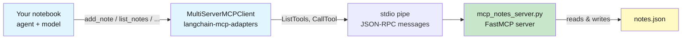

# Lab 7: Local MCP — Connect to a Locally-Run MCP Server

**Difficulty: Intermediate | ~40 min | Requires Labs 1–2**

---

## 1. Local MCP — Connect to a Locally-Run MCP Server

Every agent so far learned its tools the same way: tools were *written into the notebook* as Python functions. **MCP** (Model Context Protocol) changes who owns the tools. With MCP, capabilities live in a separate program — an **MCP server** — and your agent connects to it over a standard protocol and picks up whatever tools that server exposes. This lab covers the **local variant** of MCP: a small server running on your own machine, connected over stdio (standard input/output). It is the easier, lower-stakes half of MCP — no hosted services, no network, no auth — just a subprocess on your machine that your agent can call. You'll run a personal notes server, watch its four tools become ordinary LangChain tools, and drive them with the same free Nemotron model used all along.

---

## 2. Problem Statement / Use Case Overview

Capabilities are the whole point of an agent, and until now every capability you've given one was hand-rolled in the same notebook. In production that doesn't scale: teams build tools once and want *any* agent to discover and use them, without each agent re-encoding the tool. MCP is the answer to that — a public, language-neutral protocol that lets an application (the MCP **client**) connect to a program that offers capabilities (the MCP **server**) and ask it, at runtime, "what tools do you have?" The local variant is where everyone starts: your server and your client run on the same machine and talk over a plain pipe. In this lab you will connect an agent to a local MCP server that manages a personal notes store, watch the protocol hand tools over, and let the model add, read, and delete notes through natural language — with the tool code living *outside* the agent entirely.

---

## 3. Input Data

No dataset. The inputs are the notes you and the model create, a small JSON store, and the prompts that drive the agent:

- **`mcp_notes_server.py`** — the MCP server shipped with this lab. It exposes four tools: `add_note`, `list_notes`, `get_note`, `delete_note`, each a decorated Python function whose docstring becomes the tool description the model reads.
- **`notes.json`** — the server's persistent store, created automatically in the lab folder on the first tool call. Format is `{"1": {"title": ..., "content": ...}, ...}`. Deleting it resets the lab (the connect step does this for you each run).
- **Prompts** — *"Add a note titled 'meeting' with content 'standup at 10am', then list all my notes."*, *"What notes do I have?"*, and *"What is MCP?"* (a question that needs no tool at all).
- **`.env`** — `OPENROUTER_API_KEY` (copied from `.env.example`), exactly as in Labs 4–6.

That's the whole input: a server file, a JSON file, and a handful of prompts. The interesting part is what sits *between* your notebook and the server's tools.

---

## 4. Processing

The build proceeds from "tools in the notebook" toward "tools owned by a server":

1. **Create the model** — the OpenRouter `ChatOpenAI` wrapper from Labs 1–6.
2. **Meet the server** — read `mcp_notes_server.py`, the local MCP server that owns the notes tools.
3. **Connect** — `MultiServerMCPClient` spawns the server as a subprocess and asks it over stdio which tools it exposes (`ListTools`). No model involved.
4. **Inspect** — look at one tool's argument schema: the exact JSON the model will see.
5. **Call tools directly** — `add_note` and `list_notes` run without any LLM, proving the tools are just functions over a protocol.
6. **Agent, turn 1** — one model call chains two tool calls: add a note, then list all notes.
7. **Agent, turn 2** — a fresh turn reads the persisted store ("What notes do I have?").
8. **Agent, no tool** — a question MCP can't help with ("What is MCP?") and the loop skips tools.
9. **Agent, delete** — the model removes a note through language and confirms.
10. **Errors and metadata** — a missing-note lookup returns a clean message; `get_server_info()` reports the server's name and version.
11. **Two servers** — connect the same server twice with name prefixes and watch tool names collide-free (`notes_add_note`, `work_add_note`).

Every step is local except the model calls, of which there are four in a full run.

---

## 5. Output

A full run shows the connection being made, the tools arriving from the server, direct tool results, and four agent conversations. Sample output:

```
- add_note: Add a note and return its id. The id is a sequential number.
- list_notes: List all notes as one line per note (id + title).
- get_note: Return one note by its id, with title and content.
- delete_note: Delete a note by its id. Returns a confirmation.
```

The schema step prints the JSON schema of `add_note` — `{'title': ..., 'content': ...}` — the shape the model must fill in to call it. Direct calls return plain text (`Added note 1: groceries`, then `[1] groceries`). The agent turns print the full loop per turn, e.g.:

```
human: Add a note titled 'meeting' with content 'standup at 10am', then list all my notes.
ai:
tool: [{'type': 'text', 'text': 'Added note 2: meeting', ...}]
ai:
tool: [{'type': 'text', 'text': '[1] groceries\n[2] meeting', ...}]
ai: I've added the note titled "meeting" with content "standup at 10am" (assigned ID 2). Here...
```

The no-tool turn answers without any `tool:` lines. The missing-note lookup returns `No note with id 99.` The two-server step prints eight prefixed tool names. A `notes.json` file appears in the folder and is reset at the start of each run.

Exact wording varies — free models drift. What must be true: **the tools come from the server, not the notebook; direct calls work with no model; the agent's add/list/delete turns actually change and read `notes.json`; the no-tool turn makes no tool calls; and the two-server step shows prefixed names.**

---

## 6. Tech Stack

- Python 3.11
- `langchain==1.3.15` + `langchain-core==1.5.4` (provides `create_agent` and the agent loop)
- `langchain-openai==1.4.3` (OpenRouter speaks the OpenAI protocol)
- `langgraph==1.2.11` (the runtime under the agent loop)
- `langchain-mcp-adapters==0.3.2` (the MCP client: `MultiServerMCPClient` turns a server's tools into LangChain tools)
- `mcp==1.29.0` (the MCP Python SDK; `FastMCP` builds the server)
- `python-dotenv==1.2.2` (loads `.env`)
- `pydantic` (pulled in by the framework)
- OpenRouter API — free models, no cost (see https://openrouter.ai/models); this lab uses `nvidia/nemotron-3-super-120b-a12b:free`

No GPU needed. Runs on any laptop. The server and its tools are 100% local and free; the only paid-adjacent piece is the free OpenRouter model.

**Quota disclosure (PF-3):** OpenRouter's free tier allows **50 requests/day across all `:free` models** (20/minute), and failed requests count against it. A full run of this notebook makes about **4 model calls** — everything else (server spawn, tool calls, discovery) is local. If you hit a `429` error, wait for the daily reset or add **$10 in credits once** to raise the cap to 1,000 requests/day (see https://openrouter.ai/docs/faq).

---

## 7. Underlying Concepts

### What MCP is, and the two halves

MCP — the **Model Context Protocol** — is an open standard for giving LLM applications access to capabilities. Instead of you hard-coding a tool inside your agent, a separate program exposes it, and the agent connects and discovers it at runtime. That decouples two things that used to be glued together: *who provides a capability* (the server) and *who uses it* (the agent/client). MCP comes in two flavors. The **local** variant runs the server as a subprocess on your machine and talks over **stdio** — a pipe of JSON-RPC messages. It's easy and low-stakes: no network, no credentials, no hosting. The **remote** variant runs the server on another machine and talks over HTTP or SSE. Both present tools to the client in exactly the same way, so the client code barely changes — which is why the local variant is the right first half to learn.

### Client, server, and the stdio pipe

MCP reuses the vocabulary of client/server, but both ends run on your laptop. Your notebook is the **client** (via `MultiServerMCPClient`). `mcp_notes_server.py` is the **server**. When the client starts, it launches the server as a subprocess — `command=sys.executable, args=[server.py]` — and the two processes talk over the child's stdin/stdout. The messages are JSON-RPC: `initialize` (hello, what version, what capabilities), `ListTools` (what do you expose?), and `CallTool` (run this tool with these args).



The protocol is language-neutral: any server that speaks MCP, in any language, hands tools to this client the same way.

### How a tool crosses the protocol

The server declares a tool with a name, a docstring, and typed arguments. `FastMCP` reads the Python signature and builds the MCP tool descriptor — a JSON schema. Over `ListTools`, that descriptor travels to the client. `langchain-mcp-adapters` then converts each descriptor into a standard LangChain `BaseTool`, so your `create_agent` loop treats it exactly like a `@tool` function defined in the notebook. The model never sees the server's Python code; it sees the schema (Step 6 prints exactly that) and the description, and it decides from those whether to call the tool. The adapter is the bridge that lets an MCP ecosystem and the LangChain agent loop coexist without special-casing.

### Dynamic capability discovery

This is the payoff: your agent's toolset is no longer fixed at build time. The same notebook code connected to a different server (or a server that added a tool) would simply have different tools on the next run. The lab touches this in two places — the two-server step, where name collisions are resolved with prefixes (`notes_add_note`), and the Optional Exercise, where you add a fifth tool to the server and the agent picks it up without touching the notebook's agent code.

---

## 8. Prerequisites

- Labs 1–2 (the agent loop, messages, and how tools work) — this lab reuses `create_agent` unchanged.
- Python 3.11 and a terminal.
- A free OpenRouter account with an API key (see Lab 4, Section 9).
- Comfort reading a short Python file — the server is the star of this lab and you'll read its ~60 lines.

---

## 9. Environment / Dependencies Setup

```bash
# from inside the Lab7(Intermediate) folder
python3 -m venv .venv
source .venv/bin/activate

pip install -qU langchain==1.3.15 langchain-core==1.5.4 langchain-openai==1.4.3 \
    langgraph==1.2.11 langchain-mcp-adapters==0.3.2 mcp==1.29.0 python-dotenv==1.2.2

cp .env.example .env   # then paste your OpenRouter key into .env
jupyter lab            # open lab-local-mcp.ipynb
```

`mcp_notes_server.py` ships with the lab and needs no setup; `notes.json` is created automatically on the first tool call and reset by the notebook each run. The first notebook cell installs the same packages with the same pinned versions, so a fresh kernel can be set up by running it alone.

---

## 10. Step-wise Development Instructions

The notebook mirrors these steps; the code below is what each cell runs.

### Step 1 — Install the required modules

One pinned command installs the LangChain stack from the previous labs plus the two new packages: `mcp` (the protocol SDK, which provides `FastMCP` for the server) and `langchain-mcp-adapters` (the MCP client that converts a server's tools into LangChain tools). Versions are pinned so every learner gets the same environment.

```python
# One command installs all required modules (versions pinned for reproducibility)
!pip install -qU langchain==1.3.15 langchain-core==1.5.4 langchain-openai==1.4.3 langgraph==1.2.11 langchain-mcp-adapters==0.3.2 mcp==1.29.0 python-dotenv==1.2.2
```

### Step 2 — Load the key

Same as every lab since Lab 4. `load_dotenv()` reads `.env` into the environment.

```python
import os
from dotenv import load_dotenv

load_dotenv()
```

### Step 3 — Create the model

The OpenRouter wrapper from Labs 1–6: free Nemotron, `temperature=0` for determinism.

```python
from langchain_openai import ChatOpenAI

model = ChatOpenAI(
    model="nvidia/nemotron-3-super-120b-a12b:free",
    base_url="https://openrouter.ai/api/v1",
    api_key=os.getenv("OPENROUTER_API_KEY"),
    temperature=0,
)
```

### Step 4 — Read the local MCP server

Before any code, open `mcp_notes_server.py` in your editor. This is the whole lab in one file: a personal notes store backed by JSON, exposed as four MCP tools. The protocol work is handled by the SDK; your code is just functions with docstrings:

```python
from mcp.server.fastmcp import FastMCP

mcp = FastMCP("notes-server")

@mcp.tool()
def add_note(title: str, content: str) -> str:
    """Add a note and return its id. The id is a sequential number."""
    notes = load_notes()
    note_id = str(len(notes) + 1)
    notes[note_id] = {"title": title, "content": content}
    save_notes(notes)
    return f"Added note {note_id}: {title}"
```

The `@mcp.tool()` decorator registers the function as a tool: the docstring becomes the description (the model reads it to decide when to call), and the signature becomes the argument schema. `FastMCP` plus a single `mcp.run()` in the `__main__` block is a complete server speaking MCP over stdio. The server knows nothing about LangChain, agents, or models — it just answers MCP requests. The file also quiets the SDK's own request logs so notebook output stays readable.

### Step 5 — Connect to the server and list its tools

`MultiServerMCPClient` is the bridge. Its constructor takes a dict of connections: one entry per server, naming the server, the transport (`stdio`), the executable that runs it (`sys.executable` — the Python running this notebook), and the server script as an argument. `await client.get_tools()` spawns the server, asks it over the pipe which tools it exposes (an MCP `ListTools` request), and returns LangChain `BaseTool` objects. This step makes **no model calls**.

```python
import sys
from pathlib import Path

from langchain_mcp_adapters.client import MultiServerMCPClient

Path("notes.json").unlink(missing_ok=True)  # start from a clean notes store

client = MultiServerMCPClient(
    {
        "notes": {
            "transport": "stdio",
            "command": sys.executable,
            "args": [str(Path("mcp_notes_server.py").resolve())],
        }
    }
)

tools = await client.get_tools()
for tool in tools:
    print(f"- {tool.name}: {tool.description.splitlines()[0]}")
```

The `await` at cell top-level works because Jupyter runs cells inside an async loop. Each tool call opens its own session to the server, so there is no session lifecycle to manage across cells.

### Step 6 — See the schema the model sees

Each returned tool carries `args`: the JSON schema the model must fill in to call it. Print `add_note`'s — it's the exact shape MCP delivered over `ListTools`, converted by the adapter.

```python
print(tools[0].args)
```

### Step 7 — Call MCP tools directly, no model involved

MCP tools are ordinary functions over a protocol — they don't need an LLM. Pull two out of the list and call them with `.ainvoke()`. Every call spawns the server, runs the tool against `notes.json`, and returns a result. Watch `notes.json` appear in the folder.

```python
add = [t for t in tools if t.name == "add_note"][0]
list_notes = [t for t in tools if t.name == "list_notes"][0]

print(await add.ainvoke({"title": "groceries", "content": "milk, eggs, bread"}))
print(await list_notes.ainvoke({}))
```

### Step 8 — Give the agent the MCP tools

`create_agent` is the same factory from Labs 1–6. Pass it the model and the MCP-derived tools: the agent loop now treats the server's tools exactly like any LangChain tool. This query asks the agent to add a note *and then* list all notes — one model call, two tool calls, and the tools run locally for free. The printed messages show the whole loop: `human` → `ai` (the tool calls it decided on) → `tool` (results) → `ai` (the answer).

```python
from langchain.agents import create_agent

agent = create_agent(model=model, tools=tools)

result = await agent.ainvoke(
    {"messages": [("human", "Add a note titled 'meeting' with content 'standup at 10am', then list all my notes.")]}
)
for message in result["messages"]:
    print(f"{message.type}: {str(message.content)[:90]}")
```

### Step 9 — A fresh turn reads the persisted store

The notes live in `notes.json`, not in the model's memory. Ask the agent a follow-up in a fresh invocation: it reaches for `list_notes`, the server reads the file, and the answer reflects everything added in Steps 7–8.

```python
result = await agent.ainvoke({"messages": [("human", "What notes do I have?")]})
for message in result["messages"]:
    print(f"{message.type}: {str(message.content)[:90]}")
```

### Step 10 — The loop when no tool fits

Not every question needs a tool. Ask a general-knowledge question and watch the loop skip the tool node entirely — one `ai:` message, no `tool:` line. The agent isn't forced to use its tools.

```python
result = await agent.ainvoke({"messages": [("human", "In one sentence, what is MCP?")]})
for message in result["messages"]:
    print(f"{message.type}: {str(message.content)[:90]}")
```

### Step 11 — Delete through language

Capabilities include removal. Ask the agent to delete the groceries note and tell you what remains; the model picks `delete_note` (then `list_notes`) from the descriptions alone.

```python
result = await agent.ainvoke(
    {"messages": [("human", "Delete the note titled 'groceries', then tell me what notes remain.")]}
)
for message in result["messages"]:
    print(f"{message.type}: {str(message.content)[:90]}")
```

### Step 12 — Errors and server metadata

Two quick locals. A lookup for a note that doesn't exist returns a clean message from the tool (no crash — the server says so in plain text). `get_server_info()` asks the server to identify itself over the protocol.

```python
get = [t for t in tools if t.name == "get_note"][0]
print(await get.ainvoke({"note_id": "99"}))

info = await client.get_server_info()
print(info["notes"].serverInfo.name, info["notes"].serverInfo.version)
```

### Step 13 — Two servers, prefixed names

Connect the *same* server twice under different names. Without care, both would expose `add_note` — a name collision. `tool_name_prefix=True` prefixes every tool with its server name, so the agent can address `notes_add_note` and `work_add_note` unambiguously. This is how production clients attach multiple MCP servers without their tools fighting.

```python
client2 = MultiServerMCPClient(
    {
        "notes": {"transport": "stdio", "command": sys.executable, "args": [str(Path("mcp_notes_server.py").resolve())]},
        "work": {"transport": "stdio", "command": sys.executable, "args": [str(Path("mcp_notes_server.py").resolve())]},
    },
    tool_name_prefix=True,
)

all_tools = await client2.get_tools()
for tool in all_tools:
    print(f"- {tool.name}")
```

---

## 11. Optional Exercise

Add a fifth tool to the server: `search_notes(keyword: str) -> str`, which returns every note whose title or content contains `keyword` (a case-insensitive `in` check over `load_notes()` is enough). Register it with `@mcp.tool()` in `mcp_notes_server.py`, restart the kernel, and run the notebook's connect step again (it will discover the new tool). Then ask the agent: *"Find the note about the standup."* — it should call `search_notes("standup")` and answer from the result, with no changes to the notebook's agent code.

---

## 12. What We Learnt

- **MCP is a protocol, not a library** — it standardizes how an application discovers and calls another program's capabilities, and the same protocol covers local (stdio) and remote (HTTP) servers.
- **The local variant is the easy half** — a server is just a subprocess on your machine; `MultiServerMCPClient` spawns it and talks JSON-RPC over stdio, so there's no network, auth, or hosting to learn.
- **A tool is a name, a description, and a schema** — `FastMCP` derives all three from a decorated function; the docstring is what the model reads to decide when to call it.
- **`langchain-mcp-adapters` bridges two worlds** — `get_tools()` converts MCP tool descriptors into LangChain `BaseTool`s, so `create_agent` uses them exactly like notebook-local `@tool` functions.
- **Capabilities are discovered, not compiled in** — the agent's toolset comes from the server at runtime; adding a tool to the server (the Optional Exercise) changes the agent without touching its code.
- **Name collisions are a real problem** — attaching multiple servers can clash on `add_note`; `tool_name_prefix=True` disambiguates with server-name prefixes.
- **Tools run without the model** — direct `.ainvoke()` calls and error messages like `No note with id 99.` prove the tool layer is a plain local function, independent of the LLM.
