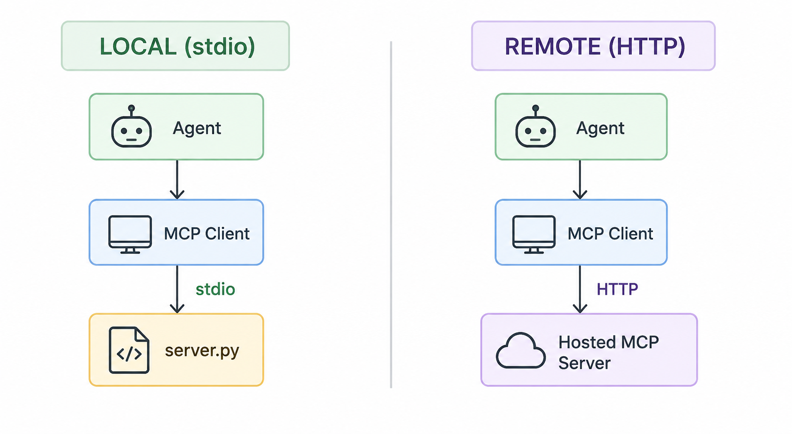
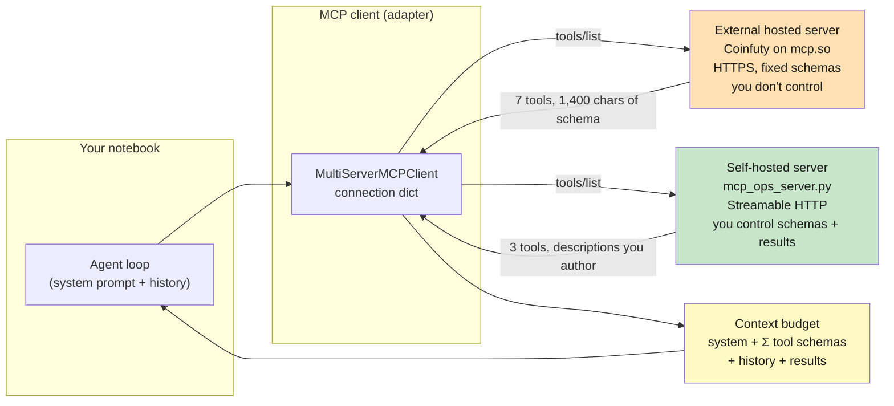

# Lab 8: MCP & Context Engineering — Remote Servers + Shaping What the Model Sees

**Difficulty: Advanced | ~45 min | Requires Lab 7 (and Lab 5)**

---

## 1. Lab Title

**MCP & Context Engineering: remote/hosted MCP servers plus deliberately shaping what context reaches the model.**

### What context engineering is

**Context engineering** is the deliberate practice of deciding what does — and does not — enter the model's context window. In an agent, that context is a *budget* to manage:

- **Every token costs** — each one you send costs money, slows the request, and crowds out the tokens that actually matter.
- **Context is rebuilt on every step** — from the system prompt, each bound tool's schema and description, the conversation history, and the latest tool results; it is never written once.
- **It decides the agent's actions** — an agent picks its next step from the context alone, so a bloated schema, a verbose payload, or a buried instruction degrades its choices before the model even thinks.
- **It's a skill you practice** — the rest of this lab does it in miniature: *measure* the budget, then shrink it with *prune*, *describe*, and *shape*.

---

## 2. Problem Statement / Use Case Overview

Every time a model decides what to do next, it pays for the *entire context you hand it* — the system prompt, every tool's name, description, and JSON schema, the conversation history, and every tool result. An agent wired to a real external MCP server inherits context it does not control: another team's tool descriptions, another team's payload sizes. Left unmanaged, this is where cost and latency quietly explode at scale.

This lab gives you the two skills that manage that complexity. First, you connect an agent to a **real external MCP server hosted on mcp.so** (Coinfuty — live crypto-futures data, no API key) and to a **self-hosted server of your own**, both over HTTP — the transport that makes MCP servers reachable anywhere, not just on your laptop. Second, you **measure the context budget** of those connections and deliberately shrink it with three levers: *prune* the tools you expose, *author* lean descriptions, and *shape* results server-side. By the end you will have a number-led answer to "how do I control how much context this agent consumes?"

---

## 3. Input Data

Two MCP servers feed the agent:

- **Coinfuty (external, hosted)** — a real production MCP endpoint at `https://mcp.coinfuty.com/api/mcp` (listed on mcp.so). It exposes 7 tools returning live crypto-futures market data: open interest, funding rates, long/short ratios, liquidations, price history. Free and keyless, rate-limited to 60 requests/min per IP. You do not control its tool names, descriptions, or payloads.
- **`mcp_ops_server.py` (self-hosted)** — a small server you run in the same folder as this notebook. It exposes 3 tools over Streamable HTTP (`http://127.0.0.1:8788/mcp`) returning **synthetic, deterministic** market-ops data: a compact snapshot, a raw log firehose (14 KB+ when asked), and a server-side digest of those same logs (~160 chars). Deterministic output means every run matches the numbers in this file.

No other data is used. The OpenRouter model key comes from `.env` exactly as in Labs 5–7.

---

## 4. Processing

The pipeline is a set of measured experiments, not a data transformation:

1. **Host your server** — spawn `mcp_ops_server.py` as a background process (the notebook manages its lifecycle).
2. **Connect two remote servers** — the same `MultiServerMCPClient` dictionary you used for stdio in Lab 7, but with `"transport": "http"` and a URL instead of a command. One entry points at Coinfuty over HTTPS, one at your own server over HTTP.
3. **Take the context ledger** — serialize what the model would actually receive: for each tool, the character size of its JSON schema and description. External tools are fixed; yours are yours.
4. **A/B experiment 1 — pruning.** Ask one market question with the agent bound to all 7 external tools, then again with only the 2 relevant ones. Measure the first LLM call's input tokens (the "decision-time context") for both.
5. **A/B experiment 2 — result shaping.** Ask one log-summary question with the agent bound to the raw firehose tool, then again with the server-digest tool. Measure how many input tokens the second LLM call carries the tool result in.
6. **Close the ledger** — compare all four numbers side by side and read the lesson back.

Total model cost: **4 LLM calls per full run** (plus tool calls, which are free).

---

## 5. Output

Two side-by-side comparisons. Values are live and approximate — the point is the *ratio*, which is stable.

**A/B 1 — pruning external tools** (decision-time input tokens on the first LLM call):

```
all 7 Coinfuty tools bound : ~1,800 input tokens
only the 2 relevant tools  : ~550 input tokens      (≈ 70% less context at decision time)
```

**A/B 2 — shaping results on your own server** (context after the tool fires):

```
raw log firehose (≈14 KB)  : ~6,500 input tokens on the follow-up call
server-side digest (~160 C): ~420 input tokens      (≈ 94% less context carried by the result)
```

You will also see the context ledger itself: each external tool's schema footprint (several are 300–570 characters), your own tools' description sizes, and the tool result sizes the server hands back. Both agents answer the question correctly in all four runs — that is the whole point: the answers survive, the context budget does not.

---

## 6. Tech Stack

| Piece | Choice | Version |
|---|---|---|
| Python | Any 3.11+ | — |
| LangChain | `langchain` | 1.3.15 |
| LangChain core | `langchain-core` | 1.5.4 |
| OpenAI-compatible bindings | `langchain-openai` | 1.4.3 |
| Agent runtime | `langgraph` | 1.2.11 |
| MCP client adapter | `langchain-mcp-adapters` | 0.3.2 |
| MCP SDK (server + streamable HTTP) | `mcp` | 1.29.0 |
| Env vars | `python-dotenv` | 1.2.2 |
| Model | `nvidia/nemotron-3-super-120b-a12b:free` via OpenRouter | free |
| External server | Coinfuty on mcp.so (`https://mcp.coinfuty.com/api/mcp`) | free, no key |

**Cost & quota disclosure:** one full run-through makes **4 OpenRouter calls**, all on the free model (50 free requests/day on a fresh key; the free-tier daily limit is shared across the catalog's labs). Coinfuty is free and keyless at 60 req/min/IP. Runs on any laptop CPU; no GPU. The one thing that is *not* optional is internet access — an external hosted server is, by definition, somewhere else.

---

## 7. Underlying Concepts

### Remote MCP is the same protocol, different transport



Lab 7 connected MCP servers over **stdio**: the client spawns the server as a subprocess and they talk over pipes. A **remote (hosted) MCP server** runs on a machine you don't own and exposes its tools over HTTP. The MCP message layer (JSON-RPC: `initialize`, `tools/list`, `tools/call`) is identical — only the transport changes, and therefore only the connection dictionary changes in your code:

```
stdio             →  {"transport": "stdio",  "command": "python", "args": ["server.py"]}
streamable-http   →  {"transport": "http",   "url": "http://127.0.0.1:8788/mcp"}
remote (hosted)   →  {"transport": "http",   "url": "https://some-host.com/api/mcp"}
```

Two consequences matter at scale. First, **you no longer control the context**: a hosted server ships whatever descriptions and payload sizes it ships — you can only *accept* them or *not load* the tools. Second, **the server is a network dependency**: it can be down, slow, or rate-limited, and authentication (OAuth, `Authorization` headers) is negotiated over the same HTTP channel. Directories such as mcp.so are how you discover these servers.

### The context budget

Every LLM call is billed on *input tokens* — everything you put in front of the model. For a tool-using agent, one decision step carries:

```
context = system prompt + (name + description + JSON schema) × each bound tool
          + conversation history + the last tool result(s)
```

The name/description/schema triple is a **fixed cost per request**: bind a tool with a 570-character schema and you pay those ~150 tokens on *every* call that tool is available, whether it is used or not. Tool results are a **variable cost**: a 14 KB log payload is thousands of tokens that arrive *after* the model already decided to call the tool. This is why "the answer fit in 500 tokens" tells you nothing about what the request actually cost.



### Three levers, and who gets to pull each one

| Lever | What you change | Who controls it |
|---|---|---|
| **Prune** | Which tools you bind to the agent per task | You, in the client |
| **Describe** | Tool description length (name, description, schema are the fixed cost) | The server author — you, if you host it |
| **Shape** | How much of a result the server hands back | The server author — you, if you host it |

The sharp version of the lesson: **external servers force you to prune; your own servers let you describe and shape.** An agent that has everything bound and accepts every payload verbatim is the default — and the default is expensive.

---

## 8. Prerequisites

- **Lab 7** (required) — MCP client basics, `MultiServerMCPClient`, tool discovery. Lab 5 for the agent loop.
- **OpenRouter API key** in `.env` (`OPENROUTER_API_KEY=sk-or-v1-...`), the same key from Labs 5–7.
- **Internet access** — this lab genuinely needs it (external hosted server + OpenRouter).
- A Python 3.11+ interpreter and the pinned packages from Section 9.

---

## 9. Environment / Dependencies Setup

Create a fresh virtual environment and install the pinned stack:

```bash
python3 -m venv .venv
source .venv/bin/activate
pip install -qU langchain==1.3.15 langchain-core==1.5.4 langchain-openai==1.4.3 \
    langgraph==1.2.11 langchain-mcp-adapters==0.3.2 mcp==1.29.0 python-dotenv==1.2.2
```

Then copy your API key into `.env`:

```bash
cp .env.example .env   # then paste your OPENROUTER_API_KEY into .env
```

The first notebook cell repeats the `pip install` in one line (pinned versions), so a fresh kernel installs everything by running cell 1. You do **not** start `mcp_ops_server.py` by hand — the notebook spawns it and manages its lifecycle.

---

## 10. Step-wise Development Instructions

The notebook has 12 code cells; the code below is what each cell runs. Work through them in order; the last cell shuts the server down.

**Step 1 — Install everything (one cell).** The first code cell is the single pinned `!pip install` line. Run it once and everything in Section 9 is in place.

```python
# One command installs all required modules (versions pinned for reproducibility).
!pip install -qU langchain==1.3.15 langchain-core==1.5.4 langchain-openai==1.4.3 langgraph==1.2.11 langchain-mcp-adapters==0.3.2 mcp==1.29.0 python-dotenv==1.2.2
```

**Step 2 — Imports, the key, and a measuring tool.** Load `.env`, build the model factory (same free Nemotron model as Labs 5–7), and define a tiny `BaseCallbackHandler`. The callback is the lab's instrument: LangChain calls `on_llm_end` after every LLM call, and the provider reports `token_usage.prompt_tokens` — the number of input tokens that request carried. This is how you *see* the context budget instead of guessing at it:

```python
import asyncio
import os
import socket
import subprocess
import sys
import time
from pathlib import Path

from dotenv import load_dotenv
from langchain.agents import create_agent
# BaseCallbackHandler: subclass it and override hooks (on_llm_start, on_llm_end, etc.)
# to observe or modify every LLM call in a run — here used to capture prompt_tokens
from langchain_core.callbacks import BaseCallbackHandler
from langchain_mcp_adapters.client import MultiServerMCPClient
from langchain_openai import ChatOpenAI

load_dotenv()
```

The model factory — same free tier as Labs 5–7:

```python
def model():
    return ChatOpenAI(
        base_url="https://openrouter.ai/api/v1",
        api_key=os.environ["OPENROUTER_API_KEY"],
        model="nvidia/nemotron-3-super-120b-a12b:free",
        temperature=0,
    )
```

The measuring instrument:

```python
class UsageCapture(BaseCallbackHandler):
    """Records prompt_tokens for every LLM call in a run."""

    def __init__(self):
        self.calls = []

    def on_llm_end(self, response, **kwargs):
        usage = (response.llm_output or {}).get("token_usage", {})
        self.calls.append(usage.get("prompt_tokens", 0))
```

`llm_output` exists on every model provider; you could log `completion_tokens` (output) or `total_tokens` the same way.

**Step 3 — Host your own server.** Start `mcp_ops_server.py` as a background subprocess. It binds `127.0.0.1:8788` and speaks Streamable HTTP. The cell is defensive on purpose: it first checks whether the port already answers, and only spawns a new process if nothing is listening — so re-running the notebook never stacks orphaned servers. A short `socket.create_connection` retry loop waits until the port accepts connections before moving on.

```python
PORT = 8788
BASE = f"http://127.0.0.1:{PORT}/mcp"


def port_up(port, timeout=20):
    """Wait until the port accepts TCP connections — retries until timeout."""
    deadline = time.time() + timeout
    while time.time() < deadline:
        try:
            sock = socket.create_connection(("127.0.0.1", port), timeout=1)
            sock.close()
            return True
        except OSError:
            time.sleep(0.3)
    return False
```

Spawn the server only if the port is not already answering:

```python
# Only spawn if nothing is already listening — re-running never stacks orphans
server = None
if not port_up(PORT, timeout=1):
    logfile = open("mcp_ops_server.log", "w")
    server = subprocess.Popen(
        [sys.executable, str(Path("mcp_ops_server.py").resolve()), str(PORT)],
        stdout=subprocess.DEVNULL,
        stderr=logfile,
    )

print("server ready:", port_up(PORT))
print("endpoint:", BASE)
```

**Step 4 — Connect two remote servers.** One `MultiServerMCPClient`, two entries, both `"transport": "http"`. This is the entire "remote" trick — notice how little changed from Lab 7:

```python
# Two remote servers, both over HTTP — the entire "remote" trick is just the transport key
client = MultiServerMCPClient({
    "coinfuty": {"transport": "http", "url": "https://mcp.coinfuty.com/api/mcp"},
    "ops":      {"transport": "http", "url": f"http://127.0.0.1:{PORT}/mcp"},
})
tools = await client.get_tools()

# Split discovered tools by source — external (someone else's) vs local (yours)
external = [t for t in tools if t.name.startswith(("get_", "list_"))]
local = [t for t in tools if t.name.startswith("digest_")]
print("external tools:", [t.name for t in external])
print("local tools:   ", [t.name for t in local])
```

Print the discovered tool names. The external server's names (`get_funding_rates`, ...) and payload shapes are someone else's design; your own (`digest_logs`, ...) are yours.

**Step 5 — Take the context ledger.** Before calling the model, serialize the *fixed cost*. For every external tool, print `len(str(tool.args))` — the character size of its JSON schema — and total it. Do the same for your server's tools. This is the number that gets paid on every request, used or not. (For the model this maps roughly to one token per 4 chars of schema.) Expect the full external set to be well over 1,000 characters of schema, and several of Coinfuty's tools to be 300–570 characters on their own.

```python
# Measure the fixed cost: schema chars per tool — paid on every request while bound
ext_total = 0
for t in external:
    print(f"  {t.name}: schema {len(str(t.args))} chars")
    ext_total += len(str(t.args))
print("EXTERNAL schema total:", ext_total, "chars -> paid on every call while bound")
print()
for t in local:
    print(f"  {t.name}: schema {len(str(t.args))} chars | description {len(t.description or '')} chars")
```

**Step 6 — A/B 1: prune the external tools.** Same question — *"What is the current funding rate and open interest for BTC futures?"* — asked twice, once with all 7 external tools bound and once with only the 2 that the question needs (`get_funding_rates`, `get_coin_summary`). `run_with_usage` runs an agent and returns the per-call input tokens; `calls[0]` is the decision-time context. Both answers should be correct and structurally identical.

```python
# Helper: run an agent and return per-call input tokens + the answer
async def run_with_usage(agent, question):
    capture = UsageCapture()
    result = await agent.ainvoke(
        {"messages": [("human", question)]}, config={"callbacks": [capture]}
    )
    return capture.calls, str(result["messages"][-1].content)
```

Run the same question with all 7 tools versus only the 2 relevant ones:

```python
# A/B: same question, all 7 tools vs only the 2 relevant ones
Q1 = "What is the current funding rate and open interest for BTC futures?"
pruned_names = {"get_funding_rates", "get_coin_summary"}
pruned = [t for t in external if t.name in pruned_names]

calls_all, ans_all = await run_with_usage(create_agent(model=model(), tools=external), Q1)
calls_2, ans_2 = await run_with_usage(create_agent(model=model(), tools=pruned), Q1)

print("ALL 7 tools : first-call tokens =", calls_all[0], "| per-call:", calls_all)
print("PRUNED 2    : first-call tokens =", calls_2[0], "| per-call:", calls_2)
print("answer (all):", ans_all[:70].replace("\n", " "))
print("answer (2)  :", ans_2[:70].replace("\n", " "))
```

**Step 7 — A/B 2: shape the results on your own server.** Now the *variable cost*. Both agents answer *"Read the recent logs for BTC and summarize what happened."* — one bound only to `digest_logs` (the raw firehose, 300 lines ≈ 14 KB by default), one only to `digest_highlights` (the *same* events, compressed server-side to ~160 chars). First measure the result sizes directly (free — no model involved), then run the agents and watch the **second** call: that is how much context the tool result dragged into the model.

```python
# A/B: same question, fat result (raw logs) vs lean result (server-side digest)
logs_fat = [t for t in local if t.name == "digest_logs"][0]
logs_lean = [t for t in local if t.name == "digest_highlights"][0]
fat_result = await logs_fat.ainvoke({"coins": "BTC"})
lean_result = await logs_lean.ainvoke({"coins": "BTC"})
print("fat result chars: ", len(str(fat_result)))
print("lean result chars:", len(str(lean_result)))
```

Run both agents and compare the post-result token cost:

```python
# Run both agents and measure the second-call context (post-result)
Q2 = "Read the recent logs for BTC and summarize what happened."
calls_fat, ans_fat = await run_with_usage(create_agent(model=model(), tools=[logs_fat]), Q2)
calls_lean, ans_lean = await run_with_usage(create_agent(model=model(), tools=[logs_lean]), Q2)

print("FAT  run per-call tokens:", calls_fat)
print("LEAN run per-call tokens:", calls_lean)
print("answer (fat) :", ans_fat[:70].replace("\n", " "))
print("answer (lean):", ans_lean[:70].replace("\n", " "))
```

**Step 8 — Close the ledger.** Print one comparison table (schema chars, result chars, first-call tokens, second-call tokens) and read the ratios back. Under Advanced difficulty this is where you connect the numbers to the decision: prune, describe, shape — and when each lever is available to you.

```python
# Context ledger: compare schema chars, result chars, and token costs side by side
fat_ctx = calls_fat[1] if len(calls_fat) > 1 else 0
lean_ctx = calls_lean[1] if len(calls_lean) > 1 else 0
print(f"prune: decision tokens   {calls_all[0]:>6} -> {calls_2[0]:>6}   ({(1 - calls_2[0] / calls_all[0]):.0%} less)")
print(f"shape: result chars      {len(str(fat_result)):>6} -> {len(str(lean_result)):>6}   ({(1 - len(str(lean_result)) / len(str(fat_result))):.0%} less)")
print(f"shape: post-result ctx   {fat_ctx:>6} -> {lean_ctx:>6}   ({(1 - lean_ctx / fat_ctx):.0%} less)")
```

**Step 9 — Shut the server down.** Terminate the background process, but only the one this kernel spawned (track the `Popen` handle and check it is still alive). If a server was already running when you started, leave it alone.

```python
# Only terminate the server this kernel spawned — leave pre-existing ones alone
if server is not None and server.poll() is None:
    server.terminate()
    print("stopped the server we spawned")
else:
    print("no server process to stop (server already running or already exited)")
```

---

## 11. Optional Exercise

**Now slim your own server's context.** Edit `mcp_ops_server.py`: cut `digest_logs`'s description down to a single sentence (it currently promises more than the model needs), and give `digest_highlights` a `max_events` argument that the server uses to cap how many events it returns. Restart the notebook's server (rerun Steps 3–4), then re-run Step 7. The first-call tokens for the `digest_logs` run should drop with the shorter description, and you should be able to shrink the lean run's result further by asking for fewer events. Record the new numbers next to the old ones.

---

## 12. What We Learnt

- **Remote MCP is the same JSON-RPC protocol over HTTP** — stdio, streamable-http, and a hosted URL differ only in the connection dictionary, and nothing else in your agent code changes (Section 7).
- **Hosted servers are context you don't control** — their descriptions and payload sizes are fixed costs you accept or avoid by *not loading* the tools (Section 7, Step 5).
- **Every request pays for the whole context** — decision-time cost is the sum of the system prompt, every bound tool's schema, the history, and the last result (Section 7).
- **Pruning is the lever you always have** — binding 2 relevant tools instead of 7 cut decision-time input tokens by roughly 70% with identical answers (Step 6).
- **Result shaping is a server-side responsibility** — a server that digests a 14 KB log firehose into 160 chars before returning it cut follow-up context by roughly 94% (Step 7).
- **Description quality is a fixed cost you author** — every character of a tool description is paid on every request while the tool is bound, whether it is used or not (Section 7, Step 5).
- **The answers surviving is the test** — context engineering only matters if the model still calls the right tool and answers correctly on the leaner budget (Steps 6–8).
