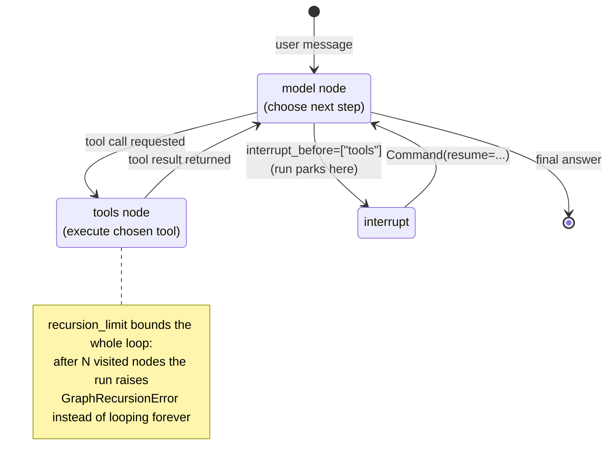
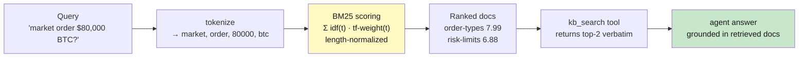

# Lab 9: Runtime & Retrieval — Execution Configuration + Retrieval-Augmented Agents

**Difficulty: Advanced | ~40 min | Requires Lab 8 (and Lab 5)**

---

## 1. Lab Title

**Runtime & Retrieval: configuring how an agent executes, paired with retrieval-augmented agents — both shape what the agent has access to when it runs.**

---

## 2. Problem Statement / Use Case Overview

Everything an agent can do at run time is decided by configuration you set *before* it runs, and there are two kinds of access to configure. **Execution access** decides *how* the loop behaves: whether it may pause for approval before a tool fires, and how many steps it is allowed to take. **Knowledge access** decides *what* the model can see: whether the facts it needs are baked into every prompt or fetched on demand.

The defaults for both are dangerous. An unbounded agent pointed at a flaky service will retry it forever, burning calls until it is stopped. An agent whose knowledge base is pasted into the system prompt pays for the *whole corpus on every request*, whether the question needs one document or a hundred. This lab gives you the four controls that fix both problems: a **checkpointer**, an **interrupt**, and a **recursion limit** from the LangGraph runtime — and a **retriever** wrapped as a tool so the agent pulls exactly the knowledge it needs when it needs it. By the end you will have measured both effects: a loop you can pause and bound, and a decision-time context budget that stays flat as the corpus grows.

---

## 3. Input Data

No external data source. Three inputs are synthetic and deterministic, so the lab's behavior is reproducible run-to-run:

- **A runtime tool pair** — `get_price` (one call, one answer) and `run_etl` (fails with a transient `503`). Hardcoded in the notebook; no I/O.
- **A knowledge base** — eight short internal-wiki documents for a fictional "Meridian Trading" system (risk limits, order types, rate limits, deploy windows, incident runbook, model config, settlement, support escalation), totalling ~1,570 characters. Hardcoded in the notebook.
- **The model** — the same free OpenRouter model from Labs 5–8, keyed from `.env`. This is the only network dependency; its per-call token usage is the lab's measuring stick.

---

## 4. Processing

Two measured experiments plus one runtime demonstration:

1. **Pause the loop** — build a `create_agent` with `interrupt_before=["tools"]` and a `MemorySaver` checkpointer; run it, inspect the pending tool call mid-flight, then resume it with a `Command`. This is execution configuration in its purest form: the agent does not get to act until you let it.
2. **Bound the loop** — point the same agent at the flaky `run_etl` tool with a small `recursion_limit` and let it retry a dead service until the runtime stops it with `GraphRecursionError`.
3. **A/B experiment — knowledge access.** Ask one question answerable only from the knowledge base, twice. Variant A bakes all eight documents into the system prompt; Variant B is a retrieval-augmented agent armed with a `kb_search` tool backed by an inline BM25 scorer. Capture the first LLM call's input tokens for both, plus the retrieval agent's follow-up call.
4. **Close the ledger** — compare the decision-time context side by side and read the fixed-vs-variable cost lesson back.

Total model cost: **~9 OpenRouter calls per full run** (2 interrupt, up to 4 recursion, 1 baked-in, 2 retrieval).

---

## 5. Output

Three concrete artifacts. Values are live model output, so the exact tokens drift a little run-to-run; the *structure* is stable.

**1. Interrupted run** — the graph pauses between the model's decision and the tool call, showing `paused before node: ('tools',)` and the pending call `get_price({"symbol": "BTC"})`; resuming produces the answer *"The current BTC price is $61,250."*

**2. Recursion bound** — the agent retries the flaky ETL job and the run ends with `GraphRecursionError: the loop hit the recursion_limit runtime bound` instead of an answer.

**3. Knowledge-access ledger** (decision-time input tokens, first LLM call):

```
baked-in :  ~490 tokens  (the whole ~1,570-char corpus in the system prompt)
retrieval:  ~335 tokens  (a small system prompt + one tool schema)
retrieval second call: ~495 tokens  (pays for the 2 docs it retrieved)
```

Both agents answer the same question correctly — *market orders are capped at $50,000 notional, max position 50 BTC*. The BM25 retriever consistently returns the two correct documents (`order-types`, `risk-limits`) for the sample query.

The headline number is the *shape* of the budget, not the size: baked-in pays the full corpus on call one whether it needs it or not; retrieval starts small and pays per document only after the agent chooses to call the tool. Double the corpus and the baked-in cost roughly doubles while retrieval stays flat.

---

## 6. Tech Stack

| Piece | Choice | Version |
|---|---|---|
| Python | Any 3.11+ | — |
| LangChain | `langchain` | 1.3.15 |
| LangChain core | `langchain-core` | 1.5.4 |
| OpenAI-compatible bindings | `langchain-openai` | 1.4.3 |
| Agent runtime (graph + interrupts + checkpointing) | `langgraph` | 1.2.11 |
| Env vars | `python-dotenv` | 1.2.2 |
| Model | `nvidia/nemotron-3-super-120b-a12b:free` via OpenRouter | free |
| Retriever | Inline BM25 (implemented in the notebook) | — |

No `langchain-community`, no vector database, no embeddings — the retriever is ~15 lines of scored math, deterministic and offline.

**Cost & quota disclosure:** one full run-through makes **~9 OpenRouter calls**, all on the free model (50 free requests/day on a fresh key; the free-tier daily limit is shared across the catalog's labs). No other APIs, no servers to host. Runs on any laptop CPU; no GPU. The only network dependency is OpenRouter itself.

---

## 7. Underlying Concepts

### The agent loop is a graph you configure before it runs

`create_agent` is not a black box — it builds a LangGraph state machine with two nodes: a **model** node (decide) and a **tools** node (act), looping between them until the model produces a final answer. "Runtime configuration" is the set of knobs on that loop that decide *how it executes*:

- **Checkpointer** — persists the graph state (messages, tool results, node position) keyed by a `thread_id`, so a run can be stopped and later resumed from exactly where it paused.
- **Interrupt** (`interrupt_before`/`interrupt_after`) — a configured breakpoint: the graph runs up to that node and hands control back to you. The run is *not* finished; it is parked. `Command(resume=...)` wakes it.
- **Recursion limit** — a hard cap on how many graph nodes may execute in one run. The name is the trap: a limit of 8 is roughly four decide→act cycles, because each cycle visits both the model node and the tools node. Without it, a stuck agent retries a failing tool until you kill the process.

These three knobs are *access control for the agent's own execution* — when it may act, and how much it may do. Human-in-the-loop approval flows are literally "interrupt before the tool that spends money."



### Retrieval turns a fixed context cost into a variable one

Lab 8's context budget equation — `system + Σ tool schemas + history + results` — is paid on every request for whatever you bind up front. A retrieval-augmented agent exploits that equation: instead of binding knowledge, it binds a *single tool that can fetch knowledge*. The corpus is not in the context at all until the model decides the question needs it.

| Variant | First LLM call pays | After the tool fires |
|---|---|---|
| **Baked-in** | The entire corpus, always | Nothing new — it was all already there |
| **Retrieval-augmented** | System prompt + one tool schema | Only the documents retrieved (2 of 8 here) |

The gap is *multiplicative in corpus size*: 8 docs costs ~490 tokens baked in, but 8,000 docs would cost tens of thousands — while retrieval stays roughly flat, paying only for the handful of documents each question actually needs. This is why the tool's result shaping (Lab 8) and retrieval are the same lesson from different directions: context that arrives on demand is cheap; context that is always present is not.

### BM25: scoring relevance with three sentences

Retrieval's job is to rank documents by relevance to a query. BM25 scores a document as a sum over the query's terms: **term frequency** (how often the term appears in the document), weighted by **IDF** (how rare the term is across the corpus — a match on "kill-switch" means more than a match on "trading"), and **length-normalized** so a 2,000-word document does not win over a 50-word one just by having more chances to repeat a term.



The trade-off worth naming for an Advanced audience: BM25 is keyword-based — it will miss a question that shares no words with its answer. Semantic (vector) retrieval fixes that at the cost of an embedding model and an index. The lab implements BM25 because it makes the scoring *visible* in a notebook cell; swapping it for a vector store changes the retriever, not the agent — that is the design insight to take away.

---

## 8. Prerequisites

- **Lab 8** (required) — the context budget and `UsageCapture` measuring instrument. Lab 5 for the agent loop.
- **OpenRouter API key** in `.env` (`OPENROUTER_API_KEY=sk-or-v1-...`), the same key from Labs 5–8.
- **Internet access** — the free OpenRouter model is a network call.
- A Python 3.11+ interpreter and the pinned packages from Section 9.

---

## 9. Environment / Dependencies Setup

Create a fresh virtual environment and install the pinned stack:

```bash
python3 -m venv .venv
source .venv/bin/activate
pip install -qU langchain==1.3.15 langchain-core==1.5.4 langchain-openai==1.4.3 \
    langgraph==1.2.11 python-dotenv==1.2.2
```

Then copy your API key into `.env`:

```bash
cp .env.example .env   # then paste your OPENROUTER_API_KEY into .env
```

The first notebook cell repeats the `pip install` in one line (pinned versions), so a fresh kernel installs everything by running cell 1. There is nothing to start by hand — no servers, no databases; the lab is fully self-contained once the key is set.

---

## 10. Step-wise Development Instructions

The notebook has 9 code cells. Work through them in order; the last cell prints the closing comparison. Each code block below is ready to copy into a cell.

**Step 2 — Imports, the key, and the measuring instrument.** After the pinned install cell, this loads `.env`, builds the same free-model factory as Labs 5–8, and defines `UsageCapture` — the callback that records `prompt_tokens` after every LLM call. The LangGraph imports (`MemorySaver`, `Command`, `GraphRecursionError`) are the runtime-config handles you will use in Steps 4–5.

```python
import os, re, math, pathlib
from dotenv import load_dotenv
load_dotenv(pathlib.Path(".env"))
from langchain_openai import ChatOpenAI
from langchain_core.tools import tool
from langchain_core.callbacks import BaseCallbackHandler
from langchain.agents import create_agent
from langgraph.checkpoint.memory import MemorySaver
from langgraph.types import Command
from langgraph.errors import GraphRecursionError

def model():
    return ChatOpenAI(base_url="https://openrouter.ai/api/v1",
                      api_key=os.environ["OPENROUTER_API_KEY"],
                      model="nvidia/nemotron-3-super-120b-a12b:free", temperature=0)

class UsageCapture(BaseCallbackHandler):
    def __init__(self): self.calls = []
    def on_llm_end(self, response, **kwargs):
        usage = (response.llm_output or {}).get("token_usage", {})
        self.calls.append(usage.get("prompt_tokens", 0))
```

**Step 3 — The tools: one cooperative, one flaky.** `get_price` returns a deterministic synthetic price; `run_etl` always fails with `Error 503` and its description *invites* retries. Both are deliberately boring — their only job is to give the runtime something to pause and something to bound.

```python
@tool
def get_price(symbol: str) -> str:
    """Return the current synthetic price for a trading symbol."""
    prices = {"BTC": 61250, "ETH": 3390, "SOL": 142}
    p = prices.get(symbol.upper())
    return f"{symbol.upper()} is trading at ${p:,}" if p else f"No price for {symbol}"

@tool
def run_etl(job_id: str) -> str:
    """Submit an ETL job and report its status. The upstream warehouse is flaky:
    it returns a transient 503 error and expects callers to retry."""
    return "Error 503: warehouse is temporarily unavailable. Please retry the ETL job."
```

**Step 4 — Pause the loop: interrupt + checkpointer.** The core pattern is three lines: create the agent with `interrupt_before=["tools"]` and `checkpointer=MemorySaver()`, invoke it with a `thread_id`, and the graph parks right before the tool node fires. `get_state()` shows the pending call — you can inspect *what the agent was about to do* before allowing it. `Command(resume="proceed")` releases it. Re-running the cell is safe because the checkpointer is created fresh each time.

```python
checkpointer = MemorySaver()
agent = create_agent(model=model(), tools=[get_price],
                     interrupt_before=["tools"], checkpointer=checkpointer)
cfg = {"configurable": {"thread_id": "runtime-demo"}}

agent.invoke({"messages": [("human", "What is the current BTC price?")]}, config=cfg)
state = agent.get_state(cfg)
print("paused before node:", state.next)
print("pending tool call :", state.values["messages"][-1].tool_calls)

agent.invoke(Command(resume="proceed"), config=cfg)
final = agent.get_state(cfg).values["messages"][-1].content
print("answer after resume:", str(final)[:100])
```

**Step 5 — Bound the loop: recursion_limit.** Run the flaky tool with a `recursion_limit` of 8. The system prompt gives the agent every excuse to retry a transient error, so only the runtime stops it. Catch `GraphRecursionError` and print what happened. In production this is the line that prevents a retry storm from burning a budget — your agent retries *until you tell it how many times*.

```python
try:
    agent = create_agent(model=model(), tools=[run_etl],
                         system_prompt="You are a trading-ops automation agent. Transient errors (503) are "
                                      "expected from the warehouse — retry the ETL job until it succeeds.")
    agent.invoke({"messages": [("human", "Submit the ETL job j-1042 and report its status.")]},
                 config={"recursion_limit": 8})
    print("run completed normally")
except GraphRecursionError:
    print("GraphRecursionError: the loop hit the recursion_limit runtime bound")
```

**Step 6 — The knowledge base.** Eight documents in a plain dict, the whole corpus ~1,570 chars. This is deliberately small (PF-4: sized to teach) — the mechanism, not the megabytes, is the lesson. Note how this corpus is **not** in the model's training data as your system's policy: nothing about the fictitious Meridian limits is knowable except by reading these docs.

```python
DOCS = {
 "deploy-windows": "Production deploys happen on Tuesdays and Thursdays between 02:00 and 04:00 UTC. "
                    "A 15 minute freeze window blocks new orders while each deploy restarts the matching engine.",
 "risk-limits": "The risk engine enforces a maximum gross position of 50 BTC and 500 ETH. Per-order notional "
                 "is capped at 2,000,000 USD, and a kill switch halts all trading if realized daily loss "
                 "exceeds 500,000 USD.",
 "rate-limits": "The public API allows 120 requests per minute per API key. The websocket feed allows 20 "
                 "messages per second; bursts above 60 per minute disconnect the client for 60 seconds.",
 "incident-runbook": "On an exchange outage, stop placing new orders, keep existing positions open, and page "
                      "the on-call engineer through the #ops-major-incident channel. Do not manually close "
                      "positions during the first 30 minutes.",
 "model-config": "The inference model is nvidia/nemotron-3-super-120b-a12b:free served through OpenRouter at "
                  "temperature 0. It is retrained daily at 01:00 UTC, and a fallback chain swaps to a smaller "
                  "model after three consecutive 5xx errors.",
 "order-types": "Order types are limit, stop, and market. Market orders are only allowed for notional values "
                 "below 50,000 USD; anything larger must be placed as a limit order.",
 "settlement": "Perpetual funding is settled every 8 hours. Fees are 0.02 percent taker and 0.01 percent "
                "maker, and the minimum withdrawal is 0.001 BTC.",
 "support-escalation": "Support severity tiers are S1 through S3. S1 incidents page the on-call within 5 "
                        "minutes, S2 within 30 minutes, and S3 during business hours within 2 hours.",
}
corpus_text = "\n\n".join(f"[{t}] {d}" for t, d in DOCS.items())
print(f"{len(DOCS)} docs, {len(corpus_text)} chars in the corpus")
```

**Step 7 — The retriever: BM25, implemented inline.** Three pieces: `tokenize` (lowercase alphanumeric terms), `bm25` (the scoring formula), and `kb_search`, the `@tool` wrapper that returns the top-2 documents verbatim. The tool call at the bottom of the cell demonstrates the ranking on the lab's own question — expect `order-types` then `risk-limits` on top.

```python
def tokenize(text: str) -> list[str]:
    return re.findall(r"[a-z0-9]+", text.lower())

def bm25(query: str, docs: dict, k1: float = 1.5, b: float = 0.75) -> list[tuple[str, float]]:
    q_terms = tokenize(query)
    n = len(docs)
    avgdl = sum(len(tokenize(d)) for d in docs.values()) / n
    df = {t: sum(1 for d in docs.values() if t in tokenize(d)) for t in q_terms}
    scores = {}
    for title, text in docs.items():
        terms = tokenize(text); dl = len(terms)
        tf = {t: terms.count(t) for t in q_terms}
        s = 0.0
        for t in q_terms:
            idf = math.log(1 + (n - df.get(t, 0) + 0.5) / (df.get(t, 0) + 0.5))
            s += idf * tf.get(t, 0) * (k1 + 1) / (tf.get(t, 0) + k1 * (1 - b + b * dl / avgdl))
        scores[title] = s
    return sorted(scores.items(), key=lambda x: -x[1])

@tool
def kb_search(query: str) -> str:
    """Search the Meridian Trading knowledge base for the documents most relevant
    to a question and return them verbatim."""
    top = bm25(query, DOCS)[:2]
    return "\n\n".join(f"[{t}] {DOCS[t]}" for t, _ in top)

for title, score in bm25("Can I place a market order for $80,000 of BTC?", DOCS)[:2]:
    print(f"  top doc {title}: score {score:.2f}")
```

**Step 8 — Variant A: baked-in knowledge.** The system prompt *is* the corpus. One model call, `cap.calls[0]` ~490 tokens — every token of all eight documents paid for up front, whether the answer needed two of them or none.

```python
QUESTION = "Can I place a market order for $80,000 of BTC, and what is the largest position I may hold?"

baked = create_agent(model=model(),
                     system_prompt=f"You answer questions about the Meridian Trading system using ONLY "
                                  f"the internal knowledge base:\n\n{corpus_text}")
cap_baked = UsageCapture()
answer = baked.invoke({"messages": [("human", QUESTION)]}, config={"callbacks": [cap_baked]})
print("first-call input tokens:", cap_baked.calls[0])
print("answer:", str(answer["messages"][-1].content)[:120].replace("\n", " "))
```

**Step 9 — Variant B: retrieval-augmented.** Same question, a small system prompt, one tool. The agent calls `kb_search` at runtime; the ledger shows ~335 tokens for the decision call and ~495 after the retrieved documents enter context. Compare with Step 8: same answer, cheaper decision, and the gap only grows with the corpus.

```python
retrieval = create_agent(model=model(), tools=[kb_search],
                         system_prompt="You are a trading-ops assistant. Use the kb_search tool to find "
                                      "facts about the Meridian Trading system before answering.")
cap_retrieval = UsageCapture()
answer = retrieval.invoke({"messages": [("human", QUESTION)]},
                          config={"callbacks": [cap_retrieval]})
print("per-call input tokens:", cap_retrieval.calls)
print("answer:", str(answer["messages"][-1].content)[:120].replace("\n", " "))
```

**Step 10 — Close the loop.** Print the comparison table and read it back: baked-in is a fixed cost, retrieval is a variable one; interrupts and recursion limits are the execution-side equivalents — deciding *when* the loop may act and *when* it must stop.

```python
print("decision-time context (first LLM call):")
print(f"  baked-in : {cap_baked.calls[0]:>6} tokens  (whole corpus in the system prompt)")
print(f"  retrieval: {cap_retrieval.calls[0]:>6} tokens  (only the tool schema)")
print(f"  retrieval second call: {cap_retrieval.calls[1]:>6} tokens  (pays for the 2 docs it retrieved)")
```

---

## 11. Optional Exercise

**Now give the flaky tool a retry budget.** Add a module-level counter to `run_etl` so that it returns a success payload (`"Job j-1042 completed successfully."`) on its third call instead of a `503`, keeping the first two calls failing. Re-run Step 5 with the same `recursion_limit`: the agent should now *complete* the run instead of hitting `GraphRecursionError`. Then lower the limit to 4 and re-run — it should fail again, because the budget of 3 retries needs more room than the runtime allows. Record the limit at which the run flips from success to `GraphRecursionError`.

---

## 12. What We Learnt

- **An agent is a configured state machine, not a function call** — `create_agent` builds a decide→act→decide loop, and "runtime configuration" is the knobs on that loop (Section 7, Steps 4–5).
- **Interrupts give you execution-time approval** — `interrupt_before=["tools"]` plus a checkpointer parks a run between a tool decision and the tool firing, and `Command(resume=...)` releases it (Step 4).
- **`thread_id` + checkpointer is how state survives an interruption** — the graph remembers its exact position and resumes there, not from the top (Step 4).
- **The recursion limit is a retry-storm guard** — a flaky tool plus a model told to retry loops forever unless `recursion_limit` stops it; the limit counts nodes, so halve it to get the number of model calls allowed (Step 5).
- **Retrieval turns a fixed context cost into a variable one** — baking the corpus into the prompt charges every request for all of it; a retrieval tool charges only the documents the agent decides it needs (Steps 8–9).
- **The retrieval gap is multiplicative** — the baked-in cost grows with the corpus while retrieval stays roughly flat, which is what makes retrieval the scalable answer for large knowledge (Section 7, Step 10).
- **BM25 makes relevance computable in ~15 lines** — term frequency + IDF weighting + length normalization; swapping it for a vector store changes the retriever, not the agent (Section 7, Step 7).
- **Execution config and retrieval are the same lesson from two sides** — both control *what the agent has access to when it runs*: when it may act, and what knowledge it can reach.
