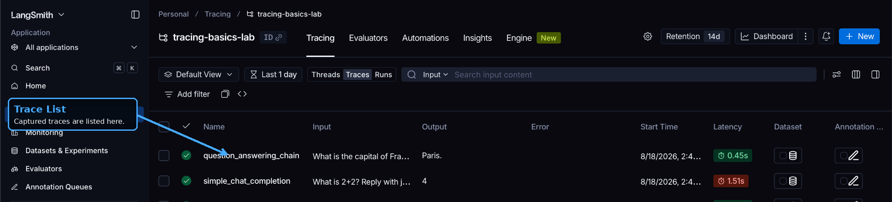
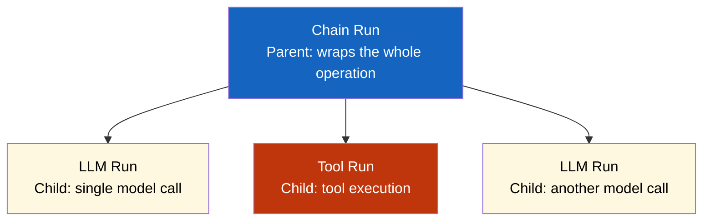

# Lab 1: Tracing Basics & Types of Runs

## Difficulty: Beginner | ~30 min | No prerequisites

---

### What is Tracing?

Tracing records every step your code takes — LLM calls, tool executions, chains — and sends them to LangSmith where you can search, filter, and analyze them. Instead of guessing why your app is slow or broken, you see exactly what happened, when, and how long it took.

### What is a Run?

A **run** is a single unit of work inside a trace — one function call, one LLM request, one tool execution. Every run captures:

- **Input**: what you passed in
- **Output**: what came back
- **Latency**: how long it took
- **Tokens**: how many tokens were consumed (for LLM calls)
- **Status**: success or error

When runs call other runs (a function calls an LLM, which calls a tool), they form a **trace** — a tree of related runs. The top-level run is the **root**, and everything it calls are **children**.

### Run Types

Run types classify what each run does:

| Type | What it captures |
|------|------------------|
| `llm` | Model input/output, tokens, latency |
| `chain` | Wrapping operation containing child runs |
| `tool` | Tool/function execution |
| `retriever` | Document retrieval for RAG |
| `embedding` | Vector embedding generation |
| `prompt` | Prompt template rendering |
| `parser` | Output parsing (JSON, etc.) |

Every LangSmith trace is built from these run types. This lab focuses on `llm` and `chain` — the foundation the rest build on.

---

## 1. Problem Statement / Use Case Overview

When building AI applications with LangChain, you need visibility into what's happening under the hood. LangSmith provides tracing — a way to record every step your code takes, from LLM calls to tool executions. Without tracing, debugging is guesswork. With it, you can see exactly where things slow down, where tokens are spent, and where errors occur.

This lab teaches you how to instrument your code with LangSmith's `@traceable` decorator, understand the anatomy of a trace, and recognize the different run types LangSmith captures. You'll build a baseline trace that becomes the reference point for every future LangChain lab.

---

## 2. Input Data

No external datasets are required. We'll use:

- A simple chat completion call via OpenRouter's free model
- LangSmith's tracing API to record execution
- The LangSmith UI to inspect results

The lab is self-contained — you provide your OpenRouter and LangSmith API keys, and everything else is built from scratch.

---

## 3. Processing

The processing pipeline is straightforward:

1. **Configure** LangSmith SDK with your API credentials
2. **Create** a simple function that calls a chat model via OpenRouter
3. **Decorate** it with `@traceable` to enable tracing
4. **Run** the function and observe the trace in LangSmith UI
5. **Extend** by wrapping the call in a chain and tracing that too

Each step is isolated in its own cell so you can run and inspect incrementally.

---

## 4. Output

When this lab works, you'll see:

- A successful chat completion response printed to the console
- A trace entry appear in your LangSmith dashboard (within seconds)
- The trace showing the `llm` run type with latency, token count, and cost
- A nested trace when you run through the chain, showing `chain` wrapping `llm`

You'll know it worked when the LangSmith UI shows your trace with the correct run type labels.

### Trace List View

Your LangSmith dashboard should show traces like this:



Each row is a trace — you'll see `simple_chat_completion` (direct LLM call) and `question_answering_chain` (chain wrapping LLM) with their inputs, outputs, and latency.

### Trace Detail View

Click into the chain trace to see the nested hierarchy:


The `question_answering_chain` trace shows a parent `chain` run containing a child `llm` run — this is the run tree hierarchy in action.

---

## 5. Tech Stack

- **Python 3.10+**
- **LangSmith SDK** `langsmith>=0.1.0` — for configuring tracing
- **OpenAI SDK** `openai>=1.0.0` — for the LLM calls (OpenRouter is OpenAI-compatible)
- **dotenv** `python-dotenv>=1.0.0` — for loading API keys from `.env`
- **Model**: `nvidia/nemotron-3-super-120b-a12b:free` (free Nemotron model on OpenRouter)
- **LangSmith account** — free tier works for this lab

Cost: $0 — using OpenRouter's free tier.

---

## 6. Underlying Concepts

### What is Tracing?

Tracing is the process of recording every significant step your code takes. In LangSmith, a **trace** is a collection of **runs** — individual operations like calling an LLM, executing a tool, or running a chain. Traces are automatically sent to LangSmith's servers, where you can search, filter, and analyze them.

### The Run Tree Hierarchy

Every trace follows a parent-child structure:



The **chain run** is the parent — it represents the overall operation. Inside it, individual **LLM runs**, **tool runs**, and other operations are children. This hierarchy lets you see the full picture: which LLM call took the longest, which tool failed, and where time was spent.

### Run Types

LangSmith recognizes these run types:

| Type | What it captures | When you see it |
|------|------------------|-----------------|
| `llm` | Model input/output, tokens, latency | Every OpenAI/Anthropic call |
| `chain` | Wrapping operation, duration | When you wrap multiple steps |
| `tool` | Tool execution, input/output | Custom tools or function calling |
| `retriever` | Document retrieval, query/results | RAG pipelines |
| `embedding` | Embedding generation | Vector embedding calls |
| `prompt` | Prompt formatting | Template rendering |
| `parser` | Output parsing | JSON extraction, etc. |

### The @traceable Decorator

The `@traceable` decorator is the simplest way to add tracing to any Python function. When you decorate a function, LangSmith automatically:

- Records the function name and inputs
- Measures execution time
- Captures outputs and errors
- Groups runs into traces for related operations

---

## 7. Prerequisites

- Python 3.10 or higher installed
- An OpenRouter account with an API key (free tier works)
- A LangSmith account (free tier works) with an API key
- Basic Python knowledge (functions, decorators)

---

## 8. Environment / Dependencies Setup

### Step 1: Get Your OpenRouter API Key (Free)

1. Go to https://openrouter.ai/
2. Click **"Sign In"** in the top right
3. Sign in with Google, GitHub, or email
4. Once logged in, click your **profile icon** → **"Keys"** (or go to https://openrouter.ai/keys)
5. Click **"Create Key"**
6. Give it a name like `langsmith-lab`
7. Copy the key (starts with `sk-or-v1-...`)
8. **Save it** — you'll only see it once

### Step 2: Get Your LangSmith API Key (Free)

1. Go to https://smith.langchain.com/
2. Click **"Sign In"** in the top right
3. Sign in with Google, GitHub, or email
4. Once logged in, you'll see the LangSmith dashboard
5. Click **"Settings"** in the left sidebar (gear icon)
6. Click **"API Keys"** tab
7. Click **"Create API Key"**
8. Give it a name like `tracing-basics-lab`
9. Copy the key (starts with `ls-...`)
10. **Save it** — you'll only see it once

### Step 3: Create a LangSmith Project

1. In the LangSmith dashboard, click **"Tracing"** in the left sidebar
2. Click **"New Project"** (or the **"+"** button near the project list)
3. Name it `tracing-basics-lab`
4. Click **"Create"**
5. You'll see an empty project — traces will appear here after you run the lab

### Step 4: Create a `.env` File

Create a `.env` file in your project root with your keys:

```
OPENROUTER_API_KEY=sk-or-v1-your-openrouter-key-here
LANGSMITH_API_KEY=ls-your-langsmith-key-here
LANGSMITH_TRACING=true
LANGSMITH_PROJECT="tracing-basics-lab"
```

Replace the placeholder values with your actual keys from Steps 1 and 2.

### Step 5: Install Dependencies

```bash
pip install langsmith>=0.1.0 openai>=1.0.0 python-dotenv>=1.0.0
```

### Step 6: Verify Setup

Before running the lab, verify everything works:

```bash
python -c "
import os
from dotenv import load_dotenv
load_dotenv()
print('OpenRouter key:', '✓' if os.getenv('OPENROUTER_API_KEY') else '✗ Missing')
print('LangSmith key:', '✓' if os.getenv('LANGSMITH_API_KEY') else '✗ Missing')
print('Tracing:', '✓' if os.getenv('LANGSMITH_TRACING') == 'true' else '✗ Missing')
print('Project:', os.getenv('LANGSMITH_PROJECT', '✗ Missing'))
"
```

All four lines should show ✓. If any show ✗, check your `.env` file.

---

## 9. Step-wise Development Instructions

### Cell 1: Install Dependencies

```python
!pip install langsmith>=0.1.0 openai>=1.0.0 python-dotenv>=1.0.0
```

This installs the exact versions of every library used in this lab.

---

### Cell 2: Load Environment Variables

```python
import os
from dotenv import load_dotenv

# Load API keys from .env file
load_dotenv()

# Verify keys are set
assert os.getenv("OPENROUTER_API_KEY"), "Missing OPENROUTER_API_KEY in .env"
assert os.getenv("LANGSMITH_API_KEY"), "Missing LANGSMITH_API_KEY in .env"
assert os.getenv("LANGSMITH_TRACING") == "true", "Missing LANGSMITH_TRACING=true in .env"

print("✓ All environment variables loaded successfully")
```

This loads your API keys from the `.env` file and verifies they're present. The `LANGSMITH_TRACING=true` variable tells the SDK to send traces to LangSmith.

---

### Cell 3: Import LangSmith and Configure Client

```python
from langsmith import traceable, Client

# Initialize the LangSmith client
ls_client = Client()

# Verify connection
print(f"✓ LangSmith client initialized")
print(f"  Project: {os.getenv('LANGSMITH_PROJECT')}")
print(f"  Tracing: {os.getenv('LANGSMITH_TRACING')}")
```

The LangSmith client connects to LangSmith's servers. This is what sends your traces automatically when you use `@traceable`.

---

### Cell 4: Import OpenAI Client for OpenRouter

```python
from openai import OpenAI

# Initialize OpenAI client pointing to OpenRouter
# OpenRouter is OpenAI-compatible, so we just change the base_url
openai_client = OpenAI(
    base_url="https://openrouter.ai/api/v1",
    api_key=os.getenv("OPENROUTER_API_KEY")
)

print("✓ OpenRouter client initialized (via OpenAI SDK)")
```

We use OpenAI's SDK but point it to OpenRouter's endpoint. OpenRouter is OpenAI-compatible, so the same client works — we just change the `base_url` and `api_key`.

---

### Cell 5: Create a Traced Function (Direct Call)

```python
@traceable(run_type="llm", name="simple_chat_completion")
def simple_chat(user_message: str) -> str:
    """Call chat model via OpenRouter with a single message."""
    response = openai_client.chat.completions.create(
        model="nvidia/nemotron-3-super-120b-a12b:free",  # Free Nemotron model on OpenRouter
        messages=[{"role": "user", "content": user_message}]
    )
    return response.choices[0].message.content
```

This function calls a chat model via OpenRouter. The `@traceable` decorator records the input (`user_message`) and output (the response). We set `run_type="llm"` to mark this as an LLM operation.

---

### Cell 6: Run the Traced Function

```python
# Call the function
response = simple_chat("What is 2+2? Reply with just the number.")

print(f"Response: {response}")
```

When you run this cell, LangSmith records a trace with a single `llm` run. The trace includes the input message, the response, latency, and token counts.

---

### Cell 7: Inspect the Trace in LangSmith UI

```python
# List recent traces to verify
traces = list(ls_client.list_runs(
    project_name=os.getenv("LANGSMITH_PROJECT"),
    is_root=True,
    limit=5
))

print(f"✓ Found {len(traces)} recent trace(s)")
for trace in traces:
    print(f"  - {trace.name} ({trace.run_type}) - {trace.status}")
```

This queries LangSmith for your recent traces. You should see your `simple_chat_completion` run with `run_type="llm"` and `status="success"`.

---

### Cell 8: Create a Wrapper Chain

```python
@traceable(run_type="chain", name="question_answering_chain")
def question_answerer(question: str) -> str:
    """A simple chain that wraps an LLM call."""
    # Add system context
    prompt = f"Answer this question concisely: {question}"
    
    # Call the LLM
    answer = simple_chat(prompt)
    
    return answer
```

This creates a **chain run** that wraps the LLM call. When you run this, you'll see a parent `chain` run with a child `llm` run inside it — this is the run tree hierarchy in action.

---

### Cell 9: Run the Wrapper Chain

```python
# Call the wrapper chain
response = question_answerer("What is the capital of France?")

print(f"Response: {response}")
```

When you run this, LangSmith records a trace with a `chain` run containing an `llm` child run. Check the LangSmith UI to see the nested structure.

---

### Cell 10: Compare Both Traces

```python
# List all traces to see both calls
traces = list(ls_client.list_runs(
    project_name=os.getenv("LANGSMITH_PROJECT"),
    is_root=True,
    limit=10
))

print(f"✓ Found {len(traces)} trace(s)")
for i, trace in enumerate(traces, 1):
    print(f"\n  Trace {i}: {trace.name}")
    print(f"    Type: {trace.run_type}")
    print(f"    Status: {trace.status}")
    print(f"    Latency: {trace.total_tokens or 'N/A'} tokens")
```

This shows all your traces side by side. The first has a single `llm` run; the second has a `chain` parent with `llm` child. This is exactly the baseline trace you'll compare against in future labs.

---

## 10. Optional Exercise

**Swap the model from `nvidia/nemotron-3-super-120b-a12b:free` to `meta-llama/llama-4-scout:free`** and run both the direct call and the wrapper chain again. Compare the traces in LangSmith UI — notice how the token counts and latency change. Update the `simple_chat` function's model parameter and re-run all cells.

---

## 11. What We Learnt

- **LangSmith tracing** provides visibility into every step of your AI application
- **The `@traceable` decorator** is the simplest way to add tracing to any function
- **Run types** classify operations: `llm` for model calls, `chain` for wrapping operations, `tool` for tool executions, `retriever` for document retrieval, `embedding` for vector generation, `prompt` for template rendering, `parser` for output parsing
- **The run tree hierarchy** shows parent-child relationships: chains contain LLM calls, tools, and other operations
- **Traces are automatic** — once decorated, LangSmith records inputs, outputs, latency, tokens, and costs without extra code
- **OpenRouter's free models** let you experiment without API costs — just sign up and get a key
- **The baseline trace** from this lab becomes the reference point for comparing every future LangChain lab's agent behavior
