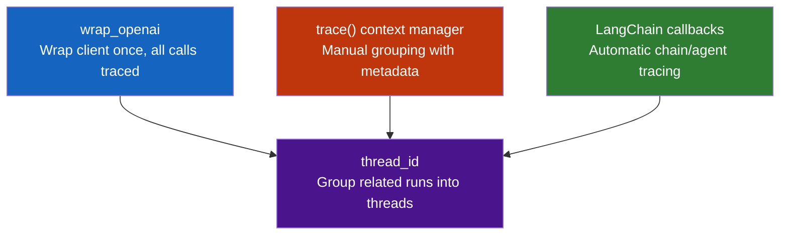

# Lab 2: Alternative Ways to Trace & Conversational Threads

## Difficulty: Beginner | ~35 min | Requires Lab 1

---

## 1. Problem Statement / Use Case Overview

LangSmith offers multiple ways to trace your code, and each method suits a different scenario. The `@traceable` decorator from Lab 1 works well for simple functions, but what if you want to trace an OpenAI client directly, control exactly which operations are grouped, or trace an entire LangChain chain automatically?

This lab teaches you three alternative tracing mechanisms — `wrap_openai`, the `trace()` context manager, and LangChain's callback tracer — and shows how to use `thread_id` metadata to group multi-turn conversations into a single thread in the LangSmith dashboard.

---

## 2. Input Data

No external datasets are required. We'll use:

- Simple chat completion calls via OpenRouter's free model
- The LangSmith SDK's tracing utilities
- LangChain's built-in tracing system

The lab is self-contained — you provide your OpenRouter and LangSmith API keys, and everything else is built from scratch.

---

## 3. Processing

The processing pipeline covers three tracing mechanisms and one metadata pattern:

1. **wrap_openai** — wrap an OpenAI client and make traced calls through it
2. **trace() context manager** — manually group operations into a trace
3. **LangChain callbacks** — trace a full chain with tool calls automatically
4. **thread_id** — tag multiple turns with the same thread ID to group them

Each mechanism is isolated in its own cells so you can run and inspect incrementally.

---

## 4. Output

When this lab works, you'll see:

- Three different trace entries in your LangSmith dashboard, each created by a different mechanism
- The `wrap_openai` trace showing an `llm` run with token counts and latency
- The `trace()` context manager trace showing a `chain` run containing an `llm` child
- The LangChain trace showing a chain with `llm` and `tool` child runs
- Multiple turns grouped under a single `thread_id`, appearing as one conversation thread

You'll know it worked when the LangSmith UI shows traces from all three mechanisms and the thread_id turns are grouped together.

---

## 5. Tech Stack

- **Python 3.10+**
- **LangSmith SDK** `langsmith>=0.1.0` — for `wrap_openai`, `trace()`, and `Client`
- **OpenAI SDK** `openai>=1.0.0` — for the LLM calls (OpenRouter is OpenAI-compatible)
- **LangChain** `langchain>=0.2.0` — for chain tracing and callbacks
- **LangChain Core** `langchain-core>=0.2.0` — for `@traceable` and callback support
- **LangChain OpenAI** `langchain-openai>=0.1.0` — for ChatOpenAI integration
- **dotenv** `python-dotenv>=1.0.0` — for loading API keys from `.env`
- **Model**: `nvidia/nemotron-3-super-120b-a12b:free` (free Nemotron model on OpenRouter)
- **LangSmith account** — free tier works for this lab

Cost: $0 — using OpenRouter's free tier.

---

## 6. Underlying Concepts

### Three Ways to Trace

LangSmith gives you three mechanisms to send traces, each suited to a different scenario:



**wrap_openai** is ideal when you're using the OpenAI SDK directly — you wrap the client once and every `client.chat.completions.create()` call is traced automatically. No decorator needed on each function.

- **Use when:** You're making direct OpenAI/OpenRouter API calls and want zero-effort tracing across your entire codebase.
- **Avoid when:** You're not using the OpenAI SDK, or you need fine-grained control over which calls get traced.

**trace() context manager** is ideal when you need manual control — you decide exactly which operations go into a trace and can add custom metadata like `thread_id`. It's a `with` block that starts and ends a trace.

- **Use when:** You want to group multiple unrelated operations into one trace, add custom metadata, or trace non-OpenAI code.
- **Avoid when:** You want automatic tracing with no setup — `wrap_openai` or `@traceable` are simpler for those cases.

**LangChain callbacks** are ideal when you're using LangChain chains and agents — the callback system traces the full execution tree automatically, including tool calls and retriever lookups, without any extra code.

- **Use when:** You're building with LangChain chains, agents, or retrievers and want the full execution tree traced automatically.
- **Avoid when:** You're not using LangChain — the callback system won't help outside that ecosystem.

All three mechanisms can attach `thread_id` metadata to group related runs into a conversation thread.

### Thread ID and Conversational Threads

When building chat applications, you often need to see the full conversation history as one unit. By tagging each turn with the same `thread_id`, LangSmith groups those runs into a single thread in the dashboard — making it easy to follow multi-turn interactions.

---

## 7. Prerequisites

- Completed Lab 1 (Tracing Basics)
- Python 3.10 or higher installed
- An OpenRouter account with an API key (free tier works)
- A LangSmith account (free tier works) with an API key
- Basic Python knowledge (decorators, context managers)

---

## 8. Environment / Dependencies Setup

### Step 1: Get Your API Keys (if you don't have them yet)

If you completed Lab 1, you already have both keys. If not:

1. **OpenRouter** — go to https://openrouter.ai/keys, create a key (starts with `sk-or-v1-...`)
2. **LangSmith** — go to https://smith.langchain.com/settings, create an API key (starts with `ls-...`)

### Step 2: Create a LangSmith Project

1. In the LangSmith dashboard, click **"Tracing"** in the left sidebar
2. Click **"New Project"** (or the **"+"** button near the project list)
3. Name it `alternative-tracing-lab`
4. Click **"Create"**

### Step 3: Create a `.env` File

Create a `.env` file in your project root with your keys:

```
OPENROUTER_API_KEY=sk-or-v1-your-openrouter-key-here
LANGSMITH_API_KEY=ls-your-langsmith-key-here
LANGSMITH_TRACING=true
LANGSMITH_PROJECT="alternative-tracing-lab"
```

Replace the placeholder values with your actual keys.

### Step 4: Install Dependencies

```bash
pip install langsmith>=0.1.0 openai>=1.0.0 langchain>=0.2.0 langchain-core>=0.2.0 langchain-openai>=0.1.0 python-dotenv>=1.0.0
```

### Step 5: Verify Setup

Before running the lab, verify everything works:

```bash
python -c "
import os
from dotenv import load_dotenv
load_dotenv()
print('OpenRouter key:', '✓' if os.getenv('OPENROUTER_API_KEY') else '✗ Missing')
print('LangSmith key:', '✓' if os.getenv('LANGSMITH_API_KEY') else '✗ Missing')
print('Tracing:', '✓' if os.getenv('LANGSMITH_TRACING') == 'true' else '✗ Missing')
print('Project:', os.getenv('LANGSMITH_PROJECT', '✗ Missing'))
"
```

All four lines should show ✓. If any show ✗, check your `.env` file.

---

## 9. Step-wise Development Instructions

### Cell 1: Install Dependencies

```python
!pip install -qU langsmith>=0.1.0 openai>=1.0.0 langchain>=0.2.0 langchain-core>=0.2.0 langchain-openai>=0.1.0 python-dotenv>=1.0.0
```

This installs the exact versions of every library used in this lab.

---

### Cell 2: Load Environment and Initialize OpenAI Client

```python
import os
from dotenv import load_dotenv
from openai import OpenAI

load_dotenv()
assert os.getenv("OPENROUTER_API_KEY"), "Missing OPENROUTER_API_KEY"
assert os.getenv("LANGSMITH_API_KEY"), "Missing LANGSMITH_API_KEY"

openai_client = OpenAI(
    base_url="https://openrouter.ai/api/v1",
    api_key=os.getenv("OPENROUTER_API_KEY")
)
print("✓ Client ready")
```

Loads API keys and initializes the OpenAI client pointing to OpenRouter.

---

### Cell 3: Method 1 — wrap_openai

```python
from langsmith.wrappers import wrap_openai

wrapped_client = wrap_openai(openai_client)

response = wrapped_client.chat.completions.create(
    model="nvidia/nemotron-3-super-120b-a12b:free",
    messages=[{"role": "user", "content": "What is 2+2? Reply with just the number."}]
)
print(f"Response: {response.choices[0].message.content}")
```

`wrap_openai` wraps the client so every API call is automatically traced. No decorator needed.

---

### Cell 4: Method 2 — trace() Context Manager

```python
from langsmith import trace

with trace("manual_grouped_operations", metadata={"method": "context_manager"}) as ts:
    prompt = "What is the capital of France?"
    response = openai_client.chat.completions.create(
        model="nvidia/nemotron-3-super-120b-a12b:free",
        messages=[{"role": "user", "content": prompt}]
    )
    answer = response.choices[0].message.content

print(f"Response: {answer}")
```

The `trace()` context manager wraps multiple operations into a single trace. You control exactly what's included and can add custom metadata.

---

### Cell 5: Method 3 — LangChain Callback Tracer

```python
from langchain_openai import ChatOpenAI
from langchain_core.tools import tool
from langchain_core.messages import HumanMessage

@tool
def add(a: int, b: int) -> int:
    """Add two numbers."""
    return a + b

llm = ChatOpenAI(
    model="nvidia/nemotron-3-super-120b-a12b:free",
    base_url="https://openrouter.ai/api/v1",
    api_key=os.getenv("OPENROUTER_API_KEY"),
)

llm_with_tools = llm.bind_tools([add])
response = llm_with_tools.invoke([HumanMessage(content="What is 3 + 5?")])
print(f"Response: {response.content}")
```

LangChain's callback system automatically traces the LLM call and any tool invocations — no manual setup needed.

---

### Cell 6: Method 4 — Grouping with thread_id

```python
import uuid

thread_id = str(uuid.uuid4())

with trace("turn_1", metadata={"thread_id": thread_id}) as ts:
    response = openai_client.chat.completions.create(
        model="nvidia/nemotron-3-super-120b-a12b:free",
        messages=[
            {"role": "system", "content": "You are a helpful assistant."},
            {"role": "user", "content": "My name is Edge."}
        ]
    )
    print(f"Turn 1: {response.choices[0].message.content}")

with trace("turn_2", metadata={"thread_id": thread_id}) as ts:
    response = openai_client.chat.completions.create(
        model="nvidia/nemotron-3-super-120b-a12b:free",
        messages=[
            {"role": "system", "content": "You are a helpful assistant."},
            {"role": "user", "content": "My name is Edge."},
            {"role": "assistant", "content": "Hello Edge! How can I help you today?"},
            {"role": "user", "content": "What's my name?"}
        ]
    )
    print(f"Turn 2: {response.choices[0].message.content}")
```

Two turns tagged with the same `thread_id` appear as one conversation thread in LangSmith.

---

### Cell 7: Inspect Traces

```python
from langsmith import Client

ls_client = Client()
traces = list(ls_client.list_runs(
    project_name=os.getenv("LANGSMITH_PROJECT"),
    is_root=True,
    limit=10
))

print(f"✓ Found {len(traces)} trace(s)")
for trace in traces:
    print(f"  - {trace.name} ({trace.run_type}) - {trace.status}")
```

Queries LangSmith to verify all traces were recorded successfully.

---

## 10. Optional Exercise

**Replace `wrap_openai` with the `trace()` context manager in Cell 3** and run it again. Compare the two traces in LangSmith — notice how `wrap_openai` automatically captures the full request details while `trace()` requires you to add metadata manually.

---

## 11. What We Learnt

- **`wrap_openai`** wraps an OpenAI client so every API call is automatically traced — no decorator needed
- **`trace()` context manager** gives manual control over tracing — group operations and add custom metadata
- **LangChain callbacks** automatically trace chains, agents, and tool calls without extra code
- **`thread_id` metadata** groups related runs into a single conversation thread in LangSmith
- **Three mechanisms, one dashboard** — all tracing methods send data to the same LangSmith project
- **Beginner-friendly tracing** — each method is shown in isolation so you can choose the one that fits your use case
- **Thread grouping** is essential for chat applications where you need to see the full conversation history
