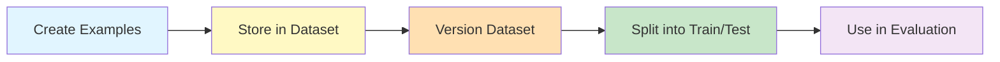

# Lab 3: Building & Managing Datasets

## Difficulty: Beginner | ~40 min | Requires LangChain Lab 3 (Structured Output)

Learn how LangSmith datasets are structured (input/output example pairs), and the different ways to create them: manually through the UI, programmatically via the SDK, by converting existing traces into examples, or by importing a CSV. Cover dataset versioning and organizing examples into splits (e.g., train/test).

---

## 2. Problem Statement / Use Case Overview

When you evaluate an LLM-powered system, you need a collection of known inputs and expected outputs — a **dataset**. Without one, you're eyeballing responses. With one, you can systematically measure whether your system gets better or worse over time.

LangSmith datasets store these input/output example pairs and let you version them, split them into train/test subsets, and use them in automated evaluation runs. This lab shows you how to build a dataset from scratch: first by creating examples manually via the SDK, then by converting traces you already captured, and finally by importing a CSV file. By the end, you'll have a 15–20 example dataset organized into two splits, ready for evaluation in later labs.

---

## 3. Input Data

- **15–20 product review texts** — short, varied reviews that you'll feed into the structured-output agent from LangChain Lab 3
- **Structured output schema** — the `ProductReview` Pydantic model (product, rating, sentiment) from LangChain Lab 3
- **No external files required** — all review texts are defined inline in the notebook
- **CSV import demo** — a small synthetic CSV file created in-notebook to demonstrate the import path

---

## 4. Processing

1. **Generate structured outputs** — Run the structured-output agent across 15–20 varied review inputs to produce typed `ProductReview` objects
2. **Create examples from traces** — Query LangSmith for the traces generated in step 1, then convert each trace's input/output into a LangSmith example
3. **Create examples manually** — Build example objects directly in Python using the SDK's `create_examples()` method
4. **Import from CSV** — Write a CSV file with input/output columns and import it as a new dataset
5. **Organize into splits** — Tag examples with split metadata (e.g., "train" or "test") for structured evaluation later

---

## 5. Output

After completing this lab, you will have:

- A LangSmith dataset named `product-reviews` containing 15–20 examples
- Each example has an input (review text) and output (structured `ProductReview` dict with product, rating, sentiment)
- A second dataset (`product-reviews-csv`) created by importing a CSV file
- Both datasets organized with split metadata (train/test)
- All data visible in the LangSmith UI under the Datasets tab

---

## 6. Tech Stack

- **langsmith** `>=0.1.0` — SDK for dataset creation, management, and trace conversion
- **langchain** `1.2.15` — framework providing `with_structured_output()`
- **langchain-core** `1.2.28` — shared foundation
- **langchain-openai** `1.1.12` — `ChatOpenAI` wrapper for OpenRouter
- **python-dotenv** `1.2.2` — loads `.env` files
- **pydantic** `2.13.4` — schema classes (`BaseModel`, `Field`)
- **pandas** `>=2.0.0` — CSV handling for the import demo
- **OpenRouter API** — free tier, model `nvidia/nemotron-3-super-120b-a12b:free`
- **LangSmith** — hosted service for tracing and datasets

---

## 7. Underlying Concepts

### What is a LangSmith Dataset?

A LangSmith **dataset** is a named collection of **examples**. Each example is an input/output pair:

- **input** — the text, dict, or object you send to your system
- **output** — the expected or ground-truth response

Datasets live in your LangSmith workspace and are versioned: every change creates a new snapshot, so you can roll back or compare across versions.

### The Example Lifecycle



### Four Ways to Create Examples

1. **Programmatic (SDK)** — Use `client.create_examples()` to add examples directly in Python
2. **From Traces** — Query existing traces in LangSmith and convert their inputs/outputs into dataset examples
3. **CSV Import** — Upload a CSV file with input/output columns
4. **Manual (UI)** — Create examples through the LangSmith web interface (not covered in this lab)

### Splits

Datasets can be organized into **splits** — named subsets like `train` and `test`. When you run an evaluation, you can target a specific split, keeping your training data separate from your test data. Each example carries a `split` metadata field.

### Why Datasets Matter for Evaluation

Without datasets, evaluating an LLM is subjective ("this response looks good"). With datasets, evaluation becomes systematic: you can measure accuracy, consistency, and regression across known inputs/outputs. This lab builds the dataset that later evaluation labs will consume.

---

## 8. Prerequisites

- **LangChain Lab 3** (Structured Output) — the structured-output agent pattern is reused here
- **LangSmith Lab 1** (Tracing Basics) — understanding traces and the `@traceable` decorator
- A **LangSmith account** with an API key (free tier works)
- An **OpenRouter API key** (free tier works)
- Python 3.11+

---

## 9. Environment / Dependencies Setup

1. Create a fresh virtual environment:
   ```bash
   python3 -m venv venv
   source venv/bin/activate
   ```

2. Install dependencies:
   ```bash
   pip install -qU "langsmith>=0.1.0" "langchain==1.2.15" "langchain-core==1.2.28" "langchain-openai==1.1.12" "python-dotenv==1.2.2" "pydantic==2.13.4" "pandas>=2.0.0"
   ```

3. Create a `.env` file with your keys:
   ```
   OPENROUTER_API_KEY=your_openrouter_key_here
   LANGSMITH_API_KEY=your_langsmith_key_here
   LANGSMITH_TRACING=true
   LANGSMITH_PROJECT=lab-3-datasets
   ```

4. Verify the setup by running the first cell of the notebook.

---

## 10. Step-wise Development Instructions

### Step 1: Install dependencies

First cell installs all required modules in one line.

### Step 2: Load environment variables

Load your API keys from `.env` and verify they're present. This stops early with a clear message if anything is missing.

### Step 3: Initialize the LangSmith client

Create a `Client()` instance — this is what talks to LangSmith's servers for dataset operations.

### Step 4: Set up the structured-output agent

Recreate the `ProductReview` schema and the structured model from LangChain Lab 3. This agent extracts product, rating, and sentiment from plain-text reviews.

### Step 5: Generate structured outputs from review texts

Define 15–20 varied review texts and run the structured-output agent on each one. Collect the results as a list of `ProductReview` objects.

### Step 6: Create a dataset and add examples from the structured outputs

Use the LangSmith client to create a new dataset named `product-reviews`, then add each review text as input and its structured output as the expected output.

### Step 7: Create examples manually via the SDK

Show the manual approach: build example dicts directly and add them to an existing dataset using `create_examples()`.

### Step 8: Convert traces into examples

Query LangSmith for the traces generated in Step 5 and convert each trace's input/output into a dataset example. This is the most common workflow in practice.

### Step 9: Import examples from a CSV file

Write a small CSV file with review texts and their structured outputs, then import it as a new dataset using `client.create_dataset()` and `client.create_examples()`.

### Step 10: Organize examples into splits

Tag examples in your dataset with split metadata (`train` or `test`) so evaluation runs can target specific subsets.

### Step 11: Verify the dataset in LangSmith

Print a summary of your dataset: number of examples, example count per split, and a sample of the data.

---

## 11. Optional Exercise

Create a third dataset by writing 10 movie descriptions (similar to the `Movie` schema from LangChain Lab 3) to a CSV file with columns `input` and `output`, then import it into LangSmith using the CSV import pattern from Step 9. Organize the examples into a `test` split and verify the dataset appears in your LangSmith workspace.

---

## 12. What We Learnt

- **Datasets are collections of input/output example pairs** — the foundation for systematic LLM evaluation
- **Four ways to create examples**: programmatically via SDK, from existing traces, from CSV files, or manually in the UI
- **The SDK pattern**: `client.create_dataset()` to create a dataset, `client.create_examples()` to add data to it
- **Trace-to-dataset conversion**: query traces with `client.list_runs()` and map their inputs/outputs to examples
- **CSV import**: read a structured file with pandas and upload it via the SDK
- **Splits organize data** into train/test subsets for targeted evaluation
- **Versioning is automatic**: every change to a dataset creates a new snapshot
- **Datasets bridge development and evaluation** — you build them during development, consume them during evaluation
