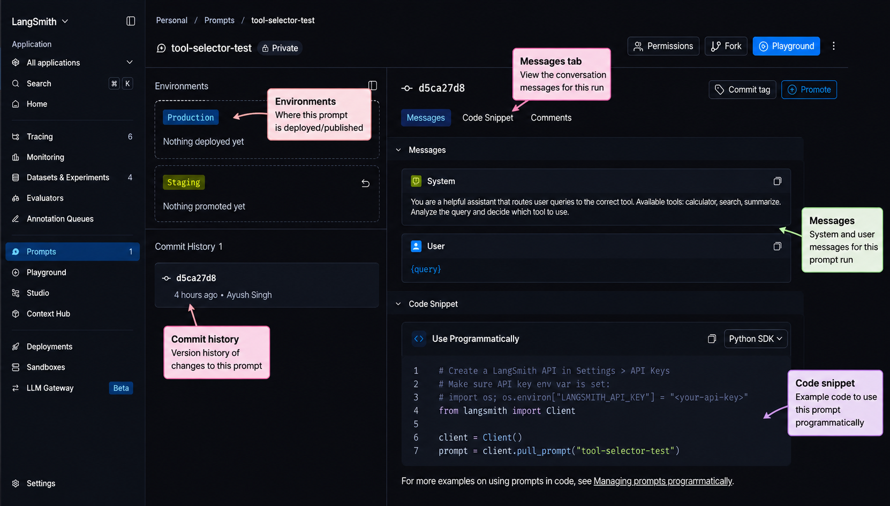
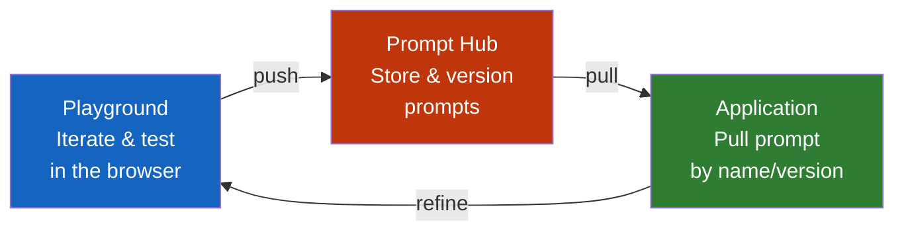

# Lab 4: Prompt Playground & Prompt Hub

## Difficulty: Beginner | ~35 min | Requires Lab 1

---

## 1. Problem Statement / Use Case Overview

Hardcoding prompts in your source code works for quick prototypes, but it breaks down when you need to iterate, share, or version-control your prompts across a team. LangSmith solves this with two tools: the **Playground** (a web UI for testing prompts against different models and parameters without writing code) and **Prompt Hub** (a version-controlled registry for storing, sharing, and pulling prompts programmatically).

This lab teaches you how to push a prompt to Prompt Hub, pull it back by name and version, test it with an LLM, and iterate on it — the same workflow you'd use in a real team setting where prompts evolve over time.

---

## 2. Input Data

No external datasets are required. We'll use:

- A simple system prompt about tool selection (inspired by the LangChain Lab 2 agent)
- LangSmith's Prompt Hub for version-controlled storage
- OpenRouter's free model for testing the prompt

The lab is self-contained — you provide your OpenRouter and LangSmith API keys, and everything else is built from scratch.

---

## 3. Processing

1. **Push** a system prompt to Prompt Hub using the LangSmith SDK
2. **List** available prompts in your workspace
3. **Pull** the prompt back by name and by specific version
4. **Invoke** the prompt with variables and test it with an LLM
5. **Iterate** by refining the prompt and pushing a new version

Each step is isolated in its own cell so you can run and inspect incrementally.

---

## 4. Output

When this lab works, you'll see:

- A prompt pushed to Prompt Hub with a URL linking to the LangSmith UI
- A list of prompts in your workspace (including the one you just pushed)
- The pulled prompt template printed with its input variables
- A formatted prompt message ready to send to an LLM
- An LLM response generated from the prompt you pushed from the Hub



The image above shows your prompt in the LangSmith Prompt Hub UI. The **prompt name** (`tool-selector-test`) appears at the top, the **Messages** section shows the system and user prompts, and the **Code Snippet** section provides the Python code to use the prompt programmatically. Notice the **Playground** button for testing and the **Environments** section for deploying to staging or production.

---

## 5. Tech Stack

- **Python 3.10+**
- **LangSmith SDK** `langsmith>=0.1.0` — for `push_prompt()`, `pull_prompt()`, and `list_prompts()`
- **LangChain Core** `langchain-core>=0.2.0` — for `ChatPromptTemplate`
- **OpenAI SDK** `openai>=1.0.0` — for the LLM calls (OpenRouter is OpenAI-compatible)
- **dotenv** `python-dotenv>=1.0.0` — for loading API keys from `.env`
- **Model**: `nvidia/nemotron-3-super-120b-a12b:free` (free Nemotron model on OpenRouter)
- **LangSmith account** — free tier works for this lab

Cost: $0 — using OpenRouter's free tier.

---

## 6. Underlying Concepts

### The Prompt Engineering Problem

When you hardcode a prompt in your Python file, you face three problems:

- **No version history** — you can't see what the prompt looked like before your last edit
- **No sharing** — teammates can't easily use or improve your prompt
- **No environment management** — you can't have "staging" vs "production" versions of the same prompt

LangSmith's Prompt Hub solves all three by treating prompts like code: versioned, shareable, and deployable.

### Prompt Hub vs Playground

The **Playground** and **Prompt Hub** work together but serve different purposes:



**Playground** (web UI at smith.langchain.com) lets you:
- Test prompts against different models (GPT-4, Claude, Llama, etc.)
- Adjust parameters like temperature, max tokens, and few-shot examples
- See side-by-side comparisons of prompt variations
- Push your refined prompt directly to Prompt Hub

**Prompt Hub** (SDK + UI) lets you:
- Store prompts as versioned artifacts (like Git for prompts)
- Pull any version programmatically in your code
- Share prompts across your team
- Tag versions for environment management (dev, staging, production)

### How Prompt Versioning Works

Every time you push a prompt to Hub, it creates a new immutable version. Pulling without specifying a version returns the latest. Pinning to a specific version ensures your code doesn't break when someone else updates the prompt.

---

## 7. Prerequisites

- Completed Lab 1 (Tracing Basics) — understanding of LangSmith SDK setup
- Python 3.10 or higher installed
- An OpenRouter account with an API key (free tier works)
- A LangSmith account (free tier works) with an API key
- Basic Python knowledge (functions, f-strings)

---

## 8. Environment / Dependencies Setup

### Step 1: Get Your API Keys (if you don't have them yet)

If you completed Lab 1, you already have both keys. If not:

1. **OpenRouter** — go to https://openrouter.ai/keys, create a key (starts with `sk-or-v1-...`)
2. **LangSmith** — go to https://smith.langchain.com/settings, create an API key (starts with `ls-...`)

### Step 2: Create a LangSmith Project

1. In the LangSmith dashboard, click **"Tracing"** in the left sidebar
2. Click **"New Project"** (or the **"+"** button near the project list)
3. Name it `prompt-hub-lab`
4. Click **"Create"**

### Step 3: Create a `.env` File

Create a `.env` file in your project root with your keys:

```
OPENROUTER_API_KEY=sk-or-v1-your-openrouter-key-here
LANGSMITH_API_KEY=ls-your-langsmith-key-here
LANGSMITH_TRACING=true
LANGSMITH_PROJECT="prompt-hub-lab"
```

Replace the placeholder values with your actual keys.

### Step 4: Install Dependencies

```bash
pip install langsmith>=0.1.0 langchain-core>=0.2.0 openai>=1.0.0 python-dotenv>=1.0.0
```

### Step 5: Verify Setup

Before running the lab, verify everything works:

```bash
python -c "
import os
from dotenv import load_dotenv
load_dotenv()
print('OpenRouter key:', '✓' if os.getenv('OPENROUTER_API_KEY') else '✗ Missing')
print('LangSmith key:', '✓' if os.getenv('LANGSMITH_API_KEY') else '✗ Missing')
print('Tracing:', '✓' if os.getenv('LANGSMITH_TRACING') == 'true' else '✗ Missing')
"
```

All three lines should show ✓. If any show ✗, check your `.env` file.

### Step 6: Explore the Playground (Optional but Recommended)

Before writing code, try the LangSmith Playground:

1. Go to https://smith.langchain.com/
2. Click **"Playground"** in the left sidebar
3. Type a system prompt (e.g., "You are a helpful assistant that selects tools based on user queries")
4. Try changing the model, temperature, and max tokens
5. Click **"Run"** to see the response

This gives you a feel for what the Playground does — the SDK code in this lab replicates and extends that workflow programmatically.

---

## 9. Step-wise Development Instructions

### Cell 1: Install Dependencies

```python
!pip install -qU langsmith>=0.1.0 langchain-core>=0.2.0 openai>=1.0.0 python-dotenv>=1.0.0
```

This installs the exact versions of every library used in this lab.

---

### Cell 2: Load Environment and Initialize Clients

```python
import os
from dotenv import load_dotenv
from langsmith import Client
from openai import OpenAI

load_dotenv()
assert os.getenv("OPENROUTER_API_KEY"), "Missing OPENROUTER_API_KEY"
assert os.getenv("LANGSMITH_API_KEY"), "Missing LANGSMITH_API_KEY"

ls_client = Client()
openai_client = OpenAI(
    base_url="https://openrouter.ai/api/v1",
    api_key=os.getenv("OPENROUTER_API_KEY")
)
print("✓ Clients ready")
```

Loads API keys and initializes both the LangSmith client (for Hub operations) and the OpenAI client (for LLM calls).

---

### Cell 3: Create a System Prompt and Push It to Hub

```python
from langchain_core.prompts import ChatPromptTemplate

system_prompt = ChatPromptTemplate.from_messages([
    ("system", "You are a helpful assistant that routes user queries to the correct tool. Available tools: calculator, search, summarize. Analyze the query and decide which tool to use."),
    ("user", "{query}")
])

# Push the prompt to Prompt Hub — this creates version 1
url = ls_client.push_prompt("tool-selector", object=system_prompt)
print(f"✓ Pushed to Hub: {url}")
```

This creates a system prompt for tool selection and pushes it to Prompt Hub. The `push_prompt()` method stores the prompt and returns a URL where you can view it in the LangSmith UI.

---

### Cell 4: List Prompts in Your Workspace

```python
prompts = list(ls_client.list_prompts(limit=10))
print(f"✓ Found {len(prompts)} prompt(s):")
for p in prompts:
    print(f"  - {p.repo_handle} (latest: {p.latest_version_draft if hasattr(p, 'latest_version_draft') else 'N/A'})")
```

This lists all prompts in your workspace. You should see the `tool-selector` prompt you just pushed.

---

### Cell 5: Pull the Prompt by Name

```python
pulled = ls_client.pull_prompt("tool-selector")
print(f"✓ Pulled prompt: {type(pulled).__name__}")
print(f"  Messages: {len(pulled.messages)}")
for msg in pulled.messages:
    role = msg.__class__.__name__
    content = msg.content[:80] + "..." if len(msg.content) > 80 else msg.content
    print(f"  {role}: {content}")
```

This pulls the latest version of your prompt from Hub. The returned object is a `ChatPromptTemplate` that you can invoke with variables.

---

### Cell 6: Invoke the Prompt with a Variable

```python
formatted = pulled.invoke({"query": "What is 15 multiplied by 23?"})
print("✓ Formatted messages:")
for msg in formatted.messages:
    print(f"  {msg.type}: {msg.content}")
```

This invokes the prompt with a sample query. The `invoke()` method fills in the `{query}` variable and returns formatted messages ready to send to an LLM.

---

### Cell 7: Test the Prompt with an LLM

```python
response = openai_client.chat.completions.create(
    model="nvidia/nemotron-3-super-120b-a12b:free",
    messages=[{"role": msg.type, "content": msg.content} for msg in formatted.messages]
)
print(f"✓ LLM Response: {response.choices[0].message.content}")
```

This sends the formatted prompt to the LLM and prints the response. The model should identify that this query needs the calculator tool.

---

### Cell 8: Refine the Prompt and Push Version 2

```python
refined_prompt = ChatPromptTemplate.from_messages([
    ("system", "You are a tool-routing assistant. Given a user query, respond with ONLY the tool name (calculator, search, or summarize) and a brief reason. Format: Tool: [name] | Reason: [why]"),
    ("user", "{query}")
])

url = ls_client.push_prompt("tool-selector", object=refined_prompt)
print(f"✓ Pushed refined version: {url}")
```

This refines the prompt to produce more structured output and pushes it as version 2. The prompt name stays the same — LangSmith automatically versions it.

---

### Cell 9: Pull by Specific Version and Compare

```python
# Pull version 1 (original)
v1 = ls_client.pull_prompt("tool-selector:1")
v2 = ls_client.pull_prompt("tool-selector:2")

print("✓ Version 1 system message:")
print(f"  {v1.messages[0].content[:100]}...")
print(f"\n✓ Version 2 system message:")
print(f"  {v2.messages[0].content[:100]}...")
```

This pulls both versions side by side so you can see how the prompt evolved. Pulling with `:1` or `:2` pins to a specific version — your code won't break if someone pushes a new version later.

---

### Cell 10: Test the Refined Prompt

```python
formatted_v2 = v2.invoke({"query": "Summarize the latest news about AI"})
response = openai_client.chat.completions.create(
    model="nvidia/nemotron-3-super-120b-a12b:free",
    messages=[{"role": msg.type, "content": msg.content} for msg in formatted_v2.messages]
)
print(f"✓ Refined prompt response:")
print(f"  {response.choices[0].message.content}")
```

This tests the refined prompt with a different query. The structured output format should produce a clearer tool-selection decision.

---

## 10. Optional Exercise

**Create a few-shot prompt** that demonstrates the tool-selection pattern with 2–3 examples, push it to Hub as a new prompt called `tool-selector-few-shot`, and test it with the query "Can you search for recent papers on quantum computing?" The prompt should include example input/output pairs showing the expected format.

---

## 11. What We Learnt

- **Prompt Hub** provides Git-like version control for prompts — every push creates an immutable version
- **`push_prompt()`** stores a prompt in Hub and returns a URL to view it in the LangSmith UI
- **`pull_prompt()`** retrieves a prompt by name (latest) or by specific version (`:1`, `:2`, or a commit hash)
- **The Playground** is a web UI for iterating on prompts against different models without writing code
- **Version pinning** (`pull_prompt("name:2")`) ensures your code doesn't break when prompts are updated
- **Prompt refinement** is iterative — push, test, refine, push again — with full history preserved
- **Decoupling prompts from code** makes prompts shareable across teams and deployable across environments
