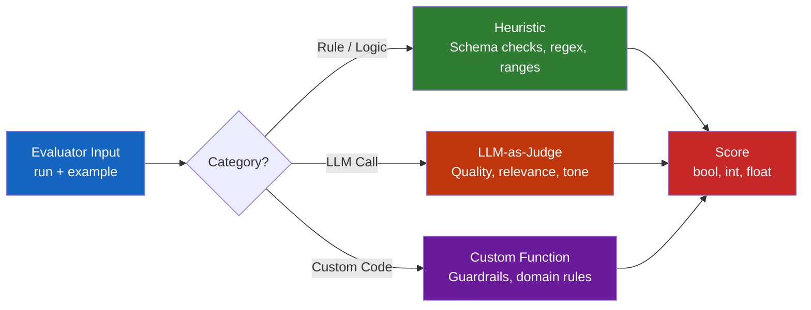

# Lab 5: Writing Custom Evaluators

## Difficulty: Intermediate | ~45 min | Requires Lab 3

---

Learn the three categories of evaluators in LangSmith — heuristic checks, LLM-as-judge, and custom functions — and attach them to runs using the `evaluate()` API.

---

## 1. Problem Statement / Use Case Overview

You've built a structured-output agent (Lab 3) and created a dataset of its inputs and outputs (Lab 3). But how do you know if the agent is actually *good*? This lab teaches you to write three types of evaluators — rule-based schema checks, LLM-as-judge quality scoring, and custom guardrail enforcement — and run them against your dataset using LangSmith's `evaluate()` API. You'll leave with a repeatable evaluation pipeline you can attach to any agent.

---

## 2. Input Data

The `product-reviews` dataset from Lab 3, containing 10+ examples of raw review text inputs and structured `ProductReview` outputs (product, rating, sentiment). Each example pairs a review with its expected structured extraction — the ground truth your evaluators compare against.

---

## 3. Processing

1. **Load** the Lab 3 dataset via the LangSmith SDK
2. **Define** a target function that runs the structured-output agent on each example
3. **Write** three evaluators: schema validation (heuristic), helpfulness scoring (LLM-as-judge), and guardrail compliance (custom logic)
4. **Run** `evaluate()` to execute the target on every example and score each run with all three evaluators
5. **Summarize** results into a per-example and aggregate view

---

## 4. Output

When this lab works, you'll see:

- A summary table showing pass rates for schema validation and guardrails, plus average helpfulness score
- Per-example detail rows with individual evaluator scores
- All results logged to your LangSmith project for inspection in the UI

### Expected Summary Output

```
=== Evaluation Summary ===
Schema Valid:    13/13 passed (100%)
Guardrail Pass:  13/13 passed (100%)
Helpfulness Avg: 4.2/5

=== Per-Example Details ===
Example 1: schema=True, helpfulness=5/5, guardrail=True
Example 2: schema=True, helpfulness=4/5, guardrail=True
...
```

---

## 5. Tech Stack

- **Python 3.10+**
- **LangSmith SDK** `langsmith>=0.1.0` — dataset access, `evaluate()` API, result logging
- **LangChain** `langchain-core>=0.2.0`, `langchain-openai>=0.1.0` — structured-output model
- **Pydantic** `pydantic>=2.0.0` — schema validation for the heuristic evaluator
- **OpenAI SDK** `openai>=1.0.0` — LLM-as-judge calls via OpenRouter
- **dotenv** `python-dotenv>=1.0.0` — API key management
- **Model**: `nvidia/nemotron-3.5-lightning:free` (target agent), `nvidia/nemotron-3-super-120b-a12b:free` (judge)
- **LangSmith account** — free tier works
- **Lab 3 dataset** `product-reviews` — required as input

Cost: $0 — using OpenRouter's free tier for both target and judge models.

---

## 6. Underlying Concepts

### The Three Evaluator Categories

LangSmith evaluators fall into three categories based on *how* they produce a score:



**1. Heuristic evaluators** use pure logic — no LLM calls. They check structural properties: Does the output parse against a schema? Is a field within a valid range? Is a required key present? These are fast, deterministic, and cheap.

**2. LLM-as-judge evaluators** call a separate LLM to score the output. The judge receives the input, output, and optionally a reference answer, then returns a score. Useful for subjective metrics like helpfulness, relevance, or tone that can't be captured by rules.

**3. Custom evaluators** combine logic, external calls, or domain-specific rules. Guardrail enforcement, policy compliance, and business-logic checks all fall here. You write arbitrary Python and return a score dict.

### The `evaluate()` API

The `evaluate()` function is the central orchestration point. It:

1. Iterates over every example in the dataset
2. Calls your target function with each example's input
3. Passes the resulting run and the original example to each evaluator
4. Collects all scores and logs them to LangSmith

The evaluator signature is always `def evaluator(run, example) -> dict`, where `run` contains the target's output and `example` contains the dataset's input/expected output.

### Evaluator Return Format

Every evaluator returns a dict with:

| Field | Required | Description |
|-------|----------|-------------|
| `key` | Yes | Name of the metric (e.g., `"schema_valid"`) |
| `score` | Yes | The score value (bool, int, float) |
| `comment` | No | Human-readable explanation of the score |

---

## 7. Prerequisites

- Completed Lab 3 (Building & Managing Datasets) — the `product-reviews` dataset must exist
- An OpenRouter account with API key (free tier works)
- A LangSmith account with API key (free tier works)
- Basic Python knowledge (functions, decorators, try/except)

---

## 8. Environment / Dependencies Setup

### Step 1: Verify Lab 3 Dataset Exists

Before running this lab, confirm the `product-reviews` dataset is in your LangSmith workspace. You can check in the LangSmith UI under Datasets, or run:

```python
from langsmith import Client
client = Client()
dataset = client.read_dataset(dataset_name="product-reviews")
print(f"Found dataset: {dataset.name} with {len(list(client.list_examples(dataset_id=dataset.id)))} examples")
```

If this fails, complete Lab 3 first.

### Step 2: Create a `.env` File

Create a `.env` file in the lab directory with your keys:

```
OPENROUTER_API_KEY=sk-or-v1-your-openrouter-key-here
LANGSMITH_API_KEY=ls-your-langsmith-key-here
LANGSMITH_TRACING=true
LANGSMITH_PROJECT="lab-5-custom-evaluators"
```

### Step 3: Install Dependencies

```bash
pip install langsmith>=0.1.0 langchain-core>=0.2.0 langchain-openai>=0.1.0 openai>=1.0.0 python-dotenv>=1.0.0 pydantic>=2.0.0
```

---

## 9. Step-wise Development Instructions

### Cell 1: Install Dependencies

```python
!pip install -qU "langsmith>=0.1.0" "langchain-core>=0.2.0" "langchain-openai>=0.1.0" "openai>=1.0.0" "python-dotenv>=1.0.0" "pydantic>=2.0.0"
```

This installs every library the lab needs in a single line.

---

### Cell 2: Load Environment and Initialize Clients

```python
import os
from dotenv import load_dotenv
from langsmith import Client
from openai import OpenAI
from pydantic import BaseModel, Field, ValidationError

load_dotenv()
assert os.getenv("OPENROUTER_API_KEY"), "Missing OPENROUTER_API_KEY"
assert os.getenv("LANGSMITH_API_KEY"), "Missing LANGSMITH_API_KEY"

ls_client = Client()
judge_client = OpenAI(
    base_url="https://openrouter.ai/api/v1",
    api_key=os.getenv("OPENROUTER_API_KEY")
)
print("Clients ready")
```

Two clients: `ls_client` for dataset/evaluation operations, `judge_client` for the LLM-as-judge evaluator.

---

### Cell 3: Load the Lab 3 Dataset

```python
dataset = ls_client.read_dataset(dataset_name="product-reviews")
examples = list(ls_client.list_examples(dataset_id=dataset.id))
print(f"Loaded {len(examples)} examples from '{dataset.name}'")
for ex in examples[:3]:
    print(f"  Input: {ex.inputs}")
    print(f"  Output: {ex.outputs}\n")
```

Pulls the dataset and previews the first 3 examples so you can confirm the data looks right.

---

### Cell 4: Define the Target Function

```python
from langchain_openai import ChatOpenAI

class ProductReview(BaseModel):
    product: str = Field(description="The exact product being reviewed")
    rating: int = Field(description="The star rating, from 1 to 5")
    sentiment: str = Field(description="positive, negative, or neutral")

model = ChatOpenAI(
    model="nvidia/nemotron-3.5-lightning:free",
    base_url="https://openrouter.ai/api/v1",
    api_key=os.getenv("OPENROUTER_API_KEY"),
    temperature=0,
)
structured_model = model.with_structured_output(ProductReview)

def target(inputs: dict) -> dict:
    parsed = structured_model.invoke(inputs["review_text"])
    return parsed.model_dump()
```

The `target` function is what `evaluate()` calls for each example. It takes the dataset input dict and returns a prediction dict. The evaluators then compare this prediction against the dataset's expected output.

---

### Cell 5: Evaluator 1 — Schema Validation

```python
from langsmith.evaluation import evaluate

def schema_validator(run, example) -> dict:
    """Check if the output parses against the ProductReview schema."""
    output = run.outputs
    try:
        ProductReview(**output)
        return {"key": "schema_valid", "score": True}
    except ValidationError as e:
        return {"key": "schema_valid", "score": False, "comment": str(e)}

print("Schema validator defined — checks Pydantic parsing on every output")
```

This heuristic evaluator catches structural failures: missing fields, wrong types, out-of-range values. If Pydantic can parse the output into a `ProductReview`, the score is `True`.

---

### Cell 6: Evaluator 2 — LLM-as-Judge

```python
def helpfulness_judge(run, example) -> dict:
    """Ask an LLM to score output helpfulness from 1-5."""
    review = example.inputs["review_text"]
    output = run.outputs
    reference = example.outputs

    prompt = f"""Score the following extraction on a 1-5 helpfulness scale.
Review: {review}
Extracted: {output}
Reference: {reference}
Return ONLY a JSON object: {{"score": <int>, "reason": "<brief explanation>"}}"""

    response = judge_client.chat.completions.create(
        model="nvidia/nemotron-3-super-120b-a12b:free",
        messages=[{"role": "user", "content": prompt}],
        temperature=0,
    )
    import json
    result = json.loads(response.choices[0].message.content)
    return {"key": "helpfulness", "score": result["score"], "comment": result["reason"]}

print("Helpfulness judge defined — LLM scores output quality from 1-5")
```

The judge receives the original review, the agent's extraction, and the reference answer. It returns a structured score with a reason — useful for understanding *why* a particular example scored poorly.

---

### Cell 7: Evaluator 3 — Guardrail Compliance

```python
ALLOWED_SENTIMENTS = {"positive", "negative", "neutral"}

def guardrail_checker(run, example) -> dict:
    """Check that the output respects configured guardrail policies."""
    output = run.outputs
    violations = []

    if output.get("sentiment") not in ALLOWED_SENTIMENTS:
        violations.append(f"Invalid sentiment: {output.get('sentiment')}")
    if not (1 <= output.get("rating", 0) <= 5):
        violations.append(f"Rating out of range: {output.get('rating')}")
    if not output.get("product"):
        violations.append("Missing product name")

    return {
        "key": "guardrail_pass",
        "score": len(violations) == 0,
        "comment": "; ".join(violations) if violations else "All guardrails passed"
    }

print("Guardrail checker defined — enforces sentiment, rating, and product policies")
```

This custom evaluator enforces business rules. In production, you'd check policies like "never return PII," "always include a disclaimer," or "response length under 500 tokens." The pattern is the same: define your rules as code, return a boolean score with violation details.

---

### Cell 8: Run the Evaluation

```python
results = evaluate(
    target,
    data="product-reviews",
    evaluators=[schema_validator, helpfulness_judge, guardrail_checker],
    experiment_prefix="lab5-custom-evaluators",
)
print(f"Evaluation complete: {len(results._results)} examples scored")
```

One line runs all three evaluators across every example. The `experiment_prefix` groups these results in the LangSmith UI so you can find them later.

---

### Cell 9: Summarize Results

```python
all_results = results._results
schema_scores = [r["evaluation_results"]["results"][0].score for r in all_results]
helpfulness_scores = [r["evaluation_results"]["results"][1].score for r in all_results]
guardrail_scores = [r["evaluation_results"]["results"][2].score for r in all_results]

print("=== Evaluation Summary ===")
print(f"Schema Valid:    {sum(schema_scores)}/{len(schema_scores)} passed ({sum(schema_scores)/len(schema_scores)*100:.0f}%)")
print(f"Guardrail Pass:  {sum(guardrail_scores)}/{len(guardrail_scores)} passed ({sum(guardrail_scores)/len(guardrail_scores)*100:.0f}%)")
print(f"Helpfulness Avg: {sum(helpfulness_scores)/len(helpfulness_scores):.1f}/5")

print("\n=== Per-Example Details ===")
for i, r in enumerate(all_results):
    evals = r["evaluation_results"]["results"]
    print(f"Example {i+1}: schema={evals[0].score}, helpfulness={evals[1].score}/5, guardrail={evals[2].score}")
```

Aggregates scores into a summary view. The per-example breakdown helps you identify which specific examples are failing and why.

---

## 10. Optional Exercise

Add a fourth evaluator called `sentiment_accuracy` that checks whether the agent's predicted sentiment matches the reference sentiment from the dataset. It should return a boolean score (True if they match, False otherwise). Attach it to the evaluation run and compare its pass rate against the schema validator.

---

## 11. What We Learnt

- **Three evaluator categories** — heuristic (rule-based), LLM-as-judge (quality scoring), and custom (domain logic) — cover every evaluation need
- **The evaluator signature** `def evaluator(run, example) -> dict` is the contract: receive a run and example, return a score dict with `key`, `score`, and optional `comment`
- **Heuristic evaluators** are fast, deterministic, and cheap — use them for structural checks like schema validation and range enforcement
- **LLM-as-judge evaluators** handle subjective quality metrics that rules can't capture — helpfulness, relevance, tone, and clarity
- **Custom evaluators** enforce business rules and policies — guardrails, compliance, and domain-specific constraints
- **The `evaluate()` API** orchestrates everything: runs the target on every example, passes each result to every evaluator, and logs all scores to LangSmith
- **Evaluator scores are logged** to LangSmith automatically, giving you a searchable, filterable history of your agent's quality over time
- **Attaching multiple evaluators** in a single `evaluate()` call gives you a multi-dimensional view of agent quality in one pass
