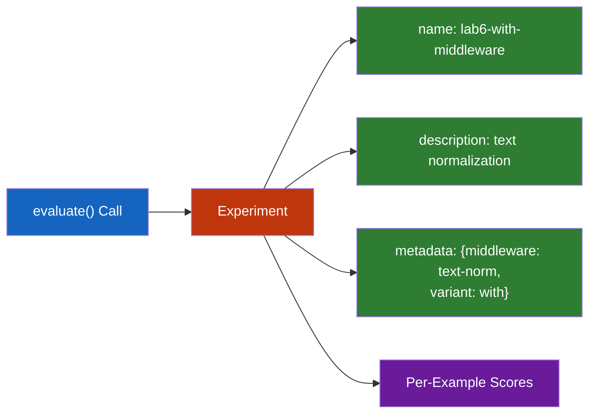
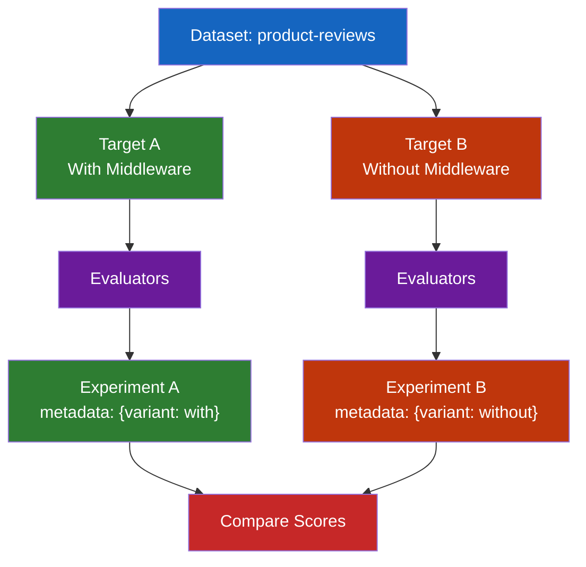

# Lab 6: Running Experiments

## Difficulty: Intermediate | ~45 min | Requires Labs 3 and 5

---

Learn how LangSmith experiments let you run a chain/prompt/model configuration against an entire dataset in one call, automatically scoring every example with the evaluators you specify, and how experiment metadata (name, description, tags) supports later comparison.

---

## 1. Problem Statement / Use Case Overview

You've built evaluators (Lab 5) and a dataset (Lab 3), but running them one example at a time doesn't tell you how a *configuration change* affects quality across the board. When you add a middleware step — say, normalizing text before it reaches the model — you need to know whether that change helps, hurts, or makes no difference. This lab teaches you to use LangSmith's `evaluate()` API to run entire experiments: sweeping a target function across every example in a dataset, tagging experiments with metadata, and comparing two configurations side by side to isolate the effect of a single variable.

---

## 2. Input Data

The `product-reviews` dataset from Lab 3, containing 13 examples of raw review text inputs and structured `ProductReview` outputs (product, rating, sentiment). Each example pairs a review with its expected structured extraction — the ground truth your evaluators compare against.

---

## 3. Processing

1. **Load** the Lab 3 dataset and define the three evaluators from Lab 5
2. **Define** two target functions: one with a text-normalization middleware step, one without
3. **Run** each target as a separate experiment via `evaluate()` with distinct metadata
4. **Compare** aggregate scores across the two experiments to isolate the middleware's effect

---

## 4. Output

When this lab works, you'll see:

- Two experiments logged to LangSmith with distinct names and metadata
- A printed comparison table showing schema pass rate, helpfulness average, and guardrail pass rate for each configuration
- All results visible in the LangSmith UI under the Experiments tab

### Expected Summary Output

```
=== Experiment Comparison ===
                      With Middleware    Without Middleware
Schema Valid:         13/13 (100%)       13/13 (100%)
Guardrail Pass:       13/13 (100%)       13/13 (100%)
Helpfulness Avg:      4.3/5              4.1/5
```

---

## 5. Tech Stack

- **Python 3.10+**
- **LangSmith SDK** `langsmith>=0.1.0` — dataset access, `evaluate()` API, experiment logging
- **LangChain** `langchain-core>=0.2.0`, `langchain-openai>=0.1.0` — structured-output model
- **Pydantic** `pydantic>=2.0.0` — schema validation for the heuristic evaluator
- **OpenAI SDK** `openai>=1.0.0` — LLM-as-judge calls via OpenRouter
- **dotenv** `python-dotenv>=1.0.0` — API key management
- **Model**: `nvidia/nemotron-3.5-lightning:free` (target agent), `nvidia/nemotron-3-super-120b-a12b:free` (judge)
- **LangSmith account** — free tier works
- **Lab 3 dataset** `product-reviews` — required as input

Cost: $0 — using OpenRouter's free tier for both target and judge models.

---

## 6. Underlying Concepts

### What is an Experiment?

An experiment is a named run of a target function across every example in a dataset. When you call `evaluate()`, LangSmith:

1. Loads all examples from the specified dataset
2. Calls your target function with each example's input, creating a run
3. Passes each run + example pair to every evaluator
4. Groups all scores under a single experiment with a name, description, and metadata

This gives you a complete quality snapshot of one configuration — not just one example, but the whole dataset scored consistently.

### Experiment Metadata

Every experiment can carry a `name`, `description`, and `metadata` dict. Metadata is arbitrary key-value pairs you attach to the experiment for later filtering and comparison:



In the LangSmith UI, you can filter experiments by metadata keys, group experiments by tags, and compare their aggregate scores side by side. This is what makes systematic A/B testing of configurations possible.

### Controlled Comparison

The scientific method applies to LLM configuration: to understand the effect of one change, keep everything else constant. Run two experiments where the *only* difference is the variable you're testing (in this lab, the middleware). If scores differ, you can attribute the difference to that variable — not to model temperature, prompt wording, or other confounding factors.



**Why this matters:** Without controlled comparison, you're guessing whether a change helped. With it, you have data. This pattern scales to any configuration variable — model choice, prompt template, chunking strategy, retrieval method — and is the foundation of systematic LLM optimization.

---

## 7. Prerequisites

- Completed Lab 3 — the `product-reviews` dataset must exist in your LangSmith workspace
- Completed Lab 5 — familiarity with the three evaluator categories (heuristic, LLM-as-judge, custom)
- An OpenRouter account with API key (free tier works)
- A LangSmith account with API key (free tier works)
- Basic Python knowledge (functions, decorators, string methods)

---

## 8. Environment / Dependencies Setup

### Step 1: Verify Lab 3 Dataset Exists

Before running this lab, confirm the `product-reviews` dataset is in your LangSmith workspace:

```python
from langsmith import Client
client = Client()
dataset = client.read_dataset(dataset_name="product-reviews")
print(f"Found dataset: {dataset.name}")
```

If this fails, complete Lab 3 first.

### Step 2: Create a `.env` File

Create a `.env` file in the lab directory with your keys:

```
OPENROUTER_API_KEY=sk-or-v1-your-openrouter-key-here
LANGSMITH_API_KEY=ls-your-langsmith-key-here
LANGSMITH_TRACING=true
LANGSMITH_PROJECT="lab-6-running-experiments"
```

### Step 3: Install Dependencies

```bash
pip install langsmith>=0.1.0 langchain-core>=0.2.0 langchain-openai>=0.1.0 openai>=1.0.0 python-dotenv>=1.0.0 pydantic>=2.0.0
```

---

## 9. Step-wise Development Instructions

### Cell 1: Install Dependencies

```python
!pip install -qU "langsmith>=0.1.0" "langchain-core>=0.2.0" "langchain-openai>=0.1.0" "openai>=1.0.0" "python-dotenv>=1.0.0" "pydantic>=2.0.0"
```

This installs every library the lab needs in a single line.

---

### Cell 2: Load Environment and Initialize Clients

```python
import os
from dotenv import load_dotenv
from langsmith import Client
from openai import OpenAI

load_dotenv()
assert os.getenv("OPENROUTER_API_KEY"), "Missing OPENROUTER_API_KEY"
assert os.getenv("LANGSMITH_API_KEY"), "Missing LANGSMITH_API_KEY"

ls_client = Client()
judge_client = OpenAI(
    base_url="https://openrouter.ai/api/v1",
    api_key=os.getenv("OPENROUTER_API_KEY")
)
print("Clients ready")
```

Two clients: `ls_client` for dataset/evaluation operations, `judge_client` for the LLM-as-judge evaluator.

---

### Cell 3: Load the Lab 3 Dataset

```python
dataset = ls_client.read_dataset(dataset_name="product-reviews")
examples = list(ls_client.list_examples(dataset_id=dataset.id))
print(f"Loaded {len(examples)} examples from '{dataset.name}'")
for ex in examples[:3]:
    print(f"  Input: {ex.inputs}")
    print(f"  Output: {ex.outputs}\n")
```

Pulls the dataset and previews the first 3 examples so you can confirm the data looks right.

---

### Cell 4: Define the Schema and Model

```python
from langchain_openai import ChatOpenAI
from pydantic import BaseModel, Field

class ProductReview(BaseModel):
    product: str = Field(description="The exact product being reviewed")
    rating: int = Field(description="The star rating, from 1 to 5")
    sentiment: str = Field(description="positive, negative, or neutral")

model = ChatOpenAI(
    model="nvidia/nemotron-3.5-lightning:free",
    base_url="https://openrouter.ai/api/v1",
    api_key=os.getenv("OPENROUTER_API_KEY"),
    temperature=0,
)
structured_model = model.with_structured_output(ProductReview)
```

Re-establishes the structured-output agent from Lab 3/5. Both target functions will use this same model — the only difference is whether middleware preprocesses the input first.

---

### Cell 5: Define the Three Evaluators

```python
from langsmith.evaluation import evaluate
from pydantic import ValidationError

def schema_validator(run, example) -> dict:
    """Heuristic: check if output parses against ProductReview schema."""
    try:
        ProductReview(**run.outputs)
        return {"key": "schema_valid", "score": True}
    except ValidationError as e:
        return {"key": "schema_valid", "score": False, "comment": str(e)}

def helpfulness_judge(run, example) -> dict:
    """LLM-as-judge: score output helpfulness from 1-5."""
    import json
    prompt = f"""Score this extraction on a 1-5 helpfulness scale.
Review: {example.inputs['review_text']}
Extracted: {run.outputs}
Reference: {example.outputs}
Return ONLY JSON: {{"score": <int>, "reason": "<brief explanation>"}}"""
    try:
        response = judge_client.chat.completions.create(
            model="nvidia/nemotron-3-super-120b-a12b:free",
            messages=[{"role": "user", "content": prompt}],
            temperature=0,
        )
        result = json.loads(response.choices[0].message.content)
        return {"key": "helpfulness", "score": result["score"], "comment": result.get("reason", "")}
    except Exception as e:
        return {"key": "helpfulness", "score": None, "comment": f"Judge error: {e}"}

ALLOWED_SENTIMENTS = {"positive", "negative", "neutral"}

def guardrail_checker(run, example) -> dict:
    """Custom: enforce sentiment, rating, and product guardrails."""
    output = run.outputs
    violations = []
    if output.get("sentiment") not in ALLOWED_SENTIMENTS:
        violations.append(f"Invalid sentiment: {output.get('sentiment')}")
    if not (1 <= output.get("rating", 0) <= 5):
        violations.append(f"Rating out of range: {output.get('rating')}")
    if not output.get("product"):
        violations.append("Missing product name")
    return {
        "key": "guardrail_pass",
        "score": len(violations) == 0,
        "comment": "; ".join(violations) if violations else "All guardrails passed"
    }

print("Three evaluators defined: schema_validator, helpfulness_judge, guardrail_checker")
```

These are the same three evaluators from Lab 5. They're re-defined here so this lab is self-contained — you don't need to import from Lab 5 to run it.

---

### Cell 6: Define Two Target Functions (With and Without Middleware)

```python
import re

def normalize_text(text: str) -> str:
    """Middleware: normalize review text before sending to the model."""
    text = text.strip()
    text = re.sub(r'\s+', ' ', text)
    return text

def target_with_middleware(inputs: dict) -> dict:
    """Target with text-normalization middleware applied first."""
    normalized = normalize_text(inputs["review_text"])
    parsed = structured_model.invoke(normalized)
    return parsed.model_dump()

def target_without_middleware(inputs: dict) -> dict:
    """Target with no preprocessing — raw input goes straight to the model."""
    parsed = structured_model.invoke(inputs["review_text"])
    return parsed.model_dump()

print("Two targets defined: with middleware (normalize_text) and without")
```

The middleware is a `normalize_text` function that strips leading/trailing whitespace and collapses multiple spaces into one. This is a simple but realistic preprocessing step — in production, middleware might also lowercase, remove special characters, or translate text. The key teaching point: the two targets are *identical* except for this one step.

---

### Cell 7: Run Experiment 1 — With Middleware

```python
results_with = evaluate(
    target_with_middleware,
    data="product-reviews",
    evaluators=[schema_validator, helpfulness_judge, guardrail_checker],
    experiment_prefix="lab6-with-middleware",
    metadata={"middleware": "text-normalization", "variant": "with"},
)
print(f"Experiment 'with middleware' complete: {len(results_with._results)} examples scored")
```

The `experiment_prefix` names the experiment in LangSmith, and `metadata` attaches key-value pairs for later filtering. You'll find this experiment in the LangSmith UI under Experiments → `lab6-with-middleware`.

---

### Cell 8: Run Experiment 2 — Without Middleware

```python
results_without = evaluate(
    target_without_middleware,
    data="product-reviews",
    evaluators=[schema_validator, helpfulness_judge, guardrail_checker],
    experiment_prefix="lab6-without-middleware",
    metadata={"middleware": "none", "variant": "without"},
)
print(f"Experiment 'without middleware' complete: {len(results_without._results)} examples scored")
```

Same evaluators, same dataset, different target function. The only variable that changed is the middleware — this is what makes the comparison valid.

---

### Cell 9: Compare Results Across Experiments

```python
def extract_scores(results):
    all_results = results._results
    schema = [r["evaluation_results"]["results"][0].score for r in all_results]
    helpfulness = [r["evaluation_results"]["results"][1].score for r in all_results]
    guardrail = [r["evaluation_results"]["results"][2].score for r in all_results]
    valid_help = [h for h in helpfulness if h is not None]
    h_avg = f"{sum(valid_help)/len(valid_help):.1f}/5" if valid_help else "N/A"
    return {
        "schema_pass": f"{sum(schema)}/{len(schema)} ({sum(schema)/len(schema)*100:.0f}%)",
        "guardrail_pass": f"{sum(guardrail)}/{len(guardrail)} ({sum(guardrail)/len(guardrail)*100:.0f}%)",
        "helpfulness_avg": h_avg,
    }

scores_with = extract_scores(results_with)
scores_without = extract_scores(results_without)

print("=== Experiment Comparison ===")
print('{:25}{:18}{:18}'.format('', 'With Middleware', 'Without Middleware'))
print('{:25}{:18}{:18}'.format('Schema Valid:', scores_with['schema_pass'], scores_without['schema_pass']))
print('{:25}{:18}{:18}'.format('Guardrail Pass:', scores_with['guardrail_pass'], scores_without['guardrail_pass']))
print('{:25}{:18}{:18}'.format('Helpfulness Avg:', scores_with['helpfulness_avg'], scores_without['helpfulness_avg']))
```

This prints a side-by-side comparison. With `temperature=0`, both experiments often produce identical scores — the structured-output model is robust to whitespace normalization. In production, middleware effects become more visible with messier inputs, different models, or more complex preprocessing. The pattern is what matters: run, tag, compare.

---

## 10. Optional Exercise

Add a third middleware variant that uppercases all review text before sending to the model. Define a new target function `target_with_uppercase_middleware`, run it as a third experiment with `experiment_prefix="lab6-uppercase-middleware"` and `metadata={"middleware": "uppercase", "variant": "uppercase"}`, then extend the comparison table to show all three configurations side by side.

---

## 11. What We Learnt

- **Experiments are full-dataset evaluations** — `evaluate()` runs your target on every example and logs all scores under a named experiment
- **Experiment metadata enables comparison** — `name`, `description`, and `metadata` dict let you filter, group, and compare experiments in the LangSmith UI
- **`experiment_prefix` names your experiment** — use descriptive, consistent naming to find experiments later
- **Controlled comparison isolates variables** — change exactly one thing between two experiments so score differences can be attributed to that change
- **The three evaluator categories still apply** — heuristic, LLM-as-judge, and custom evaluators work the same way whether you're scoring one example or a thousand
- **Middleware is a preprocessing step** — anything that transforms input before it reaches the model (normalization, translation, formatting) can be tested this way
- **Systematic comparison beats gut feeling** — running experiments against datasets with evaluators gives you data-driven answers about what works
