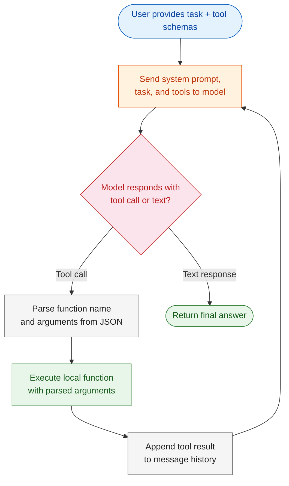

# Module 1: Client SDK Agent Loop

The Agent SDK's `query()` function handles the entire tool-use loop automatically — sending the task, dispatching tool calls, observing results, and re-prompting the model. But what does that loop look like under the hood?

This lab peels back the abstraction. You build the agent loop yourself using the OpenAI-compatible Client SDK (via OpenRouter), defining tools, managing conversation state, and dispatching tool calls by hand. By the end, you'll understand exactly what the Agent SDK does for you and why the loop architecture matters.

---

# Problem Statement / Use Case Overview

How does an LLM decide which tools to call, observe results, and iterate toward a final answer — all without human intervention at each step?

**The agent loop works in three stages:**

1. **Tool definition** — Each tool is defined as both a Python function and a JSON schema. The schema tells the model what the tool does, what arguments it expects, and what it returns.
2. **Autonomous reasoning** — The model receives a task and tool definitions, then decides which tools to call. It might call one tool, inspect the result, then call another — all without you directing it.
3. **Iterative refinement** — The model continues calling tools until it has enough information to produce a final answer. The conversation history (messages list) grows with each turn, giving the model full context of what it has done so far.

This is especially useful for:
- **Understanding agent internals** — Knowing how the loop works helps you debug, optimize, and extend agent behavior
- **Custom workflows** — When the Agent SDK's abstractions don't fit your use case, you can drop down to the raw API
- **Educational purposes** — Building the loop yourself reveals how tool-use LLMs reason and plan

---

# Input Data

| Item | Detail |
|------|--------|
| **System prompt** | Instructions defining the agent's role and behavior |
| **User task** | Natural-language task describing what the agent should do |
| **Target project** | Path to a codebase with TODO/FIXME comments to discover |
| **Tool definitions** | JSON schemas describing `read_file`, `glob`, and `grep` to the model |
| **Tool implementations** | Python functions that execute when the model calls a tool |
| **OpenRouter API Key** | Used to authenticate with the OpenAI-compatible API |

---

# Processing

### Overall Workflow



### The Agent Loop Explained

The core loop is simple but powerful:

1. **Send messages + tool definitions** to the model via the chat completions API
2. **Model responds** with either a text answer or a list of tool calls
3. **If tool calls** — parse the function name and arguments from JSON, execute the corresponding Python function, append the result as a `tool` role message, and go back to step 1
4. **If text** — the model has produced a final answer; return it

Each iteration adds to the `messages` list. The model sees the full history: what it said before, what tools it called, and what results it got back. This context is what enables the model to reason across multiple steps.

### Client SDK vs Agent SDK

| Aspect | Client SDK (this lab) | Agent SDK |
|--------|-----------------------|-----------|
| **Loop management** | You implement it manually | SDK handles it automatically |
| **Tool dispatch** | You parse JSON, call functions, format results | SDK does it internally |
| **Message history** | You maintain the `messages` list | SDK manages conversation state |
| **Flexibility** | Full control over every detail | Higher-level, faster to build |
| **Use case** | Learning, debugging, custom control flows | Production agents, rapid development |

---

# Output

A markdown report listing all TODO and FIXME comments found in the target codebase, grouped by file with line numbers and context:

> # TODO/FIXME Comments Report
>
> ## Summary
> - **Total files scanned:** 5
> - **Total TODO comments:** 8
> - **Total FIXME comments:** 5
>
> ## `data/tests/test_helpers.py`
> | Line | Type | Comment | Context |
> |------|------|---------|---------|
> | 7 | TODO | Add more edge cases for special characters | In `test_sanitize_input()` |
> | 13 | FIXME | Fails for .museum TLD | In `test_validate_email()` |

---

# Tech Stack

| Component | Tool |
|-----------|------|
| **API Client** | OpenAI Python SDK (`openai`) — communicates with the LLM API |
| **LLM** | Free model via OpenRouter (`nvidia/nemotron-3-ultra-550b-a55b:free`) |
| **Tool Execution** | Pure Python (`pathlib`, `re`) — file I/O and search |
| **Format** | JSON Schema — tool definitions sent to the model |
| **Language** | Python 3.10+ |
| **Environment** | `OPENROUTER_API_KEY` |

---

# Underlying Concepts (Summarized)

### Tool Definitions: Functions + Schemas

Every tool has two parts:

1. **The function** — plain Python code that does the work (e.g., `Path(path).read_text()`)
2. **The schema** — a JSON object that describes the tool to the LLM: its name, description, parameter names, types, and which parameters are required

The model never sees the Python code. It only sees the schema. When it decides to call a tool, it outputs a JSON object with the function name and argument values, which you parse and dispatch locally.

### The Messages Array

The conversation is a list of message objects, each with a `role`:

| Role | Purpose |
|------|---------|
| `system` | Sets the model's behavior and persona |
| `user` | The task or question from the human |
| `assistant` | The model's response (text or tool calls) |
| `tool` | The result of executing a tool call |

The agent loop appends to this list on every iteration, building a complete history that the model uses for上下文.

### MAX_ITERATIONS Safety Limit

The loop includes a `MAX_ITERATIONS` counter to prevent infinite loops. In practice, well-defined tasks complete in 3–8 iterations. If the model starts calling tools endlessly (e.g., searching files in a loop), the limit stops it.

---

# Pre-requisites

- **Basic familiarity** with Python (functions, `import` statements, JSON).
- **OpenRouter API Key** — sign up at [openrouter.ai](https://openrouter.ai) and create a key.
- **Python 3.10+** installed on your machine.
- **A codebase with TODO/FIXME comments** — the `data/` directory in this module has a sample project with annotated files.
- **Understanding of the agent loop concept** — task → reason → tool → observe → repeat.

---

# Environment / Dependencies Setup

| Package | Purpose |
|---------|---------|
| `openai` | OpenAI-compatible client for API calls via OpenRouter |
| `python-dotenv` | Loads API keys from a `.env` file |

```bash
pip install -q openai python-dotenv
```

## Configure API Key

Create a `.env` file in your project root with:

```
OPENROUTER_API_KEY=sk-or-v1-your-key-here
```

---

# Step-wise Instructions — Development

---

### Step 1 — Define the Tools

Each tool needs a Python function and a matching JSON schema. The function does the actual work; the schema tells the model what the function does and how to call it.

Define three tools:

- **`read_file(path)`** — Reads and returns a file's contents using `pathlib.Path.read_text()`.
- **`glob_files(pattern)`** — Finds files matching a glob pattern (e.g., `**/*.py`) using `pathlib.Path.glob()`.
- **`grep_files(pattern, path)`** — Searches file contents with a regex pattern using `re.compile()` and returns matching lines with file paths and line numbers.

Each schema follows the OpenAI tool format:

```python
{
    "type": "function",
    "function": {
        "name": "tool_name",
        "description": "What the tool does",
        "parameters": {
            "type": "object",
            "properties": {
                "param_name": {"type": "string", "description": "..."}
            },
            "required": ["param_name"]
        }
    }
}
```

Register all tools in two structures:
- **`TOOLS`** — a list of schemas sent to the model with each API call
- **`TOOL_MAP`** — a dict mapping tool names to Python functions for local dispatch

---

### Step 2 — Configure the Client

Initialize the OpenAI client with the OpenRouter base URL and your API key. Choose a model — the lab uses a free NVIDIA model on OpenRouter:

```python
client = OpenAI(
    base_url="https://openrouter.ai/api/v1",
    api_key=OPENROUTER_API_KEY,
)
MODEL = "nvidia/nemotron-3-ultra-550b-a55b:free"
```

Set the `TARGET_DIR` to the codebase you want the agent to analyze.

---

### Step 3 — Define the Task

Write a natural-language prompt describing what you want the agent to do. The model will decide which tools to call based on this prompt:

```python
TASK = f"""
Scan the codebase at {TARGET_DIR} and find all TODO and FIXME comments.
For each match, report: file path, line number, comment text, and context.
Organize as a markdown summary grouped by file.
"""
```

The key design principle: tell the model **what** to do, not **how**. The model figures out the tool sequence on its own.

---

### Step 4 — Run the Agent Loop

The agent loop is a `for` loop that:

1. Sends the full message history + tool definitions to the model via `client.chat.completions.create()`
2. Checks if the response contains `tool_calls` or text
3. If tool calls — executes each function locally via `TOOL_MAP`, appends the result as a `tool`-role message, and loops
4. If text — the model has produced its final answer; break and return

```python
messages = [
    {"role": "system", "content": "You are a code exploration assistant..."},
    {"role": "user", "content": TASK},
]

final_answer = None

for i in range(MAX_ITERATIONS):
    response = client.chat.completions.create(
        model=MODEL, messages=messages, tools=TOOLS,
    )
    if not response.choices:
        print(f"API returned no choices. Response: {response}")
        break

    message = response.choices[0].message

    if message.tool_calls:
        messages.append(message)
        for tool_call in message.tool_calls:
            func_name = tool_call.function.name
            func_args = json.loads(tool_call.function.arguments)
            result = TOOL_MAP[func_name](**func_args)
            messages.append({
                "role": "tool",
                "tool_call_id": tool_call.id,
                "content": json.dumps(result, default=str),
            })
    else:
        final_answer = message.content
        break
```

The model sees the full conversation history with each new request. This is how it maintains coherence across multiple tool calls.

---

### Step 5 — Result Summary

Use regex to parse the agent's free-form output and extract structured metrics:

```python
todo_count = len(re.findall(r'(?i)TODO', final_answer))
fixme_count = len(re.findall(r'(?i)FIXME', final_answer))
file_mentions = len(set(re.findall(r'\b[\w/]+\.py\b', final_answer)))
```

This demonstrates a common pattern: LLMs produce unstructured text, but you can post-process it with regex or a second LLM call to extract structured data.

---

### Step 6 — LLM Judge

Use a second LLM call to evaluate the agent's output. This is a common eval pattern — one LLM generates, another evaluates:

```python
judge_prompt = f"""
Evaluate the agent output on: COVERAGE, ACCURACY, COMPLETENESS, FORMAT.
Score each 1-5 and give an overall score. Be strict.

Respond with ONLY a compact JSON object and nothing else, using exactly these keys:
{{"coverage": <int 1-5>, "accuracy": <int 1-5>, "completeness": <int 1-5>, "format": <int 1-5>, "overall": <int 1-5>}}
"""
judge_response = client.chat.completions.create(
    model=MODEL,
    messages=[{"role": "user", "content": judge_prompt}],
)
```

LLMs may still wrap or pad the response with prose, so always parse the output defensively — try `json.loads()` first, then fall back to a regex extraction of the JSON object. If the response contains no JSON at all, re-prompt the judge to return strict JSON and retry a couple of times.

The judge checks:
- **Coverage** — Did the agent find all TODO/FIXME comments?
- **Accuracy** — Are reported items real comments (not false positives from strings)?
- **Completeness** — Did it include file paths and line numbers?
- **Format** — Is the output well-organized and readable?

---

# Optional Exercise

Challenge yourself to extend this lab:

- Add a `Write` tool that lets the agent create files, and implement a permission gate before execution.
- Switch from OpenRouter to the Anthropic API directly and compare the tool-call format.
- Add token usage tracking to measure cost per task.
- Implement a retry mechanism for failed API calls.
- Modify the system prompt to change the agent's behavior (e.g., "be extremely thorough" vs "be fast").

---

# What We Learnt

You built an agent loop from scratch using the raw Client SDK, giving you full visibility into how LLMs reason about and use tools.

**Key takeaways:**
- **The agent loop** — task → reason → tool call → observe → repeat — is the core pattern behind all LLM agents.
- **Tool definitions** require both a Python function (execution) and a JSON schema (description for the model).
- **Message history** is the model's memory — each iteration appends to the conversation, giving the model context for subsequent decisions.
- **Safety limits** like `MAX_ITERATIONS` prevent infinite loops in production.
- **Client SDK vs Agent SDK** — the Agent SDK automates everything you just built by hand. Understanding the loop helps you debug and customize agents when the abstraction isn't enough.
- **LLM Judge** — a second model call is a cheap, automated way to evaluate output quality.
