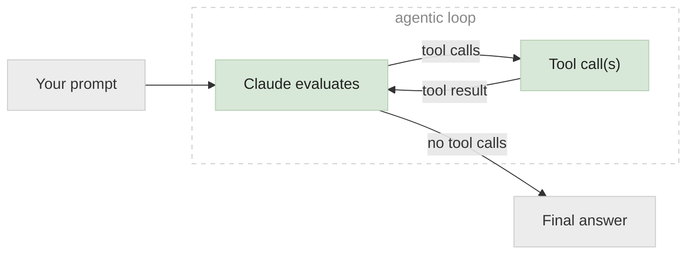
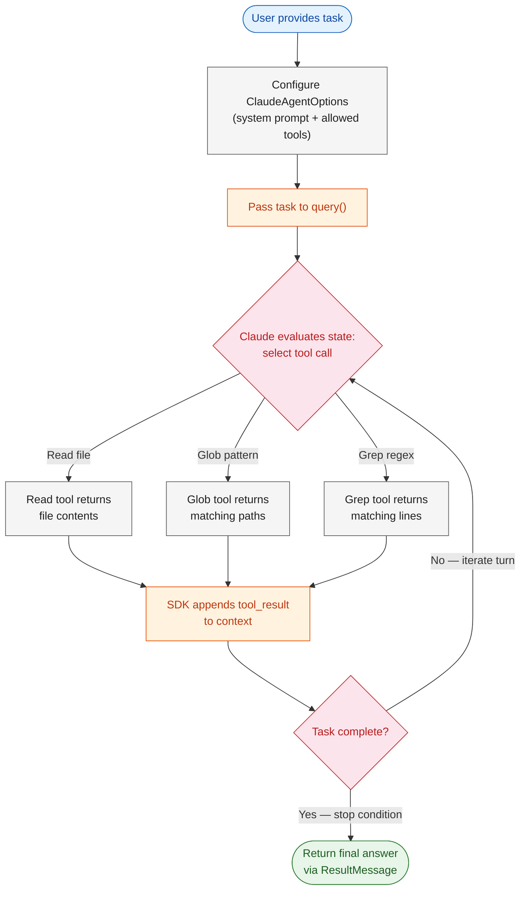
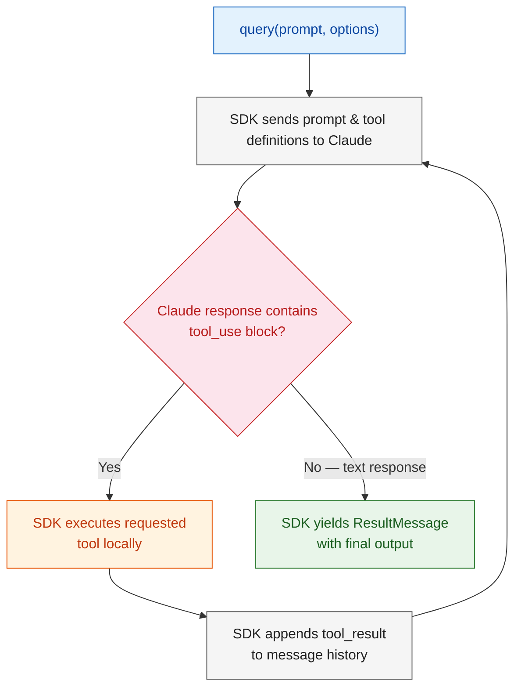

# Lab 1: The Agent Loop & Built-in Tools

> **The Agent SDK** acts as an event loop for tool use—repeatedly allowing Claude to reason, execute local actions, observe tool results, and adjust its plan until a task is completed. Rather than manually calling the API, parsing `tool_use` blocks, executing functions, and appending `tool_result` messages back into conversation history, the SDK orchestrates the entire cycle within a single, high-level execution context.



---

# Problem Statement / Use Case Overview

Consider building an automated code audit agent. The agent must explore an unknown codebase, locate targeted patterns (such as `TODO` and `FIXME` comments), inspect surrounding code context, and synthesize its findings into a structured report—without hardcoding file paths or manually managing conversation state.

**The pipeline executes across three primary stages:**

1. **Agent configuration** — Initialize execution options with a system prompt and an explicit whitelist of allowed tools (`Read`, `Glob`, `Grep`).
2. **Autonomous loop execution** — Pass a natural-language task prompt to `query()`. The agent evaluates necessary actions, executes tool calls locally, processes tool responses, and iterates until the goal is achieved.
3. **Structured synthesis** — The agent compiles its observations into a clean markdown summary report.

> [!NOTE]
> ### Why this matters
> Writing manual orchestrators for multi-turn tool interactions requires extensive boilerplate for state management, error handling, and message serialization. The Agent SDK abstracts these operational details into an automated runtime while keeping permission boundaries and budget controls fully explicit.

**Common application patterns include:**
- Automated codebase exploration and security auditing
- Continuous code quality reporting and refactoring analysis
- Automated technical debt tracking (locating temporary patches, `HACK`, or `DEPRECATED` annotations)
- Multi-step file inspection and data extraction workflows

---

# Input Data

| Component | Description |
|-----------|-------------|
| **System prompt** | Instructions defining the agent's role, constraints, and output requirements |
| **User task** | Natural-language prompt describing the audit goal and target directory |
| **Target directory** | Path to the local filesystem codebase scope open for inspection |
| **Allowed tools** | Explicit list of permitted tools (`["Read", "Glob", "Grep"]`) |
| **Anthropic API Key** | Used to authenticate with the Claude API via environment variable (`ANTHROPIC_API_KEY`) |

---

# Processing

### Overall Workflow



### The Agent Loop Internals



The execution loop operates in five distinct phases:

1. **Initialization (`query`)** — You invoke `query()` passing the user prompt and `ClaudeAgentOptions`. The SDK yields a `SystemMessage` with subtype `"init"` containing session metadata.
2. **Prompt Evaluation** — The SDK formats conversation history, system instructions, and tool definitions, sending them to Claude. Claude evaluates the context to determine the next action.
3. **Tool Execution (`tool_use`)** — If Claude requests tool execution via a `tool_use` block, the SDK validates permissions against `allowed_tools` and executes the function on your local filesystem.
4. **Observation (`tool_result`)** — The SDK serializes the tool result into a `tool_result` block, appends it to conversation history, and immediately triggers the next turn.
5. **Termination & Output** — Steps 2–4 repeat until Claude produces a response without tool calls or reaches a turn/budget limit. The SDK yields an `AssistantMessage` followed by a final `ResultMessage`.

> [!NOTE]
> ### Under the hood
> Each cycle of tool invocation and observation constitutes one **turn**. When multiple read-only tools are requested in a single turn (such as reading two independent files), the SDK executes them concurrently. State-modifying operations are executed sequentially to prevent race conditions.

---

# Tech Stack

| Component | Implementation | Role |
|-----------|----------------|------|
| **Agent SDK** | Anthropic Agent SDK (`claude_agent_sdk`) | Manages turn execution, state history, and local tool dispatch |
| **Foundation Model** | Claude 3.5 Sonnet / Claude 3.7 Sonnet | Evaluates context, determines task trajectory, and generates reports |
| **Built-in Tools** | `Read`, `Glob`, `Grep` | Native filesystem tools for reading content and pattern matching |
| **Runtime & Tooling** | Python 3.10+ & `uv` | Asynchronous runtime (`asyncio`) and fast package management (`uv`) |
| **Authentication** | `ANTHROPIC_API_KEY` | Environment variable for API request authorization |

---

# Underlying Concepts (Summarized)

### Standard Client SDK vs Agent SDK

| Dimension | Standard Client SDK (`anthropic`) | Agent SDK (`claude_agent_sdk`) |
|-----------|----------------------------------|--------------------------------|
| **Loop Control** | Manual — developer writes the request-response loop | Automatic — `query()` orchestrates multi-turn cycles internally |
| **State Management** | Manual — caller appends assistant messages and tool results | Automatic — SDK maintains context history and auto-compacts |
| **Tool Execution** | External — caller receives schema request and executes code | Local — SDK dispatches built-in and custom tools locally |
| **Primary Use Case** | Single-turn generations, strict custom pipelines | Autonomous multi-step workflows, agentic coding tasks |

When using the **Client SDK**, tool execution requires explicit loop management. When Claude returns a `tool_use` block, your code must parse the request, call the local function, format a `tool_result` message, append both messages to the request array, and invoke `messages.create()` again. This grants granular control but requires significant boilerplate.

When using the **Agent SDK**, calling `query()` delegates loop orchestration to the framework. You configure permitted capabilities via `ClaudeAgentOptions`, and the engine handles tool execution, context formatting, and iteration limits automatically.

> [!NOTE]
> ### Common misconception
> The Agent SDK does not replace the Client SDK; it operates at a higher level of abstraction. Use the Client SDK when you require custom message-level control or single-turn API access. Use the Agent SDK when building autonomous agents that need environment interaction, tool execution, and self-directed multi-step task completion.

### The `query()` Function

```python
async for message in query(
    prompt="Scan src/ for TODO annotations",
    options=ClaudeAgentOptions(allowed_tools=["Read", "Glob", "Grep"])
):
    if isinstance(message, ResultMessage):
        print(message.result)
```

`query()` is the primary execution interface. It returns an asynchronous generator yielding structured message events (`SystemMessage`, `AssistantMessage`, `UserMessage`, and `ResultMessage`) as the loop progresses.

### Configuring `allowed_tools`

Tool permissions enforce safety and operational boundaries:

```python
options = ClaudeAgentOptions(
    allowed_tools=["Read", "Glob", "Grep"],
)
```

> [!NOTE]
> ### Design rationale
> Restricting available capabilities via `allowed_tools` provides defense-in-depth. Tools omitted from `allowed_tools` cannot be executed automatically. This ensures an exploratory agent restricted to `Read`, `Glob`, and `Grep` cannot modify files or execute arbitrary shell commands.

---

# Pre-requisites

- **Python 3.10+** installed in your development environment
- **`uv` package manager** (optional, recommended for ultra-fast dependency resolution)
- **Anthropic API Key** — available from [console.anthropic.com](https://console.anthropic.com)
- **Local codebase** — directory containing source files to explore
- **Core Python knowledge** — familiarity with `asyncio` and async generators

---

# Environment / Dependencies Setup

Install required dependencies using `uv` (recommended) or `pip`:

| Package | Purpose |
|---------|---------|
| `uv` | Fast Python package manager and environment resolver |
| `claude-agent-sdk` | Anthropic Agent SDK framework |
| `rich` | Terminal text formatting and markdown rendering |
| `python-dotenv` | Loads environment variables from `.env` files |

```python
# Install dependencies using uv (or fallback to standard pip)
!uv pip install -q claude-agent-sdk rich python-dotenv || pip install -q claude-agent-sdk rich python-dotenv
```

## Import Libraries

Import required standard library and SDK components:

```python
import os
import asyncio
from dotenv import load_dotenv
from claude_agent_sdk import query, ClaudeAgentOptions, AssistantMessage, ResultMessage
from rich.console import Console
from rich.markdown import Markdown
```

## Configure Anthropic API Key

Load environment variables from a `.env` file to prevent hardcoding credentials:

```python
load_dotenv()

api_key = os.getenv("ANTHROPIC_API_KEY")
if not api_key:
    raise ValueError("ANTHROPIC_API_KEY environment variable is missing.")

print("Anthropic API key successfully loaded.")
```

---

# Step-wise Instructions — Development

---

### Step 1 — Initialize the Agent Options

Configure `ClaudeAgentOptions` to define system behavior and restrict tool access to read-only search utilities.

#### Configure the Agent

```python
TARGET_DIR = "data"  # Path to target codebase directory

# Define execution options and whitelist read-only tools
options = ClaudeAgentOptions(
    allowed_tools=["Read", "Glob", "Grep"],
)

console = Console()
console.print("[bold green]Agent options initialized.[/bold green]")
console.print(f"Allowed tools: {options.allowed_tools}")
```

---

### Step 2 — Define the Task

Specify the natural-language task prompt. High-quality prompts describe the desired objective, required constraints, and output structure clearly while leaving execution strategy to the model.

```python
TARGET_DIR = "data"

TASK = f"""
Scan the codebase located at '{TARGET_DIR}' and identify all TODO and FIXME comments.

For each match, detail:
- Relative file path
- Line number
- Comment text
- Brief summary of the task or issue described

Organize output into a clean markdown document grouped by file.
"""
```

---

### Step 3 — Run the Agent Loop

Execute `query()` inside an asynchronous function. The SDK manages turn iterations, tool calls, and message history automatically.


```python
async def execute_audit(task_prompt: str, agent_options: ClaudeAgentOptions) -> str:
    final_output = ""
    async for message in query(prompt=task_prompt, options=agent_options):
        if isinstance(message, ResultMessage):
            if message.subtype == "success":
                final_output = message.result
            else:
                final_output = f"Execution stopped with status: {message.subtype}"
    return final_output

# Execute the asynchronous query loop
response_text = asyncio.run(execute_audit(TASK, options))

console.print("\n[bold cyan]--- Agent Response ---[/bold cyan]\n")
console.print(Markdown(response_text))
```

---

### Step 4 — Save the Report

Persist the generated audit report to a local file.

```python
REPORT_PATH = "todo_fixme_report.md"

with open(REPORT_PATH, "w", encoding="utf-8") as f:
    f.write(f"# Codebase TODO / FIXME Audit\n\n")
    f.write(f"Target directory: `{TARGET_DIR}`\n\n")
    f.write(response_text)

console.print(f"[bold green]Audit report written to {REPORT_PATH}[/bold green]")
```

---

# Optional Exercise

Extend the agent workflow to experiment with loop parameters and tool configurations:

- **Expand search targets**: Modify the prompt to locate `HACK`, `DEPRECATED`, or `XXX` annotations.
- **Permission testing**: Add `Edit` or `Write` to `allowed_tools` and prompt the agent to fix a simple `TODO` item. Observe how the tool list alters agent planning.
- **Turn and budget limits**: Set `max_turns=3` or `max_budget_usd=0.05` on `ClaudeAgentOptions` to test early termination behavior and handle `error_max_turns` in `ResultMessage`.
- **Reasoning depth**: Adjust the `effort` setting (`"low"`, `"medium"`, or `"high"`) on options to compare token usage and response latency.

---

# What We Learnt

In this lab, you implemented an autonomous single-agent workflow using the Anthropic Agent SDK.

**Key takeaways:**
- **Agent SDK vs Client SDK** — The Client SDK requires manual tool dispatch and context updating. The Agent SDK automates this loop via `query()`.
- **`query()` interface** — A single async generator call manages prompt evaluation, local tool execution, state updates, and termination conditions.
- **Built-in tools** — Built-in tools like `Read`, `Glob`, and `Grep` give agents filesystem exploration capabilities out of the box.
- **Explicit tool permissioning** — `allowed_tools` defines strict operational boundaries, enabling safe autonomous execution.
- **Turn-based loop execution** — Each cycle of model evaluation, tool execution, and result ingestion forms a turn, continuing until Claude returns a final text response.
