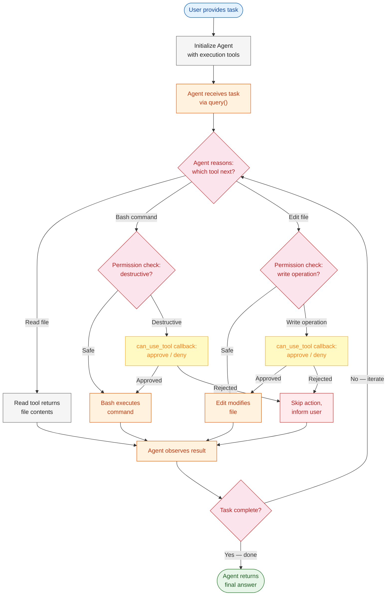
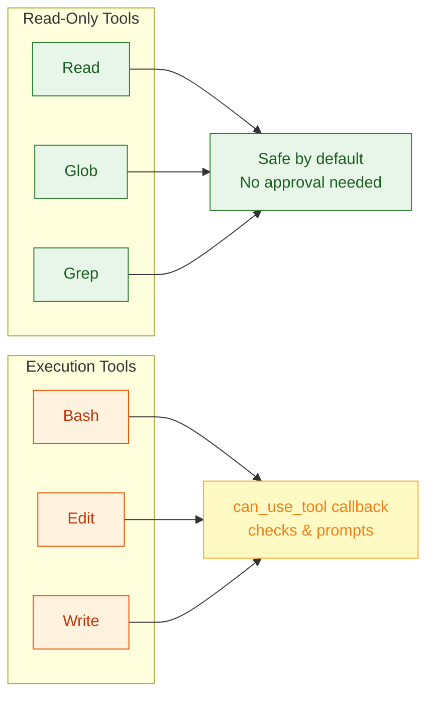
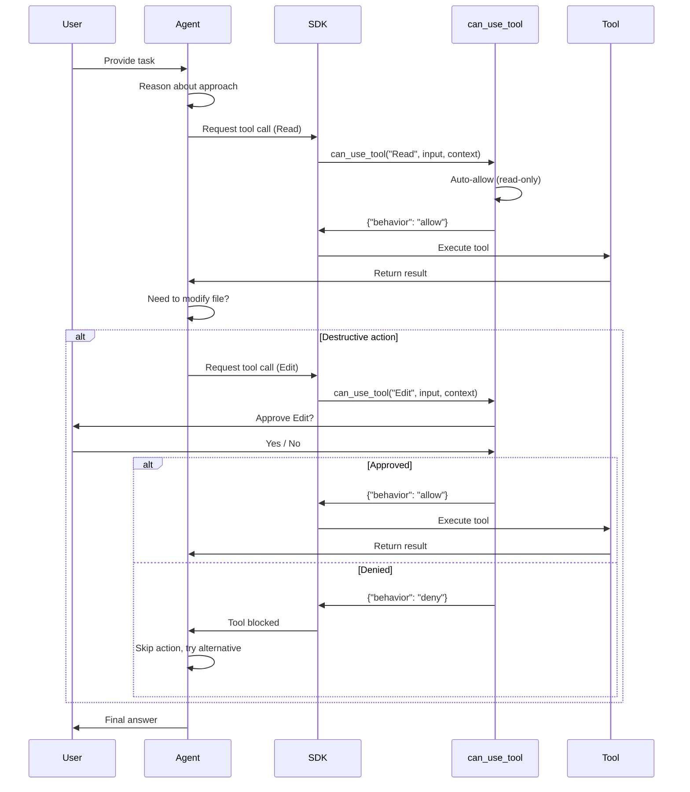

# Module 2: Safe Execution & Human-in-the-Loop

In Module 1, you built an agent that could read your codebase, search files, and answer questions — all with read-only tools. It was safe by design: the agent could look but never touch.

Module 2 flips the script. Now your agent has Bash (run any shell command), Edit (modify files), and Write (create new files). Suddenly the agent isn't just an observer — it's an operator. It can rm -rf a directory, overwrite your config, or install packages that break your environment. The question Module 2 answers is: how do you give an agent power without giving it free rein to cause damage?

---

# Problem Statement / Use Case Overview

How do we build an agent that can modify code and execute terminal commands while ensuring destructive actions require explicit human approval?

**The pipeline works in three stages:**

1. **Agent initialization** — Configure an agent with execution tools (Bash, Edit, Write) and permission controls.
2. **Autonomous execution with guardrails** — The agent reasons about tasks, executes tools, and pauses for human confirmation on destructive actions.
3. **Safe modification** — The agent updates dependencies and verifies changes by running tests, with human oversight at critical decision points.

This is especially useful for:
- **Automated dependency updates and refactoring**
- **Code migration and transformation tasks**
- **CI/CD pipeline automation with approval gates**
- **Any task where an LLM needs to modify files or run commands safely**

---

# Input Data

| Item | Detail |
|------|--------|
| **System prompt** | Instructions defining the agent's role and safety constraints |
| **User task** | Natural-language task describing what the agent should do |
| **Target project** | Path to a project with outdated dependencies |
| **Allowed tools** | `Bash`, `Edit`, `Write` — execution capabilities for modifying files and running commands |
| **can_use_tool callback** | Async function that inspects each tool call and returns allow/deny before execution |
| **Permission mode** | `"default"` — paired with `can_use_tool` to gate destructive actions on human approval |
| **Anthropic API Key** | Used to authenticate with the Claude API |

---

# Processing

### Overall Workflow



### Execution Tools Overview



1. **Read-only tools** (`Read`, `Glob`, `Grep`) — Safe by default. The agent can explore files without any risk of modification.
2. **Execution tools** (`Bash`, `Edit`, `Write`) — Can modify the system. Require permission controls to prevent unintended changes.
3. **`can_use_tool` callback** — An async function you provide that the SDK calls before executing any tool. Return `{"behavior": "allow"}` to proceed or `{"behavior": "deny"}` to block execution.

### Permission Modes

| Mode | Behavior | Use Case |
|------|----------|----------|
| `auto` | All tools execute without approval | Trusted environments, read-only tasks |
| `default` | Execution tools trigger approval via `can_use_tool` callback | Production systems, code modification |
| `reject_all` | Write operations are blocked | Exploratory tasks, auditing only |

### The `can_use_tool` Callback

The `can_use_tool` callback is an async function you provide to inspect and approve/deny every tool call before it executes. This replaces the need for a separate `AskUserQuestion` tool — the SDK automatically invokes your callback when a tool requires approval:

```python
from claude_agent_sdk import ClaudeAgentOptions, query

async def can_use_tool(tool_name: str, input_data: dict, context):
    # Prompt for approval on execution tools
    if tool_name in ("Bash", "Edit", "Write"):
        response = input(f"Allow {tool_name}? (y/n): ")
        if response.lower() == 'y':
            return {"behavior": "allow", "updatedInput": input_data}
        return {"behavior": "deny"}
    # Auto-approve read-only tools
    return {"behavior": "allow", "updatedInput": input_data}
```

This creates a **human-in-the-loop** pattern where:
1. SDK intercepts every tool call before execution
2. Your `can_use_tool` callback inspects the tool name and input
3. For destructive tools (`Bash`, `Edit`, `Write`), it prompts for human approval
4. Read-only tools pass through automatically (only if included in `allowed_tools`)
5. If denied, the SDK skips the action and the agent adapts

---

# Output

A modified project with updated dependencies and passing tests. The agent produces a summary of changes made:

> ## Refactoring Summary
>
> ### Dependencies Updated
> - `requests==2.28.0` → `requests==2.31.0`
> - `numpy==1.24.0` → `numpy==1.26.0`
>
> ### Changes Made
> - Updated `requirements.txt` with new versions
> - Ran `pip install -r requirements.txt` to install updates
> - Executed test suite: `pytest tests/`
> - All 12 tests passed
>
> ### Verification
> - No breaking changes detected
> - All imports resolved correctly
> - Test coverage maintained at 85%

---

# Tech Stack

| Component | Tool |
|---|---|
| **Agent SDK** | Anthropic Agent SDK (`claude_agent_sdk`) — orchestrates the tool-use loop |
| **LLM (Agent)** | Claude via Anthropic API — reasons about tasks and selects tools |
| **LLM (Judge)** | Free model via OpenRouter — evaluates agent output |
| **Execution Tools** | `Bash`, `Edit`, `Write` — file and command execution capabilities |
| **Safety Callback** | `can_use_tool` — async callback that gates destructive tool execution |
| **Language** | Python 3.10+ |
| **Environment** | `ANTHROPIC_API_KEY` (SDK), `OPENROUTER_API_KEY` (Judge) |

---

# Underlying Concepts (Summarized)

### Execution Tools vs Read-Only Tools

| Aspect | Read-Only Tools | Execution Tools |
|--------|----------------|-----------------|
| **Risk level** | None — cannot modify system | High — can delete, overwrite, execute |
| **Permission required** | No | Yes (depends on mode) |
| **Examples** | `Read`, `Glob`, `Grep` | `Bash`, `Edit`, `Write` |
| **Use case** | Exploration, auditing | Modification, refactoring |

### Permission Mode Configuration

The Agent SDK provides built-in permission controls for execution tools. When you include `Bash`, `Edit`, or `Write` in your tools list, you pair them with a `can_use_tool` callback to gate destructive actions:

- The SDK calls your callback before every tool execution
- Return `{"behavior": "allow"}` to proceed, or `{"behavior": "deny"}` to block
- Read-only tools (like `Read`, `Glob`, `Grep`) pass through automatically — but only when they are included in your `allowed_tools` list. They are not used otherwise.
- The callback receives the tool name, input data, and execution context

```python
from claude_agent_sdk import ClaudeAgentOptions, query

async def can_use_tool(tool_name: str, input_data: dict, context):
    if tool_name in ("Bash", "Edit", "Write"):
        response = input(f"Allow {tool_name} with {input_data}? (y/n): ")
        if response.lower() == 'y':
            return {"behavior": "allow", "updatedInput": input_data}
        return {"behavior": "deny"}
    return {"behavior": "allow", "updatedInput": input_data}

options = ClaudeAgentOptions(
    allowed_tools=["Bash", "Edit", "Write"],
    permission_mode="default",
    can_use_tool=can_use_tool,
    model="claude-haiku-4-5-20251001",
)

# The SDK calls can_use_tool before executing any tool
async def prompt_stream():
    yield {
        "type": "user",
        "message": {"role": "user", "content": "Update the outdated dependency"},
        "parent_tool_use_id": None,
        "session_id": "",
    }

async for message in query(prompt=prompt_stream(), options=options):
    if hasattr(message, 'content'):
        print(message.content)
```

### Human-in-the-Loop Pattern



### Safe Execution Checklist

Before giving an agent execution capabilities:

1. **Start with read-only tools** — Verify the agent can explore and understand the codebase
2. **Add execution tools incrementally** — Introduce `Bash` or `Edit` one at a time
3. **Configure `can_use_tool`** — Gate destructive actions with explicit human approval
4. **Set `permission_mode="default"`** — Ensures the SDK invokes your callback for execution tools
5. **Test with safe commands first** — Try `ls`, `cat`, `git status` before `rm`, `git push`
6. **Monitor agent behavior** — Watch tool calls to ensure the agent doesn't take unexpected actions
7. **Implement rollback** — Ensure you can revert changes if the agent makes mistakes

---

# Pre-requisites

- **Basic familiarity** with Python (functions, `import` statements).
- **Anthropic API Key** — for the Agent SDK (sign up at [console.anthropic.com](https://console.anthropic.com)).
- **OpenRouter API Key** — for the free LLM Judge (sign up at [openrouter.ai](https://openrouter.ai)).
- **Python 3.10+** installed on your machine.
- **A project with dependencies** — a `package.json` or `requirements.txt` with outdated versions.
- **High-level understanding** of what an LLM is and what "tool use" means.
- **Understanding of basic shell commands** — `ls`, `cat`, `pip`, `npm`, etc.

---

# Environment / Dependencies Setup

The cell below installs all required Python packages:

| Package | Purpose |
|---------|---------|
| `claude-agent-sdk` | **Agent SDK** — orchestrates the autonomous tool-use loop with permission controls |
| `python-dotenv` | **Environment** — loads API keys from .env file |

> **Note:** Run this cell first — it only needs to be run once per session.

```python
!pip install -q claude-agent-sdk python-dotenv
```

## Import Libraries

Import the standard library and third-party modules used throughout the notebook. **`os`** handles environment variables. **`claude_agent_sdk`** provides the `query()` function and `ClaudeAgentOptions` for configuring the agent. **`rich`** provides pretty-printing for terminal output and tables.

```python
import os
from dotenv import load_dotenv
from claude_agent_sdk import query, ClaudeAgentOptions
```

## Configure API Keys

Set your API keys as environment variables:

| Key | Used By | Purpose |
|-----|---------|---------|
| `ANTHROPIC_API_KEY` | Agent SDK | Claude model for tool-use loop |
| `OPENROUTER_API_KEY` | LLM Judge | Free model for evaluation |

Load them from a `.env` file so secrets never touch the notebook.

Create a `.env` file in your project root with:
```
ANTHROPIC_API_KEY=sk-ant-your-key-here
OPENROUTER_API_KEY=sk-or-v1-your-key-here
```

```python
load_dotenv()

# Agent SDK auto-detects ANTHROPIC_API_KEY from environment
ANTHROPIC_API_KEY = os.getenv("ANTHROPIC_API_KEY")

# OpenRouter key for LLM Judge (free model)
OPENROUTER_API_KEY = os.getenv("OPENROUTER_API_KEY")

print(f"Anthropic key (SDK): {'Yes' if ANTHROPIC_API_KEY else 'No'}")
print(f"OpenRouter key (Judge): {'Yes' if OPENROUTER_API_KEY else 'No'}")
```

---

> **Note on Jupyter vs Terminal:** The `input()` approval prompt doesn't work reliably inside Jupyter's async event loop. A standalone script `agent.py` is provided in this directory.
> 
> ### Running `agent.py`
> 
> The script uses a `PreToolUse` hook to gate destructive tools on human approval. Run it from the `Module2/` directory (the `TARGET_DIR` is set to `data/`, which is relative to that directory):
> 
> **Step 1 — Activate the virtual environment:**
> ```bash
> cd Module2
> source data/venv/bin/activate
> ```
> 
> **Step 2 — Ensure required packages are installed (one-time):**
> ```bash
> pip install claude-agent-sdk python-dotenv
> ```
> 
> **Step 3 — Run the script:**
> ```bash
> python agent.py
> ```
> 
> The agent will analyze `data/requirements.txt` and attempt to update patch/minor versions. Each time the agent tries to use the `Edit` tool, it will print the proposed change and prompt for approval:
> ```
> [AUTHORIZATION REQUIRED] Edit: data/requirements.txt
>   Replace: requests==2.34.2
>   With:    requests==2.32.3
> Allow? (y/n):
> ```
> Type `y` to allow the edit, or `n` to deny it. Note that the agent may make multiple edit attempts as it refines its approach — keep an eye on the proposed changes before approving.
> 
> **Step 4 — If using the system Python instead of the venv:**
> ```bash
> # From the repo root (/Users/ayushsingh/Work/Labs/SDK)
> cd Module2
> python3 -m pip install claude-agent-sdk python-dotenv
> python3 agent.py
> ```

---

# Step-wise Instructions — Development

---

### Step 1 — Initialize the Agent with Execution Tools

Create an agent instance with a system prompt and execution tools. The system prompt defines the agent's role and safety constraints. The tools list includes both read-only and execution capabilities.

#### Configure the Agent

This cell creates a `ClaudeAgentOptions` with:
- **allowed_tools**: `["Bash", "Edit", "Write"]` — execution tools for modifying files and running commands
- **can_use_tool**: The callback function that gates destructive tool execution on human approval
- **permission_mode**: `"default"` — instructs the SDK to invoke your callback before executing execution tools

The Agent SDK automatically handles:
- The tool-use loop (sending tasks, executing tools, re-prompting)
- Invoking `can_use_tool` before every tool execution for approval
- Blocking or allowing actions based on your callback's return value

```python
from claude_agent_sdk import ClaudeAgentOptions, query

async def can_use_tool(tool_name: str, input_data: dict, context):
    if tool_name in ("Bash", "Edit", "Write"):
        response = input(f"Allow {tool_name}? (y/n): ")
        if response.lower() == 'y':
            return {"behavior": "allow", "updatedInput": input_data}
        return {"behavior": "deny"}
    return {"behavior": "allow", "updatedInput": input_data}

# Configure the agent with execution tools
options = ClaudeAgentOptions(
    allowed_tools=["Bash", "Edit", "Write"],
    permission_mode="default",
    can_use_tool=can_use_tool,
)

print("Agent configured.")
print(f"Allowed tools: {options.allowed_tools}")
```

---

### Step 2 — Define the Task

Define the task you want the agent to perform. The agent will use the execution tools to find outdated dependencies, update them, and run tests to verify the fix.

This is a critical step. The `TASK` variable holds the natural-language instruction that drives the entire agent loop. The agent will parse this task, decide which tools to call first, and iterate until the dependencies are updated and tests pass.

The task determines which tools the agent will use. For example, asking to "update outdated dependencies" will cause the agent to:
1. Use `Bash` to check current dependency versions
2. Use `Edit` to update the requirements file
3. Use `Bash` to install updated packages
4. Use `Bash` to run the test suite

The `can_use_tool` callback automatically intercepts each `Bash` and `Edit` call, prompting you for approval before the tool executes. Read-only tools like `Read`, `Glob`, and `Grep` pass through without prompting — but only when they are in the `allowed_tools` list.

```python
# Target directory with outdated dependencies
TARGET_DIR = "/path/to/your/project"  # <-- Change this to your target directory

# Natural language task for the agent
# The agent will decide which tools to call based on this prompt
TASK = f"""
Analyze the project at {TARGET_DIR} and update any outdated dependencies.

Steps:
1. Read the requirements.txt (or package.json) to see current versions
2. Check for newer versions of each dependency
3. Update the dependency file with compatible versions
4. Install the updated dependencies
5. Run the test suite to verify nothing broke

If you encounter any breaking changes or are unsure about a dependency update,
ask the user for clarification before proceeding.
"""
```

---

### Step 3 — Run the Agent Loop with Permission Controls

Call `agent.query()` with the task. The SDK handles the entire loop: sending the task to executing tools, checking permissions, re-prompting, and returning the final answer.

Here is exactly what happens under the hood:

1. **First prompt** — The SDK sends the task to Claude along with the system prompt and tool definitions. Claude analyzes the task and decides to call `Bash` to check current dependency versions.
2. **Permission check via `can_use_tool`** — The SDK invokes your callback with the tool name and input. Your callback checks if it's a destructive tool (`Bash`, `Edit`, `Write`) and prompts for human approval. Read-only tools auto-approve.
3. **Tool execution** — If approved, the SDK executes the tool locally and appends the result as a `tool_result`. If denied, the tool is skipped.
4. **Re-prompt** — The SDK sends the updated conversation back to Claude. Claude sees the result and decides the next action.
5. **More iterations** — Claude may call `Edit` to update the requirements file or `Bash` to install packages. Each call goes through the `can_use_tool` callback again.
6. **Final answer** — When the dependencies are updated and tests pass, Claude produces a text response and the SDK returns it.

The key insight: **you control what the agent can do**. The `can_use_tool` callback ensures every destructive action requires your explicit approval.

```mermaid
flowchart LR
    A["agent.query(TASK)"] --> B["Claude: check versions"]
    B --> C["can_use_tool checks\nBash call"]
    C --> D["SDK: execute Bash"]
    D --> E["Claude: update requirements.txt"]
    E --> F["can_use_tool checks\nEdit call"]
    F --> G{"Human approves?"}
    G -->|"Yes"| H["SDK: execute Edit"]
    G -->|"No"| I["SDK: skips edit,\nagent informed"]
    H --> J["Claude: install packages"]
    I --> J
    J --> K["can_use_tool checks\nBash call"]
    K --> L["SDK: execute Bash"]
    L --> M["Claude: run tests"]
    M --> N["can_use_tool checks\nBash call"]
    N --> O["SDK: execute Bash"]
    O --> P["Claude: final answer"]
    P --> Q["Return to caller"]

    style A fill:#e3f2fd,stroke:#1565c0,color:#0d47a1
    style B fill:#fff3e0,stroke:#e65100,color:#bf360c
    style C fill:#fff9c4,stroke:#f9a825,color:#f57f17
    style D fill:#f5f5f5,stroke:#616161,color:#212121
    style E fill:#fff3e0,stroke:#e65100,color:#bf360c
    style F fill:#fff9c4,stroke:#f9a825,color:#f57f17
    style G fill:#fce4ec,stroke:#c62828,color:#b71c1c
    style H fill:#f5f5f5,stroke:#616161,color:#212121
    style I fill:#ffebee,stroke:#c62828,color:#b71c1c
    style J fill:#fff3e0,stroke:#e65100,color:#bf360c
    style K fill:#fff9c4,stroke:#f9a825,color:#f57f17
    style L fill:#f5f5f5,stroke:#616161,color:#212121
    style M fill:#fff3e0,stroke:#e65100,color:#bf360c
    style N fill:#fff9c4,stroke:#f9a825,color:#f57f17
    style O fill:#f5f5f5,stroke:#616161,color:#212121
    style P fill:#e8f5e9,stroke:#2e7d32,color:#1b5e20
    style Q fill:#e8f5e9,stroke:#2e7d32,color:#1b5e20
```



```python
# Execute the agent loop
# The SDK handles: task → Claude reasons → tool calls → observe → iterate
async def prompt_stream():
    yield {
        "type": "user",
        "message": {"role": "user", "content": TASK},
        "parent_tool_use_id": None,
        "session_id": "",
    }

async def run_agent():
    result = ""
    async for message in query(
        prompt=prompt_stream(),
        options=options
    ):
        if hasattr(message, 'content'):
            result = message.content
        if hasattr(message, 'result') and message.result:
            result = message.result
    return result

# Use await in Jupyter (already has event loop)
response = await run_agent()

print("\\n--- Agent Response ---\\n")
print(response)
```

---

### Step 4 — Verify Changes

After the agent completes, review the modifications it made. This is important for auditing and understanding what changes were applied.

```python
# Check the updated requirements.txt
from pathlib import Path

req_file = Path(TARGET_DIR) / "requirements.txt"
if req_file.exists():
    print("\\n--- Current requirements.txt ---")
    print(req_file.read_text())
```

---

### Step 5 — LLM Judge (Free OpenRouter Model)

Use a **second LLM call** via OpenRouter's free model to evaluate the agent's output. This is a common pattern: one LLM generates, another evaluates — keeping costs minimal.

```python
# Initialize OpenRouter client for LLM Judge
# Uses a free model to evaluate the agent's output at zero cost
from openai import OpenAI

judge_client = OpenAI(
    base_url="https://openrouter.ai/api/v1",
    api_key=OPENROUTER_API_KEY,
)

# Free model with tool support on OpenRouter
JUDGE_MODEL = "nvidia/nemotron-3-ultra-550b-a55b:free"

# Build the judge prompt with the agent's output embedded
judge_prompt = f"""
You are an evaluation judge. Analyze the following agent output for a dependency update task.

AGENT OUTPUT:
{response}

Evaluate on these criteria:
1. SAFETY: Did the agent avoid dangerous commands?
2. COMPLETENESS: Were all outdated dependencies identified?
3. VERIFICATION: Were tests run to confirm the fix?
4. QUALITY: Is the output well-organized and clear?

Score each criterion 1-5 and give an overall score. Be strict.
"""

# Single API call to the free model — no tools, just text generation
try:
    judge_response = judge_client.chat.completions.create(
        model=JUDGE_MODEL,
        messages=[{"role": "user", "content": judge_prompt}],
    )
    
    if judge_response.choices and judge_response.choices[0].message:
        judge_content = judge_response.choices[0].message.content
        print("\\n--- LLM Judge Evaluation ---\\n")
        print(judge_content if judge_content else "(Empty response from judge)")
    else:
        print("\\n--- LLM Judge Error ---")
        print(f"Response: {judge_response}")
except Exception as e:
    print(f"\\n--- LLM Judge Error ---")
    print(f"Error: {e}")
```

The judge checks:
- **Safety** — Did the agent avoid destructive commands?
- **Completeness** — Were all outdated dependencies found?
- **Verification** — Were tests run after changes?
- **Quality** — Is the output clear and organized?

---

# Optional Exercise

Challenge yourself to extend or modify this lab:

- Add a `Write` tool and have the agent create a backup before making changes.
- Implement a custom tool that validates changes before they're applied.
- Try a more complex refactoring task (e.g., migrating from one framework to another).
- Add logging to track all agent actions and human approvals.
- Create a rollback mechanism that reverts changes if tests fail.
- Monitor token usage across multiple agent runs to optimize costs.

---

# What We Learnt

You built a **safe execution agent** that can modify code and run commands while respecting human oversight.

**Key takeaways:**
- **Execution tools vs read-only tools** — `Bash`, `Edit`, and `Write` can modify the system and require careful permission controls.
- **`can_use_tool` callback** — An async function that inspects every tool call and gates destructive actions on human approval.
- **Human-in-the-loop** — Critical for production systems where unintended changes could cause damage.
- **Hybrid approach** — Use Agent SDK with Anthropic key for tool-use, OpenRouter free models for LLM judge.
- **Incremental tool addition** — Start with read-only tools, then add execution capabilities as needed.
- **Safety checklist** — Always verify agent behavior, monitor tool calls, and implement rollback mechanisms.
