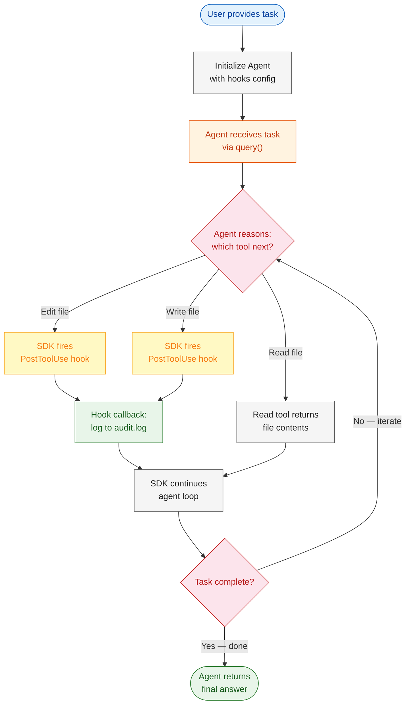
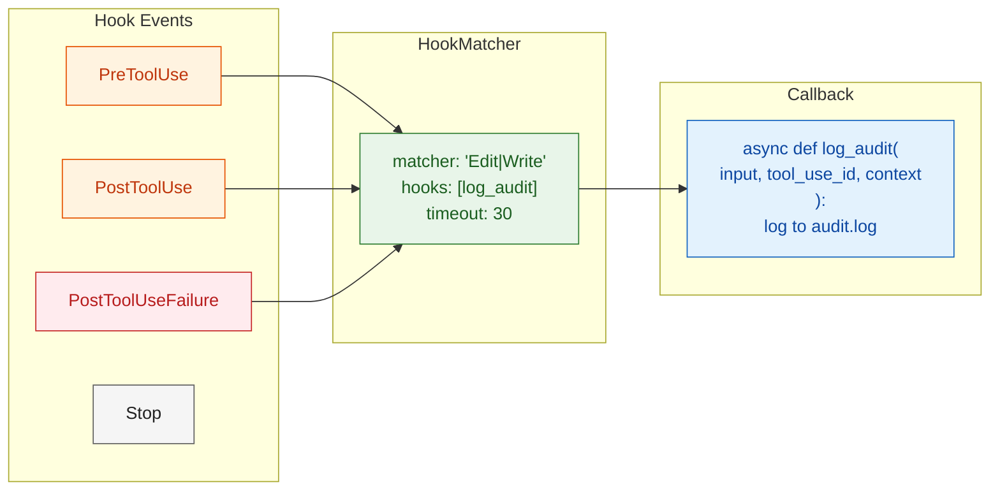
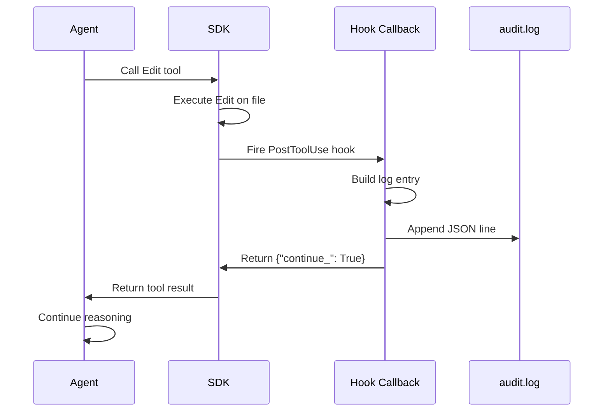

# Module 3: Observability & Lifecycle Hooks

In Module 2, you gave your agent write access with safety guardrails. But in production, safety isn't enough — you also need **visibility**. When an agent modifies files across a codebase, you need to know *what* changed, *when*, and *why*.

Module 3 introduces **lifecycle hooks** — callback functions that let you observe and react to the agent's every move. You'll build an audit trail that logs every file edit to `audit.log`, turning a black-box agent into a transparent, auditable system.

### What is a Hook?

A **hook** is a callback function that fires automatically at specific points in the agent's tool-use lifecycle, letting you observe, log, or gate actions without modifying the agent's core logic.

### How Hooks Work in the SDK

1. **Register** — Bind async callback functions to **hook events** (`PreToolUse`, `PostToolUse`, `PostToolUseFailure`, `Stop`) using a `HookMatcher` that specifies which tool names (regex, e.g. `"Edit|Write"`) trigger which callbacks, plus a timeout.
2. **Fire** — When the agent calls a matched tool (like `Edit`), the SDK intercepts the call at the configured event point and invokes your callback with typed parameters (`input`, `tool_use_id`, `context`).
3. **React** — Your callback runs (logs to `audit.log`, checks permissions, etc.) and returns `{"continue_": True}` to let the agent proceed or `{"continue_": False}` to halt.

Hooks are **non-invasive** — the agent never knows they exist. They're wired via `ClaudeAgentOptions.hooks`, not embedded in the agent's prompt or code, making them ideal for cross-cutting concerns like audit trails, compliance, and monitoring.

---

# Problem Statement / Use Case Overview

The SDK lacks built-in durable execution out of the box, making observability critical for production deployments. How do you track every file change an agent makes without modifying the agent's code?

**The pipeline works in three stages:**

1. **Hook registration** — Bind callback functions to specific tool events (PreToolUse, PostToolUse).
2. **Autonomous execution with observation** — The agent runs as usual; hooks fire automatically on matched tool calls.
3. **Audit trail** — Every file modification is logged with timestamp, file path, and context to a local `audit.log`.

This is especially useful for:
- **Compliance tracking** in regulated environments
- **Debugging** unexpected agent behavior
- **CI/CD pipelines** where every change must be recorded
- **Multi-agent systems** where you need to attribute changes to specific agents

---

# Input Data

| Item | Detail |
|------|--------|
| **System prompt** | Instructions defining the agent's role |
| **User task** | Natural-language task for the agent |
| **Hook callbacks** | Python functions registered on `PostToolUse` for `Edit` and `Write` tools |
| **HookMatcher** | Configuration matching tools to their callback functions |
| **Target project** | Path to a project the agent will modify |
| **Anthropic API Key** | Used to authenticate with the Claude API |

---

# Processing

### Overall Workflow



### Lifecycle Hooks Overview



1. **Hook Events** — Points in the agent loop where hooks can fire (`PreToolUse`, `PostToolUse`, `PostToolUseFailure`, `Stop`, etc.). Each event fires at a specific moment in the tool-use lifecycle, giving you fine-grained control over when your callbacks execute.
2. **HookMatcher** — Matches specific tools (by name) to callback functions. The matcher uses a regex-style pipe-separated pattern (e.g., `"Edit|Write"`) to select which tools trigger which hooks, with a configurable timeout to prevent hung callbacks from blocking the agent loop.
3. **Callback** — Your Python function that receives the hook input and can log, modify, or block execution. Callbacks are async functions that accept typed parameters (`input`, `tool_use_id`, `context`) and return a `HookJSONOutput` dict. Returning `{"continue_": True}` lets the agent proceed; returning `{"continue_": False}` or raising an exception can halt or redirect execution.

### Available Hook Events

| Event | When It Fires | Common Use | HookInput Contains |
|-------|---------------|------------|-------------------|
| `PreToolUse` | Before a tool executes | Validation, permission gating — inspect the tool name and input to decide whether to allow or block execution | `tool_name`, `tool_input` (the full input dict the tool will receive), `session_id` |
| `PostToolUse` | After a tool succeeds | Logging, audit trails — record what the agent did, including the tool's output | `tool_name`, `tool_input`, `tool_result` (the output returned by the tool), `session_id` |
| `PostToolUseFailure` | After a tool fails | Error tracking, alerts — capture failure details for debugging | `tool_name`, `tool_input`, `error` (exception or error message), `session_id` |
| `Stop` | When the session stops | Cleanup, summary reports — flush buffers, close connections, generate a session summary | `session_id`, `stop_reason` (e.g., `"end_turn"`, `"max_tokens"`) |

### The `HookMatcher` Configuration

```python
from claude_agent_sdk import HookMatcher

# Match Edit and Write tools, bind a logging callback
matcher = HookMatcher(
    matcher="Edit|Write",           # pipe-separated tool names
    hooks=[log_audit_callback],     # list of async functions
    timeout=30,                     # seconds before hook times out
)
```

The matcher field uses a pipe-separated list of tool names (it is treated as a regex pattern internally). When the agent calls any matched tool, the SDK fires the hook event and runs your callbacks. You can register multiple `HookMatcher` instances under the same event, each matching different tools with different callbacks. The `timeout` parameter (in seconds) prevents a slow or stuck callback from holding up the agent loop — if the callback exceeds the timeout, the SDK cancels it and proceeds with `{"continue_": True}` as the fallback.

### The Audit Logging Callback

```python
import json
from datetime import datetime, timezone

async def log_audit(input, tool_use_id, context):
    """Log every Edit/Write to audit.log with timestamp and file path."""
    file_path = input.get("tool_input", {}).get("file_path", "unknown")
    entry = {
        "timestamp": datetime.now(timezone.utc).isoformat(),
        "tool": input["tool_name"],
        "file_path": file_path,
        "tool_use_id": tool_use_id,
        "session_id": input["session_id"],
    }
    with open("audit.log", "a") as f:
        f.write(json.dumps(entry) + "\n")

    return {"continue_": True}  # let the agent proceed
```

---

# Output

A transparent agent system with built-in compliance tracking. After the agent runs, `audit.log` contains:

```json
{"timestamp": "2026-07-29T14:22:31.123456+00:00", "tool": "Edit", "file_path": "src/app.py", "tool_use_id": "tu_1234", "session_id": "ses_abc"}
{"timestamp": "2026-07-29T14:22:45.654321+00:00", "tool": "Write", "file_path": "src/utils.py", "tool_use_id": "tu_5678", "session_id": "ses_abc"}
```

---

# Tech Stack

| Component | Tool |
|---|---|
| **Agent SDK** | Anthropic Agent SDK (`claude_agent_sdk`) — orchestrates the tool-use loop with hooks |
| **LLM (Agent)** | Claude via Anthropic API — reasons about tasks and selects tools |
| **LLM (Judge)** | Free model via OpenRouter — evaluates agent output |
| **Hook System** | `HookMatcher`, `HookEvent` — lifecycle callback infrastructure |
| **Audit Log** | Local `audit.log` file — append-only JSON lines |
| **Language** | Python 3.10+ |
| **Environment** | `ANTHROPIC_API_KEY` (SDK), `OPENROUTER_API_KEY` (Judge) |

---

# Underlying Concepts (Summarized)

### Lifecycle Hooks vs Permission Modes

| Aspect | Permission Modes (Module 2) | Lifecycle Hooks (Module 3) |
|--------|---------------------------|---------------------------|
| **Purpose** | Block/allow destructive actions | Observe and react to any action |
| **Control flow** | Interrupts execution for approval | Fires alongside execution |
| **Output** | Approve / Reject decision | Log entry, context injection |
| **Use case** | Safety guardrails | Observability, compliance |

### Hook Callback Signature

```python
async def my_callback(
    input: HookInput,          # typed dict with tool_name, tool_input, etc.
    tool_use_id: str | None,   # unique identifier for this tool use
    context: HookContext,       # abort signal (future use)
) -> HookJSONOutput:           # return {"continue_": True} to proceed
```

### How Hooks Are Registered

```python
from claude_agent_sdk import (
    query, ClaudeAgentOptions,
    HookMatcher, HookEvent,
)

options = ClaudeAgentOptions(
    allowed_tools=["Bash", "Edit", "Write"],
    model="claude-haiku-4-5-20251001",
    hooks={
        "PostToolUse": [
            HookMatcher(
                matcher="Edit|Write",
                hooks=[log_audit],
                timeout=30,
            ),
        ],
    },
)
```

### Hook Dispatch Flow



### Observability Checklist

Before deploying an agent with hooks:

1. **Start with PostToolUse** — Observe what the agent does before adding PreToolUse gating
2. **Log enough context** — Include timestamps, file paths, session IDs, and tool names
3. **Keep callbacks fast** — Hooks run synchronously in the agent loop; avoid slow I/O
4. **Handle failures gracefully** — Wrap hook logic in try/except so a logging failure doesn't crash the agent
5. **Rotate logs** — Audit logs can grow quickly in long-running sessions

---

# Pre-requisites

- **Basic familiarity** with Python (functions, `import` statements).
- **Anthropic API Key** — for the Agent SDK (sign up at [console.anthropic.com](https://console.anthropic.com)).
- **OpenRouter API Key** — for the free LLM Judge (sign up at [openrouter.ai](https://openrouter.ai)).
- **Python 3.10+** installed on your machine.
- **A project with files** the agent can read and edit.
- **High-level understanding** of what an LLM is and what "tool use" means.
- **Completion of Module 2** recommended (permission modes and execution tools).

---

# Environment / Dependencies Setup

The cell below installs all required Python packages:

| Package | Purpose |
|---------|---------|
| `claude-agent-sdk` | **Agent SDK** — orchestrates the tool-use loop with lifecycle hooks |
| `python-dotenv` | **Environment** — loads API keys from .env file |

> **Note:** Run this cell first — it only needs to be run once per session.

```python
!pip install -q claude-agent-sdk python-dotenv
```

## Import Libraries

Import the standard library and SDK modules. **`os`** handles environment variables. **`json`** and **`datetime`** build the audit log entries. **`claude_agent_sdk`** provides the query function, options, and hook infrastructure.

```python
import os
import json
from datetime import datetime, timezone
from dotenv import load_dotenv
from claude_agent_sdk import query, ClaudeAgentOptions, HookMatcher
```

## Configure API Keys

| Key | Used By | Purpose |
|-----|---------|---------|
| `ANTHROPIC_API_KEY` | Agent SDK | Claude model for tool-use loop |
| `OPENROUTER_API_KEY` | LLM Judge | Free model for evaluation |

```python
load_dotenv()

# Agent SDK auto-detects ANTHROPIC_API_KEY from environment
ANTHROPIC_API_KEY = os.getenv("ANTHROPIC_API_KEY")

# OpenRouter key for LLM Judge (free model)
OPENROUTER_API_KEY = os.getenv("OPENROUTER_API_KEY")

print(f"Anthropic key (SDK): {'Yes' if ANTHROPIC_API_KEY else 'No'}")
print(f"OpenRouter key (Judge): {'Yes' if OPENROUTER_API_KEY else 'No'}")
```

---

# Step-wise Instructions — Development

---

### Step 1 — Define the Audit Logging Hook

Create an async callback that logs every Edit and Write operation. The function receives three parameters:
- **`input`** — A `HookInput` dict containing `tool_name` (e.g., `"Edit"`), `tool_input` (the arguments passed to the tool, such as `file_path` and `content`), and `session_id`.
- **`tool_use_id`** — A unique string identifier for this specific tool invocation, useful for correlating log entries with the agent's response.
- **`context`** — A `HookContext` object that provides an `abort_signal` (an `asyncio.Event`) for future use, allowing hooks to signal cancellation across long-running operations.

The callback appends a JSON entry to `audit.log` and returns `{"continue_": True}` to signal the SDK that the agent loop should proceed normally. Returning `{"continue_": False}` would block the agent from continuing.

```python
# Hook callbacks receive:
#   input       — dict with tool_name, tool_input (args passed to tool), session_id
#   tool_use_id — unique string identifying this specific tool invocation
#   context     — HookContext object with abort_signal for future cancellation use
#
# Return {"continue_": True} to proceed, {"continue_": False} to halt
async def log_audit(input, tool_use_id, context):
    """PostToolUse hook: log file path, timestamp, and context."""

    # Extract the arguments the tool was called with
    tool_input = input.get("tool_input", {})
    file_path = tool_input.get("file_path", "unknown")

    # Build a structured audit entry
    entry = {
        "timestamp": datetime.now(timezone.utc).isoformat(),
        "tool": input["tool_name"],
        "file_path": file_path,
        "tool_use_id": tool_use_id,
        "session_id": input.get("session_id", ""),
    }

    # Append to audit.log as a single JSON line (append-only, no read)
    with open("audit.log", "a") as f:
        f.write(json.dumps(entry) + "\n")

    print(f"[AUDIT] {entry['tool']} on {file_path} — logged")

    # Signal the SDK to continue the agent loop normally
    return {"continue_": True}
```

---

### Step 2 — Configure the Agent with Hooks

Create an agent instance with execution tools and a `PostToolUse` hook bound to `Edit` and `Write`. The `ClaudeAgentOptions` object configures three things:
1. **`allowed_tools`** — Which tools the agent is permitted to call (`["Bash", "Edit", "Write"]`). Only these tools will be available to the LLM during reasoning.
2. **`permission_mode`** — Set to `"default"`, which pairs with a `can_use_tool` callback to prompt the user for approval on destructive actions. This complements the hook system: hooks provide visibility, `can_use_tool` provides safety.
3. **`hooks`** — A dict mapping event names (`"PostToolUse"`) to lists of `HookMatcher` instances. Each `HookMatcher` tells the SDK: "whenever a tool matching this pattern finishes, call these callbacks."

The `HookMatcher` uses:
- **`matcher`** — A pipe-separated regex pattern matching tool names (e.g., `"Edit|Write"` means "match Edit OR Write").
- **`hooks`** — A list of async callback functions to invoke when the matcher fires.
- **`timeout`** — Maximum seconds the SDK waits for the callback to complete before proceeding.

```python
# can_use_tool: permission callback for Module 2-style safety guardrails
# Return {"behavior": "allow"} to approve, {"behavior": "deny"} to block
async def can_use_tool(tool_name: str, input_data: dict, context):
    if tool_name in ("Bash", "Edit", "Write"):
        response = input(f"Allow {tool_name}? (y/n): ")
        if response.lower() == 'y':
            return {"behavior": "allow", "updatedInput": input_data}
        return {"behavior": "deny"}
    # Non-destructive tools (e.g. Read) are allowed automatically
    return {"behavior": "allow", "updatedInput": input_data}

# ClaudeAgentOptions accepts a hooks dict mapping event names to HookMatcher lists
options = ClaudeAgentOptions(
    allowed_tools=["Bash", "Edit", "Write"],
    permission_mode="default",
    can_use_tool=can_use_tool,
    model="claude-haiku-4-5-20251001",
    hooks={
        # "PostToolUse": fires AFTER a tool succeeds — ideal for logging
        "PostToolUse": [
            HookMatcher(
                matcher="Edit|Write",  # regex: match Edit OR Write tools
                hooks=[log_audit],      # list of async callbacks to invoke
                timeout=30,             # max seconds to wait before cancelling
            ),
        ],
    },
)

print("Agent configured with PostToolUse hooks and can_use_tool.")
print(f"Allowed tools: {options.allowed_tools}")
```

---

### Step 3 — Define the Task

Define a task that will cause the agent to use Edit and Write tools. The hook will automatically log every modification. The task is designed to:
- **Use `TARGET_DIR`** as the root directory the agent operates on — change this to point at any project with Python files.
- **Trigger multiple Edit calls** — the agent must find every `.py` file and add a copyright header, which produces multiple `Edit` tool invocations.
- **Include a safety constraint** — "Do NOT modify any existing code" prevents the agent from making unintended changes beyond the header.
- **Include an idempotency check** — "if it doesn't already have one" prevents the agent from duplicating headers on re-runs.

```python
# Target directory for the agent to work on — point this at a project with .py files
TARGET_DIR = "data"  # <-- Change this to your target directory

# The task is designed to trigger multiple Edit calls so hooks fire repeatedly
# Constraints: safety (don't modify existing code) and idempotency (skip if header exists)
TASK = f"""
Analyze the project at {TARGET_DIR} and add a comment header to every Python file.
The header should be:
# Copyright 2026
# This file is part of the project.

Do NOT modify any existing code — only add the header at the top of each .py file
if it doesn't already have one.
"""
```

---

### Step 4 — Run the Agent Loop

Execute the agent. Every Edit and Write call will automatically fire the `PostToolUse` hook and append to `audit.log`. Key points about this execution:
- **`query()`** is an async generator function from the SDK that takes a `prompt` and `options`. It yields messages as the agent streams its response.
- **`async for`** iterates over the stream. Each `message` is a partial or complete response from the agent. The loop accumulates the final content in `response`.
- **Hooks fire automatically** — the SDK intercepts matched tool calls, invokes your callbacks, waits for their return value, and then continues the loop. You don't need to call hooks manually.
- **Error handling** — if a hook callback raises an exception, the SDK catches it and logs a warning but does NOT crash the agent (unless the hook is configured as critical).

```python
# prompt_stream: async generator yielding the user's task message
# The SDK expects a stream of messages; we yield one user message to start
async def prompt_stream():
    yield {
        "type": "user",
        "message": {"role": "user", "content": TASK},
        "parent_tool_use_id": None,
        "session_id": "",
    }

# query() is an async generator — it yields messages as the agent streams
# The SDK automatically fires hooks (log_audit) on every matched tool call
response = ""
async for message in query(
    prompt=prompt_stream(),
    options=options
):
    # Accumulate the final response content
    if hasattr(message, 'content') and message.content:
        response = message.content

print("\n--- Agent Response ---\n")
print(response)
```

---


### Step 5 — Verify the Audit Trail

After the agent completes, read `audit.log` to see every file change recorded with timestamps and context. This verification step confirms that:
- The `PostToolUse` hook fired correctly for every `Edit` and `Write` call.
- Each log entry contains all expected fields (timestamp, tool, file_path, tool_use_id, session_id).
- The agent's modifications are fully traceable — you can reconstruct exactly what happened and in what order.

```python
from pathlib import Path

# Read the append-only audit log generated by the PostToolUse hook
audit_file = Path("audit.log")
if audit_file.exists():
    print("\n--- Audit Log ---")
    lines = audit_file.read_text().strip().split("\n")
    for line in lines:
        entry = json.loads(line)
        print(f"  [{entry['timestamp']}] {entry['tool']} → {entry['file_path']}")
    print(f"\nTotal entries: {len(lines)}")
else:
    print("No audit log found. Did the agent use Edit or Write?")
```

---

### Step 6 — LLM Judge (Free OpenRouter Model)

Use a free OpenRouter model to evaluate the agent's output and audit trail quality. This step demonstrates a pattern called **LLM-as-a-Judge**:
- A separate LLM (not the agent) acts as an impartial evaluator.
- You provide the judge with both the agent's output and the audit log.
- The judge scores the agent's work on predefined criteria, giving you an automated quality check.
- Using a free model (like Nvidia's Nemotron on OpenRouter) keeps costs at $0 for evaluation while still providing meaningful feedback.

The judge is provided with a structured prompt that includes the full agent response and the complete audit log, then asked to score four dimensions on a 1–5 scale:

- **Observability** — Did the hook capture every modification?
- **Completeness** — Were all requested file changes applied?
- **Audit quality** — Are log entries well-structured and useful?
- **Safety** — Did the agent avoid unintended changes?

```python
# OpenRouter client — uses OpenAI-compatible API with a different base URL
# This lets us call non-Anthropic models (including free ones) for evaluation
from openai import OpenAI

judge_client = OpenAI(
    base_url="https://openrouter.ai/api/v1",
    api_key=OPENROUTER_API_KEY,
)

# Free model on OpenRouter — no cost for evaluation, good for automated scoring
JUDGE_MODEL = "nvidia/nemotron-3-ultra-550b-a55b:free"

# Read the audit log generated by the PostToolUse hook
from pathlib import Path
audit_file = Path("audit.log")
audit_log_content = audit_file.read_text() if audit_file.exists() else "(empty)"

# The judge prompt includes the agent's output + the full audit trail
# This lets the judge score both the agent's work AND the hook's coverage
judge_prompt = f"""
You are an evaluation judge. Analyze the following agent output for a file modification task.

AGENT OUTPUT:
{response}

AUDIT LOG:
{audit_log_content}

Evaluate on these criteria:
1. OBSERVABILITY: Did the hook capture every file modification?
2. COMPLETENESS: Did the agent complete the requested file changes?
3. AUDIT QUALITY: Are the audit log entries well-structured and useful?
4. SAFETY: Did the agent avoid destructive or unintended changes?

Score each criterion 1-5 and give an overall score. Be strict.
"""

# Single chat completion call — no tools, just evaluation
# The free OpenRouter model has rate limits but works well for scoring
try:
    judge_response = judge_client.chat.completions.create(
        model=JUDGE_MODEL,
        messages=[{"role": "user", "content": judge_prompt}],
    )

    if judge_response.choices and judge_response.choices[0].message:
        judge_content = judge_response.choices[0].message.content
        print("\n--- LLM Judge Evaluation ---\n")
        print(judge_content if judge_content else "(Empty response from judge)")
    else:
        print("\n--- LLM Judge Error ---")
        print(f"Response: {judge_response}")
except Exception as e:
    print(f"\n--- LLM Judge Error ---")
    print(f"Error: {e}")
```

---

# Optional Exercise

Challenge yourself to extend or modify this lab:

- Add a **PreToolUse** hook that blocks edits to specific files (e.g., `*.env`, `secrets.py`).
- Extend the audit log to include a **diff** of what changed (before/after content).
- Implement a **PostToolUseFailure** hook that sends an alert when a tool errors.
- Add a **Stop** hook that writes a summary report when the session ends.
- Log additional context like the **working directory** and **permission mode**.
- Create a **real-time dashboard** that tails `audit.log` and displays changes.

---

# What We Learnt

You built an **observable agent system** with lifecycle hooks that automatically logs every file modification to an audit trail.

**Key takeaways:**
- **Lifecycle hooks** — `PreToolUse`, `PostToolUse`, `PostToolUseFailure`, and `Stop` let you observe and react to agent actions.
- **HookMatcher** — Matches specific tools (by name) to callback functions, with configurable timeout.
- **Audit trail** — Every Edit/Write can be logged with timestamp, file path, and context.
- **Non-invasive** — Hooks fire automatically without modifying the agent's core logic.
- **LLM Judge** — Use a free OpenRouter model to evaluate agent output and audit quality.
- **Hybrid approach** — Combine hooks for observability with permission modes for safety.
- **Compliance ready** — Audit logs provide the transparency needed for regulated environments.
