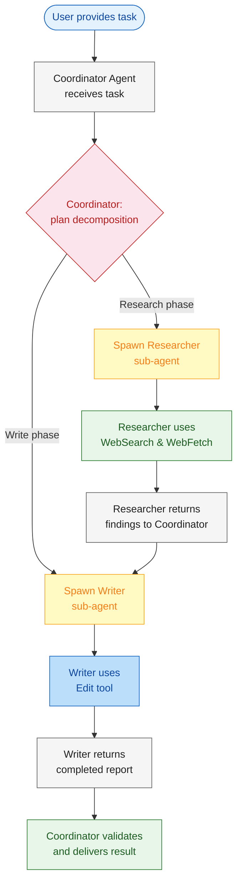
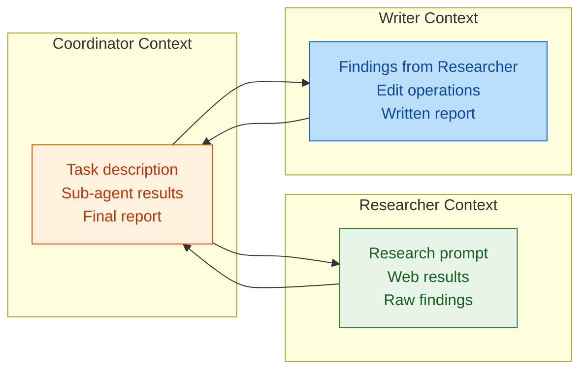
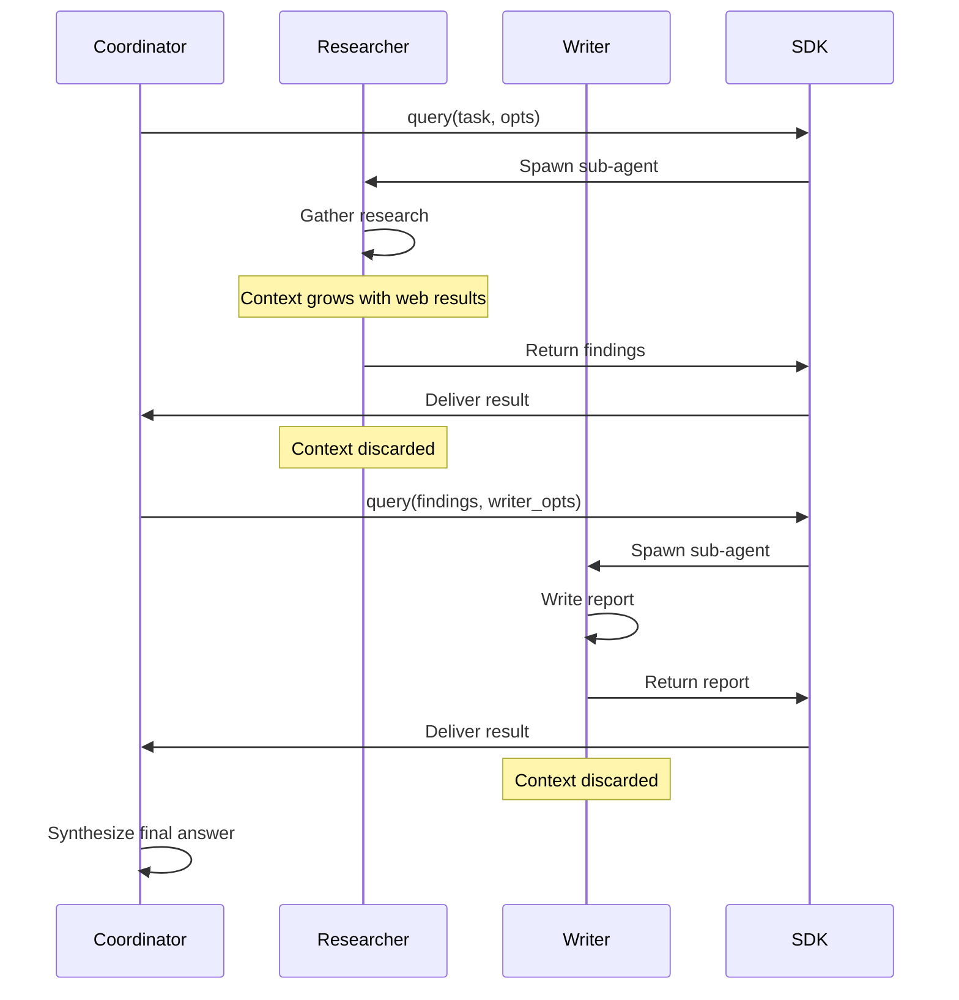

# Module 5: Context Management & Multi-Agent Orchestration

In Modules 1-4, you built a single agent with read, write, and observability capabilities. But real-world tasks quickly consume the 200,000 token context window. Passing the entire conversation history to one agent leads to degradation, irrelevant context, and rising costs.

Module 5 introduces **multi-agent orchestration** — a "Coordinator" agent delegates tightly scoped tasks to specialized "Sub-agents" with restricted toolsets. Each sub-agent operates in its own context window, keeping individual sessions small and focused. You'll build a Research & Synthesis Pipeline that separates data gathering from report writing across two isolated agents.

---

# Problem Statement / Use Case Overview

How do you build an agent system that can handle complex, multi-step tasks without blowing through the context window?

**The pipeline works in three stages:**

1. **Orchestration** — A Coordinator agent receives a high-level task, plans the work, and delegates to sub-agents.
2. **Isolated execution** — Each sub-agent runs in its own context window with its own tools. The Researcher only has `WebSearch` and `WebFetch`. The Writer only has `Edit`.
3. **Synthesis** — The Coordinator collects results and produces a final deliverable.

This is especially useful for:
- **Research tasks** where gathering and writing are separate concerns
- **Complex workflows** that exceed a single context window
- **Permission isolation** where no single agent has all capabilities
- **Cost optimization** by keeping each agent's context small

---

# Input Data

| Item | Detail |
|------|--------|
| **System prompt** | Coordinator defines the plan; sub-agents have role-specific instructions |
| **User task** | Natural-language task requiring research and synthesis |
| **Coordinator agent** | Top-level agent that delegates work |
| **Researcher sub-agent** | Equipped with `WebSearch` and `WebFetch` only |
| **Writer sub-agent** | Equipped with `Edit` only |
| **Target project** | Path to a project with a report template to fill in |
| **Anthropic API Key** | Used to authenticate with the Claude API |

---

# Processing

### Overall Workflow



### Context Window Breakdown



1. **Coordinator context** — Holds the high-level task, intermediate results from sub-agents, and the final deliverable. Never sees raw web pages or edit diffs.
2. **Researcher context** — Contains only the research prompt, web search results, and fetched page content. Toolset limited to `WebSearch` and `WebFetch`.
3. **Writer context** — Receives only the researcher's condensed findings, then edits the report template. Toolset limited to `Edit`.

### Token Efficiency Comparison
| Approach | Context Per Agent | Total Tokens | Degradation Risk |
|----------|------------------|--------------|------------------|
| Single agent | Full history (~200k) | ~200k | High — context drift over long sessions |
| Multi-agent (this lab) | Coordinator ~5k, Researcher ~15k, Writer ~10k | ~30k | Low — each agent stays focused |

### Context Compaction Triggers

The SDK provides built-in auto-compaction that kicks in when:

| Trigger | Behavior |
|---------|----------|
| Token threshold exceeded | SDK summarizes older turns to free space |
| `PreCompact` hook event | Fires before auto-compaction — observe when and why it triggers |
| Sub-agent handoff | Natural compaction point — sub-agent context is discarded after return |

---

# Output

A completed research report with gathered facts synthesized into structured markdown. The Coordinator returns a summary of what was researched and written:

> ## Research Report: Quantum Computing
>
> ### Summary
> Quantum computing leverages superposition and entanglement to solve problems classical computers cannot. Current challenges include decoherence and error rates.
>
> ### Key Findings
> - Qubits use superposition for parallel computation
> - Entanglement enables correlated operations across qubits
> - Applications include drug discovery, cryptography, optimization
>
> ### Implications
> Quantum computing will transform industries once error correction matures, expected within 5-10 years.

---

# Tech Stack

| Component | Tool |
|---|---|
| **Agent SDK** | Anthropic Agent SDK (`claude_agent_sdk`) — orchestrates agent loop with context management |
| **LLM (Coordinator)** | Claude via Anthropic API — plans and delegates |
| **LLM (Researcher)** | Claude via Anthropic API — gathers data with web tools |
| **LLM (Writer)** | Claude via Anthropic API — writes report with Edit tool |
| **Web Tools** | `WebSearch`, `WebFetch` — research capabilities |
| **Edit Tool** | `Edit` — file modification for report writing |
| **Language** | Python 3.10+ |
| **Environment** | `ANTHROPIC_API_KEY` (SDK) |

---

# Underlying Concepts (Summarized)

### Single Agent vs Multi-Agent

| Aspect | Single Agent | Multi-Agent (Orchestrator) |
|--------|-------------|---------------------------|
| **Context** | One large window | Multiple small windows |
| **Toolset** | All tools available | Per-agent restricted tools |
| **Permission** | One permission scope | Isolated per sub-agent |
| **Failure mode** | Single point of failure | Sub-agent failures contained |
| **Cost** | Higher per-turn (large context) | Lower per-turn (small context) |

### Coordinator Pattern

```python
async def run_researcher(topic: str) -> str:
    """Spawn a researcher sub-agent with web tools only."""
    # Restrict tools: web access only — no file write capability
    options = ClaudeAgentOptions(
        allowed_tools=["WebSearch", "WebFetch"],
    )
    result = ""
    async for message in query(
        prompt=f"Research: {topic}. Return concise findings.",
        options=options
    ):
        # hasattr guards handle both intermediate TextBlock and final ResultMessage
        if hasattr(message, 'content'):
            result = message.content
    return result  # Only the result string survives — sub-agent context is discarded
```

### Sub-agent Isolation

Each sub-agent:
- Gets its own `ClaudeAgentOptions` with a restricted toolset
- Runs in a separate `query()` call with its own context window
- Returns only the result string (not the full conversation)
- Its context is discarded after return — no accumulation

### Context Compaction Flow



### Multi-Agent Checklist

Before deploying a multi-agent system:

1. **Define clear interfaces** — What does each sub-agent take as input and return as output?
2. **Restrict tools per agent** — Never give a sub-agent tools it doesn't need
3. **Keep sub-agent tasks small** — One research question, one file edit, not both
4. **Pass condensed context** — Summarize before handing off to the next agent
5. **Validate results** — The coordinator should check sub-agent outputs before using them
6. **Monitor context size** — Watch token usage to identify compaction opportunities

---

# Pre-requisites

- **Basic familiarity** with Python (functions, `import` statements, `async`/`await`).
- **Anthropic API Key** — for the Agent SDK (sign up at [console.anthropic.com](https://console.anthropic.com)).
- **Python 3.10+** installed on your machine.
- **A project with a report template** the Writer can edit.
- **High-level understanding** of context windows and token limits.
- **Completion of Modules 1-4** recommended.

---

# Environment / Dependencies Setup

The cell below installs all required Python packages:

| Package | Purpose |
|---------|---------|
| `claude-agent-sdk` | **Agent SDK** — orchestrates multi-agent loop with context management |
| `python-dotenv` | **Environment** — loads API keys from .env file |

> **Note:** Run this cell first — it only needs to be run once per session.

```python
!pip install -q claude-agent-sdk python-dotenv
```

## Import Libraries

Import the standard library and SDK modules needed for this lab:

| Import | Purpose |
|--------|---------|
| `os` | Read environment variables (`ANTHROPIC_API_KEY`) |
| `json` | Pass structured data between sub-agents |
| `asyncio` | Async runtime for concurrent sub-agent execution |
| `load_dotenv` | Load `.env` file into environment variables |
| `query` | SDK function — sends a prompt and yields streaming messages |
| `ClaudeAgentOptions` | Configures tools, model, permissions, and hooks for a sub-agent |
| `HookMatcher` | Routes hook events to callbacks (used in Step 6 for compaction) |

```python
import os
import json
import asyncio
from dotenv import load_dotenv
from claude_agent_sdk import query, ClaudeAgentOptions, HookMatcher  # query: sends prompts; ClaudeAgentOptions: configures agents; HookMatcher: routes hook events
```

## Configure API Keys

The SDK authenticates via the `ANTHROPIC_API_KEY` environment variable. Create a `.env` file in your project root:

```
ANTHROPIC_API_KEY=sk-ant-...
```

| Key | Used By | Purpose |
|-----|---------|---------|
| `ANTHROPIC_API_KEY` | Agent SDK | Authenticates all sub-agent calls to Claude |

The cell below loads the key and verifies it is present:

```python
# Load .env file into environment variables (does not override existing env vars)
load_dotenv()

# Read the API key from environment; set by .env or pre-exported in shell
ANTHROPIC_API_KEY = os.getenv("ANTHROPIC_API_KEY")

print(f"Anthropic key (SDK): {'Yes' if ANTHROPIC_API_KEY else 'No'}")
```

**Expected output:**
```
Anthropic key (SDK): Yes
```

If you see `No`, create a `.env` file with your key and re-run this cell.

---

# Step-wise Instructions — Development

---

### Step 1 — Define the Researcher Sub-agent

Create the first specialized sub-agent. The Researcher only has web-browsing tools — it can search the internet and fetch pages, but it **cannot** modify any files on disk. This is the foundation of the principle of least privilege: each agent gets only the tools it absolutely needs.

#### Configure the Researcher

This cell creates a `ClaudeAgentOptions` with:
- **allowed_tools**: `["WebSearch", "WebFetch"]` — read-only web access, no write capabilities
- **model**: `claude-haiku-4-5-20251001` — fast, low-cost model ideal for focused research tasks

The agent will receive a prompt that instructs it to:
1. Call `WebSearch` to discover relevant pages on the topic
2. Call `WebFetch` to read the full content of the most useful pages
3. Return a bullet-point summary of key facts only

This keeps the sub-agent's output small and focused — critical for efficient context handoff to the next agent.

```python
async def run_researcher(topic: str) -> str:
    """Gather research on a topic using web tools only."""
    # Restricted toolset: read-only web access, no write capabilities
    options = ClaudeAgentOptions(
        allowed_tools=["WebSearch", "WebFetch"],
        model="claude-haiku-4-5-20251001",
    )
    prompt = f"""Research the topic '{topic}' and return concise findings.
You MUST call WebSearch first to find relevant information, then WebFetch to read details.
Return a bullet-point summary of the most important facts only."""
    result = ""
    async for message in query(prompt=prompt, options=options):
        # Intermediate messages expose .content; final ResultMessage exposes .result
        if hasattr(message, 'content') and message.content:
            result = message.content
        if hasattr(message, 'result') and message.result:
            result = message.result
    return result
```

**Key points:**
- The `query()` call starts a **fresh context window** — the Researcher has no memory of anything outside this prompt
- Each `query()` yields streaming messages; the final `ResultMessage` contains the `.result` field with the agent's answer
- The `hasattr` checks handle both intermediate `TextBlock` messages and the final `ResultMessage`
- When this function returns, the Researcher's **entire context is discarded** — natural compaction at sub-agent boundaries

---

### Step 2 — Define the Writer Sub-agent

Create the second specialized sub-agent. The Writer has the opposite toolset from the Researcher — it can **read and edit files**, but it has **no web access**. This isolation ensures the Writer cannot accidentally browse the internet; it must work only with the findings the Researcher gathered.

#### Configure the Writer

This cell creates a `ClaudeAgentOptions` with:
- **allowed_tools**: `["Read", "Edit"]` — file read/write, no web capabilities
- **can_use_tool**: An async callback that gates the `Edit` tool on human approval
- **permission_mode**: `"default"` — invokes the callback before executing execution tools
- **model**: `claude-haiku-4-5-20251001`

The prompt passes the Researcher's findings directly into the instructions via an f-string:

| Variable | Source | Description |
|----------|--------|-------------|
| `template_path` | Coordinator parameter | Path to the template file with placeholders |
| `output_path` | Coordinator parameter | Where to write the completed report |
| `{findings}` | Researcher's return value | Bullet-point summary of research |

The Writer is deliberately told to **not modify any other files** — this prevents it from accidentally altering anything outside the report.

```python
async def can_use_tool(tool_name: str, input_data: dict, context):
    if tool_name == "Edit":
        response = input(f"Allow Edit on {input_data.get('file_path', 'unknown')}? (y/n): ")
        if response.lower() == 'y':
            return {"behavior": "allow", "updatedInput": input_data}
        return {"behavior": "deny"}
    return {"behavior": "allow", "updatedInput": input_data}

async def run_writer(findings: str, template_path: str, output_path: str) -> str:
    """Write findings into the report template using Edit tool only."""
    options = ClaudeAgentOptions(
        allowed_tools=["Read", "Edit"],
        permission_mode="default",  # Invokes can_use_tool before execution tools
        can_use_tool=can_use_tool,  # Gates Edit on human approval
        model="claude-haiku-4-5-20251001",
    )
    prompt = f"""Read the template at {template_path}, then write a completed
report to {output_path} using the Edit tool.

Findings to incorporate:
{findings}

Replace every placeholder in the template with real content.
Do NOT modify any other files."""

    # prompt_stream() must be an async generator yielding message dicts;
    # each yield is one user message in the conversation stream
    async def prompt_stream():
        yield {
            "type": "user",
            "message": {"role": "user", "content": prompt},
            "parent_tool_use_id": None,  # Root message — no parent tool call
            "session_id": "",  # Empty = create new session
        }

    result = ""
    async for message in query(prompt=prompt_stream(), options=options):
        if hasattr(message, 'content') and message.content:
            result = message.content
        if hasattr(message, 'result') and message.result:
            result = message.result
    return result
```

**What happens when this runs:**
1. The Writer receives the prompt with findings inline
2. It calls `Read` to load the template file
3. It calls `Edit` to write the completed report to the output path
4. Returns a confirmation message
5. Its context is discarded — natural compaction at sub-agent boundary

---

### Step 3 — Define the Coordinator

The Coordinator is the orchestrator that ties the two sub-agents together. It does **no work itself** — it delegates everything to specialized sub-agents and only stitches the results together.

#### Coordinator Flow

Here is exactly what happens when the Coordinator runs:

1. **Research phase** — The Coordinator calls `run_researcher(task)` which spawns a fresh sub-agent with web tools. The `await` keyword pauses the Coordinator until the Researcher finishes.
2. **Handoff** — The Researcher returns a condensed string of findings. Its context is **discarded** (compaction). The Coordinator receives only the findings text — no raw web pages, no tool call history.
3. **Write phase** — The Coordinator calls `run_writer(findings, template_path, output_path)`, passing only the condensed findings. A fresh sub-agent is spawned with file tools only.
4. **Return** — The Writer returns the confirmation. The Coordinator prints the status and returns the report string.

This pattern keeps each context window small:
- Researcher context: ~15k tokens (web results + analysis)
- Writer context: ~10k tokens (template + findings + edit operations)
- Coordinator context: ~5k tokens (task + results only)

```python
async def run_coordinator(task: str, template_path: str, output_path: str) -> str:
    """Orchestrate research and writing phases."""
    print("[Coordinator] Starting research phase...")
    # Phase 1: spawn Researcher in a fresh context window; await its findings
    findings = await run_researcher(task)
    print(f"[Coordinator] Research complete. {len(findings)} chars gathered.")

    print("[Coordinator] Starting writing phase...")
    # Phase 2: hand off only the condensed findings to a fresh Writer context
    # The Researcher's context was already discarded after return (compaction)
    report = await run_writer(findings, template_path, output_path)
    print("[Coordinator] Report written.")

    return report
```

**Why this matters:** In a single-agent system, all web pages and edit diffs accumulate in one context window, quickly hitting the 200k limit. Here, each sub-agent's context is discarded after use — the Coordinator itself stays small and focused.

---

### Step 4 — Execute the Pipeline

Set the target paths and run the full orchestration. The `TEMPLATE_PATH` must point to an existing template file with placeholders. The `OUTPUT_PATH` will be created by the Writer.

#### Configuration

| Variable | Value | Description |
|----------|-------|-------------|
| `TEMPLATE_PATH` | `data/report_template.md` | Template with `[TOPIC]`, `[Summary]`, `[Key Findings]`, `[Implications]`, `[Sources]` placeholders |
| `OUTPUT_PATH` | `data/completed_report.md` | Destination for the completed report |
| `TASK` | `"Quantum Computing"` | The research topic passed to the Coordinator |

The `await run_coordinator(...)` call starts the entire pipeline. Because `run_coordinator` is async, this works in a Jupyter notebook's event loop. The pipeline is **sequential** — research completes before writing begins.

```python
TEMPLATE_PATH = "data/report_template.md"  # Template with placeholders to fill in
OUTPUT_PATH = "data/completed_report.md"   # Destination written by the Writer
TASK = "Quantum Computing"                 # Research topic passed to the Coordinator

# Kick off the whole pipeline. Await blocks until research AND writing finish.
# The pipeline is sequential — writing never starts before research completes.
result = await run_coordinator(TASK, TEMPLATE_PATH, OUTPUT_PATH)
print("\n--- Final Report ---\n")
print(result)
```

**Expected output (approximate):**
```
[Coordinator] Starting research phase...
[Coordinator] Research complete. 2641 chars gathered.
[Coordinator] Starting writing phase...
[Coordinator] Report written.

--- Final Report ---

[TextBlock(text="Perfect! I've successfully created the completed report...")]
```
The report content will vary based on what the Researcher finds. The key metric is the number of chars gathered — if it is very small (< 10), the Researcher may not have called `WebSearch` successfully.

---

### Step 5 — Verify the Output

Read the completed report from disk to confirm the Writer properly filled in the template. This step runs locally — no SDK calls, no token usage.

#### What to check in the output

| Check | What to look for |
|-------|-----------------|
| **File exists** | `data/completed_report.md` was created |
| **Placeholders replaced** | No `[TOPIC]`, `[Summary]`, etc. remaining |
| **Research incorporated** | Real facts about the topic (dates, names, technologies) |
| **Structure preserved** | Sections match the template (Summary, Key Findings, Implications, Sources) |

If the file does not exist, the Writer may have been blocked by permissions or the template path was incorrect.

```python
from pathlib import Path

# Verify the Writer created the report on disk.
# This runs locally — no SDK calls, no token usage.
report_file = Path(OUTPUT_PATH)
if report_file.exists():
    print("--- Completed Report ---")
    print(report_file.read_text())  # Dump the full markdown report
else:
    print("Report not found.")  # Writer may have been blocked by permissions
```

**Expected output (truncated example):**
```
--- Completed Report ---
# Research Report: Quantum Computing Breakthroughs and Market Emergence in 2026

## Summary
Quantum computing has reached a critical inflection point in 2026...
```

---

### Step 6 — Observe Context Compaction with a `PreCompact` Hook

The SDK **auto-compacts** the context window when token usage exceeds a threshold, summarizing older turns to free up space. This is transparent to you — the agent keeps working while older messages are condensed.

You can observe this happening by registering a `PreCompact` hook, which fires before auto-compaction runs. This step also reinforces that every sub-agent handoff in your pipeline is a **natural compaction point** — the sub-agent's context is discarded entirely on return.

#### How the `PreCompact` Hook Works

| Field | Value | Description |
|-------|-------|-------------|
| **Hook event** | `"PreCompact"` | Fires before auto-compaction summarizes older turns |
| **Trigger** | `"auto"` or `"manual"` | What caused the compaction |
| **Hook callback** | `async def (hook_input, tool_use_id, context)` | Receives the compaction context |
| **Return** | `dict` (may be empty `{}`) | Hook output (not used by compaction logic) |

#### The Demo

This cell registers a `PreCompact` hook and runs a query that reads multiple files — enough content to potentially trigger auto-compaction. If the hook fires, you will see `Trigger: auto` logged to the console.

```python
from claude_agent_sdk import HookMatcher

# Hook callback: logs when auto-compaction fires.
# Signature is (hook_input, tool_use_id, context) for all hook events.
async def log_compaction(hook_input, tool_use_id, context):
    """Log when auto-compaction fires."""
    print(f"  Trigger: {hook_input.get('trigger', 'unknown')}")
    if hook_input.get("custom_instructions"):
        print(f"  Instructions: {hook_input['custom_instructions'][:200]}")
    return {}  # Empty dict = let compaction proceed normally

options = ClaudeAgentOptions(
    allowed_tools=["Read"],
    model="claude-haiku-4-5-20251001",
    hooks={
        "PreCompact": [  # Register hook on the PreCompact event
            HookMatcher(
                hooks=[log_compaction],  # Callback invoked before compaction runs
            ),
        ],
    },
)

prompt = """Read ALL files in the data/ directory. For each file, return its full path, size in bytes, and a 1-paragraph summary of its contents. Be thorough and detailed."""
result = ""
async for message in query(prompt=prompt, options=options):
    if hasattr(message, 'content') and message.content:
        result = message.content
    if hasattr(message, 'result') and message.result:
        result = message.result

print(f"\nFiles analyzed. Result: {len(result)} chars")
print("\nIf auto-compaction was triggered, you saw PreCompact log messages above.")
print("Even without auto-compaction, every sub-agent handoff in this pipeline")
print("discards the sub-agent's context — that's natural compaction at work.")
```

**What to observe:**
- If auto-compaction fires, you will see `Trigger: auto` printed by the hook callback
- If it does not fire (not enough tokens generated), the demo still completes successfully — the file summaries are returned
- Either way, remember: every sub-agent in your pipeline (Researcher, Writer) already discards its context on return — that is the most impactful compaction pattern in a multi-agent system

---

# Optional Exercise

Challenge yourself to extend or modify this lab:

- Add a **Reviewer** sub-agent that checks the Writer's output for quality before final delivery.
- Implement **parallel research** by spawning multiple Researcher sub-agents concurrently.
- Add **context compaction logging** to track how many tokens are saved vs. a single-agent approach.
- Build a **retry mechanism** that re-spawns a sub-agent if it fails or times out.
- Add a **human-in-the-loop** step where the Coordinator asks for approval before handing off to the Writer.
- Create a **third sub-agent** (e.g., a "Formatter" with only `Bash` to run a linter on the output).

---

# What We Learnt

You built a **multi-agent orchestration system** that isolates context windows and restricts tools per agent.

**Key takeaways:**
- **Multi-agent architecture** — A Coordinator delegates to specialized sub-agents instead of doing everything in one context window.
- **Context isolation** — Each sub-agent runs in its own `query()` call with its own context, keeping individual windows small.
- **Tool restriction** — Sub-agents get only the tools they need (Researcher: web, Writer: Edit), reducing risk.
- **Token efficiency** — Three small context windows (~30k total) instead of one giant window (~200k).
- **Modular design** — Sub-agents can be added, removed, or replaced without affecting the rest of the pipeline.
- **Compaction readiness** — Sub-agent handoffs are natural compaction points where context is discarded.
- **Production pattern** — This coordinator/sub-agent pattern is used in production multi-agent systems.
