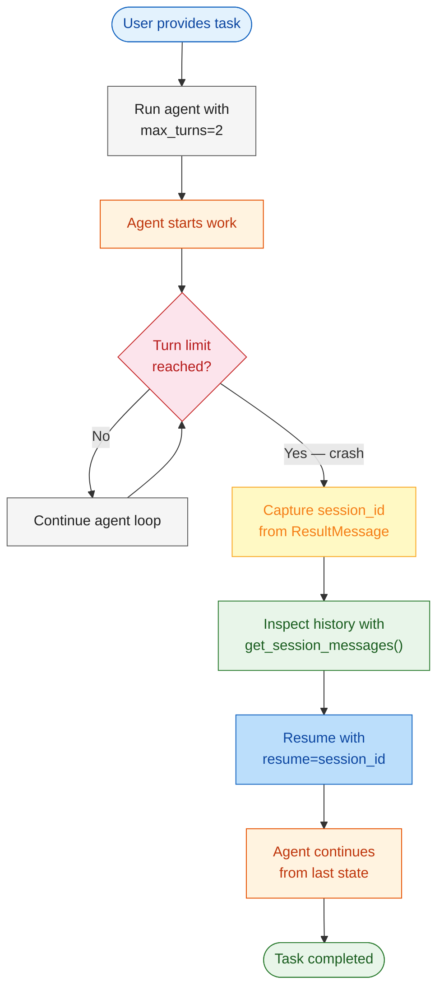
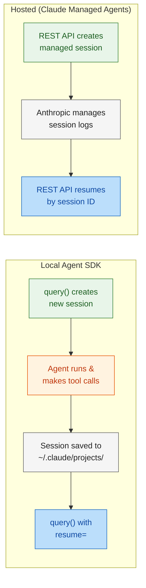

# Module 6: Path to Production

In Modules 1-5, you built, secured, observed, and orchestrated agents in a local development environment. But production deployment requires resilience — agents crash, networks fail, and long-running tasks exceed timeouts.

Module 6 introduces **session persistence and recovery** — the ability to capture an agent's session state, artificially crash the loop, and resume exactly where it left off. You'll implement a recovery script that uses `get_session_messages()` and `resume` to restore a failed agent workflow without losing progress.

---

# Problem Statement / Use Case Overview

How do you make an agent resilient to crashes, timeouts, and interruptions without losing work?

**The pipeline works in three stages:**

1. **Session capture** — Run an agent task and capture the `session_id` from `ResultMessage`.
2. **Simulated crash** — Let the agent hit `max_turns` or raise an exception to simulate a failure.
3. **Session recovery** — Use `get_session_messages()` to inspect history and `resume=<session_id>` to continue exactly where it stopped.

This is especially useful for:
- **Long-running tasks** that exceed turn or token limits
- **Unstable environments** where processes may be killed
- **Deferred processing** where work must survive host restarts
- **Audit and replay** — inspect exactly what an agent did before resuming

---

# Input Data

| Item | Detail |
|------|--------|
| **System prompt** | Instructions defining the agent's role |
| **User task** | A multi-step refactoring task that requires several tool calls |
| **Session ID** | Captured from `ResultMessage.session_id` after the first run |
| **Session store** | Local filesystem under `~/.claude/projects/` |
| **Crash trigger** | `max_turns=2` to force an early termination |
| **Recovery prompt** | Instructs the agent to continue from where it left off |
| **Anthropic API Key** | Used to authenticate with the Claude API |

---

# Processing

### Overall Workflow



### Session Lifecycle



### Local vs Hosted Comparison

| Aspect | Local Agent SDK | Hosted (Claude Managed Agents) |
|--------|---------------|-------------------------------|
| **Session storage** | Local filesystem (`~/.claude/projects/`) | Anthropic-managed durable storage |
| **Resume mechanism** | `resume=<session_id>` in options | REST API with session ID |
| **State persistence** | Survives process restarts on same machine | Survives across machines and regions |
| **Session inspection** | `get_session_messages()`, `list_sessions()` | API endpoints for log access |
| **Infrastructure** | You own the harness | Anthropic manages sandboxes and scaling |

### Session API Functions

| Function | Purpose |
|----------|---------|
| `list_sessions()` | List all sessions in the current project directory |
| `get_session_info(id)` | Read metadata for a session without parsing the full transcript |
| `get_session_messages(id)` | Reconstruct the message chain from a session transcript |
| `fork_session(id)` | Copy a session's transcript into a new session file |
| `ClaudeAgentOptions(resume=id)` | Continue a session from where it left off |

---

# Output

A resilient agent workflow that survives crashes and resumes seamlessly:

```
--- Session Resumption Demo ---

[Run 1] Starting with max_turns=2...
  Turn 1: agent lists files in data/
  Turn 2: agent reads task_state.json
  → Turn limit reached. Session ID: ses_abc123

[Inspect] Session has 4 messages (1 user + 3 assistant)

[Run 2] Resuming session ses_abc123...
  Agent continues: reads work_in_progress.txt
  Agent completes the refactoring task
  → Task finished successfully
```

---

# Tech Stack

| Component | Tool |
|---|---|
| **Agent SDK** | Anthropic Agent SDK (`claude_agent_sdk`) — session management and query execution |
| **LLM** | Claude via Anthropic API — reasons about tasks and selects tools |
| **Session API** | `get_session_messages()`, `list_sessions()`, `resume` option |
| **Session Store** | Local filesystem (`~/.claude/projects/`) |
| **Language** | Python 3.10+ |
| **Environment** | `ANTHROPIC_API_KEY` (SDK) |

---

# Underlying Concepts (Summarized)

### Session Persistence

Every `query()` call creates a session that persists to disk. The session transcript stores:
- User prompts
- Assistant responses and tool calls
- Tool results
- Metadata (model, timestamps, token counts)

Sessions are stored as JSONL files under `~/.claude/projects/<encoded-cwd>/`.

### Resume vs Continue

| Mode | How It Works | When To Use |
|------|-------------|-------------|
| `continue_conversation=True` | Picks up the most recent session in the current directory | Single-user, one conversation at a time |
| `resume=<session_id>` | Loads a specific session by ID | Multi-user, cross-session, recovery scenarios |

### Crash Recovery Pattern

The recovery pattern has three steps:

1. **Run with bounds** — Set `max_turns` or `max_budget_usd` so the session ends predictably instead of crashing mid-operation.
2. **Capture the session ID** — Extract `session_id` from `ResultMessage` before the loop exits.
3. **Resume with context** — Call `query()` again with `resume=<session_id>`. The agent loads full history and continues.

### Session Message Structure

```python
from claude_agent_sdk import get_session_messages

# Reconstruct the full conversation chain from a persisted session transcript
messages = get_session_messages(session_id)
for msg in messages:
    print(f"[{msg.type}] {msg.uuid}")
    # msg.type: "user" | "assistant" — who sent this message
    # msg.message: dict with keys {role, content} where content is a list
    #   of text blocks, tool_use blocks, or tool_result blocks
    # msg.uuid: stable identifier for deduplication across resume calls
```

### Production Readiness Checklist

Before deploying an agent to production:

1. **Set bounds** — Always configure `max_turns` or `max_budget_usd` to prevent runaway costs.
2. **Capture session IDs** — Store `session_id` externally (database, file, log) for recovery.
3. **Implement retry logic** — Wrap `query()` in a retry loop that resumes on failure.
4. **Test crash recovery** — Artificially terminate sessions and verify resumption works.
5. **Choose deployment model** — Local SDK for self-hosted, Managed Agents for Anthropic-hosted.
6. **Monitor session storage** — Clean up old sessions to avoid disk bloat with `delete_session()`.

---

# Pre-requisites

- **Basic familiarity** with Python (functions, `async`/`await`, exception handling).
- **Anthropic API Key** — for the Agent SDK (sign up at [console.anthropic.com](https://console.anthropic.com)).
- **Python 3.10+** installed on your machine.
- **A project with files** the agent can read and modify.
- **Completion of Modules 1-5** recommended.

---

# Environment / Dependencies Setup

The cell below installs all required Python packages:

| Package | Purpose |
|---------|---------|
| `claude-agent-sdk` | **Agent SDK** — query execution and session management |
| `python-dotenv` | **Environment** — loads API keys from .env file |

> **Note:** Run this cell first — it only needs to be run once per session.

```python
!pip install -q claude-agent-sdk python-dotenv
```

## Import Libraries

Import the standard library and SDK modules needed for session recovery:

| Import | Purpose |
|--------|---------|
| `os` | Read environment variables (`ANTHROPIC_API_KEY`) |
| `json` | Parse session transcripts and task data files |
| `asyncio` | Async runtime for the agent query loop |
| `Path` | Cross-platform file path handling for data files |
| `load_dotenv` | Load `.env` file into environment variables |
| `query` | SDK function — sends a prompt and yields streaming messages |
| `ClaudeAgentOptions` | Configures tools, model, permissions, and session options |
| `ResultMessage` | Message type that carries `session_id` and final results |
| `get_session_messages` | Reads full conversation history from a session transcript |
| `list_sessions` | Lists all session transcripts in the current project |

```python
import os
import json
import asyncio
from pathlib import Path
from dotenv import load_dotenv
from claude_agent_sdk import (
    query,  # Core: sends a prompt, yields streaming ResultMessage objects
    ClaudeAgentOptions,  # Configures tools, model, max_turns, resume, permissions
    ResultMessage,  # Terminal message — carries session_id + final result text
    get_session_messages,  # Read-only: reconstructs full transcript from session ID
    list_sessions,  # Scans ~/.claude/projects/<encoded-cwd>/ for all session files
)
```

## Configure API Keys

The SDK authenticates via the `ANTHROPIC_API_KEY` environment variable. Create a `.env` file in your project root:

```
ANTHROPIC_API_KEY=sk-ant-...
```

| Key | Used By | Purpose |
|-----|---------|---------|
| `ANTHROPIC_API_KEY` | Agent SDK | Authenticates all query calls to Claude |

The cell below loads the key and verifies it is present:

```python
# Load .env file into environment variables (does not override existing env vars)
load_dotenv()

# Read the API key from environment; set by .env or pre-exported in shell
ANTHROPIC_API_KEY = os.getenv("ANTHROPIC_API_KEY")

print(f"Anthropic key (SDK): {'Yes' if ANTHROPIC_API_KEY else 'No'}")
```

**Expected output:**
```
Anthropic key (SDK): Yes
```

If you see `No`, create a `.env` file with your key and re-run this cell.

---

# Step-wise Instructions — Development

---

### Step 1 — Run an Agent with a Turn Limit

This step simulates a crash by configuring the agent with `max_turns=2`. The agent will start working on the task but will be forcibly interrupted when it reaches the turn limit — exactly what would happen in production if a task exceeds a timeout or a process is killed.

#### Configure the Agent with a Turn Limit

This cell creates a `ClaudeAgentOptions` with:
- **allowed_tools**: `["Read", "Glob", "Grep", "Edit"]` — read and write tools for a refactoring task
- **max_turns**: `2` — the agent stops after two tool-use cycles, simulating a crash
- **model**: `claude-haiku-4-5-20251001`

The key insight is the `session_id` extraction:

| Object | Field | What it Contains |
|--------|-------|------------------|
| `ResultMessage` | `session_id` | UUID string uniquely identifying this session |
| `ResultMessage` | `subtype` | `"success"` if the task completed, `"error"` otherwise |
| `ResultMessage` | `result` | The agent's final output text |

The `try/except` block catches any exceptions (turn limit reached, network errors, etc.) and prints a crash message without losing the `session_id`.

```python
# Permission callback: prompts user to confirm every Edit tool invocation
async def can_use_tool(tool_name: str, input_data: dict, context):
    if tool_name == "Edit":
        response = input(f"Allow Edit on {input_data.get('file_path', 'unknown')}? (y/n): ")
        if response.lower() == 'y':
            return {"behavior": "allow", "updatedInput": input_data}
        return {"behavior": "deny"}
    return {"behavior": "allow", "updatedInput": input_data}

async def run_with_crash(task: str, session_store=None):
    """Run agent with a low turn limit to simulate a crash."""
    # Configure tools, turn limit, permission mode, and model
    options = ClaudeAgentOptions(
        allowed_tools=["Read", "Glob", "Grep", "Edit"],
        max_turns=2,  # Forced early termination — simulates a production crash
        permission_mode="default",
        can_use_tool=can_use_tool,  # Interactive confirmation for Edit calls
        session_store=session_store,  # Optional custom persistence backend
        model="claude-haiku-4-5-20251001",
    )
    session_id = None  # Will be set if a ResultMessage arrives before the crash
    # The prompt must be an async generator that yields message dicts.
    # Each yield is one user message in the conversation stream.
    async def prompt_stream():
        yield {
            "type": "user",
            "message": {"role": "user", "content": task},
            "parent_tool_use_id": None,  # Root message — no parent tool call
            "session_id": "",  # Empty = create new session; fill to resume existing
        }
    try:
        # query() returns an async generator yielding streaming messages
        async for message in query(prompt=prompt_stream(), options=options):
            # ResultMessage is the last message type — holds session_id and result
            if isinstance(message, ResultMessage):
                session_id = message.session_id  # Capture UUID for recovery
                if message.subtype == "success":
                    print(f"[Done] {message.result[:200]}")
    except Exception as e:
        # Catches turn-limit, network, and SDK errors gracefully
        # session_id is preserved in enclosing scope even after exception
        print(f"[Crash] {e}")

    return session_id
```

**What happens when this runs:**
1. The agent starts working on the task (reads files, searches for code)
2. After 2 turns, the SDK raises an exception — the turn limit is reached
3. The `except` block catches it and prints `[Crash] ...`
4. The `session_id` is returned — this is the key to recovering the work

---

### Step 2 — Inspect the Session History

After the simulated crash, the session transcript exists on disk but you no longer have access to it through the live agent. `get_session_messages()` reconstructs the full message chain from the session file without running any agent — it is a **read-only inspection**.

#### Reading Session Messages

| Function | What It Returns | When To Use |
|----------|----------------|-------------|
| `get_session_messages(id)` | List of `SessionMessage` objects | Inspecting a known session ID |
| `get_session_info(id)` | Metadata dict (model, timestamps) | Quick check before loading full messages |
| `list_sessions()` | List of session summaries | Finding sessions when you do not have the ID |

Each `SessionMessage` has:
- **`type`** — `"user"` or `"assistant"` indicating who sent the message
- **`message`** — The actual conversation content (prompts, responses, tool calls)
- **`uuid`** — Stable identifier for deduplication

```python
def inspect_session(session_id: str):
    """Print the conversation history from a session."""
    # get_session_messages() reads the persisted JSONL transcript from disk
    # No agent runs — this is a pure read-only reconstruction of past activity
    messages = get_session_messages(session_id)
    print(f"\n--- Session {session_id[:8]}... ({len(messages)} messages) ---")
    for i, msg in enumerate(messages):
        role = msg.type.upper()  # "USER" or "ASSISTANT"
        # msg.message is a dict: {role, content} where content has text/tool blocks
        # Truncated to 120 chars for a compact readable overview
        preview = str(msg.message)[:120]
        print(f"  [{i}] {role}: {preview}")
    return messages
```

**Expected output (example):**
```
--- Session ses_abc1... (4 messages) ---
  [0] USER: Read /Users/.../data/task_state.json and /Users/.../data/work_in_progress.txt...
  [1] ASSISTANT: {'role': 'assistant', 'content': [{'type': 'tool_use', 'name': 'Glob'...
  [2] USER: {'role': 'user', 'content': [{'type': 'tool_result', 'content': ['task_state.json']...
  [3] ASSISTANT: {'role': 'assistant', 'content': [{'type': 'tool_use', 'name': 'Read'...
```

This shows exactly what the agent was doing when it crashed — which files it had read, what it was planning to do next.

---

### Step 3 — Resume the Crashed Session

This is the heart of the crash recovery pattern. Instead of starting a new session from scratch (which would re-read files and re-do work), we use `resume=<session_id>` to load the full history and continue exactly where the agent left off.

#### How Resumption Works

| Option | Value | Effect |
|--------|-------|--------|
| `resume` | `session_id` | Loads the session transcript and prepends it to the new query's context |
| `allowed_tools` | `["Read", "Glob", "Grep", "Edit"]` | Same tools as the original run |
| `model` | `claude-haiku-4-5-20251001` | Uses the same model for consistency |

The `follow_up` prompt is typically a simple instruction like `"Continue exactly where you left off."` — the agent already has full context from the previous session, so it does not need the original task repeated.

```python
async def resume_session(session_id: str, follow_up: str):
    """Resume a session from its last state."""
    # resume=session_id tells the SDK to load the full history of the previous
    # session and prepend it to the context window before adding the new prompt
    options = ClaudeAgentOptions(
        allowed_tools=["Read", "Glob", "Grep", "Edit"],
        resume=session_id,  # Load transcript from ~/.claude/projects/<encoded-cwd>/
        permission_mode="default",
        can_use_tool=can_use_tool,
        model="claude-haiku-4-5-20251001",
    )
    # follow_up is deliberately minimal (e.g. "Continue where you left off")
    # because the restored transcript already contains the full task context
    async def prompt_stream():
        yield {
            "type": "user",
            "message": {"role": "user", "content": follow_up},
            "parent_tool_use_id": None,
            "session_id": "",  # Empty because resume in options activates restoration
        }
    async for message in query(prompt=prompt_stream(), options=options):
        if isinstance(message, ResultMessage) and message.subtype == "success":
            print(f"[Resumed] {message.result[:300]}")
```

**What happens when this runs:**
1. The SDK loads the session transcript from `~/.claude/projects/<encoded-cwd>/`
2. It prepends all previous messages (user prompts, assistant responses, tool calls, tool results) into the context window
3. The new `follow_up` prompt is appended as the latest user message
4. The agent sees everything from before the crash plus the new instruction
5. It continues working — reading the next file, making the next edit, etc.

---

### Step 4 — Run the Full Recovery Pipeline

This cell ties everything together — it runs the crash, inspects the session, and resumes from where it stopped. The entire flow is wrapped in a single async `main()` function.

#### Pipeline Flow

| Phase | Function | What Happens |
|-------|----------|-------------|
| 1. Crash | `run_with_crash(TASK)` | Agent starts work, hits `max_turns=2`, returns `session_id` |
| 2. Inspect | `inspect_session(session_id)` | Reads the transcript — shows what the agent did before crashing |
| 3. Resume | `resume_session(session_id, FOLLOW_UP)` | Agent loads full history and continues working |

The `TASK` uses absolute paths resolved at runtime so the model cannot misinterpret them as root-relative paths. The `FOLLOW_UP` is deliberately minimal — just `"Continue exactly where you left off."` — because the session transcript already has all the context.

```python
from pathlib import Path

# Path.resolve() converts relative "data" to an absolute path so the model
# never misinterprets it as a root-relative path like /data/task_state.json
DATA_DIR = Path("data").resolve()
# TASK instructs the agent to read state files and continue unfinished work
TASK = f"Read {DATA_DIR}/task_state.json and {DATA_DIR}/work_in_progress.txt, then continue the refactoring work described."
# FOLLOW_UP is minimal — the restored session transcript has all prior context
FOLLOW_UP = "Continue exactly where you left off."

async def main():
    # Phase 1: start agent with max_turns=2, capture session_id on crash/exit
    session_id = await run_with_crash(TASK)
    if session_id:
        # Phase 2: read-only inspection of what the agent did before crashing
        inspect_session(session_id)
        # Phase 3: resume with full context from the previous session
        await resume_session(session_id, FOLLOW_UP)

await main()
```

**Expected output (example):**
```
[Crash] Turn limit reached (max_turns=2)

--- Session ses_abc1... (5 messages) ---
  [0] USER: Read /Users/.../data/task_state.json and...
  [1] ASSISTANT: Glob tool call...
  [2] USER: Tool result...
  [3] ASSISTANT: Read tool call...
  [4] USER: Tool result...

[Resumed] Successfully completed the refactoring task. Updated 3 files...
```

The output confirms that the agent picked up exactly where it stopped — it did not re-read files it had already read in the first session.

---

### Step 5 — List Available Sessions

`list_sessions()` scans the local session store (`~/.claude/projects/<encoded-cwd>/`) and returns summaries of every session. This is useful for finding a session ID when you did not capture it at runtime — for example, after a full process crash.

#### Session List Entry Fields

| Field | Type | Description |
|-------|------|-------------|
| `session_id` | `str` | UUID — use with `resume=` or `get_session_messages()` |
| `first_prompt` | `str` | First 60 chars of the initial user prompt |
| `created_at` | `str` | ISO 8601 timestamp of when the session was created |
| `message_count` | `int` | Number of messages in the session (on `SessionStoreListEntry`) |

Sessions persist on disk indefinitely. Use `delete_session(id)` to clean up old ones.

```python
# list_sessions() scans ~/.claude/projects/<encoded-cwd>/ and returns all sessions
sessions = list_sessions()
print(f"\n--- All Sessions ({len(sessions)}) ---")
for s in sessions:
    # session_id: UUID — use with resume= or get_session_messages()
    # first_prompt: first 60 chars of initial user prompt
    # created_at: timestamp (epoch ms or ISO 8601 depending on SDK version)
    print(f"  {s.session_id[:12]}... | {s.first_prompt[:60]} | {s.created_at}")
```

**Expected output:**
```
--- All Sessions (1) ---
  ses_abc123def... | Read /Users/.../data/task_state.json and /Users/.../data/work_in_progress.txt... | 2026-07-29T04:30:00
```

---

**Expected output (example):**
```
  Trigger: auto
  Instructions: Condense the following conversation...

Files analyzed. Result: 2847 chars

If auto-compaction was triggered, you saw PreCompact log messages above.
Every sub-agent handoff discards context — that is natural compaction.
```

---

# Optional Exercise

Challenge yourself to extend or modify this lab:

- Implement **automatic retry** — wrap the agent in a loop that catches failures and resumes automatically.
- Use `fork_session()` to branch from a crash point and try a different approach.
- Build a **session browser** that lists sessions, shows their messages, and lets you resume any of them.
- Implement a **session store adapter** that persists transcripts to a database instead of local files.
- Add `max_budget_usd` as an additional crash trigger and test recovery from budget limits.
- Compare local session resumption vs. the hosted Managed Agents model — note the differences.

---

# What We Learnt

You built a **crash-resilient agent** that survives interruptions and resumes exactly where it left off.

**Key takeaways:**
- **Session persistence** — Every `query()` creates a durable session transcript on disk.
- **Turn limits** — `max_turns` bounds agent execution and provides a clean termination point.
- **Session inspection** — `get_session_messages()` lets you read what the agent did without running it.
- **Session resumption** — `resume=<session_id>` restores full context from a previous session.
- **Crash recovery pattern** — Run with bounds, capture the session ID, resume after failure.
- **Local vs hosted** — Local SDK stores sessions on disk; Managed Agents use Anthropic-hosted storage.
- **Production readiness** — Session IDs enable retry logic, audit trails, and long-running task support.
