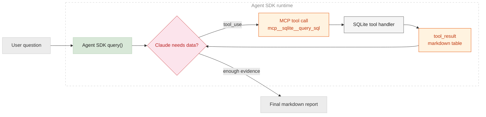
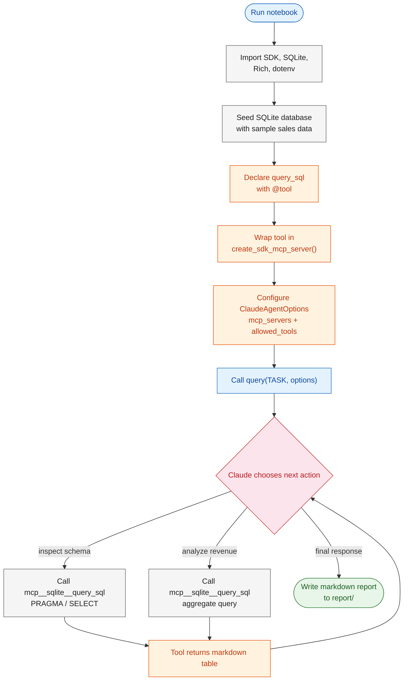
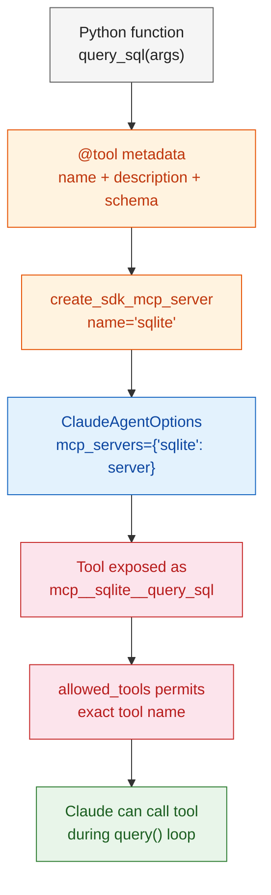
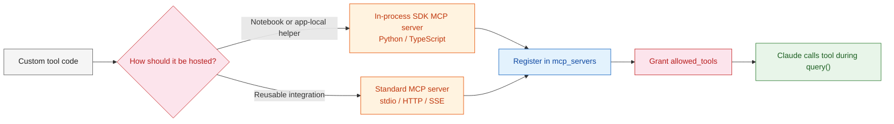
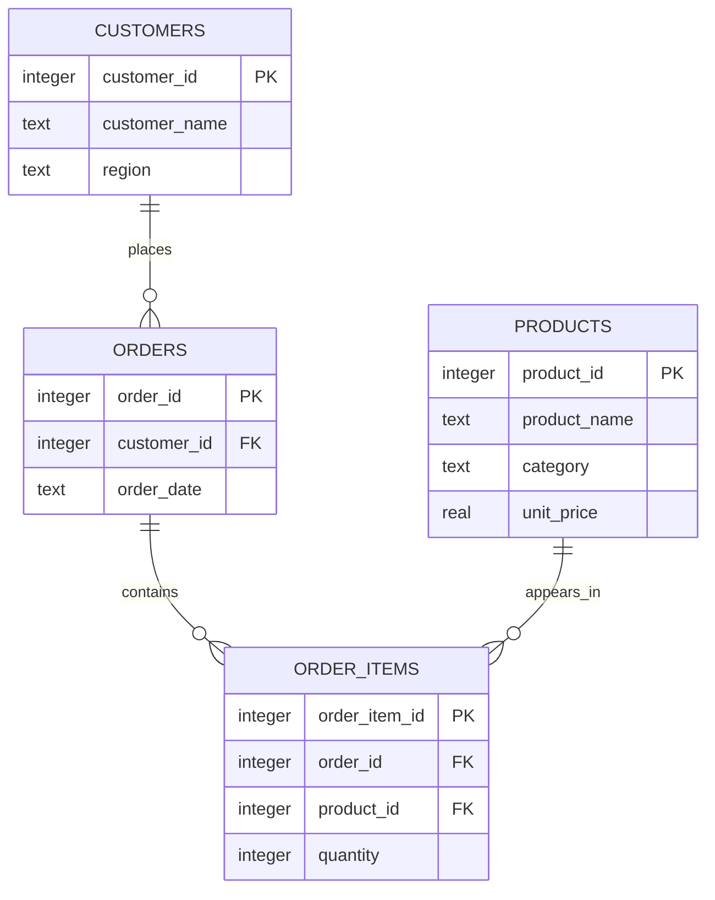
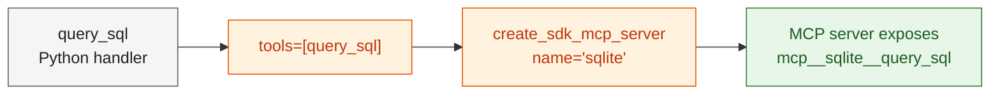

# Lab 4: Custom Tools & Model Context Protocol (MCP)

> **Model Context Protocol (MCP)** is a standard way to connect an agent to external tools and data sources. In the Agent SDK, an MCP server can be a local process, a remote HTTP/SSE service, or an in-process SDK server that exposes Python functions directly to Claude.



---

# Problem Statement / Use Case Overview

Consider building a lightweight business analyst agent. The agent must answer revenue questions from a database, but it should not receive raw database files or unrestricted filesystem access. Instead, we expose one carefully scoped database capability through MCP: a read-only SQL query tool.

This lab creates a local SQLite sales database, wraps a Python function as an in-process MCP tool, registers that server with `ClaudeAgentOptions`, and lets Claude call the tool through the normal `query()` agent loop.

**The pipeline executes across five primary stages:**

1. **Seed local data** - Create a compact SQLite database with customers, products, orders, and order items.
2. **Define a custom tool** - Implement `query_sql`, a read-only SQL tool using the Agent SDK `@tool` decorator.
3. **Create an MCP server** - Wrap the tool with `create_sdk_mcp_server()` using the server name `sqlite`.
4. **Grant explicit permission** - Allow only `mcp__sqlite__query_sql` through `allowed_tools`.
5. **Run the analyst loop** - Ask Claude to inspect the schema, query the data, and synthesize a markdown report.

> [!NOTE]
> ### Why this matters
> Built-in tools are useful for filesystem and shell workflows, but production agents often need domain-specific capabilities: querying databases, calling internal APIs, fetching tickets, or interacting with business systems. MCP gives those capabilities a consistent interface while keeping permission boundaries explicit.

**Common application patterns include:**
- Database analysis agents that can query approved reporting views
- Internal API assistants that call scoped service operations
- Support or operations agents connected to ticketing and status systems
- Domain-specific tools that encode business rules behind a simple interface

---

# Input Data

| Component | Description |
|-----------|-------------|
| **Business task** | Natural-language request asking for top revenue region, top 3 products, and a management insight |
| **SQLite database** | Local file created at `data/module4_sales.sqlite` |
| **MCP server** | In-process SDK MCP server named `sqlite` |
| **MCP tool** | `query_sql`, a read-only SQL execution function |
| **Allowed tool name** | `mcp__sqlite__query_sql` |
| **Anthropic API Key** | Loaded from `ANTHROPIC_API_KEY` through `.env` or environment variables |

---

# Processing

### Overall Workflow



### MCP Integration Internals



The MCP flow has four important moving parts:

1. **Tool declaration (`@tool`)** - Defines the tool name, description, input schema, and async handler Claude can invoke.
2. **Server registration (`create_sdk_mcp_server`)** - Bundles one or more tools into an in-process MCP server. This lab uses an SDK MCP server, so no separate server process is required.
3. **MCP naming convention** - Exposed tool names follow `mcp__<server-name>__<tool-name>`. For this lab, server `sqlite` plus tool `query_sql` becomes `mcp__sqlite__query_sql`.
4. **Permissioning (`allowed_tools`)** - MCP tools require explicit permission before Claude can run them. This lab allows only the SQL query tool.

> [!NOTE]
> ### MCP server types
> The Agent SDK can connect to MCP servers in several ways:
> - **stdio** for local subprocess servers, such as a filesystem MCP server launched with `npx`
> - **HTTP/SSE** for remote or cloud-hosted MCP servers
> - **SDK MCP servers** for custom tools defined directly inside the application process
>
> This lab uses the third option because it is ideal for notebooks: the tool, server, database, and agent loop all live in one Python runtime.

---

# Tech Stack

| Component | Implementation | Role |
|-----------|----------------|------|
| **Agent SDK** | `claude_agent_sdk` | Runs the agent loop and hosts the in-process MCP server |
| **MCP server** | `create_sdk_mcp_server()` | Registers Python tool handlers as MCP tools |
| **Custom tool API** | `@tool` decorator | Defines tool name, schema, description, and handler |
| **Database** | SQLite (`sqlite3`) | Stores local sales data without external infrastructure |
| **Runtime** | Python 3.10+ / Jupyter | Executes the notebook and async agent workflow |
| **Rendering** | `rich` | Displays panels and markdown output in the notebook |
| **Configuration** | `python-dotenv` | Loads `ANTHROPIC_API_KEY` from environment settings |

---

# Underlying Concepts (Summarized)

### Built-in Tools vs MCP Tools

| Dimension | Built-in Tools | MCP Tools |
|-----------|----------------|-----------|
| **Source** | Provided by Claude Code / Agent SDK | Provided by an MCP server |
| **Examples** | `Read`, `Glob`, `Grep`, `Bash` | `mcp__sqlite__query_sql`, `mcp__github__list_issues` |
| **Best for** | Filesystem, shell, and coding workflows | External systems, APIs, databases, domain logic |
| **Permissioning** | Listed through tool options and permission settings | Usually granted through `allowed_tools` |
| **Extensibility** | Fixed built-in capability set | Any server can expose additional tools |

MCP does not replace built-in tools. It extends the agent with capabilities that are not part of the default runtime.

### In-process Custom Tools vs Standardized MCP Servers

| Dimension | In-process Python/TypeScript Tools | Standardized MCP Servers |
|-----------|------------------------------------|---------------------------|
| **Where code runs** | Inside your application or notebook process | In a separate local process or remote service |
| **Best for** | Lightweight labs, prototypes, app-specific helpers, notebook demos | Reusable integrations, shared team tools, production connectors |
| **Implementation style** | Define functions directly with SDK helpers such as `@tool` and `create_sdk_mcp_server()` | Connect to a server over stdio, HTTP, or SSE |
| **Operational setup** | Minimal infrastructure; import and run in the same Python/TypeScript runtime | Requires server configuration, transport settings, and often service credentials |
| **Reuse boundary** | Usually tied to one app or repo | Portable across clients that understand MCP |
| **Example** | `query_sql()` inside this notebook | A GitHub, filesystem, database, or internal API MCP server |

This lab uses an **in-process Python tool** because the goal is to learn the mechanics without running a separate server. The same concepts apply in TypeScript: define a typed tool handler, validate inputs, register it with an MCP server, then allow the resulting `mcp__server__tool` name in the agent options.



### Authentication, Permissions, and Parameter Validation

Tool integration has four separate safety layers:

| Layer | What it controls | Where this lab handles it |
|-------|------------------|---------------------------|
| **Authentication** | Whether the app can call Claude or an external service | `ANTHROPIC_API_KEY` is loaded with `python-dotenv` |
| **Tool permissions** | Whether Claude may call a specific tool | `allowed_tools=["mcp__sqlite__query_sql"]` |
| **Runtime approval** | Whether a specific tool invocation is allowed at runtime | `can_use_tool` callback gates execution on user input |
| **Parameter validation** | Whether a tool call's arguments are acceptable | `query_sql` checks SQL verb and rejects multi-statement input |

These layers solve different problems. Authentication proves the application is allowed to access a service. Permissions decide which tools the agent can invoke. `can_use_tool` provides runtime human oversight for every tool call. Parameter validation protects the tool implementation from malformed, unsafe, or out-of-scope arguments.

For environments where even read-only tool calls need human oversight, add a `can_use_tool` callback:

```python
async def can_use_tool(tool_name: str, input_data: dict, context):
    response = input(f"Allow {tool_name}? (y/n): ")
    if response.lower() == 'y':
        return {"behavior": "allow", "updatedInput": input_data}
    return {"behavior": "deny"}

options = ClaudeAgentOptions(
    mcp_servers={"sqlite": sqlite_server},
    allowed_tools=["mcp__sqlite__query_sql"],
    permission_mode="default",
    can_use_tool=can_use_tool,
    model="claude-haiku-4-5-20251001",
)
```

### MCP Tool Naming

Every MCP tool receives a fully qualified name:

```text
mcp__<server-name>__<tool-name>
```

In this lab:

```text
server name: sqlite
tool name:   query_sql
allowed as:  mcp__sqlite__query_sql
```

This matters because `allowed_tools` must reference the exposed MCP tool name, not just the local Python function name.

### Why Use `allowed_tools`

```python
options = ClaudeAgentOptions(
    mcp_servers={"sqlite": sqlite_server},
    allowed_tools=["mcp__sqlite__query_sql"],
)
```

`allowed_tools` pre-approves the specific MCP tool Claude may call during the loop. You can use wildcards such as `mcp__sqlite__*`, but this lab uses the exact tool name to keep the permission boundary narrow.

> [!NOTE]
> ### Safety boundary
> The permission list controls whether Claude may call the tool. The tool handler itself still needs application-level safeguards. In this lab, `query_sql` rejects non-read-only statements and multi-statement SQL so the database interface stays focused on analysis instead of mutation.

---

# Pre-requisites

- **Python 3.10+** installed in your development environment
- **`uv` package manager** for the existing project workflow
- **Anthropic API Key** available as `ANTHROPIC_API_KEY`
- **Jupyter Notebook** available through the project environment
- **Basic SQL knowledge** for understanding the generated queries and aggregation results

---

# Environment / Dependencies Setup

Run the setup commands from the module folder:

```bash
cd module4
```

Install or synchronize dependencies using the project workflow:

```bash
uv sync
```

Install the notebook kernel if needed:

```bash
uv run python -m ipykernel install --user --name module4-uv --display-name "Python (Module4 - uv)"
```

Start Jupyter:

```bash
uv run jupyter notebook module4_mcps.ipynb
```

Set the API key before running the notebook:

```bash
set ANTHROPIC_API_KEY=your_api_key_here
```

On macOS/Linux:

```bash
export ANTHROPIC_API_KEY=your_api_key_here
```

---

# Step-wise Instructions - Development

---

### Step 1 - Import Libraries and Seed the Database

The notebook imports the Agent SDK, SQLite, async utilities, and rendering helpers. It also creates the local database path and defines the business task.

```python
import asyncio
import os
import sqlite3
from pathlib import Path
from typing import Any

from claude_agent_sdk import (
    AssistantMessage,
    ClaudeAgentOptions,
    ResultMessage,
    SystemMessage,
    create_sdk_mcp_server,
    query,
    tool,
)
from dotenv import load_dotenv
from rich.console import Console
from rich.markdown import Markdown
from rich.panel import Panel
```

The lab then seeds four tables:

| Table | Purpose |
|-------|---------|
| `customers` | Customer names and regions |
| `products` | Product names, categories, and unit prices |
| `orders` | Order headers with customer and date |
| `order_items` | Line items with product and quantity |



> [!NOTE]
> ### Why seed data in the notebook
> Seeding the database at runtime makes the lab reproducible. Every learner gets the same schema, rows, and expected analytical surface without installing PostgreSQL or provisioning a remote database.

---

### Step 2 - Define the Read-only SQL Tool

The custom tool is declared with `@tool`. The schema requires one argument, `sql`, and the handler returns MCP content blocks that Claude receives as a tool result.

```python
@tool(
    "query_sql",
    "Run a read-only SQL query against the local SQLite analytics database.",
    {"sql": str},
)
async def query_sql(arguments: dict[str, Any]) -> dict[str, Any]:
    sql = arguments["sql"].strip()
    normalized = sql.lower().lstrip()
    if not normalized.startswith(("select", "with", "pragma", "explain")):
        return {
            "content": [
                {
                    "type": "text",
                    "text": "Only read-only SELECT, WITH, PRAGMA, or EXPLAIN statements are allowed.",
                }
            ],
            "is_error": True,
        }
```

The first guard rejects statements such as `INSERT`, `UPDATE`, `DELETE`, and `DROP`. The second guard rejects multiple SQL statements in a single tool call:

```python
stripped = sql.rstrip().rstrip(";")
if ";" in stripped:
    return {
        "content": [
            {
                "type": "text",
                "text": "Only single-statement queries are allowed.",
            }
        ],
        "is_error": True,
    }
```

If the SQL passes validation, the handler executes it with SQLite and formats up to 25 returned rows as a markdown table:

```python
with sqlite3.connect(DB_PATH) as connection:
    connection.row_factory = sqlite3.Row
    cursor = connection.execute(sql)
    headers = [column[0] for column in cursor.description]
    rows = cursor.fetchmany(25)
    table_text = render_markdown_table(headers, rows)
    return {"content": [{"type": "text", "text": table_text}]}
```

> [!NOTE]
> ### Tool result shape
> MCP tool handlers return a dictionary with a `content` array. In this lab, each result is a text block containing a markdown table. Claude reads that table, reasons over it, and decides whether another query is needed.

---

### Step 3 - Create the SDK MCP Server

The tool is wrapped in an in-process MCP server. The server name becomes part of the tool's public name.

```python
sqlite_server = create_sdk_mcp_server(
    name="sqlite",
    version="1.0.0",
    tools=[query_sql],
)
```



An SDK MCP server is useful when the tool implementation already lives in the application. A stdio or HTTP MCP server is better when the tool runs as a separate package, process, or remote service.

---

### Step 4 - Configure MCP Access

The server is registered through `mcp_servers`, and the exact MCP tool is pre-approved through `allowed_tools`.

```python
options = ClaudeAgentOptions(
    mcp_servers={"sqlite": sqlite_server},
    allowed_tools=["mcp__sqlite__query_sql"],
    model="claude-haiku-4-5-20251001",
)
```

The key detail is that the `mcp_servers` dictionary key and the server name align around `sqlite`. The allowed tool string uses the standard MCP naming convention:

```text
mcp__sqlite__query_sql
```

For larger servers, you can allow all tools from a server with a wildcard:

```python
allowed_tools=["mcp__sqlite__*"]
```

This lab intentionally avoids the wildcard so learners can see the narrowest useful permission.

---

### Step 5 - Run the Agent Loop

The loop is still the same Agent SDK pattern used in Lab 1. The difference is the available tool: Claude can now call a custom MCP database tool instead of only built-in tools.

```python
async def run_database_analyst(task_prompt: str, agent_options: ClaudeAgentOptions) -> str:
    final_output = ""

    async for message in query(prompt=task_prompt, options=agent_options):
        if isinstance(message, SystemMessage) and message.subtype == "init":
            console.print("[bold blue]Agent session initialized.[/bold blue]")
            console.print(message.data.get("mcp_servers"))

        if isinstance(message, AssistantMessage):
            tool_calls = [
                block.name
                for block in message.content
                if hasattr(block, "type") and block.type == "tool_use"
            ]
            if tool_calls:
                console.print(f"[dim]Tool calls requested: {', '.join(tool_calls)}[/dim]")

        if isinstance(message, ResultMessage):
            if message.subtype == "success":
                final_output = message.result or ""
                break
            final_output = f"Execution stopped with status: {message.subtype}"
            break

    return final_output
```

The function observes three useful message types:

| Message type | What it tells you |
|--------------|-------------------|
| `SystemMessage` | Session initialization details, including MCP server status |
| `AssistantMessage` | Intermediate assistant turns, including requested tool calls |
| `ResultMessage` | Final success or stop condition for the whole query |

---

### Step 6 - Execute and Save the Report

The notebook runs the async workflow with a timeout, renders the final answer, and writes the report to disk.

```python
REQUEST_TIMEOUT_SECONDS = 120


def run_database_analyst_sync() -> str:
    return asyncio.run(
        asyncio.wait_for(run_database_analyst(TASK, options), timeout=REQUEST_TIMEOUT_SECONDS)
    )


response_text = await asyncio.to_thread(run_database_analyst_sync)
```

The final report is saved here:

```text
report/module4_sqlite_report.md
```

---

# Expected Outcome

The notebook should produce a concise markdown report that answers:

1. Which region generated the most revenue?
2. Which three products generated the most revenue?
3. What business insight follows from those results?

Because the data is deterministic, Claude should be able to calculate the answer by issuing SQL queries through `mcp__sqlite__query_sql`, reading the markdown table results, and summarizing the findings.

---

# Optional Exercise

Extend the lab to explore MCP design choices:

- **Add schema inspection**: Create a second MCP tool named `describe_schema` that returns table and column metadata without requiring raw SQL.
- **Parameterize analysis**: Add arguments such as `start_date`, `end_date`, or `region` to constrain the report.
- **Compare permission scopes**: Replace `mcp__sqlite__query_sql` with `mcp__sqlite__*` and add a harmless second tool. Observe how wildcard approval changes the permission surface.
- **Improve safety**: Add query timeouts, stricter SQL parsing, or a whitelist of allowed tables.
- **Return structured data**: Include `structuredContent` alongside markdown so downstream code can reuse the query output programmatically.

---

# Troubleshooting

| Symptom | Likely Cause | Fix |
|---------|--------------|-----|
| `ANTHROPIC_API_KEY environment variable is not set` | API key is missing | Set `ANTHROPIC_API_KEY` in your shell or `.env` file |
| MCP tool is visible but not called | Prompt does not require database access, or tool permission is missing | Confirm `allowed_tools=["mcp__sqlite__query_sql"]` |
| Tool call is rejected as unsafe | SQL starts with a non-read-only verb or includes multiple statements | Use a single `SELECT`, `WITH`, `PRAGMA`, or `EXPLAIN` statement |
| Notebook points to the wrong file | Older notes referenced `module4_agent_loop.ipynb` or `notebooks/module4_mcps.ipynb` | Use `module4_mcps.ipynb` from inside the `module4` folder |
| Final answer times out | Model call did not complete within 120 seconds | Increase `REQUEST_TIMEOUT_SECONDS` or rerun the cell |

---

# What We Learnt

In this lab, you connected the Agent SDK to a custom MCP tool and used it to query a local SQLite database.

**Key takeaways:**
- **MCP extends agent capabilities** - Agents can connect to databases, APIs, and domain-specific functions through a standard tool protocol.
- **Custom tools can be local or standardized** - In-process Python/TypeScript tools are great for app-local logic; standalone MCP servers are better for reusable integrations.
- **SDK MCP servers are notebook-friendly** - `create_sdk_mcp_server()` lets you expose local Python functions without running a separate server process.
- **Tool names are fully qualified** - MCP tools use the `mcp__<server-name>__<tool-name>` convention.
- **Permissions remain explicit** - `allowed_tools` controls which MCP tools Claude may call automatically.
- **Authentication and validation are separate concerns** - API keys authenticate the app, while tool permissions and parameter checks constrain what the model can do.
- **Tool handlers still need safeguards** - The SQL tool enforces read-only, single-statement access inside the handler.
- **The agent loop stays familiar** - `query()` still manages turn execution, tool results, and final response generation just as it did in Lab 1.

---

# References

- [Claude Code Docs: Connect to external tools with MCP](https://code.claude.com/docs/en/agent-sdk/mcp)
- [Claude Code Docs: Give Claude custom tools](https://code.claude.com/docs/en/agent-sdk/custom-tools)
